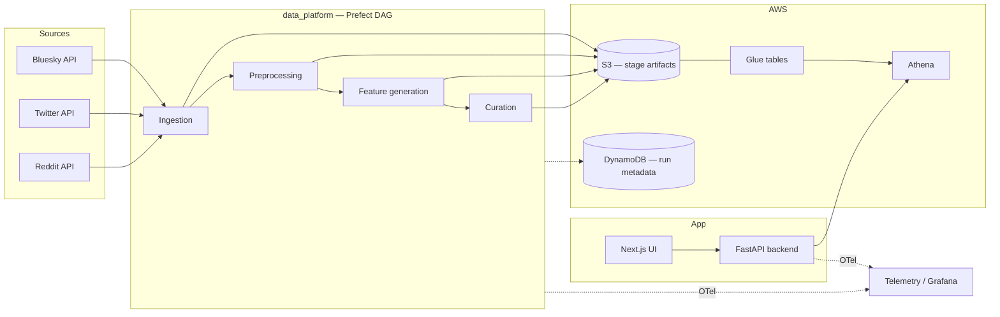

# Lab Data Integrations Interface

## Summary

Unified lab tooling for collecting, enriching, and querying social posts (Bluesky primary; Twitter/Reddit in progress) so researchers avoid re-implementing scrape/filter boilerplate.

The pipeline delivers a continuous batch ingestion pipeline, S3/Athena for queries, and a **FastAPI + Next.js** app for exploratory queries. Designed for Mirrorview-style political/opinion datasets with stage-level idempotency and auto-catch-up on failed runs.

## Architecture

**Data path:** each stage materializes outputs (copy-on-write), uploads to S3, and registers Glue partitions. Dedup runs per stage via disk resume + Athena `seen` URIs scoped by `dataset_id`. Downstream stages gate on upstream `s3_upload_status`.

**Query path:** UI → FastAPI → Athena over raw/preprocessed/features/curated tables; results include preview rows + S3 presigned download.

## Components

| Component | Role |
|-----------|------|
| `data_platform/ingestion` | Platform sync CLIs (Bluesky/Twitter/Reddit); checkpointed keyword tasks → `raw/{timestamp}/` |
| `data_platform/preprocessing` | Validators/filters; all raw runs → `preprocessed/{timestamp}/` |
| `data_platform/generate_features` | LLM/API labels (`is_political`, spam, stance, etc.); flat accumulative `features/*.parquet` |
| `data_platform/curate` | DuckDB join + YAML business rules → `curated/{timestamp}/` |
| `data_platform/orchestration` | Prefect DAG (`orchestrate_bluesky`); disk cleanup; DynamoDB run bookkeeping |
| `data_platform/aws` | S3, Athena, Glue setup, DynamoDB helpers |
| `backend` | FastAPI query API over Athena (e.g. recent posts, top authors, keyword counts) |
| `ui` | Next.js frontend for example queries |
| `ml_tooling` | Shared LLM + Perspective API clients used by feature generation |
| `collector` | Early Bluesky CLI / upsampling experiments (pre–data-platform) |
| `telemetry` | OpenTelemetry instrumentation target (LGTM / Grafana) |
| `terraform` | AWS data-platform infra |
