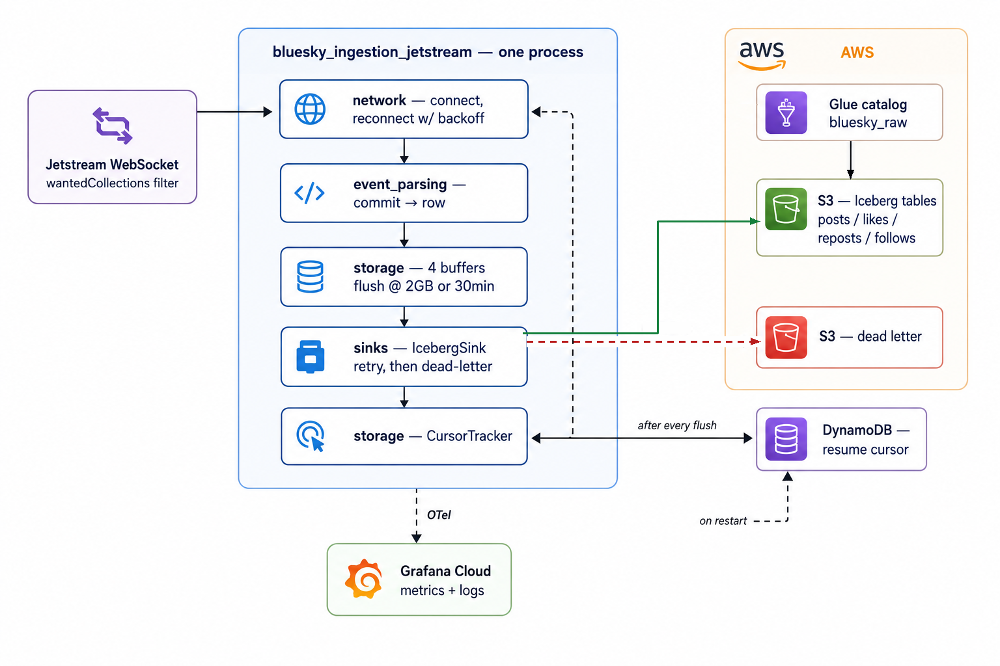
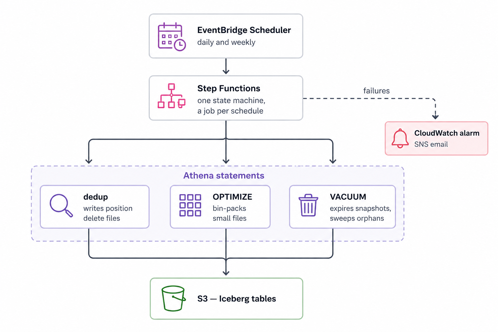
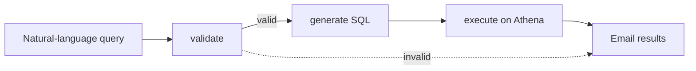

# Lab Data Integrations Interface

## Summary

A social data platform for academic researchers. It maintains a multi-TB dataset of Bluesky data and puts it behind a natural-language query interface, so getting a dataset for a paper takes minutes rather than the weeks that collecting it yourself would.

Our project is split into 3 major components:

1. **Bluesky ingestion jetstream** — collects live data off the Bluesky firehose into Iceberg tables, plus the scheduled job that keeps those tables healthy.
2. **Bluesky backfill app** — historical backfills of Bluesky users.
3. **Agentic Querying engine** - an agentic query engine that turns a researcher's question into a dataset they can download.

## bluesky_ingestion_jetstream

### Ingestion

**Flushing:** buffers are flushed together to Iceberg on S3 once the set hits 2GB or 30 minutes, whichever comes first. Each record type commits separately, and a batch that fails its retries is dead-lettered to S3.

**Cursor checkpointing:** the cursor is written to DynamoDB after every flush, so it never gets ahead of a row that is not yet durable.

### Table maintenance

One state machine, one job per schedule. `OPTIMIZE` runs daily over the last few days (and unbounded weekly) to bin-pack small files, `dedup` weekly to delete duplicate rows the stream produced, and `VACUUM` weekly to expire snapshots and sweep what they orphan. Step Functions failures raise a CloudWatch alarm that emails through SNS.

## backend/agentic_search

```mermaid
flowchart LR
  Q[Natural-language query] --> V[validate]
  V -- valid --> G[generate SQL] --> E[execute on Athena] --> M[Email results]
  V -. invalid .-> M
```

**Validation before SQL:** one LLM call turns the question into a `QueryIntent` (record type, columns, date range). That intent is then checked in plain code — nonsense input, columns the table does not have, dates outside coverage. An invalid query stops there and never reaches Athena.

**Async by design:** the endpoint acknowledges with `202` and hands the work to a background task, so a long Athena scan never blocks the request. Every outcome — results, validation issues, or an error — is mailed.

## Repository map

| Directory | Role |
|-----------|------|
| `bluesky_ingestion_jetstream` | The ingestion process: Jetstream WebSocket, commit parsing, in-memory buffers, Iceberg sink, cursor tracking, telemetry |
| `backend/agentic_search` | The query engine: LangGraph app, intent extraction and validation, SQL generation, Athena execution, result mail |
| `backend/routes` | FastAPI endpoints the UI calls |
| `ui` | Next.js query console |
| `terraform` | Infrastructure for both: S3 bucket, Glue database, cursor table, and the Athena/Step Functions maintenance job with its alarm |
