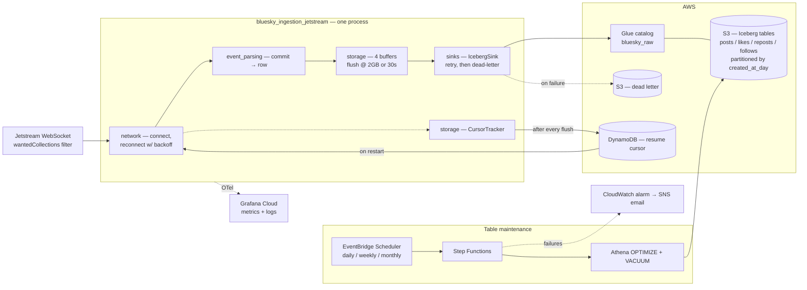

# Lab Data Integrations Interface

## Summary

A continuous ingestion pipeline for Bluesky. A single process holds a WebSocket connection to the Jetstream firehose, parses each commit into one of four record types (posts, likes, reposts, follows), buffers them in memory, and commits batches to **Apache Iceberg** tables in the Glue catalog on S3.

The resume cursor lives in DynamoDB, so a restart picks up where the last flush left off. Scheduled Athena `OPTIMIZE`/`VACUUM` jobs compact the tables and expire old snapshots.

## Architecture

```mermaid
flowchart LR
  JS[Jetstream WebSocket<br/>wantedCollections filter]

  subgraph Process["bluesky_ingestion_jetstream — one process"]
    Net[network — connect,<br/>reconnect w/ backoff]
    Parse[event_parsing — commit → row]
    Buf[storage — 4 buffers<br/>flush @ 2GB or 30s]
    Sink[sinks — IcebergSink<br/>retry, then dead-letter]
    Cur[storage — CursorTracker]
    Net --> Parse --> Buf --> Sink
    Net -.-> Cur
  end

  subgraph AWS
    Glue[Glue catalog<br/>bluesky_raw]
    S3[(S3 — Iceberg tables<br/>posts / likes / reposts / follows<br/>partitioned by created_at_day)]
    DL[(S3 — dead letter)]
    DDB[(DynamoDB — resume cursor)]
    Glue --- S3
  end

  subgraph Maintenance["Table maintenance"]
    Sched[EventBridge Scheduler<br/>daily / weekly / monthly]
    SFN[Step Functions]
    Ath[Athena OPTIMIZE + VACUUM]
    Sched --> SFN --> Ath
  end

  JS --> Net
  Sink --> Glue
  Sink -. on failure .-> DL
  Cur -- after every flush --> DDB
  DDB -- on restart --> Net
  Ath --> S3
  SFN -. failures .-> Alarm[CloudWatch alarm → SNS email]
  Process -. OTel .-> Graf[Grafana Cloud<br/>metrics + logs]
```

**Flushing:** buffers are flushed together to Iceberg on S3 once the set hits 2GB or 30s, whichever comes first. Each record type commits separately, and a batch that fails its retries is dead-lettered to S3.

**Cursor checkpointing:** the cursor is written to DynamoDB after every flush, so it never gets ahead of a row that is not yet durable.

**Iceberg maintenance:** cron jobs run `OPTIMIZE` daily (and unbounded monthly) to bin-pack small files, and `VACUUM` weekly to expire snapshots and delete what they orphan.

## Components

| Component | Role |
|-----------|------|
| `bluesky_ingestion_jetstream/main.py` | Entry point: read loop + flush task, running until `SIGTERM` |
| `bluesky_ingestion_jetstream/network` | Jetstream WebSocket, exponential-backoff reconnect, frame → `StreamEvent` |
| `bluesky_ingestion_jetstream/event_parsing` | Commit → row per record type; drops rows missing required fields or with unusable `created_at` |
| `bluesky_ingestion_jetstream/storage` | In-memory buffers, flush thresholds, resume-cursor tracking |
| `bluesky_ingestion_jetstream/sinks` | `Sink` protocol + `IcebergSink` (retry → dead letter) |
| `bluesky_ingestion_jetstream/schemas` | PyArrow schemas, one per record type |
| `bluesky_ingestion_jetstream/aws` | Glue catalog, table bootstrap, DynamoDB cursor store, S3 dead letter, commit retry |
| `bluesky_ingestion_jetstream/telemetry` | OTLP metrics/logs to Grafana Cloud + the ingestion dashboard |
| `terraform/bluesky_ingestion_jetstream` | S3 bucket, Glue database, cursor table; Athena/Step Functions maintenance + alarm |

Iceberg tables are **not** Terraform resources — Iceberg rewrites schema, partition spec, and snapshot pointer on every commit, which Terraform would read as drift. They are created once by `python -m bluesky_ingestion_jetstream.aws.bootstrap`; the ingester never issues DDL.
