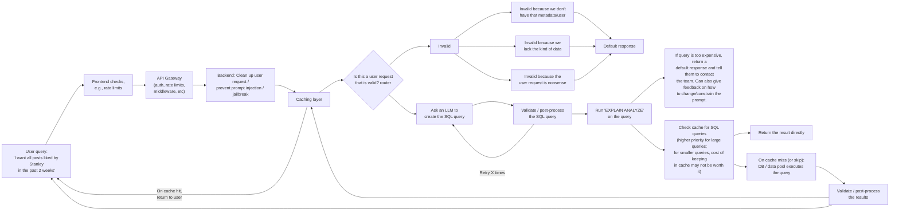

<!-- START doctoc generated TOC please keep comment here to allow auto update -->
<!-- DON'T EDIT THIS SECTION, INSTEAD RE-RUN doctoc TO UPDATE -->
**Table of Contents** 

- [Design Doc: Natural language search](#design-doc-natural-language-search)
  - [Purpose](#purpose)
  - [Background](#background)
  - [Proposal](#proposal)
    - [High-level architecture](#high-level-architecture)
    - [User-facing behavior](#user-facing-behavior)
    - [Goals/non-goals](#goalsnon-goals)
      - [What is in-scope](#what-is-in-scope)
      - [What is out-of-scope](#what-is-out-of-scope)
    - [Key design choices](#key-design-choices)
    - [Estimated scale](#estimated-scale)
    - [Scope of changes](#scope-of-changes)
  - [Implementation details](#implementation-details)
    - [Per-service/component changes](#per-servicecomponent-changes)
      - [Frontend input](#frontend-input)
      - [Backend](#backend)
      - [Athena client](#athena-client)
      - [New service layers](#new-service-layers)
        - [API Gateway](#api-gateway)
    - [Schemas/APIs](#schemasapis)
    - [Prompting](#prompting)
      - [Draft query generation prompt](#draft-query-generation-prompt)
      - [Draft router prompt](#draft-router-prompt)
      - [Testing + Experimentation](#testing--experimentation)
    - [Adding limits by default](#adding-limits-by-default)
    - [Gating on the `EXPLAIN ANALYZE` query](#gating-on-the-explain-analyze-query)
    - [Validation rules](#validation-rules)
      - [Router layer validation](#router-layer-validation)
      - [Validating generated SQL queries](#validating-generated-sql-queries)
      - [Post-Athena validation/postprocesisng](#post-athena-validationpostprocesisng)
    - [Caching design](#caching-design)
      - [Option 1: Matching on other entities or values](#option-1-matching-on-other-entities-or-values)
      - [Option 2: Fuzzy matching](#option-2-fuzzy-matching)
      - [Option 3: Hybrid RAG (semantic search + BM25)](#option-3-hybrid-rag-semantic-search--bm25)
    - [LLM application deployment to production](#llm-application-deployment-to-production)
      - [Deploying LLM pipeline changes to production](#deploying-llm-pipeline-changes-to-production)
      - [Offline evals strategy](#offline-evals-strategy)
      - [Online evals strategy](#online-evals-strategy)
    - [Observability/Telemetry](#observabilitytelemetry)
      - [System Ops](#system-ops)
        - [General System Ops considerations](#general-system-ops-considerations)
      - [LLMOps](#llmops)
        - [General LLMOps considerations](#general-llmops-considerations)
        - [1. Was the LLM result correct?](#1-was-the-llm-result-correct)
        - [2. Was the LLM behavior reliable, observable, and cost-efficient?](#2-was-the-llm-behavior-reliable-observable-and-cost-efficient)
        - [3. Can we audit and reconstruct how the result was produced?](#3-can-we-audit-and-reconstruct-how-the-result-was-produced)
        - [Tracking LLMOps in a dashboard](#tracking-llmops-in-a-dashboard)
      - [FinOps](#finops)
    - [Scaling the results](#scaling-the-results)
  - [Alternatives considered](#alternatives-considered)
  - [Cross-cutting concerns](#cross-cutting-concerns)
  - [Errata](#errata)

<!-- END doctoc generated TOC please keep comment here to allow auto update -->

# Design Doc: Natural language search

This is a design doc for the natural language search component.

## Purpose

...

## Background

...

## Proposal

Our proposal is a natural-language (NL) to SQL search interface. We propose a natural language query interface, where we take user queries, convert to SQL, execute the queries, and return results to users. Along the way, we include layers of caching and validation.

### High-level architecture



### User-facing behavior

A user enters the app and enters a natural language query as well as an email for contact (how the results are returned to the user is out-of-scope of the current plan). Upon submission, the user is informed that the request is underway. They then are given an end result, one of the following:

- A presigned URL with the resulting .csv file, if the request is valid.

### Goals/non-goals

#### What is in-scope

- NL-to-SQL end-to-end pipeline.
- Validation + preprocessing/postprocessing.
- API gateway layer (for rate limiting, authorization, etc).
- Agent plane observability: adding telemetry to the app and integrating with the existing [Grafana-based telemetry plane](https://github.com/METResearchGroup/lab_data_integrations_interface/issues/113). Some key metrics we care to track include error rate, p95/p99, cache hits/misses.
- LLMOps for the LLM components (router query, SQL generation query, and RAG steps).
- Basic FinOps: we want to track the cost of supporting our expected use case. We want to understand the cost of scaling different application components as well as provide a cost basis that we can then convert into a well-structured proposal for multi-TB project expansion.

#### What is out-of-scope

- Support for expanding data availability: this is managed in [this call for proposal](https://github.com/METResearchGroup/lab_data_integrations_interface/issues/111). The current plan builds on top of the existing database.
- Expanded app interactions beyond natural-language queries: we will keep the same endpoint that exists in FastAPI, focusing on providing a NL interface for users to request data.
- Expanding to multiple data sources and data integrations: this is managed in [this call for proposal](https://github.com/METResearchGroup/lab_data_integrations_interface/issues/111). The current plan builds on top of the existing data integrations.
- Multi-agent systems: two consecutive LLM calls are more than enough. No need for multi-agent architectures.

### Key design choices

...

### Estimated scale

... How many queries?
... How many users?
... Average size of records requested?

### Scope of changes

Here, we introduce a new product surface. We replace the existing simple FastAPI + Athena query logic with a NL query interface.

## Implementation details

### Per-service/component changes

#### Frontend input

...

#### Backend

...

#### Athena client

...

#### New service layers

...

##### API Gateway

...

### Schemas/APIs

Request/response shapes, error codes.

### Prompting

#### Draft query generation prompt

```markdown
{SYSTEM_PROMPT}

{cleaned up version of the user's prompt}.  

This is a query that a user has for our DB.

{tables + columns from Glue}

Here are some example requests from users and the correct SQL queries for those requests:

"I want all posts by Stanley in the past month" -> "SELECT * FROM posts WHERE handle LIKE "Stanley" AND created_at > {past month}"

{example requests + SQL queries}

Given that we have these columns and tables, generate an Athena SQL query for this user's request.

{cleaned up version of the user's prompt}
```

#### Draft router prompt

```markdown
You are a routing agent, charged with gatekeeping access to a database.

Our database has the following tables and columns:

{tables + columns from Glue}

{other system prompt details}

This is a query that a user has for our DB.

{cleaned up version of the user's prompt}.  

This is a request that a user has for our DB.

Classify the request using the following labels:

- VALID
- INVALID_MISSING_DATASET: Invalid because we don't have that table/dataset.
- INVALID_MISSING_ROWS: Invalid because we lack the rows of data.
- INVALID_UNQUERYABLE_REQUEST: Invalid because the user request isn't something that can be queried (e.g., "What is 2+2").
- INVALID_OTHER: Invalid for other reasons.

{Include few-shot examples}

Classify the request:

{cleaned up version of the user's prompt}
```

#### Testing + Experimentation

We'll need to do some experiments and have eval datasets to see if we're generating the right prompts. We'll want to create 40-50 queries for each use case, determine common query patterns, and use a subset as representative few-shot examples while keep the remaining as a validation set.

We'll also add regression testing as part of nightly tests, CI/CD (especially before big production releases relating to the search functionality).

We also want to add telemetry and take a subset of production traffic, perhaps every 1-2 days, and manually QA the samples + generate new evaluation samples.

### Adding limits by default

... Adding limits by default, e.g., limiting the max results, adding date range limits, etc.

### Gating on the `EXPLAIN ANALYZE` query

Our goal is to avoid naively running expensive queries. Our end users won't have the insight to know how expensive queries are to run, so we must make defensive design a core part of our plan.

Athena costs $5/TB to run. Even just $1 means scanning 200GB of records. We will use indexing and precomputed views (both out of scope of this design, will be more scoped out in [this proposal](https://github.com/METResearchGroup/lab_data_integrations_interface/issues/115)) as well as other optimizations to reduce the query scan cost, but if a query is costing even $1 to run, that's already a cause for caution for our current estimated scale.

As a first pass, we restrict queries scanning >10GB of data. As part of the beta phase of this application, we can restrict the amount of records that a user can access. 10GB is towards the upper limit of how many records a single nontechnical user can download on their computer (much less download in-memory into an R script or Jupyter notebook). Even if, say, only 10% of the scanned data is actually exported, 1GB is still a decently large dataset for a nontechnical user to manage on their personal laptop.

Given that this is how the majority of nontechnical users will likely interact with our interface, we can set this cap. We have limitations that should circumvent this (see the ##adding-limits-by-default section). We can direct users to contact the research team and we can collaborate with them to run larger queries. This will also allow us to work more closely with power users, troubleshoot queries that could be particularly tricky and/or costly, and simplify our development by removing a surface area for scalability problems during V1 development (costly/large-scale queries).

### Validation rules

#### Router layer validation

Let's treat any `INVALID_*` labels as hard failures and automatically invalidate the query.

We will also do testing (accumulating an eval set and refining the LLM prompt against it). We'll also review rejection decisions during beta testing to calibrate the LLM's propensity of assigning `INVALID_*` labels.

#### Validating generated SQL queries

We want to make sure that queries are read-only.

- We can allowlist read statements (e.g., `SELECT`, `WITH ... SELECT`) and restrict all other SQL queries.
- We also can require that queries be condensed to single statements, to avoid the possibility of 1 statement being a valid SQL query and another being invalid.

Stretch goal: we can ask a validator LLM if the SQL query would be a valid query to answer the user's request. For a V1, this is likely a stretch goal because it adds another LLM call and we should first see if this problem comes up before we prematurely add another LLM call per query (adding both cost and latency).

On invalid queries, for whatever reason it is deemed invalid, we can add the error message (or, in the case of the LLM validator, the reason why it's invalid) and retry the SQL query generation LLM call (up to n=3 times) using exponential backoff. Upon failing the last retry, we can hard-fail and log the error in our telemetry collector, returning a "Your request failed to be processed" message to the user.

#### Post-Athena validation/postprocesisng

We can do the following as postprocessing/validation steps once the Athena query results are completed:

- PII/column allowlist: this is a use case that hasn't come up yet but perhaps may come up depending on, for example, IRB requirements around exposing names of user handles.
- Empty results: return a "No results found" to the user.
- Error (Athena query couldn't complete): retry up to n=3 times. Upon failing the last retry, we can hard-fail and log the error in our telemetry collector, returning a "Your request failed to be processed" message to the user. We can be more specific if/when we see specific Athena errors.

Stretch goal: Review the returned columns (and perhaps the first 5 rows) and run an LLM query to see if, given this subset, the results likely captured what the user intended. If not, we can ask the LLM for a reason and then we can retry. This one is optional as it adds another LLM call to the pipeline. We should first evaluate if this is a real error case (e.g., by seeing actual queries whose results were not entailed by the request).

### Caching design

We want to invest in a good caching system (Redis cache + DB search of past queries + RAG) so as to avoid expensive queries + Athena calls. We also want to prioritize caching results of large queries, and caching results of smaller queries is less important (though will have to see financial tradeoff of keeping extra RAM in Redis + RAG queries vs. cost of executing smaller queries).

Our motivating example is the following user query:

```json
{
     "user_query": "I want all posts liked by Stanley in the past 2 months.",
     "cleaned_query": "i want all posts liked by stanley in the past 2 months",
}
```

#### Option 1: Matching on other entities or values

We can match on entities/values extracted from the user query.

```json
{
    "user_query": "I want all posts liked by Stanley in the past 2 months.",
    "cleaned_query": "i want all posts liked by stanley in the past 2 months",
    // don't match on the exact query string, match on the entities
    "users_referenced": "Stanley",
    "entities_mentioned": "posts",
    "timeframe": "last 2 months",
    // cache key could be something like {users referenced}::{entities}::{timeframe}
    // i want all posts liked by stanley in the past 2 months" vs.
    // i want all posts in the past 2 months  liked by stanley" have the same cache key
}
```

This is a low-cost approach, easy to implement and requires 0 LLM calls. The only inference cost may be from deploying NER models, but these are multiple orders of magnitude smaller than LLMs and easily fit in-memory.

#### Option 2: Fuzzy matching

Basically an extension of option 1, but not looking for exact match, but rather approximate string.

#### Option 3: Hybrid RAG (semantic search + BM25)

Can use RAG to find queries that are similar enough, then grab those similar queries, pass to an LLM,
ask an LLM "are any of these past queries the same as what a user is looking for?". If yes, return
the presigned URL for that past query.

Can possibly use a combination, e.g., using Option 1 first, then Option 2, then Option 3, in sequence.

Also Options 1+2 are probably via Redis, Option 3 is via vector DB (higher latency, higher cost, but more accurate)

### LLM application deployment to production

(the stuff here complements what's in LLMOps, focusing on production considerations + evals)

#### Deploying LLM pipeline changes to production

(Process of trying a new model/prompt/etc and deploying to production).

#### Offline evals strategy

...

#### Online evals strategy

### Observability/Telemetry

#### System Ops

We'll want to add telemetry across the entire request lifecycle:

- Request acceptance
- Cache
- Router
- SQL query generation
- Validation
- `EXPLAIN ANALYZE`
- Execute query
- Validation
- Return response

We'll want to add request-level tracing.

Some metrics to add include:

- Latency: p50/p95/p99 per stage + end-to-end.
- Error rate by refusal reason (e.g., `INVALID_*`) and by exception class (timeout, validation failure, Athena query failure, etc.)
- Cache: hit/miss by layer (Redis/RAG).

Later on, as we have more concurrency requirements, we might also consider measuring number of concurrent queries.

Some of the core questions we care about include:

1. Did the overall request complete successfully?
2. Did each component perform within its operational targets?
3. If the request failed or degraded, can we quickly determine where and whhy?
4. Can the system protect itself from overload, expensive requests, failing dependencies, and other failures?
5. Can the team safely deploy, monitor, and recover the application?

We want to be able to both observe the end-to-end flow while also allowing us to isolate the behavior of each component separately.

##### General System Ops considerations

Some guiding principles we want to consider include:

1. **Observe both complete user journeys and individual services**: we want to be able to deep-dive into both end-to-end request flows as well as what happens in individual journeys.
2. **Measure both success AND quality of service**: a request that returns in 5 seconds versus a request that returns in 5 minutes both technically returned results, but are different in quality.
3. **Distinguish between requests rejected explicitly vs. requests that aren't fulfilled due to system error**: we want to make sure that we know when a request isn't fulfilled because, for example, it's invalid, as opposed to a request that isn't fulfilled because the pipeline breaks.

Additionally, some more general Ops-specific principles that we'll want to consider include:

1. Prefer structured telemetry over free-form logs, so we can more easily review later.
2. Avoid high-cardinality metrics: don't track things like "unique request IDs", as these are high cardinality metrics and we'll want to keep those in traces, not metric dimensions.
3. Use a single request identifier. We want to make sure that disparate artifacts (e.g., logs, traces, metrics, etc.) can be all linked through a common trace identifier.

#### LLMOps

For our use case, the LLM steps are relatively constrained (as opposed to free-form multi-agent or chatbot apps). However, they do fulfill core responsibilities in our pipeline, validating user requests and generating valid SQL. Our LLMOps strategy revolves around three pillars:

1. Was the LLM result correct?
2. Was the LLM behavior reliable, observable, and cost-efficient?
3. Can we audit and reconstruct how the result was produced?

##### General LLMOps considerations

Across all these pillars, there are a few principles for us to keep in mind.

1. **Evaluate each LLM task independently**: each LLM task has different assumptions, failure modes, and thresholds for failure, so we should evaluate each independently. They should each have their own evaluation datasets, metrics, and release thresholds.
2. **Optimizing for task-level correctness**: we want to avoid "shiny-object" syndrome and automatically plugging in the latest cutting-edge models. We want to prioritize designing LLM systems that perform well on their specific task. What this may mean, for example, is that a different LLM works better for the router than the RAG component.
3. **Utilize deterministic checks as much as possible**: We want to use deterministic verifiers and checks as much as possible, both to (1) complement LLM checks and (2) verify LLM results. For example, we can have a lightweight set of examples as well as edge cases (e.g., queries < 10 chars) to automatically filter some results before it gets to the LLM router. We can also use deterministic checks (see the "1. Was the LLM result correct?" discussion below) against the LLM-generated results. We want to avoid LLM-as-a-judge as much as possible, reserving it for more heavyweight, infrequent QA. An LLM should be able to propose an action (e.g., run a specific SQL query), but it should be gated and verified.
4. **Treat prompts, models, and configurations as versioned production artifacts**: Prompt templates, few-shot examples, model identifiers, inference parameters, schema context, and validators should be reviewed and deployed like code. We should define all of these as YAML configs and use a plugin-style architecture (see [this YAML config for an example](https://github.com/METResearchGroup/lab_data_integrations_interface/blob/main/data_platform/ingestion/configs/bluesky/default.yaml)). Not only should these be committed in Git, but we should, within reason, add these as trace-level metadata on production requests. At minimum, for each trace we should track the prompt, model, model parameters, and config version.
5. **Combine offline evals with online observation**: We discuss this more in the "LLM application deployment to production" section. A proper LLMOps strategy requires combining offline evals with online observations.
6. **Turn failures into regression tests**: As we track queries, we'll want to review meaningful production errors, incorrect refusals, expensive generated queries, and user-reported mistakes, and add them to the evaluation suite.
7. **Consider tradeoff between precision/recall on a case-by-case basis**: the tradeoff between recall and precision varies based on the LLM task. For the router LLM, for example, we would rather prioritize a high precision of the `VALID` label as any result that is marked as valid gets passed down to the next LLM caller to generate a SQL query. Too many incorrectly assigned `VALID` labels causes downstream callers to break.

##### 1. Was the LLM result correct?

We should define correctness separately per LLM module.

**Router correctness**: for router correctness, we want to know if the assigned label is correct. Therefore, we can make use of typical classification metrics:

- Overall accuracy/F1
- Class-specific precision/recall
- False acceptance rate: requests that should've been rejected but were passed to SQL generation.
- False rejection rate: valid user requests that were unnecessarily rejected.
- Confusion between the different `INVALID_*` labels.
- Performance on ambiguous, malformed, adversarial, and prompt-injection-like requests.

Not all errors are equal. As previously mentioned, false acceptance is particularly costly, while false rejections, albeit inconvenient to a user, is safer. During beta testing, we prefer that the router is conservative and requires tuning as opposed to a router that incorrectly accepts requests.

--

**SQL query generation correctness**: we can't do exact SQL string matching because multiple SQL statements can correctly answer the same requests. There's a few ways for us to evaluate SQL queries, ranging from syntax to correct data fetching:

- Is this SQL query valid, parseable, compilable SQL?
- Is the SQL query grounded in real tables/columns, or does it hallucinate?
- Is the SQL query read-only and single-statement?
- Can Athena successfully execute or explain the query?
- Does the query implement the filters, joins, aggregations, date ranges, ordering, and entities that are requestesd by the user?
- Does the query result in the correct data being fetched?

When designing the evaluation dataset, we'll want to include both common request template as well as difficult edge cases, such as:

- Similar entity/column names
- Multiple simultaneous filter
- Relative/absolute date ranges
- Joins
- Aggregated vs. raw-row retrieval
- Requests for unavailable or unsupported datasets.
- Ambiguous query references
- Queries that are logically valid but unreasonably expensive.

Where possible, we should verify SQL correctness against a stable fixtuer database or representative test tables. We'll want to complement SQL query correctness with comparing the results of the actual queries against the text fixtures.

--

**Cache/RAG correctness**: For using RAG to retrieve past queries, we want to prioritize precision, as we're OK with a user request being retried as opposed to being returned an incorrect past query whose result is then incorrect as well. We'll want to do a similar approach as the previous models, developing an evaluation set to evaluate RAG retrieval correctness (e.g., `precision@k`).

##### 2. Was the LLM behavior reliable, observable, and cost-efficient?

We also need to measure the operational behavior of the LLMs beyond accuracy. Some operational metrics that we'll want to consider include: p50/p95/p99, TTFT, input/output/total tokens, retry count, timeout rate, and rate limits. We'll want to consider this for each LLM step individually as well as at the level of the entire request.

We'll want to establish initial SLAs for each of these parameters.

##### 3. Can we audit and reconstruct how the result was produced?

For each LLM-derived result, we should be able to determine what inputs and configs produced it. We'll want values like: request/trace identifiers, timestamp, Git version commit, LLM model details (model name, hyperparameters), config/prompt version, etc.

Ideally, with sufficiently detailed audit trails, we can replay requests and understand why a particular result came to be. This is critical for reproducibility and debugging.

##### Tracking LLMOps in a dashboard

We'll want a dashboard (possibly an extension of [the dashboard created in this ticket](https://github.com/METResearchGroup/lab_data_integrations_interface/issues/113)) to track basic LLMOps metrics. We'll discuss later what metrics will be most important here (which will be informed by the approach the team agrees on in the aforementioned proposal ticket). Some initial thoughts: basic success/failure for each LLM step, snapshot count of LLM failure modes, p50/p95/p99 for each LLM step, cost for each LLM step.

#### FinOps

...

### Scaling the results

A v1 approach is presigned URLs. We can probably ship this as a v1, but what do we do with queries that will return LARGE results? A few options here:

- Disallow such queries, and tell them to contact the team: this removes the possibility of an end user querying lots of data, but still leaves it up to the internal team to have a policy for queries with a large number of results. This can possibly be combined with other methods (see below)
- Return paginated results: We can either (1) paginate the query internally, run multiple queries, and combine the results after the fact, or (2) run the expensive query once and then paginate the results ourselves. We can experiment with the more feasible approach (feasible via cost + runtime). I suspect the second approach is better since running multiple queries in order to get subsets of rows will result in more disk reads, which is where the cost will really pile on.

## Alternatives considered

...

## Cross-cutting concerns

...

## Errata

*A design doc is essentially the same thing as an RFC. Some companies, like Uber, call it RFCs, while others, like Google, call it Design Docs.

Some resources:

- [Practical Engineer article on RFCs](https://blog.pragmaticengineer.com/scaling-engineering-teams-via-writing-things-down-rfcs/)
- ["How we use RFCs"](https://resend.com/handbook/engineering/how-we-use-rfcs)
- [Design docs at Google](https://www.industrialempathy.com/posts/design-docs-at-google/)
