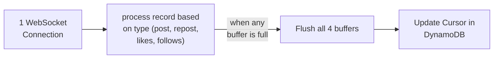

<!-- START doctoc generated TOC please keep comment here to allow auto update -->
<!-- DON'T EDIT THIS SECTION, INSTEAD RE-RUN doctoc TO UPDATE -->
**Table of Contents**  *generated with [DocToc](https://github.com/thlorenz/doctoc)*

- [Background](#background)
- [Proposal](#proposal)
- [Implementation Plan](#implementation-plan)
  - [Ingestion](#ingestion)
    - [Receive Data from Websocket](#receive-data-from-websocket)
    - [Periodically Flush to S3](#periodically-flush-to-s3)
    - [Update cursor in DynamoDB](#update-cursor-in-dynamodb)
    - [Ingestion pipeline](#ingestion-pipeline)
    - [Buffer max capacity](#buffer-max-capacity)
    - [Clearing the buffer/uploading to S3](#clearing-the-bufferuploading-to-s3)
  - [Splitting Data into Individual Tables](#splitting-data-into-individual-tables)
    - [Filter the Data](#filter-the-data)
    - [Upload Filtered Data to S3](#upload-filtered-data-to-s3)
    - [Update Partitions](#update-partitions)
    - [Apache Iceberg Overview](#apache-iceberg-overview)
    - [Proposed File Structure](#proposed-file-structure)
  - [Deduplication](#deduplication)
  - [Open Questions:](#open-questions)

<!-- END doctoc generated TOC please keep comment here to allow auto update -->

# Background

In the current data platform we specify a particular way to retrieve records from Bluesky. We use the direct Bluesky API. We then also get only posts currently. We take this and pass it into the rest of the pipeline. We want to expand to more methods of ingestion from Bluesky as well as more data types.

# Proposal

Use the Bluesky Jetstream API to access all data from a few days up to a few weeks ago. Since the Jetstream is a continuous WebSocket connection, we will always try to keep connected to the WebSocket, and keep a cursor for when we lose the connection. 

# Implementation Plan

System design diagram:
https://www.tldraw.com/f/Pau4SS84LG1WNbbCmFuFm?d=v731.-104.648.426.page

## Ingestion

### Receive Data from Websocket

We should keep a websocket connection to the Jetstream and continuosly stream their data into our machine's memory. 
We should start receiving data from our cursor's value. 

### Periodically Flush to S3

We can do this in 2 ways:

1. Every x amount of time

2. After x amount of data enters our server

### Update cursor in DynamoDB

Because it is unrealistic to always keep our WebSocket connection, we need some way to know where to leave off.
We can do this by storing the cursor in DynamoDB so that when our connection goes down, we know where to restart.
We will update the cursor after all of our buffers have been flushed, so that the cursor never gets ahead of any event.

### Ingestion pipeline



### Buffer max capacity
We want to flush all 4 buffers once any reach their capacity. However, some events are more likeley than others. 
Therefore, we will set a ratio of posts:likes:follows:reposts such that the amount of each event should be similar 
every time we flush each event the S3 table. 

### Clearing the buffer/uploading to S3
Use a retry + deadletter pattern for S3 uploads.

In addition, we should use a pandas dataframe to automatically split the data across dt/hr for us so that we can 
accurately place the data into their respective files. 

Provenance: We can consider adding in json files with run_id + created_at timestamps. 

## Splitting Data into Individual Tables

### Filter the Data
In general, we want a separate table for (platform, data_type) since each of these combinations potentially have different columns.

The reasoning is that:
1. We will have different columns for each of the data types, as well as each of the platforms.
2. Users likely will only query one platform at a time, so splitting platforms into separate tables makes sense. 

For example, with the platform Bluesky alone, we will have:
- Posts table
- Likes table
- Reposts table
- Follows table


### Upload Filtered Data to S3
We should have separate tables for each of these filters, and upload to S3 after we have received the data into memory.

### Update Partitions
3 Options:
1. Glue Crawler
- Cheaper than immediate Glue table updates, assuming we upload to S3 more frequently than we run Glue Crawler
- New data won't be queryable for x time

2. Immediate Glue Table updates
- New data is queryable immediately after update
- More expensive than Glue Crawler, assuming we upload to S3 more frequently than we run Glue Crawler

3. Partition Projection
- New data is queryable immediately after S3 upload
- Only works for highly predictable partition structures

4. Apache Iceberg
- Free
- Works as well as partition projection
- Sets us up for deduplication better

### Apache Iceberg Overview
- Doesn't need hive file system
- Iceberg stores the schemas of our data, not Glue
- All glue now does is point to the Iceberg metadata file
- Iceberg tracks all data via metadata dir


### Proposed File Structure
```
s3://lab-data-integrations-interface/
│
├── bluesky/
│   ├── posts/
│   │   ├── metadata/  <── (Iceberg creates this to keep track of files)
│   │   └── data/
│   │       ├── created_at_day=2026-07-16/
│   │       │   ├── run_123.parquet
│   │       │   └── run_124.parquet
│   │       └── created_at_day=2026-07-17/
│   │           └── run_125.parquet
│   │
│   └── follows/
│       ├── metadata/
│       └── data/
│           ├── created_at_day=2026-07-16/
│           │   └── run_123.parquet
│           └── created_at_day=2026-07-17/
│               └── run_124.parquet
│
├── twitter/
(rest is similar)
```

## Deduplication
At a high level, we have two options:
1. Deduplicate before writing to S3. 
2. Deduplicate at the query level. 

We can do a hybrid. 

Since Athena queries charge on size, a couple of duplicates won't hurt. We just don't want them to add up over time. 

Initially in ingestion, just allow all writes to the S3 after deduping within the file itself. 

Then, as a cron job, do a compaction + deduplication via AWS EventBridge Rule. 

Cost:
- for AWS EventBridge, essentially $0.00
- Athena is necessary for EventBridge to do its compaction ($5.00/TB)

This seems to be a very cost-optimized operation.
A tradeoff is that the Athena queries will be slower as it has to deduplicate. 

## Open Questions:
- How large should the buffer be? I think this depends on how much memory and cores our VM will have (potentially HPC)
- What should we use as the ratio for posts:follows:reposts:likes? https://bsky.jazco.dev/stats doesn't include reposts, 
is the reposts included in the posts? Either way, it is unclear just based off these stats
- Will we need deduplication here? Or should we omit entirely, since the jetstream should be generally reliable. 
Ie, even in the cases where we do have duplicates, we could potentially pass deduplication onto the querying layer. 
