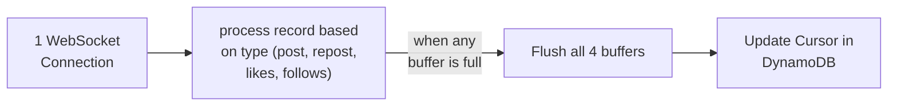

<!-- START doctoc generated TOC please keep comment here to allow auto update -->
<!-- DON'T EDIT THIS SECTION, INSTEAD RE-RUN doctoc TO UPDATE -->
**Table of Contents**  *generated with [DocToc](https://github.com/thlorenz/doctoc)*

- [Background](#background)
- [Proposal](#proposal)
- [Implementation Plan](#implementation-plan)
  - [Ingestion](#ingestion)
    - [Receive Data from Websocket](#receive-data-from-websocket)
    - [Periodically Flush to S3](#periodically-flush-to-s3)
    - [Update cursor in DynamoDB](#update-cursor-in-dynamodb)
    - [Ingestion pipeline](#ingestion-pipeline)
    - [Clearing the buffer/uploading to S3](#clearing-the-bufferuploading-to-s3)
  - [Splitting Data into Individual Tables](#splitting-data-into-individual-tables)
    - [Filter the Data](#filter-the-data)
    - [Update Partitions](#update-partitions)
    - [Apache Iceberg Overview](#apache-iceberg-overview)
    - [Proposed File Structure](#proposed-file-structure)
  - [Deduplication](#deduplication)
  - [Open Questions:](#open-questions)

<!-- END doctoc generated TOC please keep comment here to allow auto update -->

# Background

In the current data platform we specify a particular way to retrieve records from Bluesky. We use the direct Bluesky API. We then also get only posts currently. We take this and pass it into the rest of the pipeline. We want to expand to more methods of ingestion from Bluesky as well as more data types.

# Proposal

Use the Bluesky Jetstream API to access all data from a few days up to a few weeks ago. Since the Jetstream is a continuous WebSocket connection, we will always try to keep connected to the WebSocket, and keep a cursor for when we lose the connection. 

# Implementation Plan

System design diagram:
https://www.tldraw.com/f/Pau4SS84LG1WNbbCmFuFm?d=v-40.-187.1810.1190.page

## Ingestion

### Receive Data from Websocket

We should keep a websocket connection to the Jetstream and continuosly stream their data into our machine's memory. 
We should start receiving data from our cursor's value. 

### Periodically Flush to S3

We do this in 2 ways:

1. Every x amount of time

2. After x amount of data enters our server

Typically we expect ~500MB of data per hour, and we have multiple GB of memory, 
so during most scenarios, we will be flushing by time. We have the second flushing condition
for safety. 

### Update cursor in DynamoDB

Because it is unrealistic to always keep our WebSocket connection, we need some way to know where to leave off.
We can do this by storing the cursor in DynamoDB so that when our connection goes down, we know where to restart.
We will update the cursor after all of our buffers have been flushed, so that the cursor never gets ahead of any event.

### Ingestion pipeline



### Clearing the buffer/uploading to S3
Use a retry + deadletter pattern for S3 uploads.

Provenance: We can consider adding in json files with run_id + created_at timestamps. 

## Splitting Data into Individual Tables

### Filter the Data
In general, we want a separate table for (platform, data_type) since each of these combinations potentially have different columns.

The reasoning is that:
1. We will have different columns for each of the data types, as well as each of the platforms.
2. Users likely will only query one platform at a time, so splitting platforms into separate tables makes sense. 

For example, with the platform Bluesky alone, we will have:
- Posts table
- Likes table
- Reposts table
- Follows table

### Update Partitions
Apache Iceberg
- Free
- Works as well as partition projection
- Sets us up for deduplication better

### Apache Iceberg Overview
- Doesn't need hive file system
- Iceberg stores the schemas of our data, not Glue
- All glue now does is point to the Iceberg metadata file
- Iceberg tracks all data via metadata dir


### Proposed File Structure
```
s3://lab-data-integrations-interface/
│
├── bluesky/
│   └── raw/
│       ├── posts/
│       │   ├── metadata/  <── (Iceberg creates this to keep track of files)
│       │   └── data/
│       │       ├── created_at_day=2026-07-16/
│       │       │   ├── run_123.parquet
│       │       │   └── run_124.parquet
│       │       └── created_at_day=2026-07-17/
│       │           └── run_125.parquet
│       │
│       └── follows/
│           ├── metadata/
│           └── data/
│               ├── created_at_day=2026-07-16/
│               │   └── run_123.parquet
│               └── created_at_day=2026-07-17/
│                   └── run_124.parquet
│
├── twitter/
(rest is similar)
```

## Deduplication
We will be using a combination of
- Iceberg's merge-on-read for every S3 file that's uploaded
- Periodic compaction + unused file deletion via AWS EventBridge Rule. 

Cost:
- for AWS EventBridge, essentially $0.00
- Athena is necessary for EventBridge to do its compaction ($5.00/TB)

## Open Questions:
- How often should we flush? To balance keeping S3 costs low but also not losing too much data 
at a time if our server crashes. 
