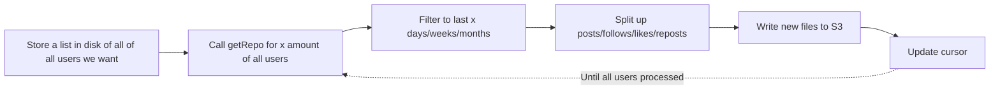

<!-- START doctoc generated TOC please keep comment here to allow auto update -->
<!-- DON'T EDIT THIS SECTION, INSTEAD RE-RUN doctoc TO UPDATE -->
**Table of Contents**  *generated with [DocToc](https://github.com/thlorenz/doctoc)*

- [Background](#background)
- [Proposal](#proposal)
- [Implementation Plan](#implementation-plan)
  - [Ingestion](#ingestion)
    - [Receive Data from getRepo](#receive-data-from-getrepo)
    - [Selecting Users to call getRepo on](#selecting-users-to-call-getrepo-on)
    - [Periodically Flush to S3](#periodically-flush-to-s3)
    - [Update cursor](#update-cursor)
    - [Ingestion pipeline](#ingestion-pipeline)
    - [Clearing the buffer/uploading to S3](#clearing-the-bufferuploading-to-s3)
    - [Splitting Data into Individual Tables](#splitting-data-into-individual-tables)
    - [Proposed S3 Layout](#proposed-s3-layout)
    - [Deduplication](#deduplication)
    - [Storing the list of Users](#storing-the-list-of-users)
    - [Parallelization](#parallelization)
  - [Open Questions:](#open-questions)

<!-- END doctoc generated TOC please keep comment here to allow auto update -->

# Background

We want to be able to backfill bluesky data to say, 6 months ago. In order to do this, we have to use a different approach than 
we would for getting future data. 

# Proposal

Use the Bluesky getRepo API call to access a user's entire past history. Then we can filter to the last x amount of time. 

# Implementation Plan

System design diagram:
https://www.tldraw.com/f/N4eyVuGQjtQ1MBSSVKxly?d=v-606.-633.4292.2822.page

## Ingestion

### Receive Data from getRepo
We will use bsky.network and make API calls. The rate limit is 3000 calls/5 minute, which is more than we'll need. 
We can still set up logic to handle rate limits, but likely won't even need it. 

### Selecting Users to call getRepo on
One approach is to just start from a popular person, and do a BFS/DFS from there. Potentially we could start from AOC,
who has millions of followers, and just take some of her follower's history first. 

### Periodically Flush to S3

We need to decide on how many users we want to load into memory before flushing to S3. This is because S3 PUTs will add up 
over time, and if we can get as much information about users at once, we can append, say 100 rows to a file at once, as opposed
to splitting up those 100 rows into 10 separate PUTs. This would depend on how much memory our VM has. 

### Update cursor
We could just have a txt file or something with one user on each row, and then our cursor would be a line number.
We could store the cursor on disk as well. 

Another approach is DynamoDB to store the cursor. 

### Ingestion pipeline

### Clearing the buffer/uploading to S3
Use a retry + deadletter pattern for S3 uploads.

In addition, we should use a pandas dataframe to automatically split the data across dt for us so that we can 
accurately place the data into their respective files. 

Provenance: We can consider adding in json files with run_id + created_at timestamps. 

### Splitting Data into Individual Tables

This should follow similar logic as `docs/design_docs/2026-07-13_bluesky_ingestion_jetstream.md`. 

The one potential difference could be in the S3 layout. 

### Proposed S3 Layout
This S3 layout should match `docs/design_docs/2026-07-13_bluesky_ingestion_jetstream.md`. 

### Deduplication
Should follow `docs/design_docs/2026-07-13_bluesky_ingestion_jetstream.md`

### Storing the list of Users
We will store the list in DynamoDB, under the statuses:
in_queue/processing/finished/failed

### Parallelization
- Have multiple workers receiving users from a queue (SQS)
- ACK when finished processing a user
- Update DynamoDB from in_queue -> processing -> finished/failed along the way

## Open Questions:
1. How are we getting list of users that we want to get data for?
