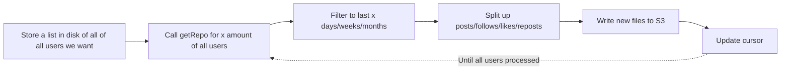

<!-- START doctoc generated TOC please keep comment here to allow auto update -->
<!-- DON'T EDIT THIS SECTION, INSTEAD RE-RUN doctoc TO UPDATE -->
**Table of Contents**  *generated with [DocToc](https://github.com/thlorenz/doctoc)*

- [Background](#background)
- [Proposal](#proposal)
- [Implementation Plan](#implementation-plan)
  - [Ingestion](#ingestion)
    - [Receive Data from getRepo](#receive-data-from-getrepo)
    - [Selecting Users to call getRepo on](#selecting-users-to-call-getrepo-on)
    - [Periodically Flush to S3](#periodically-flush-to-s3)
    - [Update cursor](#update-cursor)
    - [Ingestion pipeline](#ingestion-pipeline)
    - [Buffer max capacity](#buffer-max-capacity)
    - [Clearing the buffer/uploading to S3](#clearing-the-bufferuploading-to-s3)
  - [Splitting Data into Individual Tables](#splitting-data-into-individual-tables)
    - [Filter the Data](#filter-the-data)
    - [Upload Filtered Data to S3](#upload-filtered-data-to-s3)
    - [Update Partitions](#update-partitions)
    - [Proposed S3 Layout for Partition Projection](#proposed-s3-layout-for-partition-projection)

<!-- END doctoc generated TOC please keep comment here to allow auto update -->

# Background

We want to be able to backfill bluesky data to say, 6 months ago. In order to do this, we have to use a different approach than 
we would for getting future data. 

# Proposal

Use the Bluesky getRepo API call to access a user's entire past history. Then we can filter to the last x amount of time. 

# Implementation Plan

System design diagram:
https://www.tldraw.com/f/N4eyVuGQjtQ1MBSSVKxly?d=v-606.-633.4292.2822.page

## Ingestion

### Receive Data from getRepo
We will use bsky.network and make API calls. The rate limit is 3000 calls/5 minute, which is more than we'll need. 
We can still set up logic to handle rate limits, but likely won't even need it. 

### Selecting Users to call getRepo on
One approach is to just start from a popular person, and do a BFS/DFS from there. Potentially we could start from AOC,
who has millions of followers, and just take some of her follower's history first. 

### Periodically Flush to S3

We need to decide on how many users we want to load into memory before flushing to S3. This is because S3 PUTs will add up 
over time, and if we can get as much information about users at once, we can append, say 100 rows to a file at once, as opposed
to splitting up those 100 rows into 10 separate PUTs. This would depend on how much memory our VM has. 

### Update cursor
We could just have a txt file or something with one user on each row, and then our cursor would be a line number.
We could store the cursor on disk as well. 

Another approach is DynamoDB to store the cursor. 

### Ingestion pipeline



### Buffer max capacity
We want to flush all 4 buffers once any reach their capacity. However, some events are more likeley than others. 
Therefore, we will set a ratio of posts:likes:follows:reposts such that the amount of each event should be similar 
every time we flush each event the S3 table. 

### Clearing the buffer/uploading to S3
Use a retry + deadletter pattern for S3 uploads.

In addition, we should use a pandas dataframe to automatically split the data across dt for us so that we can 
accurately place the data into their respective files. 

Provenance: We can consider adding in json files with run_id + created_at timestamps. 

## Splitting Data into Individual Tables

### Filter the Data
We have 4 main tables we want:
- Posts
- Likes
- Reposts
- Follows

Based off this, we need to make Athena queries for each of these things and load them into our memory. 
A solution is to use AWS Bookmarks for this. 

### Upload Filtered Data to S3
We should have separate tables for each of these filters, and upload to S3 after we have received the data into memory.

### Update Partitions
Proposed solution: Partition Projection
- New data is queryable immedaitely after S3 upload
- Only works for highly predictable partition structures


### Proposed S3 Layout for Partition Projection
```
s3://lab-data-integrations-interface/platform=bluesky/stage=raw/table=posts/dt=2026-07-16/{run_id}.parquet
s3://lab-data-integrations-interface/platform=bluesky/stage=raw/table=likes/dt=2026-07-16/{run_id}.parquet
s3://lab-data-integrations-interface/platform=bluesky/stage=raw/table=reposts/dt=2026-07-16/{run_id}.parquet
s3://lab-data-integrations-interface/platform=bluesky/stage=raw/table=follows/dt=2026-07-16/{run_id}.parquet
```

Corresponding Glue table properties:
```
-- 1. Enable Projection
'projection.enabled' = 'true',

-- 2. Platform (Enum)
'projection.platform.type' = 'enum',
'projection.platform.values' = 'bluesky,twitter,mastodon', -- list the platforms you support

-- 3. Stage (Enum)
'projection.stage.type' = 'enum',
'projection.stage.values' = 'raw,preprocessed,features,curated',

-- 4. Table (Enum)
'projection.table.type' = 'enum',
'projection.table.values' = 'posts,likes,reposts,follows',

-- 5. Date (Date type)
'projection.dt.type' = 'date',
'projection.dt.range' = '2025-01-01,NOW',
'projection.dt.format' = 'yyyy-MM-dd',

-- 6. Hour (Integer type with zero-padding)
'projection.hour.type' = 'integer',
'projection.hour.range' = '0,23',
'projection.hour.digits' = '2', -- Ensures 9 becomes '09' to match S3 'hour=09'

-- 7. The exact S3 path structure template
'storage.location.template' = 's3://lab-data-integrations-interface/platform=${platform}/stage=${stage}/table=${table}/dt=${dt}/hour=${hour}/'
```

Most likely will not use hour for this and keep as date, as we will not get as much information for backfill as we will for 
continuous data. 

Open Questions:
1. Should we write our cursor to disk or DynamoDB? This applies to the jetstream app as well, could disk be a possible solution for
cursor writes?
2. How should we even store the list of users that we want to get data for? On disk?
3. How large is our VM? This will probably determine how much data our system collects before flushing to S3. 