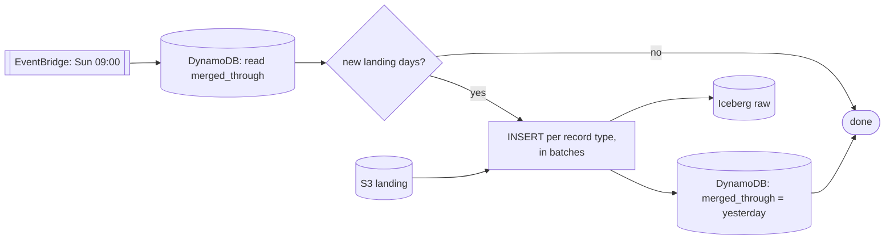
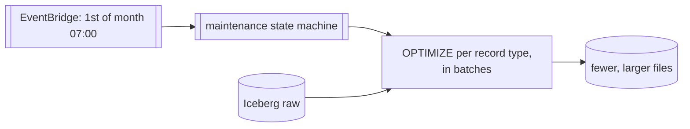
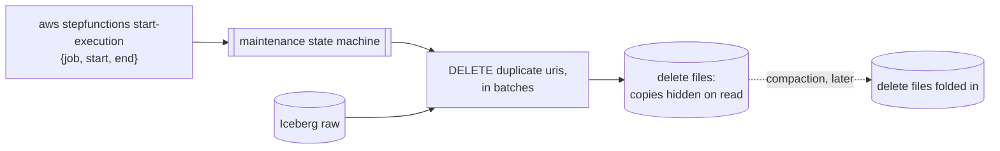

<!-- START doctoc generated TOC please keep comment here to allow auto update -->
<!-- DON'T EDIT THIS SECTION, INSTEAD RE-RUN doctoc TO UPDATE -->
**Table of Contents**  *generated with [DocToc](https://github.com/thlorenz/doctoc)*

- [Background](#background)
- [Proposal](#proposal)
- [Decisions](#decisions)
- [Components](#components)
  - [A. Landing Glue tables](#a-landing-glue-tables)
  - [B. Merge cursor table](#b-merge-cursor-table)
  - [C. Merge state machine](#c-merge-state-machine)
  - [D. Weekly schedule](#d-weekly-schedule)
  - [E. Athena workgroup](#e-athena-workgroup)
  - [F. Maintenance additions](#f-maintenance-additions)
  - [G. Landing retention](#g-landing-retention)
  - [H. Failure alarm](#h-failure-alarm)
- [Concurrency](#concurrency)
- [Accepted tradeoffs](#accepted-tradeoffs)

<!-- END doctoc generated TOC please keep comment here to allow auto update -->

# Background

`bluesky_backfill_app/fetch_repos/` lands Parquet in
`s3://lab-data-integrations-interface/landing/bluesky/backfill/<record_type>/dt=<day>/`
and marks the DID `done`. `dt` is the day a worker wrote the file, so one file
holds a whole flush: several repos, rows dated anywhere in
`BLUESKY_START_DATE` (2022-11-17) .. `DATA_END_DATE` (2026-08-07).

Nothing moves those files into the Iceberg tables under `bluesky/raw/`, which
Jetstream also writes and which are partitioned by day of `created_at`.

# Proposal

A weekly Athena job appends the landing files into the Iceberg tables, reading
only the landing days newer than a stored cursor. Rows route to their
`created_at` day partition from the table's own partition spec.

Duplicates are only removed within a single run. Nothing is compared against
`bluesky/raw/`, because the landing rows span four years and an anti-join would
read the whole table on every run.

# Decisions

| Thing | Value | Why |
| --- | --- | --- |
| Cadence | Weekly, outside the 03:00-06:00 UTC maintenance window | Each run writes a file into every `created_at` day it touches (~1,360), so a rarer merge means fewer, larger files. Appends never read the partitions they write, so merge size does not change scanned bytes. |
| Input | `dt > merged_through AND dt < current_date` | `run_id` is in the filename, not the path, so a run is not addressable -- the prefix is. Today's landing day is still being written. |
| Chunking | One `INSERT` per quarter of `created_at` | Athena writes at most 100 partitions per statement, and the tables are partitioned by day. Measured 2026-09-19 on a throwaway Iceberg table: 100 succeeds, 101 fails with `ICEBERG_TOO_MANY_OPEN_PARTITIONS`. A quarter is at most 92 days: 16 statements instead of 46 monthly ones. |
| Dedup | `row_number()` over `uri` inside each `INSERT` | Free: the statement reads those rows anyway, and Athena bills scanned bytes. |
| Provenance | None per DID | A `done` DID is in Iceberg once `date(updated_at) <= merged_through`. Marking each one would add a DID-extraction query and a bulk writer to what is otherwise files in, rows out, one cursor. |

# Components

## A. Landing Glue tables

`terraform/bluesky_backfill_app/landing.tf`. One `aws_glue_catalog_table` per
record type over `landing/bluesky/backfill/<type>/`, so `FROM landing.<type>`
resolves; the files themselves do not change. Columns mirror
`RECORD_TYPE_TO_SCHEMA` and are hand-kept. `dt` uses partition projection:

```
projection.enabled        = true
projection.dt.type        = date
projection.dt.format      = yyyy-MM-dd
projection.dt.range       = <first landing day>,NOW
storage.location.template = s3://<bucket>/landing/bluesky/backfill/<type>/dt=${dt}/
```

## B. Merge cursor table

`bluesky_backfill_merge_cursor`, holding one item whose `merged_through` is the
last merged `dt`, inclusive. Separate from `bluesky_backfill_cursor`, whose key
is `run_id` and which paginates `listRepos`. Seeded by
`aws_dynamodb_table_item` with a date before the first landing day -- a missing
item means "merge everything", which must not happen by accident.

## C. Merge state machine

`terraform/bluesky_backfill_app/merge.tf`, plus its IAM role (Athena, Glue, S3,
DynamoDB):

```
GetItem cursor
  -> Choice: exit if already current
  -> Map over 4 record types
       -> Map over quarters, concurrency 1
            -> Athena StartQueryExecution.sync
  -> PutItem merged_through = current_date - 1
```

```sql
INSERT INTO raw.<type> (uri, did, created_at, ...)
SELECT uri, did, created_at, ...
FROM (
  SELECT *, row_number() OVER (PARTITION BY uri ORDER BY rev DESC, ingested_at DESC) AS rn
  FROM landing.<type>
  WHERE dt > :merged_through AND dt < current_date
) WHERE rn = 1
  AND created_at >= :quarter_start AND created_at < :quarter_end;
```



## D. Weekly schedule

`aws_scheduler_schedule`, `cron(0 9 ? * SUN *)`: after Sunday's 05:00 VACUUM and
outside the maintenance window.

## E. Athena workgroup

Its own, so merge spend and CloudWatch metrics stay separate from
`<glue_database>_maintenance`.

## F. Maintenance additions

In `terraform/bluesky_ingestion_jetstream/maintenance.tf`:

- **`optimize_backfill`** -- monthly (`cron(0 7 1 * ? *)`), covering 2022-11 ..
  2026-08. `optimize_full` starts at `optimize_full_start_month` (2026-08-01), so
  no backfill partition is otherwise ever compacted. The range is fixed, so the
  predicates are a static monthly list, not the JSONata month counting
  `optimize_full` needs for an open-ended range.



- **`dedup_range`** -- the same `row_number()` DELETE as the weekly `dedup` job,
  with the window from the execution input, and **no** `aws_scheduler_schedule`
  entry: deployed, never self-starting.

  ```bash
  aws stepfunctions start-execution --state-machine-arn <arn> \
    --input '{"job":"dedup_range","start":"2022-11-17","end":"2026-08-07"}'
  ```

  It `Map`s over quarters like the merge, for the same 100-partition cap. The
  weekly `dedup` job is one unchunked DELETE because its window
  (`created_at >= current_date - interval '21' day`) touches about 22 day
  partitions, well under 100. The backfill range, `BLUESKY_START_DATE` ..
  `DATA_END_DATE`, is 1,360 days, so one DELETE over it would write delete files
  into far more than 100 partitions. Merge-on-read, so follow it with
  `optimize_backfill` to fold the delete files in.

Both need the `Choice` branch, the `Fail` cause text, and the runbook
description in that file updated.



## G. Landing retention

A 30-day expiration rule on `landing/bluesky/backfill/`, added to the existing
`aws_s3_bucket_lifecycle_configuration.warehouse`. Three merge cycles of margin,
and no code. Age-based rather than cursor-based: a stalled merge is caught by
the alarm in H, not by deletion logic.

## H. Failure alarm

Extend the existing SNS topic and `maintenance_failed` alarm to the merge state
machine's `ExecutionsFailed`.

## I. Expected Flow

1. Run backfills whenever we want to place data into landing zone. 
2. Every week, merge will happen and all new landing zone files will move into iceberg. 
3. Every month, compaction will happen. If nothing to compact, the actual data won't be scanned. 
4. Every month, expired files (files > 30 days) in the landing zone will be auto-deleted. By this point,
the weekly cron should've already moved the data to the iceberg table. 
5. Whenever we want to (on demand), we run dedup on the data.

# Concurrency

The merge is not the only writer: Jetstream appends on every flush, and four
maintenance jobs rewrite the same tables
(`terraform/bluesky_ingestion_jetstream/maintenance.tf:497-516`) -- OPTIMIZE
daily at 03:00, VACUUM Sundays at 05:00, dedup Saturdays at 05:00, full OPTIMIZE
Saturdays at 06:00, all UTC. The merge runs Sundays at 09:00 to stay clear.

Overlap is safe anyway: the commit that loses the Glue pointer race reloads and
reapplies itself, and Jetstream already retries
(`bluesky_ingestion_jetstream/aws/retry.py`). The Athena states get a `Retry` on
`ICEBERG_COMMIT_ERROR` for when those internal retries run out.

# Accepted tradeoffs

- **Duplicates across runs.** Two copies of a DID landing in different merge runs
  both reach Iceberg. Cleaned up on demand with `dedup_range`.
- **Rerun after a partial failure.** Re-inserts the quarters that succeeded, causing duplicates. 
We're allowing these duplicates because deduping on every run would be very expensive, for when 
we expect very little duplicates. 
- **No per-DID merge status.** A DID stops at `done`; nothing marks it merged.
  Writing one would mean a second Athena query per run to pull the merged DIDs
  out, something to turn millions of rows into `UpdateItem` calls, and a
  reconciliation path for when that half-finishes. Skipping it for simplicity, 
  less failure to worry about. 
