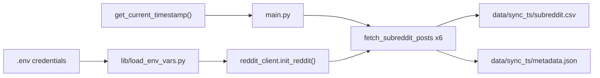

# Reddit Subreddit Post Fetch Experiment

## Remember
- Exact file paths always
- Exact commands with expected output
- DRY, YAGNI, TDD, frequent commits
- Maximum safely delegable parallelism
- Delegated tasks must be impossible to misread
- No UI changes — screenshots not required

## Overview

Build a standalone experiment script that uses the Reddit API (via PRAW) to collect 10 posts from each of six subreddits (`Conservative`, `Republican`, `AskConservatives`, `politics`, `liberal`, `democrats`). Credentials live in the root [`.env`](.env) and will be loaded through [`lib/load_env_vars.py`](lib/load_env_vars.py). A single `sync_timestamp` is captured once at job start via [`lib/timestamp_utils.py`](lib/timestamp_utils.py) (`%Y_%m_%d-%H:%M:%S`, e.g. `2026_05_23-14:30:00`) and stamped on every row and in `metadata.json`. Output lands in `experiments/reddit_fetch_data_2026_05_23/data/<sync_timestamp>/`.

**Pre-flight fix (manual):** The current [`.env`](.env) uses curly/smart quotes around Reddit values (`"..."`). `python-dotenv` expects straight ASCII quotes or no quotes. Fix before running or auth will fail with invalid credentials.

---

## Happy Flow

1. Operator runs `uv run python experiments/reddit_fetch_data_2026_05_23/main.py` from repo root.
2. `main.py` calls `get_current_timestamp()` once → `sync_timestamp`.
3. `EnvVarsContainer.get_env_var(...)` loads `REDDIT_CLIENT_ID`, `REDDIT_SECRET`, `REDDIT_USERNAME`, `REDDIT_PASSWORD` (required); `REDDIT_REDIRECT_URI` (optional, stored for future OAuth flows).
4. `reddit_client.init_reddit()` builds a PRAW `Reddit` instance (script-app password grant).
5. For each subreddit in the fixed list, `fetch_subreddit_posts(reddit, name, limit=10)` iterates `.hot(limit=10)` (simple, no search query needed).
6. Each `Submission` is normalized to a flat dict (author, engagement, text fields, Reddit IDs, `sync_timestamp`).
7. `main.py` creates `experiments/reddit_fetch_data_2026_05_23/data/<sync_timestamp>/`.
8. Writes `<subreddit_lower>.csv` per subreddit (e.g. `conservative.csv`).
9. Writes `metadata.json` with subreddit list, target count (10), actual counts, `sync_timestamp`, and output file map.
10. Prints summary to stdout (subreddit → rows written).



---

## Interface or Contract Freeze

### Subreddit list (exact)

```python
SUBREDDITS = [
    "Conservative",
    "Republican",
    "AskConservatives",
    "politics",
    "liberal",
    "democrats",
]
POSTS_PER_SUBREDDIT = 10
```

### CSV schema (columns, exact order)

| Column | Source (PRAW `Submission`) |
|--------|------------------------------|
| `reddit_id` | `post.id` |
| `reddit_fullname` | `post.name` (e.g. `t3_abc123`) |
| `subreddit` | `post.subreddit.display_name` |
| `title` | `post.title` |
| `selftext` | `post.selftext` |
| `author` | `str(post.author)` or `"[deleted]"` if None |
| `score` | `post.score` |
| `upvote_ratio` | `post.upvote_ratio` |
| `num_comments` | `post.num_comments` |
| `created_utc` | ISO8601 from `post.created_utc` |
| `permalink` | `post.permalink` |
| `url` | `post.url` |
| `is_self` | `post.is_self` |
| `sync_timestamp` | job-level timestamp (same for all rows) |

### `metadata.json` schema

```json
{
  "sync_timestamp": "2026_05_23-14:30:00",
  "subreddits": ["Conservative", "Republican", "AskConservatives", "politics", "liberal", "democrats"],
  "posts_per_subreddit": 10,
  "total_posts": 60,
  "counts": {
    "conservative": 10,
    "republican": 10,
    "askconservatives": 10,
    "politics": 10,
    "liberal": 10,
    "democrats": 10
  },
  "files": {
    "conservative": "conservative.csv",
    "republican": "republican.csv",
    "askconservatives": "askconservatives.csv",
    "politics": "politics.csv",
    "liberal": "liberal.csv",
    "democrats": "democrats.csv"
  }
}
```

### Env vars to register in [`lib/load_env_vars.py`](lib/load_env_vars.py)

Add to `ENV_VAR_TYPES`:

```python
"REDDIT_CLIENT_ID": str,
"REDDIT_SECRET": str,
"REDDIT_REDIRECT_URI": str,
"REDDIT_USERNAME": str,
"REDDIT_PASSWORD": str,
```

---

## Serial Coordination Spine

These steps must run in order before parallel work merges:

1. **Add `praw` dependency** to [`pyproject.toml`](pyproject.toml) (`praw>=7.7.0`) and run `uv sync`.
2. **Freeze contracts** above (CSV columns, metadata shape, subreddit list, output paths).
3. **Update [`lib/load_env_vars.py`](lib/load_env_vars.py)** with Reddit env var keys.
4. **Merge parallel outputs** (`reddit_client.py`, tests, `main.py`) and run integration.
5. **Run live fetch** once credentials are verified.

---

## Parallel Task Packets

### Task P1 — Reddit env vars in loader

- **Objective:** Register five Reddit keys in the centralized env loader.
- **Parallelizable because:** Touches only [`lib/load_env_vars.py`](lib/load_env_vars.py); no dependency on experiment code.
- **Files allowed to change:** [`lib/load_env_vars.py`](lib/load_env_vars.py)
- **Files forbidden:** experiment files, `pyproject.toml`
- **Steps:**
  1. Add five entries to `ENV_VAR_TYPES` dict (see contract above).
  2. No other logic changes needed — `_initialize_env_vars` already loads all keys in the dict.
- **Verify:** `uv run python -c "from lib.load_env_vars import EnvVarsContainer; print(EnvVarsContainer.get_env_var('REDDIT_CLIENT_ID')[:4])"`
- **Expected:** Prints first 4 chars of client ID (non-empty) when `.env` is fixed.
- **Done when:** All five keys resolve without code changes elsewhere.

### Task P2 — PRAW client + post parser module

- **Objective:** Create [`experiments/reddit_fetch_data_2026_05_23/reddit_client.py`](experiments/reddit_fetch_data_2026_05_23/reddit_client.py) with init + fetch + parse functions.
- **Parallelizable because:** Depends only on contract freeze + P1; no `main.py` yet.
- **Files allowed to change:** `experiments/reddit_fetch_data_2026_05_23/reddit_client.py`
- **Preconditions:** P1 merged (or mock env in tests).
- **Implementation:**

```python
# reddit_client.py — key functions
def init_reddit() -> praw.Reddit: ...
def submission_to_row(post: praw.models.Submission, sync_timestamp: str) -> dict: ...
def fetch_subreddit_posts(reddit: praw.Reddit, subreddit: str, limit: int, sync_timestamp: str) -> list[dict]: ...
```

- **`init_reddit` details:**
  - `client_id`, `client_secret`, `username`, `password` from `EnvVarsContainer` (required=True).
  - `user_agent`: `f"lab_data_integrations:v0.1 (by /u/{username})"`.
  - Do not pass `redirect_uri` for script-app password grant (not used); env var still registered for future OAuth work.
- **`fetch_subreddit_posts`:** Use `reddit.subreddit(subreddit).hot(limit=limit)`. Wrap iteration in try/except for `prawcore.exceptions.NotFound` → log and return `[]`.
- **Verify:** Import succeeds: `uv run python -c "from experiments.reddit_fetch_data_2026_05_23 import reddit_client"` — may need running from repo root; if import path fails, use relative import from `main.py` only (match [`experiments/llm_upscaling_2026_05_18/run_experiment.py`](experiments/llm_upscaling_2026_05_18/run_experiment.py) pattern: top-level `from lib...` imports).

### Task P3 — Unit tests (TDD, mocked PRAW)

- **Objective:** Add tests before live run at [`tests/experiments/test_reddit_fetch.py`](tests/experiments/test_reddit_fetch.py).
- **Parallelizable because:** Uses mocks only; no live API.
- **Files allowed to change:** `tests/experiments/test_reddit_fetch.py`, `tests/experiments/__init__.py` (empty)
- **Preconditions:** Contract freeze; reddit_client module exists (P2).
- **Test cases:**
  1. `test_submission_to_row_maps_all_fields` — MagicMock Submission → dict with all CSV columns + `sync_timestamp`.
  2. `test_submission_to_row_deleted_author` — `post.author is None` → `"[deleted]"`.
  3. `test_fetch_subreddit_posts_limit` — mock `.hot(limit=10)` returns 10 mock submissions.
  4. `test_write_metadata_structure` — if metadata writer is in `main.py`, test helper extracted or test via `main.write_metadata(...)`.
- **Verify:** `uv run pytest tests/experiments/test_reddit_fetch.py -v`
- **Expected:** All tests pass without network.

### Task P4 — Orchestration `main.py`

- **Objective:** Create [`experiments/reddit_fetch_data_2026_05_23/main.py`](experiments/reddit_fetch_data_2026_05_23/main.py) to wire fetch → CSV → metadata.
- **Parallelizable because:** Implements against frozen contracts; can stub reddit_client until P2 lands.
- **Files allowed to change:** `experiments/reddit_fetch_data_2026_05_23/main.py`
- **Steps:**
  1. `sync_timestamp = get_current_timestamp()` at top of `main()`.
  2. `output_dir = Path(__file__).parent / "data" / sync_timestamp`.
  3. Loop `SUBREDDITS`, call `fetch_subreddit_posts`, write CSV with `csv.DictWriter` (fieldnames = CSV schema order).
  4. Filename: `subreddit.lower() + ".csv"`.
  5. Write `metadata.json` via `json.dump(..., indent=2)`.
  6. Print per-subreddit count summary.
- **Pattern reference:** CSV writing mirrors [`experimentation/fetch_posts.py`](experimentation/fetch_posts.py) and [`collector/upsampler.py`](collector/upsampler.py) `append_posts_to_csv`.

---

## Integration Order

1. P1 (env vars) → merge
2. P2 (reddit_client) + P3 (tests) in parallel → merge
3. P4 (main.py) → merge
4. Live run + manual verification

---

## Alternative Approaches

| Option | Why not chosen |
|--------|----------------|
| **Search API** (as in user's example) | Requires a query string; user wants general recent posts, not keyword-filtered. |
| **`.new()` / `.top()`** | Any listing works; `.hot()` is the simplest default for "current posts." |
| **Direct HTTP to Reddit API** | More boilerplate; PRAW is the standard Python client and matches the reference script's approach. |
| **Separate `requirements.txt` for experiment** | Repo convention is single [`pyproject.toml`](pyproject.toml) for dependencies (see `atproto`, `pandas`). |

---

## Manual Verification

- [ ] Fix [`.env`](.env) smart quotes → straight values or unquoted strings
- [ ] `uv sync` — installs `praw` without errors
- [ ] `uv run pytest tests/experiments/test_reddit_fetch.py -v` — all green
- [ ] `uv run python experiments/reddit_fetch_data_2026_05_23/main.py` from repo root
- [ ] Confirm directory exists: `experiments/reddit_fetch_data_2026_05_23/data/<sync_timestamp>/`
- [ ] Confirm 6 CSV files: `conservative.csv`, `republican.csv`, `askconservatives.csv`, `politics.csv`, `liberal.csv`, `democrats.csv`
- [ ] Each CSV has header + 10 data rows: `wc -l experiments/reddit_fetch_data_2026_05_23/data/*/conservative.csv` → `11`
- [ ] All rows share same `sync_timestamp` value: `cut -d, -f14 experiments/reddit_fetch_data_2026_05_23/data/*/conservative.csv | sort -u | wc -l` → `2` (header + one timestamp)
- [ ] `metadata.json` validates: `total_posts: 60`, each count `10`, `sync_timestamp` matches folder name
- [ ] Spot-check one row: non-empty `reddit_id`, `title`, `subreddit`, numeric `score`

---

## Plan Asset Storage

Save this plan and any run notes to:

`docs/plans/2026-05-23_reddit_fetch_data_482917/`

(No UI screenshots — not applicable.)

---

## Security Notes

- Never commit [`.env`](.env) or credentials.
- Reddit script-app password grant requires the Reddit account to have 2FA disabled or use an app-specific password — if auth fails with 401, verify app type is "script" in Reddit developer settings.
- `REDDIT_REDIRECT_URI` is registered for completeness but unused in this script-app flow.
