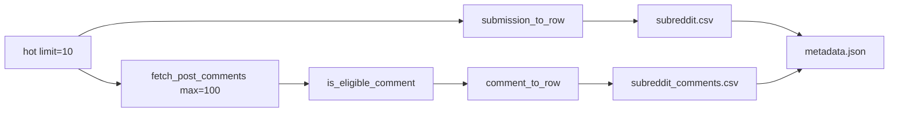

# Reddit Comment Collection — Implementation Plan

Plan asset folder: [`docs/plans/2026-05-24_reddit_fetch_comments_738492/`](docs/plans/2026-05-24_reddit_fetch_comments_738492/)

No UI changes — screenshots not required.

## Remember

- Exact file paths always
- Exact commands with expected output
- DRY, YAGNI, frequent commits
- No unit tests for this experiment — verify via live run
- UI changes: agent captures before/after screenshots itself (no README or instructions for the user)

---

## Overview

Extend the existing Reddit fetch experiment ([`experiments/reddit_fetch_data_2026_05_23/`](experiments/reddit_fetch_data_2026_05_23/)) so that for each of the 60 hot posts already collected (6 subreddits × 10 posts), the script also fetches comments and replies in Reddit's default tree order, skips stickied and mod-distinguished comments, skips bodies shorter than 30 characters, and stops once **100 qualifying rows** are collected for that post. Output adds `{subreddit}_comments.csv` per subreddit (e.g. `conservative_comments.csv`) under `data/<sync_timestamp>/`, with an updated `metadata.json`. Post CSVs and schema remain unchanged.

**No pytest coverage** for this experiment — it is a one-shot script; correctness is verified by running it and inspecting output files.

---

## Happy Flow

1. Operator runs from repo root:
   `PYTHONPATH=. uv run python experiments/reddit_fetch_data_2026_05_23/main.py`
2. [`main.py`](experiments/reddit_fetch_data_2026_05_23/main.py) calls `get_current_timestamp()` once → `sync_timestamp`.
3. `init_reddit()` in [`reddit_client.py`](experiments/reddit_fetch_data_2026_05_23/reddit_client.py) authenticates via existing env vars.
4. For each subreddit in `SUBREDDITS`, `fetch_subreddit_posts(...)` calls `.hot(limit=10)` and, **for each `Submission` before discarding it**:
   - Normalizes the post via `submission_to_row()`.
   - Calls `fetch_post_comments(submission, max_comments=100, min_body_length=30, sync_timestamp=...)`.
5. `fetch_post_comments()` expands the comment tree as needed (`replace_more`), walks top-level comments in Reddit default order and recurses into `.replies` (depth-first), yielding comments+replies in display order.
6. For each candidate comment, `is_eligible_comment()` returns `False` if `stickied`, `distinguished` is not `None`, or `len(body.strip()) < 30`; otherwise `comment_to_row()` appends a row with `comment_rank` 1–100.
7. Collection for that post stops when 100 eligible rows are collected or the tree is exhausted.
8. `main.py` writes existing `{subreddit}.csv` (posts) and new `{subreddit}_comments.csv` (comments).
9. `write_metadata()` writes extended `metadata.json` including comment config, per-subreddit comment counts, and `comment_files` map.
10. Stdout prints post and comment row counts per subreddit.



---

## Interface or Contract Freeze

### Constants ([`main.py`](experiments/reddit_fetch_data_2026_05_23/main.py))

```python
POSTS_PER_SUBREDDIT = 10
COMMENTS_PER_POST = 100
MIN_COMMENT_BODY_LENGTH = 30
```

### Comment CSV schema — exact column order ([`reddit_client.py`](experiments/reddit_fetch_data_2026_05_23/reddit_client.py))

| Column | Source |
|--------|--------|
| `post_reddit_id` | `submission.id` |
| `post_reddit_fullname` | `submission.name` |
| `subreddit` | `submission.subreddit.display_name` |
| `comment_id` | `comment.id` |
| `comment_fullname` | `comment.name` (e.g. `t1_abc`) |
| `parent_id` | `comment.parent_id` |
| `author` | `str(comment.author)` or `"[deleted]"` |
| `body` | `comment.body` |
| `score` | `comment.score` |
| `created_utc` | ISO8601 from `comment.created_utc` |
| `permalink` | `comment.permalink` |
| `depth` | 0 for top-level; +1 per reply level (tracked during walk) |
| `comment_rank` | 1-based order among **eligible** comments for this post |
| `sync_timestamp` | job-level timestamp |

Export as `COMMENT_CSV_FIELDNAMES: list[str]`.

### Eligibility rules

```python
def is_eligible_comment(comment: praw.models.Comment, min_body_length: int) -> bool:
    # False if comment.stickied is True
    # False if comment.distinguished is not None  (moderator/admin)
    # False if len((comment.body or "").strip()) < min_body_length
    # True otherwise
```

Deleted/removed bodies like `"[deleted]"` / `"[removed]"` are shorter than 30 → naturally excluded.

### `fetch_subreddit_posts` signature change

```python
def fetch_subreddit_posts(
    reddit: praw.Reddit,
    subreddit: str,
    limit: int,
    sync_timestamp: str,
    *,
    comments_per_post: int = 100,
    min_comment_body_length: int = 30,
) -> tuple[list[dict[str, object]], list[dict[str, object]]]:
    """Returns (post_rows, comment_rows)."""
```

- Still catches `prawcore.exceptions.NotFound` → `([], [])`.
- Per-post comment fetch wrapped in try/except; log warning and continue on failure.

### Comment tree walk algorithm (default order, includes replies)

1. Call `submission.comments.replace_more(limit=0)` to strip initial placeholders.
2. DFS over `CommentForest`:
   - Iterate `for comment in comments_forest` (Reddit default top-level order).
   - Before processing, if remaining eligible count < max: call `comments_forest.replace_more(limit=32)` when `MoreComments` placeholders exist (loop until no new batches or cap reached).
   - Skip ineligible via `is_eligible_comment`.
   - Append `comment_to_row(...)` with incrementing `comment_rank`.
   - If `len(rows) < max`, recurse into `comment.replies` with `depth + 1`.
3. Stop entire walk when `len(rows) == max`.

### `metadata.json` additions

```json
{
  "comments_per_post_max": 100,
  "min_comment_body_length": 30,
  "total_comments": 4820,
  "comment_counts": {
    "conservative": 812,
    "republican": ...
  },
  "comment_files": {
    "conservative": "conservative_comments.csv",
    ...
  }
}
```

Existing post fields unchanged. Extend `write_metadata()` signature with comment kwargs.

### Files to delete (no unit tests)

- [`tests/experiments/test_reddit_fetch.py`](tests/experiments/test_reddit_fetch.py)
- [`tests/experiments/__init__.py`](tests/experiments/__init__.py)

Remove the entire `tests/experiments/` directory. Remaining CI tests (`tests/collector/`, etc.) are unaffected.

### Files forbidden to change

- [`lib/load_env_vars.py`](lib/load_env_vars.py) — no new env vars needed
- [`pyproject.toml`](pyproject.toml) / `uv.lock` — `praw` already present
- Existing committed post CSVs under [`data/2026_05_23-15:52:04/`](experiments/reddit_fetch_data_2026_05_23/data/2026_05_23-15:52:04/) — leave as-is; new live run creates a new timestamp folder

---

## Alternative Approaches

| Option | Why not chosen |
|--------|----------------|
| Separate `{subreddit}_comments.csv` per subreddit (chosen) | Matches existing per-subreddit post CSV pattern; easy joins on `post_reddit_id` |
| Single global `comments.csv` | Harder to inspect per subreddit; breaks existing file naming convention |
| Flatten via `submission.comments.list()[:100]` | Does not preserve Reddit default display order or depth |
| Chronological sort | User requested default order |
| Fetch all comments then filter | Wastes API calls on busy threads; DFS with early stop at 100 eligible is cheaper |
| Pytest unit tests | User decision: experimental script; live run is sufficient verification |

---

## Implementation Tasks

### P1 — reddit_client ([`reddit_client.py`](experiments/reddit_fetch_data_2026_05_23/reddit_client.py))

Implement:

- `COMMENT_CSV_FIELDNAMES`
- `is_eligible_comment()`
- `comment_to_row()`
- `_walk_comments_in_order()` (private generator)
- `fetch_post_comments()`
- Refactor `fetch_subreddit_posts()` → return `(post_rows, comment_rows)`

### P2 — main + metadata ([`main.py`](experiments/reddit_fetch_data_2026_05_23/main.py))

Implement:

- Import `COMMENT_CSV_FIELDNAMES`
- Add constants `COMMENTS_PER_POST`, `MIN_COMMENT_BODY_LENGTH`
- `write_comments_csv(rows, path)` — mirror `write_subreddit_csv`
- Extend `write_metadata(..., comments_per_post_max, min_comment_body_length, comment_counts, comment_files)`
- Update `main()` loop: unpack tuple, write `{subreddit.lower()}_comments.csv`, track comment counts, print both totals

### P3 — Remove experiment tests

Delete [`tests/experiments/`](tests/experiments/) entirely.

---

## Integration Order

1. P1 → commit: `feat: fetch up to 100 eligible comments per post via PRAW`
2. P2 → commit: `feat: write subreddit_comments.csv and extend metadata`
3. P3 → commit: `chore: remove reddit experiment unit tests`
4. P4 → verify live run
5. P5 → commit: `docs: add reddit comment collection plan`

---

## Manual Verification

- [ ] `uv sync --group dev && uv run pre-commit run --all-files` — ruff, pyright, complexipy pass
- [ ] `uv sync --extra testing && uv run pytest tests/ -v` — remaining suite passes (26 collector tests; no experiment tests)
- [ ] Live run (requires `.env` Reddit creds):
  - `PYTHONPATH=. uv run python experiments/reddit_fetch_data_2026_05_23/main.py`
  - New folder: `experiments/reddit_fetch_data_2026_05_23/data/<sync_timestamp>/`
  - Six post CSVs (10 rows each) — unchanged schema
  - Six comment CSVs: `conservative_comments.csv`, etc.
  - Spot-check one comment CSV:
    ```bash
    uv run python -c "
    import csv
    from pathlib import Path
    p = sorted(Path('experiments/reddit_fetch_data_2026_05_23/data').iterdir())[-1]
    rows = list(csv.DictReader(open(p / 'conservative_comments.csv')))
    assert all(len(r['body'].strip()) >= 30 for r in rows)
    assert all(r['comment_rank'] for r in rows)
    print(f'{len(rows)} comment rows, max rank {max(int(r[\"comment_rank\"]) for r in rows)}')
    "
    ```
  - Per-post cap: no single `post_reddit_id` has more than 100 rows in a comment CSV
  - `metadata.json` contains `comments_per_post_max: 100`, `min_comment_body_length: 30`, `comment_files`, `total_comments`
- [ ] Do **not** commit new live data unless explicitly requested (keeps PR diff reviewable)

---

## Final Verification (CI parity)

```bash
uv sync --group dev && uv run pre-commit run --all-files
uv sync --extra testing && uv run pytest tests/
```

Expected: lint job and test job both pass (matches [`.github/workflows/ci.yml`](.github/workflows/ci.yml)). Experiment tests removed; collector tests unchanged.
