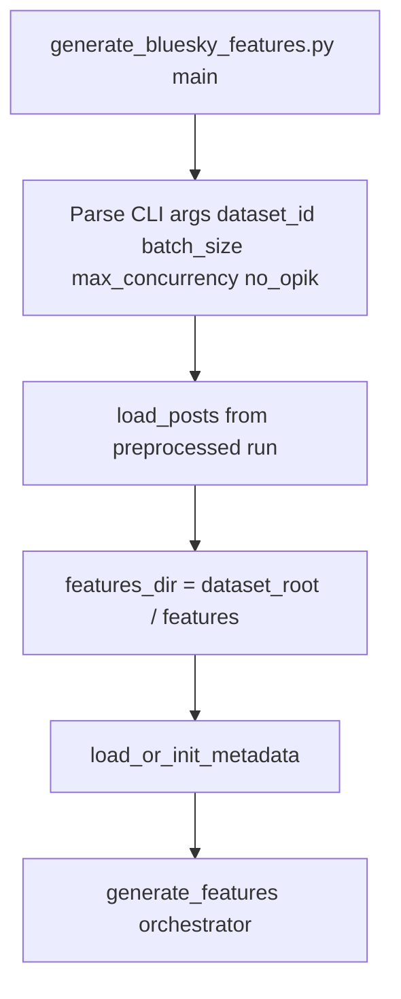
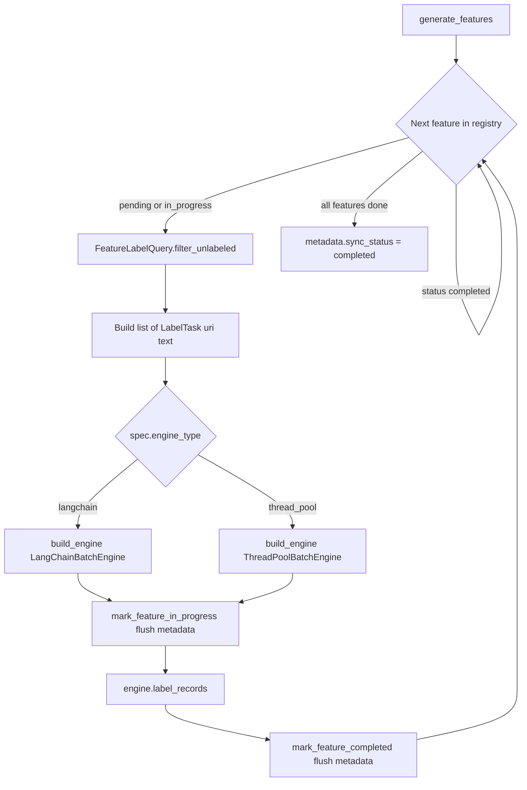
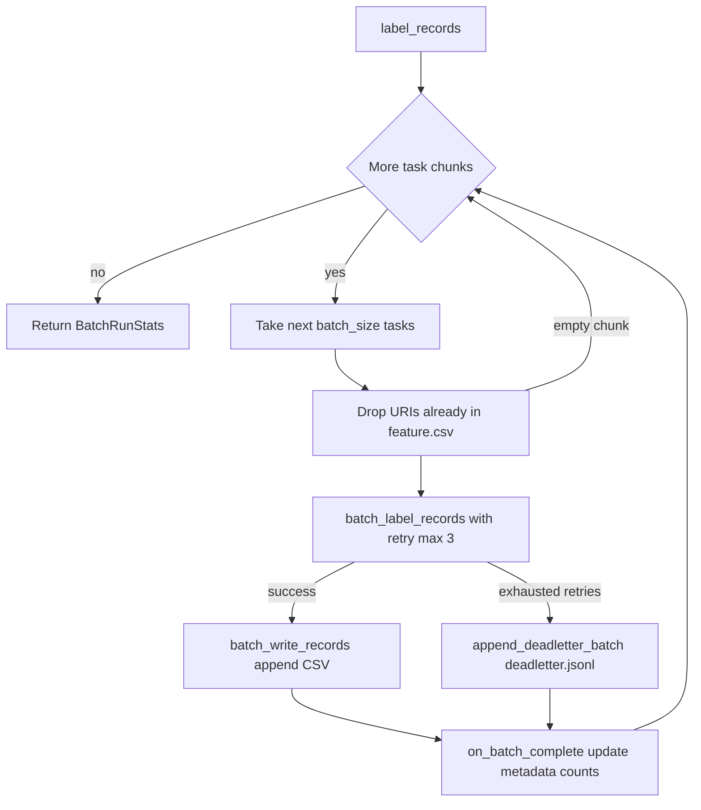
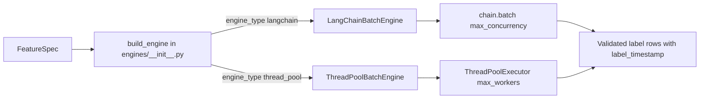

# Feature Generation Batch Engine

Plan assets: [`docs/plans/2026-05-31_feature_generation_batch_engine_591024/`](docs/plans/2026-05-31_feature_generation_batch_engine_591024/)

## Remember

- Exact file paths always
- Exact commands with expected output
- DRY, YAGNI, TDD, frequent commits
- Maximum safely delegable parallelism
- Delegated tasks must be impossible to misread
- No UI changes in this plan (no screenshots required)

## Overview

Replace the sequential, batch-at-end [`generate_features.py`](data_platform/generate_features/generate_features.py) loop with a resumable orchestrator that processes one feature at a time, deduplicates via [`FeatureLabelQuery`](data_platform/utils/feature_labels.py), executes labeling through a `BatchExecutionEngine` protocol (LangChain `Runnable.batch` for LLM features, `ThreadPoolExecutor` for Perspective API), appends results to flat `{features_dir}/{feature}.csv` files with a `label_timestamp` column, tracks progress in `{features_dir}/metadata.json`, and writes exhausted atomic-batch failures to `deadletter.jsonl`. This supports ~12k posts × 6 features with concurrency, retries, and safe resume without a separate status CSV.

**First step (M0):** Run a one-time migration script to flatten existing timestamped feature runs for [`bluesky_f47ac10b-58cc-4372-a567-0e02b2c3d479`](data_platform/data/bluesky/bluesky_f47ac10b-58cc-4372-a567-0e02b2c3d479/features/) so the end-state file shape can be inspected before pipeline code lands.

## Happy Flow

0. **Migration (M0, first, breaking):** [`scripts/flatten_bluesky_features.py`](scripts/flatten_bluesky_features.py) merges nested `features/{timestamp}/*.csv` into flat `features/{feature}.csv`, adds `label_timestamp` from run dir name, writes `features/metadata.json`, then **deletes** nested timestamp run dirs. No archive path; unmigrated datasets are incompatible with the new pipeline.
1. CLI [`generate_bluesky_features.py`](data_platform/generate_features/generate_bluesky_features.py) loads preprocessed posts from latest (or `--preprocessed-run`) via [`BlueskyStorageManager`](data_platform/utils/storage.py).
2. Orchestrator sets `features_dir = dataset_root("bluesky", dataset_id) / "features"` and loads or initializes `features/metadata.json` via [`metadata.py`](data_platform/generate_features/metadata.py).
3. For each entry in [`FEATURE_REGISTRY`](data_platform/generate_features/registry.py), skip if `metadata.features[feature_name].status == "completed"`.
4. Planner calls `FeatureLabelQuery(features_dir).filter_unlabeled(posts, feature_name)` to produce pending `(uri, text)` tasks.
5. Orchestrator selects engine: `LangChainBatchEngine` (5 LLM features) or `ThreadPoolBatchEngine` (`is_toxic_tiered` / Perspective API).
6. Engine runs `label_records`: for each atomic batch of `batch_size` (default 64), filter already-seen URIs from `{feature}.csv`, call `batch_label_records` with up to 3 retries (reuse [`collector/retry.py`](collector/retry.py) pattern), append rows via `batch_write_records`, invoke `on_batch_complete` to call `flush_metadata`.
7. On exhausted batch-label retries, append one record to `deadletter.jsonl` (whole batch, no auto-retry in v1).
8. Mark feature `completed` in metadata; when all features done, set `sync_status: completed`.
9. Downstream curate reads flat feature CSVs via updated [`feature_glob`](data_platform/utils/duckdb_features.py) in [`consolidate.py`](data_platform/curate/consolidate.py).

## End-State File Structure

### Part A — Data output (`data/bluesky/{dataset_id}/`)

Unchanged stages keep timestamped run dirs; **features stage moves to flat layout** after M0.

```text
data/bluesky/{dataset_id}/
  dataset.json                              # unchanged manifest
  preprocessed/
    {timestamp}/                            # unchanged (timestamped runs)
      posts.csv
      metadata.json
  features/                                 # long-lived flat layout (M0 creates shape)
    metadata.json                           # run progress + provenance (NEW location: features root)
    deadletter.jsonl                        # NEW — empty until batch failures
    is_political.csv                        # NEW flat path (was features/{timestamp}/...)
    is_news_or_opinion.csv
    is_self_contained.csv
    is_structurally_complete.csv
    is_toxic_tiered.csv
    political_stance.csv
    # NOTE: nested features/{timestamp}/ dirs REMOVED by M0 (breaking)
  curated/
    {timestamp}/                            # unchanged (downstream of flat features)
      ...
```

**M0 target dataset:** [`data_platform/data/bluesky/bluesky_f47ac10b-58cc-4372-a567-0e02b2c3d479/features/`](data_platform/data/bluesky/bluesky_f47ac10b-58cc-4372-a567-0e02b2c3d479/features/) — 5 nested timestamp run dirs, 765 labeled URIs per feature in latest run (`2026_05_29-21:08:10`).

### Part B — Pipeline code (`data_platform/generate_features/`)

```text
data_platform/generate_features/
  models.py                                 # NEW — LabelTask, FeatureSpec, FeatureRunMetadata, configs
  metadata.py                               # NEW — load_or_init, flush_metadata, status helpers
  deadletter.py                             # NEW — append_deadletter_batch
  engines/                                  # NEW — BatchExecutionEngine implementations
    __init__.py                             # NEW — build_engine factory
    base.py                                 # NEW — label_records loop, seen-uri filter, batch_write
    langchain_engine.py                     # NEW — chain.batch + retry for LLM features
    thread_pool_engine.py                   # NEW — ThreadPoolExecutor for is_toxic_tiered
  generate_features.py                      # MODIFIED — replace sequential loop with orchestrator
  generate_bluesky_features.py              # MODIFIED — CLI flags (--batch-size, --no-opik, etc.)
  registry.py                               # MODIFIED — engine_type, system_prompt, llm_output_schema
  is_political/generate_feature.py          # MODIFIED — add label_timestamp to IsPoliticalModel
  is_news_or_opinion/generate_feature.py    # MODIFIED — add label_timestamp
  is_self_contained/generate_feature.py     # MODIFIED — add label_timestamp
  is_structurally_complete/generate_feature.py  # MODIFIED — add label_timestamp
  is_toxic_tiered/generate_feature.py       # MODIFIED — add label_timestamp (Perspective API path)
  political_stance/generate_feature.py      # MODIFIED — add label_timestamp
```

**Related files outside `generate_features/` (MODIFIED unless noted):**

```text
scripts/
  flatten_bluesky_features.py               # NEW — M0 migration (runs first)

tests/data_platform/generate_features/      # NEW test package
  test_metadata.py
  test_deadletter.py
  test_langchain_engine.py
  test_thread_pool_engine.py
  test_generate_features.py                 # orchestrator with mocked engine

data_platform/utils/
  feature_labels.py                         # MODIFIED — flat csv only (breaking; no nested glob)
  duckdb_features.py                        # MODIFIED — flat feature_glob only (breaking)

data_platform/curate/
  consolidate.py                            # MODIFIED — reads flat feature_glob (via duckdb_features)

ml_tooling/llm/
  opik.py                                   # MODIFIED — opik_enabled no-op path

collector/retry.py                          # unchanged — reused via import (retry_llm_completion)

data_platform/README.md                     # MODIFIED — features stage path docs
```

### File skeletons

**`features/metadata.json`**

```json
{
  "dataset_id": "bluesky_f47ac10b-58cc-4372-a567-0e02b2c3d479",
  "source_preprocessed_run": "preprocessed/2026_05_29-20:14:22",
  "sync_status": "completed",
  "features": {
    "is_political": {
      "status": "completed",
      "labeled": 765,
      "failed_batches": 0
    },
    "is_toxic_tiered": {
      "status": "completed",
      "labeled": 765,
      "failed_batches": 0
    }
  },
  "config": {
    "batch_size": 64,
    "max_concurrency": 20,
    "opik_enabled": false,
    "max_label_retries": 3
  },
  "migrated_from": "flatten_bluesky_features.py",
  "migrated_at": "2026-05-31T20:00:00+00:00",
  "updated_at": "2026-05-31T20:00:00+00:00"
}
```

**`features/is_political.csv`**

```csv
uri,label_timestamp,is_political
at://did:plc:abc/app.bsky.feed.post/xyz,2026_05_29-21:08:10,true
```

**`features/deadletter.jsonl`** (one JSON object per line, atomic batch)

```json
{"feature":"is_political","uris":["at://...","at://..."],"error":"RateLimitError: ...","attempts":4,"ts":"2026-05-31T20:05:00+00:00","batch_index":12}
```

## End-to-End Control Flow

Split into four diagrams for clarity.

### Diagram 1 — CLI entry and setup



### Diagram 2 — Per-feature orchestration loop



### Diagram 3 — Batch execution inner loop (`label_records`)



### Diagram 4 — Engine selection and labeling backends



## M0 — Migration Script (runs first)

### Purpose

Flatten 5 nested timestamped feature run dirs under [`bluesky_f47ac10b-58cc-4372-a567-0e02b2c3d479/features/`](data_platform/data/bluesky/bluesky_f47ac10b-58cc-4372-a567-0e02b2c3d479/features/) into the end-state flat layout so metadata and CSV shapes can be inspected before pipeline implementation.

### Script

[`scripts/flatten_bluesky_features.py`](scripts/flatten_bluesky_features.py)

### Commands

```bash
# Preview merge stats (no writes)
PYTHONPATH=. uv run python scripts/flatten_bluesky_features.py \
  --dataset-id bluesky_f47ac10b-58cc-4372-a567-0e02b2c3d479 \
  --dry-run

# Apply flatten + write metadata.json + DELETE nested run dirs (irreversible)
PYTHONPATH=. uv run python scripts/flatten_bluesky_features.py \
  --dataset-id bluesky_f47ac10b-58cc-4372-a567-0e02b2c3d479
```

**Breaking change:** Applying M0 removes all `features/{timestamp}/` directories for the dataset. There is no rollback path except restoring from git/backup.

### Migration logic

1. **Discover** nested run dirs: `features/{timestamp}/` (exclude flat `*.csv` and `metadata.json` at features root).
2. **Per feature** in `FEATURE_REGISTRY` keys: glob all `{run_dir}/{feature}.csv`.
3. **Merge rows** across runs; **dedup by `uri`**, keeping the row from the **latest run dir** (lexicographic max on timestamp dir name, e.g. `2026_05_29-21:08:10` wins over `2026_05_29-20:51:31`).
4. **Add `label_timestamp`** column = source run dir name for each row (legacy rows have no timestamp today).
5. **Write** flat `features/{feature}.csv` with column order: `uri`, `label_timestamp`, then feature-specific fields.
6. **Build `metadata.json`:**
   - `dataset_id` from arg
   - `source_preprocessed_run` from **latest** nested run's `metadata.json` (`source_preprocessed_run` field)
   - `sync_status: "completed"` if all 6 feature CSVs written with row counts > 0; else `"in_progress"`
   - `features.{name}.status: "completed"` for each feature with a non-empty flat CSV
   - `features.{name}.labeled` = row count per flat CSV
   - `features.{name}.failed_batches: 0`
   - `config` defaults (batch_size 64, max_concurrency 20, opik_enabled false, max_label_retries 3)
   - `migrated_from`, `migrated_at`, `updated_at`
7. **Delete nested run dirs:** after flat CSVs and metadata are written successfully, `shutil.rmtree` each discovered `features/{timestamp}/` dir.
8. **`--dry-run`:** print per-feature run dir counts, deduped row counts, metadata preview, and which dirs would be deleted; write nothing.

### M0 verification (inspect shape before continuing)

```bash
ls data_platform/data/bluesky/bluesky_f47ac10b-58cc-4372-a567-0e02b2c3d479/features/
head -3 data_platform/data/bluesky/bluesky_f47ac10b-58cc-4372-a567-0e02b2c3d479/features/is_political.csv
jq . data_platform/data/bluesky/bluesky_f47ac10b-58cc-4372-a567-0e02b2c3d479/features/metadata.json
```

Expected: 6 flat CSVs + `metadata.json` at features root; **no** nested `features/{timestamp}/` dirs remain; each CSV has `label_timestamp` column; metadata shows `completed` for all 6 features with `labeled: 765` (or actual deduped count).

M0 is verified manually via dry-run + apply commands above (no dedicated unit test file).

## Core File Outlines

### `scripts/flatten_bluesky_features.py`

```python
def discover_nested_run_dirs(features_dir: Path) -> list[Path]:
    # List features/{timestamp}/ dirs sorted by name; skip root files (flat csv, metadata.json)

def load_run_metadata(run_dir: Path) -> dict:
    # Read run_dir/metadata.json if present; return {} on missing

def collect_feature_rows(features_dir: Path, feature_name: str) -> list[dict]:
    # Glob all nested {run_dir}/{feature_name}.csv; attach label_timestamp from run dir name

def dedupe_rows_by_uri(rows: list[dict]) -> list[dict]:
    # Keep row with max label_timestamp (latest run) per uri

def write_flat_feature_csv(features_dir: Path, feature_name: str, rows: list[dict]) -> int:
    # Write features_dir/{feature_name}.csv; return row count

def build_migrated_metadata(dataset_id: str, feature_counts: dict, source_preprocessed_run: str) -> dict:
    # Construct metadata.json dict matching end-state schema

def delete_nested_run_dirs(run_dirs: list[Path]) -> None:
    # shutil.rmtree each nested features/{timestamp}/ dir (breaking; only after successful write)

def flatten_features(dataset_id: str, *, dry_run: bool) -> None:
    # Orchestrate discover → merge → write CSVs → write metadata → delete nested dirs

def main() -> None:
    # argparse: --dataset-id (required), --dry-run
    # Print breaking-change warning when not dry-run
    flatten_features(...)
```

### `data_platform/generate_features/models.py`

```python
@dataclass(frozen=True)
class LabelTask:
    # uri + text for one labeling task

@dataclass(frozen=True)
class FeatureRunConfig:
    # batch_size, max_concurrency, opik_enabled, max_label_retries

@dataclass
class FeatureStatus:
    # status, labeled, failed_batches per feature

@dataclass
class FeatureRunMetadata:
    # Full metadata.json schema; to_dict / from_dict helpers

@dataclass(frozen=True)
class FeatureSpec:
    # name, model, engine_type, generate_fn, system_prompt, llm_output_schema

@dataclass(frozen=True)
class FeatureGenerationConfig:
    # platform, id_column, text_column, feature_registry, input_storage, features_dir, feature_label_query, run_config

@dataclass
class BatchRunStats:
    # labeled, failed_batches counts returned from label_records
```

### `data_platform/generate_features/metadata.py`

```python
def metadata_path(features_dir: Path) -> Path:
    # Return features_dir / "metadata.json"

def load_or_init_metadata(features_dir: Path, dataset_id: str, source_preprocessed_run: str, run_config: FeatureRunConfig) -> FeatureRunMetadata:
    # Load existing metadata.json or create default with all registry features pending

def flush_metadata(features_dir: Path, metadata: FeatureRunMetadata) -> None:
    # Write metadata.json via tmp file + replace (same pattern as StorageManager.write_run_metadata_atomic)

def mark_feature_in_progress(metadata: FeatureRunMetadata, feature_name: str) -> FeatureRunMetadata:
    # Set feature status in_progress; bump updated_at

def mark_feature_completed(metadata: FeatureRunMetadata, feature_name: str, labeled: int) -> FeatureRunMetadata:
    # Set status completed, labeled count, updated_at

def update_batch_counts(metadata: FeatureRunMetadata, feature_name: str, labeled_delta: int, failed_batches_delta: int) -> FeatureRunMetadata:
    # Called from on_batch_complete callback

def set_sync_status_completed(metadata: FeatureRunMetadata) -> FeatureRunMetadata:
    # Set sync_status completed when all features done
```

### `data_platform/generate_features/deadletter.py`

```python
def deadletter_path(features_dir: Path) -> Path:
    # Return features_dir / "deadletter.jsonl"

def append_deadletter_batch(features_dir: Path, *, feature: str, uris: list[str], error: str, attempts: int, batch_index: int) -> None:
    # Append one JSON line atomically (open append mode)
```

### `data_platform/generate_features/generate_features.py`

```python
def tasks_from_dataframe(records: pd.DataFrame, id_column: str, text_column: str) -> list[LabelTask]:
    # Convert filtered pending posts to LabelTask list

def resolve_source_preprocessed_run(config: FeatureGenerationConfig, preprocessed_run: str | None) -> str:
    # Return pinned run path or latest preprocessed run relative path

def generate_features(records: pd.DataFrame, config: FeatureGenerationConfig) -> dict[str, Path]:
    # Main orchestrator: load metadata → per-feature loop → skip completed → filter_unlabeled
    # → build_engine → label_records → mark completed
    # Returns dict of feature_name → flat csv path

def filter_records_needing_features(...):
    # Thin wrapper kept for tests; delegates to feature_label_query.filter_unlabeled

# Call chain (no main in this module — imported by generate_bluesky_features.py):
# generate_features(records, config)
#   → load_or_init_metadata(...)
#   → for spec in registry: filter_unlabeled → build_engine → engine.label_records(...)
#   → set_sync_status_completed → flush_metadata
```

### `data_platform/generate_features/generate_bluesky_features.py`

```python
def bluesky_feature_config(dataset_id: str, *, run_config: FeatureRunConfig, preprocessed_run: str | None) -> FeatureGenerationConfig:
    # Build config with features_dir flat path, FeatureLabelQuery, FEATURE_REGISTRY subset

def load_posts(dataset_id: str, preprocessed_run: str | None) -> pd.DataFrame:
    # Load from latest or pinned preprocessed run; validate via SyncBlueskyPostModel

def generate_bluesky_features(dataset_id: str, *, batch_size, max_concurrency, no_opik, preprocessed_run, features_subset) -> dict[str, Path]:
    # Wire config and call generate_features

def main(dataset_id, batch_size, max_concurrency, no_opik, preprocessed_run, features) -> None:
    # typer entrypoint; parse --features comma list
    generate_bluesky_features(...)

# Call chain:
# main()
#   → generate_bluesky_features(dataset_id, ...)
#       → load_posts(dataset_id, preprocessed_run)
#       → bluesky_feature_config(...)
#       → set_opik_enabled(not no_opik)
#       → generate_features(posts, config)
```

### `data_platform/generate_features/registry.py`

```python
FEATURE_REGISTRY: dict[str, FeatureSpec] = { ... }
    # Each entry adds engine_type ("langchain" | "thread_pool")
    # LLM features: system_prompt + llm_output_schema from existing generate_feature modules
    # is_toxic_tiered: engine_type thread_pool, generate_fn unchanged
```

### `data_platform/generate_features/engines/__init__.py`

```python
def build_engine(spec: FeatureSpec, run_config: FeatureRunConfig) -> BatchExecutionEngine:
    # Dispatch to LangChainBatchEngine or ThreadPoolBatchEngine based on spec.engine_type
```

### `data_platform/generate_features/engines/base.py`

```python
class BatchExecutionEngine(Protocol):
    def batch_label_records(self, tasks: list[LabelTask]) -> list[dict]: ...
    def batch_write_records(self, labels: list[dict], *, feature_name: str, features_dir: Path) -> None: ...
    def label_records(self, tasks, *, feature_name, features_dir, batch_size, on_batch_complete) -> BatchRunStats: ...

def filter_seen_tasks(tasks: list[LabelTask], features_dir: Path, feature_name: str) -> list[LabelTask]:
    # Drop URIs already in features_dir/{feature_name}.csv via load_seen_uris_from_features_dir

def batched(tasks: list[LabelTask], batch_size: int) -> Iterator[list[LabelTask]]:
    # Yield chunks of batch_size

class BaseBatchExecutionEngine:
    def label_records(...):
        # Shared loop: chunk → filter_seen → batch_label_records (subclass) → batch_write_records → on_batch_complete
        # On batch_label_records failure after retries: append_deadletter_batch, increment failed_batches, continue

    def batch_write_records(...):
        # Validate rows against spec.model; append via StorageManager.append_records to flat csv path
```

### `data_platform/generate_features/engines/langchain_engine.py`

```python
class LangChainBatchEngine(BaseBatchExecutionEngine):
    def __init__(self, spec: FeatureSpec, run_config: FeatureRunConfig):
        # Build chain once via build_structured_chat_chain(system_prompt, llm_output_schema)

    def batch_label_records(self, tasks: list[LabelTask]) -> list[dict]:
        # Map to user_prompt inputs; chain.batch with RunnableConfig(max_concurrency)
        # Wrapped in @retry_llm_completion(max_retries=3) — atomic batch
        # Map results to {uri, label_timestamp, **fields}; validate with spec.model
```

### `data_platform/generate_features/engines/thread_pool_engine.py`

```python
class ThreadPoolBatchEngine(BaseBatchExecutionEngine):
    def batch_label_records(self, tasks: list[LabelTask]) -> list[dict]:
        # ThreadPoolExecutor(max_workers=run_config.max_concurrency) calling spec.generate_fn(uri, text)
        # Inject label_timestamp; validate with spec.model
        # Wrapped in same retry decorator — atomic batch
```

### `data_platform/utils/feature_labels.py`

```python
class FeatureLabelQuery:
    def _flat_feature_csv(self, feature_name: str) -> Path: ...
        # features_root / f"{feature_name}.csv"

    def labeled_ids(self, feature_name: str) -> set[str]:
        # SELECT DISTINCT uri FROM read_csv(flat path) — empty set if file missing

    def filter_unlabeled(self, records, feature_name) -> pd.DataFrame:
        # Unchanged logic; uses updated labeled_ids
```

### `data_platform/utils/duckdb_features.py`

```python
def feature_glob(features_root: Path, feature_name: str) -> str:
    # Breaking: flat path only — features_root/{feature_name}.csv (no nested glob)

def flat_feature_csv(features_root: Path, feature_name: str) -> Path:
    # Return explicit flat path helper
```

### `ml_tooling/llm/opik.py`

```python
_opik_enabled: ContextVar[bool]  # or module flag set by orchestrator

def set_opik_enabled(enabled: bool) -> None:
    # Called from generate_features when --no-opik

def track_llm_call(name: str):
    # Return no-op decorator when disabled

def langchain_callbacks(...):
    # Return [] when disabled

def project_scope():
    # No-op context manager when disabled

def flush():
    # Skip when disabled
```

### `data_platform/generate_features/is_*/generate_feature.py` (×5 LLM features)

```python
# Each module keeps existing SYSTEM_PROMPT, Llm*Model, generate_feature(uri, text)
# MODIFIED only:
class IsPoliticalModel(BaseModel):  # example
    uri: str
    label_timestamp: str            # NEW field — set by engine, not generate_feature
    is_political: bool

def generate_feature(uri: str, text: str) -> IsPoliticalModel:
    # Unchanged for standalone __main__ demos; engines bypass this for batch path
    # __main__ may pass label_timestamp=get_current_timestamp() for manual runs
```

### `data_platform/generate_features/is_toxic_tiered/generate_feature.py`

```python
class IsToxicTieredModel(BaseModel):
    uri: str
    label_timestamp: str            # NEW
    toxicity_prob: float
    toxicity_tier: ToxicityTier

def generate_feature(uri: str, text: str) -> IsToxicTieredModel:
    # Used by ThreadPoolBatchEngine.batch_label_records (unchanged logic)
```

### `tests/data_platform/generate_features/test_generate_features.py`

```python
def test_skips_completed_features(tmp_path, monkeypatch):
    # metadata.features[name].status == completed → engine not called

def test_orchestrator_calls_label_records_per_pending_feature(tmp_path, monkeypatch):
    # Mock build_engine; assert call count matches pending features

def test_resume_skips_labeled_uris(tmp_path):
    # Partial flat csv exists; filter_unlabeled + seen filter reduce task count
```

## Breaking Changes (v1)

- **Features layout:** `features/{timestamp}/*.csv` removed; replaced by flat `features/{feature}.csv` + root `metadata.json`.
- **M0 migration:** Destructive — deletes nested run dirs after merge. No `_legacy_timestamped_runs/` archive. Run `--dry-run` first.
- **Query/curate:** `FeatureLabelQuery` and `feature_glob` read flat paths only; nested globs dropped.
- **Prerequisite:** Run `flatten_bluesky_features.py` on each dataset before using the new generate_features pipeline.

## Alternative Approaches

- **Timestamped feature run dirs (current):** Rejected — resume requires picking run dirs; append-first flat layout matches ingestion checkpoint pattern without a status CSV.
- **Archive nested runs to `_legacy_timestamped_runs/`:** Rejected — user chose breaking migration with deletion instead of soft transition.
- **Per-task ThreadPool + `structured_chat_completion`:** Rejected — rebuilds chain per row; LangChain `batch` on one chain is cheaper and already proven in [`upsampler.py`](collector/upsampler.py).
- **Partial batch failure handling:** Rejected for v1 — user chose atomic batch; retries re-run whole batch with seen-uri filtering before each attempt.
- **Write-failure recovery (persist labels before CSV append):** Out of scope for v1.

## Serial Coordination Spine

Must land in order; coordinator owns integration:

0. **M0** — Implement and run [`scripts/flatten_bluesky_features.py`](scripts/flatten_bluesky_features.py) on f47 dataset; inspect flat shape.
1. **S1** — Freeze interfaces (`LabelTask`, metadata schema, `FeatureSpec.engine_type`, flat CSV row shape with `label_timestamp`). Match M0 output schema.
2. **S2** — Update shared infra: `feature_glob`, `FeatureLabelQuery`, flat-path helpers.
3. **S3** — Implement `BatchExecutionEngine` base loop + deadletter + retry in `engines/base.py`.
4. **S4** — Implement `LangChainBatchEngine` and `ThreadPoolBatchEngine`.
5. **S5** — Refactor orchestrator in `generate_features.py` + CLI flags in `generate_bluesky_features.py`.
6. **S6** — Add `label_timestamp` to all 6 feature output models + registry langchain metadata.
7. **S7** — Opik disable flag in [`ml_tooling/llm/opik.py`](ml_tooling/llm/opik.py) + wire through config.
8. **S8** — Update curate `consolidate.py` / tests + [`data_platform/README.md`](data_platform/README.md).
9. **S9** — Final integration verification on a small dataset.

## Interface or Contract Freeze

Coordinator publishes these before parallel packets start (schema must match M0 `metadata.json` output):

```python
# data_platform/generate_features/models.py
@dataclass(frozen=True)
class LabelTask:
    uri: str
    text: str

@dataclass(frozen=True)
class FeatureSpec:
    name: str
    model: type[BaseModel]           # output row schema incl. uri + label_timestamp
    engine_type: Literal["langchain", "thread_pool"]
    generate_fn: Callable[[str, str], BaseModel]  # thread_pool only
    system_prompt: str | None = None              # langchain only
    llm_output_schema: type[BaseModel] | None = None  # langchain only

# engines/base.py — BatchExecutionEngine protocol
def label_records(tasks, *, feature_name, features_dir, batch_size, on_batch_complete) -> None: ...
def batch_label_records(tasks: list[LabelTask]) -> list[dict]: ...  # raises on total batch failure
def batch_write_records(labels: list[dict], *, feature_name, features_dir) -> None: ...
```

**Invariants (all tasks):**

- CSV path: `{features_dir}/{feature_name}.csv`
- Dedup key: `uri` per feature (first row wins; no re-label in v1)
- Every appended row includes `label_timestamp` from `get_current_timestamp()`
- Only `label_records` / orchestrator thread calls `batch_write_records` (never concurrent CSV writers)
- Atomic batch: any exception from `batch_label_records` after retries → entire batch to deadletter; no partial writes for that batch
- Before each batch attempt, filter tasks whose `uri` is already in `{feature}.csv`

## Parallel Task Packets

### M0 — Flatten migration script (serial, first, breaking)

- **Objective:** Migrate f47 nested feature runs to flat layout + metadata.json; **delete** nested timestamp dirs.
- **Allowed to change:** NEW [`scripts/flatten_bluesky_features.py`](scripts/flatten_bluesky_features.py), writes under `data_platform/data/bluesky/bluesky_f47ac10b-58cc-4372-a567-0e02b2c3d479/features/`
- **Forbidden:** pipeline orchestrator, engines (not built yet)
- **Verify:**
  - dry-run then apply commands above
  - `jq . .../features/metadata.json` and `head .../is_political.csv`
  - `ls .../features/` shows no `{timestamp}/` subdirs
- **Done when:** flat CSVs + metadata exist; nested dirs gone; user has inspected shape

### P1 — Shared models + metadata module

- **Objective:** Add `LabelTask`, metadata pydantic/dataclass helpers, deadletter append helper.
- **Parallelizable because:** New files only; schema matches M0 output.
- **Inspect:** M0 `metadata.json` on disk, [`lib/timestamp_utils.py`](lib/timestamp_utils.py)
- **Allowed to change:** NEW `data_platform/generate_features/models.py`, `metadata.py`, `deadletter.py`
- **Forbidden:** `generate_features.py`, `engines/*`, feature `generate_feature.py` files
- **Preconditions:** M0 complete; S1 contract reviewed
- **Verify:** `PYTHONPATH=. uv run pytest tests/data_platform/generate_features/test_metadata.py tests/data_platform/generate_features/test_deadletter.py -q`

### P2 — Flat-path query + storage helpers

- **Objective:** Point dedup and curate at flat `{feature}.csv` only (breaking; remove nested glob).
- **Allowed to change:** `feature_labels.py`, `duckdb_features.py`, related tests
- **Verify:** `PYTHONPATH=. uv run pytest tests/data_platform/utils/test_feature_labels.py tests/data_platform/curate/test_consolidate.py -q`
- **Done when:** tests use flat layout only; nested glob tests removed or replaced

### P3 — LangChain batch engine

(Same as before.)

### P4 — ThreadPool batch engine

(Same as before.)

### P5 — Feature model `label_timestamp` updates (6 files)

(Same as before.)

### P6 — Opik disable flag

(Same as before.)

## Integration Order

1. **M0** — flatten f47 dataset; inspect shape
2. Merge P1 + P2 (foundation; metadata.py matches M0 schema)
3. Implement S3 `engines/base.py`
4. Merge P3 + P4 into `engines/__init__.py`
5. Merge P5 + update `registry.py`
6. S5 refactor orchestrator + CLI
7. Merge P6 Opik wiring
8. S8 README + curate
9. S9 final verification

## Manual Verification

- [ ] **M0 migration:** dry-run then apply on f47 dataset; confirm nested `features/{timestamp}/` dirs deleted; inspect flat CSVs and `metadata.json`
- [ ] Unit tests: `PYTHONPATH=. uv run pytest tests/data_platform/generate_features/ tests/data_platform/utils/test_feature_labels.py tests/ml_tooling/test_opik_disabled.py -q` → all passed
- [ ] Full suite: `PYTHONPATH=. uv run pytest tests/data_platform/ -q` → all passed
- [ ] Typecheck: `PYTHONPATH=. uv run pyright data_platform/generate_features/` → 0 errors
- [ ] Dry run on small subset: CLI with `--features is_political --batch-size 2 --max-concurrency 2 --no-opik`
- [ ] Resume test: interrupt mid-feature, re-run; URIs skipped correctly
- [ ] Deadletter test: force batch failure; `deadletter.jsonl` gains one line; CSV unchanged for that batch
- [ ] Curate: `PYTHONPATH=. uv run python data_platform/curate/curate_bluesky.py --dataset-id bluesky_f47ac10b-58cc-4372-a567-0e02b2c3d479 --config mirrorview.yaml`

## Final Verification (coordinator)

- [ ] M0 migration applied; f47 flat layout is reference shape for all later code
- [ ] All parallel packets merged; no duplicate CSV writers
- [ ] M0 deleted nested timestamp dirs (no `_legacy_timestamped_runs/`); `FeatureLabelQuery` flat-only
- [ ] Plan copy at `docs/plans/2026-05-31_feature_generation_batch_engine_591024/plan.md`
