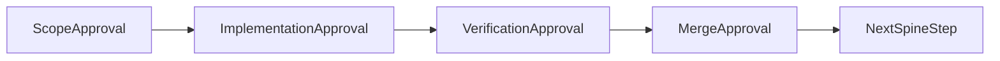

# Deduplication refactor — per-instance approval rollout

**Plan assets:** [docs/plans/2026-06-01_deduplication_refactor_847294/](docs/plans/2026-06-01_deduplication_refactor_847294/) (save this plan as `plan.md` there on execution)

**Source of truth for scope, files, code chunks, and proposed fixes:** [DEDUPLICATION_OPPORTUNITIES.md](DEDUPLICATION_OPPORTUNITIES.md). Developers must read the matching `### … instance N` section before starting any task. This plan does not duplicate that content.

---

## Remember

- Exact file paths always
- Exact commands with expected output
- DRY, YAGNI, TDD, frequent commits
- One instance = one PR unless explicitly paired at Stage 1
- Minimum regression risk over maximum LOC reduction (per source doc)
- **Strict spine:** complete Stage 4 for task *N* before starting task *N+1* in the table below
- UI: N/A — no `ui/` changes; no screenshots required

---

## Overview

The data platform has repeated patterns across ingestion, preprocessing, feature generation, and curation. [DEDUPLICATION_OPPORTUNITIES.md](DEDUPLICATION_OPPORTUNITIES.md) catalogs 18 refactor instances. This rollout treats **each instance as exactly one task** with a fixed four-stage approval gate. Work proceeds in **strict instance-number order by domain**: Ingestion 1→6, then Preprocessing 1→3, Generate features 1→3, Curate 1→2, Cross-folder 1→4. The dedup doc’s “Summary priority” table is advisory only when it disagrees with this spine (see note below).

---

## Happy Flow

1. Coordinator assigns the next task from **Serial Coordination Spine** (spine step = previous + 1; start at step 1 = `ingestion-1`).
2. Developer reads the corresponding section in [DEDUPLICATION_OPPORTUNITIES.md](DEDUPLICATION_OPPORTUNITIES.md) and completes **Stage 1 — Scope approval**.
3. Developer implements on a dedicated branch; opens PR; obtains **Stage 2 — Implementation approval**.
4. Developer runs instance-specific and spine verification commands; documents results in PR; obtains **Stage 3 — Verification approval**.
5. Reviewer merges; **Stage 4 — Merge approval** unlocks the next spine step.
6. Repeat through step 18, or stop with documented defer/skip on `preprocessing-1`, `cross-folder-2`, `cross-folder-3`, or `cross-folder-4`.



---

## Per-instance approval workflow (mandatory for all 18 tasks)

| Stage | Gate | Owner | Done when |
|-------|------|-------|-----------|
| 1 — Scope | Confirm task ID, dedup doc section read, files in/out of scope | Developer + reviewer | PR/issue comment: “Scope approved for {task-id}” |
| 2 — Implementation | Code matches proposed fix in dedup doc; no drive-by refactors | Reviewer | PR approved for code |
| 3 — Verification | Tests + manual checks from dedup doc / spine | Developer + reviewer | “Verification approved” + checklist |
| 4 — Merge | Safe to land | Reviewer | Merged; advance spine pointer |

**Rules:**

- **No parallel instance tasks.** Do not start Stage 2 on spine step *N+1* until Stage 4 on step *N* completes.
- If scope changes mid-PR, return to Stage 1.
- **`generate-features-2`:** Stage 1 must acknowledge P0 dual-path risk (dedup doc); required before `generate-features-3` (satisfied by spine order 11 → 12).

**Note vs dedup doc priority table:** [DEDUPLICATION_OPPORTUNITIES.md](DEDUPLICATION_OPPORTUNITIES.md) suggests doing quick wins (ingestion 5–6, curate 2) and P0 `generate-features-2` earlier, and ingestion 4 before 3. This plan **overrides execution order** to instance numbering for predictability. Stage 1 for higher-risk steps (`ingestion-3`, `ingestion-4`, `generate-features-2`) should call out any extra regression checks from the dedup doc.

---

## Alternative approaches

| Approach | Why not chosen here |
|----------|---------------------|
| Dedup doc “Summary priority” order | User requested instance IDs in numeric order starting at ingestion |
| Step-0 parallel bundle (ingestion 5/6 + curate 2) | Conflicts with strict serial spine |
| One mega-PR | Hard to review; violates per-instance approval |
| Single `curate_platform.py --platform` CLI | Dedup doc recommends keeping three operator scripts |

---

## Serial Coordination Spine (execution order)

| Spine step | Task ID | Dedup doc section |
|------------|---------|-------------------|
| 1 | `ingestion-1` | Ingestion instance 1 |
| 2 | `ingestion-2` | Ingestion instance 2 |
| 3 | `ingestion-3` | Ingestion instance 3 |
| 4 | `ingestion-4` | Ingestion instance 4 |
| 5 | `ingestion-5` | Ingestion instance 5 |
| 6 | `ingestion-6` | Ingestion instance 6 |
| 7 | `preprocessing-1` | Preprocessing instance 1 — **defer by default** unless Stage 1 override |
| 8 | `preprocessing-2` | Preprocessing instance 2 |
| 9 | `preprocessing-3` | Preprocessing instance 3 |
| 10 | `generate-features-1` | Generate features instance 1 |
| 11 | `generate-features-2` | Generate features instance 2 (P0) |
| 12 | `generate-features-3` | Generate features instance 3 — blocked until step 11 Stage 4 |
| 13 | `curate-1` | Curate instance 1 |
| 14 | `curate-2` | Curate instance 2 |
| 15 | `cross-folder-1` | Cross-folder instance 1 — may refactor loader introduced in step 10 |
| 16 | `cross-folder-2` | Cross-folder instance 2 — **defer by default** unless Stage 1 override |
| 17 | `cross-folder-3` | Cross-folder instance 3 — **defer optional** |
| 18 | `cross-folder-4` | Cross-folder instance 4 — **skip unless pain** |

**Optional Stage 1 pairing (same PR, same spine step):** Only if reviewer explicitly approves combining two adjacent steps into one PR (e.g. `ingestion-1` + `ingestion-2`). Default remains one instance = one PR.

**Minor / quick wins** in dedup doc (lines ~894–904): not separate tasks — fold into the instance that touches those files (e.g. `_require_dataset_id` → `ingestion-3`).

---

## Interface or Contract Freeze

Freeze these public surfaces unless the active instance’s dedup section explicitly allows change:

- CLI entrypoints: `sync_*.py`, `preprocess_*.py`, `generate_*_features.py`, `curate_*.py`
- [`data_platform/utils/platform_ids.py`](data_platform/utils/platform_ids.py) — binding columns / CSV keys
- Reddit-only sync metadata — **`ingestion-2`**
- Bluesky vs Twitter keyword loop table — **`ingestion-4`**
- `FeatureSpec` / registry engine routing — **`generate-features-2`**

New shared modules: only as named in the active instance’s dedup section.

---

## Parallel Task Packets

**None.** All 18 tasks run strictly serially per spine table above.

---

## Integration Order

After each merge (in spine order):

1. `uv run pytest tests/data_platform/ -q --tb=short` (or area subset if instance-local)
2. Ingestion instances: `uv run pytest tests/data_platform/ingestion/ -q`
3. Feature instances: `uv run pytest tests/data_platform/generate_features/ -q` (+ `test_langchain_engine.py` when LLM path changes)
4. Preprocessing instances: `uv run pytest tests/data_platform/preprocessing/ -q`
5. Curate instances: `uv run pytest tests/data_platform/curate/ -q`

---

## Instance task catalog (18 tasks)

Read the matching `### … instance N` in [DEDUPLICATION_OPPORTUNITIES.md](DEDUPLICATION_OPPORTUNITIES.md) before each task.

| Task ID | Stage 1 reminder (not a substitute for dedup doc) |
|---------|---------------------------------------------------|
| `ingestion-1` | `sync_checkpoint.py`; `subreddits` vs `keywords` ledger key |
| `ingestion-2` | Reddit `extra` metadata fields must survive generalization |
| `ingestion-3` | `sync_runner.py`; Reddit loop stays platform-specific |
| `ingestion-4` | Bluesky/Twitter behavior table; row-count parity / checkpoint tests |
| `ingestion-5` | Per-platform retry predicates unchanged |
| `ingestion-6` | `experiments/x_fetch_data_2026_06_01/x_client.py` import shared helper |
| `preprocessing-1` | Defer unless override; `runner.py` CLI factory |
| `preprocessing-2` | Single `URL_PATTERN` |
| `preprocessing-3` | `check_text_length` bounds unchanged |
| `generate-features-1` | `platform_cli.py`; `FeatureLabelQuery` from binding |
| `generate-features-2` | P0 — one LLM labeling path; do not start `generate-features-3` early |
| `generate-features-3` | `llm_feature_factory` only after step 11 merged |
| `curate-1` | Keep three `curate_*.py` CLI entrypoints |
| `curate-2` | Delete `curate/utils.py` wrapper only |
| `cross-folder-1` | `records_loader.py`; may dedupe step 10 loader code |
| `cross-folder-2` | Defer unless override; `atomic_json.py` |
| `cross-folder-3` | Defer optional; schema differences |
| `cross-folder-4` | Skip unless pain; no god-object `PlatformPipelineSpec` |

---

## Manual Verification

### Global (after every merge)

```bash
cd /Users/mark/Documents/work/lab_data_integrations_interface-wt
uv run pytest tests/data_platform/ -q --tb=short
```

### Instance-specific (Stage 3 when applicable)

- **`ingestion-4`:** Same-config row counts with `max_rows`, multi-keyword, resume; checkpoint tests.
- **`generate-features-2`:** Batch and standalone paths share one implementation; `test_langchain_engine.py` green.
- **`ingestion-3`:** `tests/data_platform/ingestion/test_sync_*_checkpoint.py` after steps 1–2 merged.

### PR checklist (each task)

- [ ] Dedup doc section for this task ID read
- [ ] Spine step number recorded in PR title/description
- [ ] Stage 1 scope approval comment
- [ ] Tests added/updated where behavior changes
- [ ] Subset pytest commands run (listed in PR)
- [ ] Stage 3 verification approval comment
- [ ] Stage 4 merge → coordinator advances spine

---

## Final Verification

When spine steps 1–18 are complete (or defer/skip documented):

```bash
uv run pytest tests/data_platform/ -q
uv run ruff check data_platform/ tests/data_platform/
```

- [ ] All non-deferred spine steps at Stage 4
- [ ] [DEDUPLICATION_OPPORTUNITIES.md](DEDUPLICATION_OPPORTUNITIES.md) annotated if implementation diverged from proposed fix

---

## Execution artifact

On plan approval, write to:

`docs/plans/2026-06-01_deduplication_refactor_847294/plan.md`

Optional: `instance_status.md` — columns `Spine step | Task ID | Stage 1–4 | PR link | Notes`.
