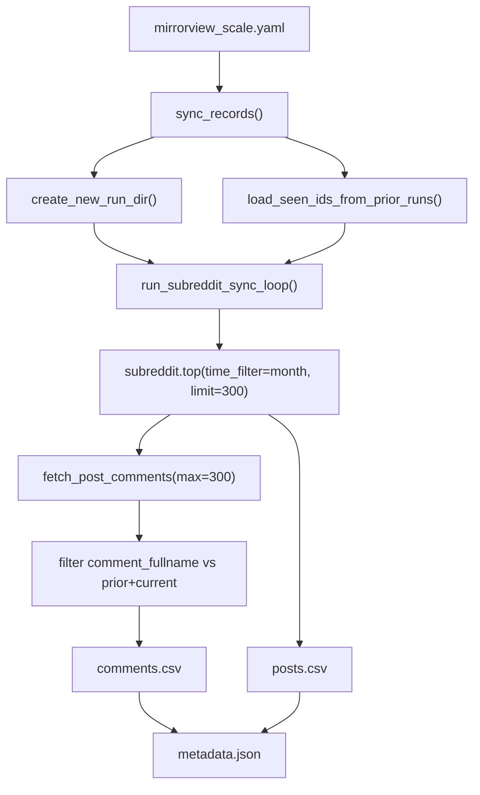

# Reddit mirrorview_scale Ingestion Plan

Plan asset folder: [`docs/plans/2026-06-01_reddit_mirrorview_scale_628471/`](docs/plans/2026-06-01_reddit_mirrorview_scale_628471/)

No UI changes — screenshots not required.

## Remember

- Exact file paths always
- Exact commands with expected output
- DRY, YAGNI, TDD, frequent commits
- Maximum safely delegable parallelism
- Delegated tasks must be impossible to misread
- UI changes: agent captures before/after screenshots itself (no README or instructions for the user)

---

## Overview

We are extending the Reddit ingestion pipeline to support a second Mirrorview collection batch: **top posts from the last month** at 6× post volume and 1.5× comments/post, while **skipping comments already stored in prior raw runs** for dataset `reddit_f47ac10b-58cc-4372-a567-0e02b2c3d479`. The prior `mirrorview.yaml` run used `listing: hot` with 50/200 limits and wrote to [`data_platform/data/reddit/reddit_f47ac10b-58cc-4372-a567-0e02b2c3d479/raw/2026_06_01-02:51:43/`](data_platform/data/reddit/reddit_f47ac10b-58cc-4372-a567-0e02b2c3d479/raw/2026_06_01-02:51:43/). Current code supports `listing: top` but **does not pass PRAW `time_filter`**, and deduplicates comments **only within the current run directory**.

---

## Happy Flow

1. Operator creates [`data_platform/ingestion/configs/reddit/mirrorview_scale.yaml`](data_platform/ingestion/configs/reddit/mirrorview_scale.yaml) with `listing: top`, `listing_time_filter: month`, `limit_per_subreddit: 300`, `comments_per_post: 300`, `dedupe_comments_from_prior_raw_runs: true`, same `dataset_id` and subreddit list as [`mirrorview.yaml`](data_platform/ingestion/configs/reddit/mirrorview.yaml).
2. Operator runs: `PYTHONPATH=. uv run python data_platform/ingestion/sync_reddit.py --config mirrorview_scale.yaml`
3. [`sync_reddit.py`](data_platform/ingestion/sync_reddit.py) `sync_records()` loads config, creates a **new** raw timestamp dir under `data_platform/data/reddit/reddit_f47ac10b-58cc-4372-a567-0e02b2c3d479/raw/`.
4. `run_subreddit_sync_loop()` loads prior comment IDs from all sibling raw run dirs (excluding current run) via new `StorageManager.load_seen_ids_from_prior_runs()`.
5. For each subreddit, `fetch_records_for_subreddit()` calls `_fetch_subreddit_page()` → `_get_subreddit_listing()` with `subreddit.top(time_filter="month", limit=300)`.
6. For each submission, `fetch_post_comments()` (unchanged, in [`experiments/reddit_fetch_data_2026_05_23/reddit_client.py`](experiments/reddit_fetch_data_2026_05_23/reddit_client.py)) collects up to 300 eligible comments.
7. Posts append to `posts.csv` with **within-run dedup only** (existing behavior). Comments append only if `comment_fullname` not in `prior_ids ∪ current_run_ids`.
8. `metadata.json` records fetch params, per-subreddit stats, `comments_skipped_as_duplicates`, and `sync_status: completed`.
9. Downstream preprocess/curate/feature steps (out of scope for this plan) consume the new raw timestamp separately.



---

## Alternative Approaches

| Option | Why not chosen |
|--------|----------------|
| Post-fetch filter by `created_utc` instead of `listing_time_filter` | Reddit API already exposes `t=month` on `/top`; client-side date filter wastes API calls and misaligns with Reddit ranking |
| Skip comment fetch for posts seen in prior runs | Would miss **new** comments on old posts; user wants dedup at write time, not skip fetch |
| Dedup posts across runs | User explicitly said posts may be re-collected |
| Hard-code prior run path `2026_06_01-02:51:43` | Scanning all prior raw runs under the dataset is general and survives future batches |
| Separate dedup index file | YAGNI; existing `comments.csv` + `load_seen_ids` is sufficient at current scale (~11k prior comments) |

**Chosen:** Config-driven `listing_time_filter` + `dedupe_comments_from_prior_raw_runs`, implemented with one new storage helper and targeted changes to listing/dedup paths in `sync_reddit.py`.

---

## Interface or Contract Freeze

### New YAML fetch keys ([`mirrorview_scale.yaml`](data_platform/ingestion/configs/reddit/mirrorview_scale.yaml))

| Key | Type | Required | Default | Semantics |
|-----|------|----------|---------|-----------|
| `listing_time_filter` | string | when `listing: top` | none (PRAW default `"all"`) | One of: `hour`, `day`, `week`, `month`, `year`, `all`. Invalid if `listing != top` |
| `dedupe_comments_from_prior_raw_runs` | bool | no | `false` | When `true`, union `comment_fullname` from all other raw run dirs before append |

### New storage API ([`storage.py`](data_platform/utils/storage.py))

```python
def load_seen_ids_from_prior_runs(
    self,
    exclude_run_dir: Path,
    id_column: str,
    *,
    filename: str | None = None,
) -> set[str]:
    """Union id_column values from every run dir under root_dir except exclude_run_dir."""
```

### New metadata fields

- `comments_skipped_as_duplicates: int` (run-level, incremented each subreddit)
- `fetch.listing_time_filter` persisted via existing `init_sync_metadata()` copy of `config["fetch"]`

### Invariants (must not break)

- Within-run dedup for posts and comments unchanged
- Resume/checkpoint behavior unchanged (`--resume`, subreddit ledger)
- Existing configs ([`default.yaml`](data_platform/ingestion/configs/reddit/default.yaml), [`mirrorview.yaml`](data_platform/ingestion/configs/reddit/mirrorview.yaml)) behave identically when new keys absent
- Comment CSV schema unchanged

---

## All Changed Files

| File | Action |
|------|--------|
| [`data_platform/utils/storage.py`](data_platform/utils/storage.py) | Modify — add `load_seen_ids_from_prior_runs` |
| [`data_platform/ingestion/sync_reddit.py`](data_platform/ingestion/sync_reddit.py) | Modify — listing time filter + prior-run comment dedup |
| [`data_platform/ingestion/configs/reddit/mirrorview_scale.yaml`](data_platform/ingestion/configs/reddit/mirrorview_scale.yaml) | **Create** |
| [`tests/data_platform/utils/test_storage.py`](tests/data_platform/utils/test_storage.py) | Modify — test prior-run loader |
| [`tests/data_platform/ingestion/test_sync_reddit_listing.py`](tests/data_platform/ingestion/test_sync_reddit_listing.py) | **Create** — listing/time_filter unit tests |
| [`tests/data_platform/ingestion/test_sync_reddit_checkpoint.py`](tests/data_platform/ingestion/test_sync_reddit_checkpoint.py) | Modify — prior-run comment dedup test |
| [`docs/plans/2026-06-01_reddit_mirrorview_scale_628471/plan.md`](docs/plans/2026-06-01_reddit_mirrorview_scale_628471/plan.md) | **Create** — copy of this plan |

**Forbidden to change:** [`reddit_client.py`](experiments/reddit_fetch_data_2026_05_23/reddit_client.py), curate/preprocess pipelines, existing raw data under `2026_06_01-02:51:43/`

---

## Before / After — Per File and Function

### 1. [`data_platform/utils/storage.py`](data_platform/utils/storage.py)

#### Function: `load_seen_ids_from_prior_runs` — **NEW**

**Before:** Does not exist. Callers only load IDs from a single `run_dir` via `load_seen_ids()`.

**After:**

```python
def load_seen_ids_from_prior_runs(
    self,
    exclude_run_dir: Path,
    id_column: str,
    *,
    filename: str | None = None,
) -> set[str]:
    seen: set[str] = set()
    if not self.root_dir.exists():
        return seen
    for run_dir in self.root_dir.iterdir():
        if not run_dir.is_dir() or run_dir.resolve() == exclude_run_dir.resolve():
            continue
        seen.update(self.load_seen_ids(run_dir, id_column, filename=filename))
    return seen
```

---

### 2. [`data_platform/ingestion/sync_reddit.py`](data_platform/ingestion/sync_reddit.py)

#### Module constant — **NEW**

**Before:** No time-filter validation set.

**After:**

```python
VALID_LISTING_TIME_FILTERS = frozenset({"all", "day", "hour", "month", "week", "year"})
```

#### Function: `_resolve_listing_time_filter` — **NEW**

**Before:** N/A

**After:**

```python
def _resolve_listing_time_filter(fetch: dict[str, Any], listing: str) -> str | None:
    raw = fetch.get("listing_time_filter")
    if raw is None:
        return None
    if listing != "top":
        raise ValueError("fetch.listing_time_filter is only valid when listing is 'top'")
    time_filter = str(raw)
    if time_filter not in VALID_LISTING_TIME_FILTERS:
        raise ValueError(f"Unsupported fetch.listing_time_filter value: {time_filter!r}")
    return time_filter
```

#### Function: `_get_subreddit_listing`

**Before:**

```python
def _get_subreddit_listing(
    subreddit_obj: praw.models.Subreddit,
    listing: str,
    limit: int,
) -> list[praw.models.Submission]:
    ...
    if listing == "top":
        return list(subreddit_obj.top(limit=limit))
```

**After:**

```python
def _get_subreddit_listing(
    subreddit_obj: praw.models.Subreddit,
    listing: str,
    limit: int,
    *,
    time_filter: str | None = None,
) -> list[praw.models.Submission]:
    ...
    if listing == "top":
        kwargs: dict[str, Any] = {"limit": limit}
        if time_filter is not None:
            kwargs["time_filter"] = time_filter
        return list(subreddit_obj.top(**kwargs))
```

#### Function: `_fetch_subreddit_page`

**Before:**

```python
def _fetch_subreddit_page(
    reddit: praw.Reddit,
    subreddit: str,
    listing: str,
    limit: int,
) -> list[praw.models.Submission]:
    return _get_subreddit_listing(reddit.subreddit(subreddit), listing, limit)
```

**After:**

```python
def _fetch_subreddit_page(
    reddit: praw.Reddit,
    subreddit: str,
    listing: str,
    limit: int,
    *,
    time_filter: str | None = None,
) -> list[praw.models.Submission]:
    return _get_subreddit_listing(
        reddit.subreddit(subreddit), listing, limit, time_filter=time_filter
    )
```

#### Function: `fetch_records_for_subreddit`

**Before:** Reads `listing`, calls `_fetch_subreddit_page(reddit, subreddit, listing, limit)` with no time filter. Stats omit `listing_time_filter`.

**After:**

- Call `_resolve_listing_time_filter(fetch, listing)` before fetch
- Pass `time_filter=resolved` to `_fetch_subreddit_page`
- Include `"listing_time_filter": resolved` in stats dict and NotFound fallback dict (value `None` when unset)

#### Function: `run_subreddit_sync_loop`

**Before:**

```python
def run_subreddit_sync_loop(..., include_comments: bool, include_posts: bool) -> None:
    ...
    # comment dedup:
    seen_comments = comment_storage.load_seen_ids(output_dir, "comment_fullname", ...)
    new_comments = [row for row in comment_rows if row["comment_fullname"] not in seen_comments]
```

**After:**

```python
def run_subreddit_sync_loop(..., include_comments: bool, include_posts: bool) -> None:
    prior_comment_ids: set[str] = set()
    if include_comments and fetch.get("dedupe_comments_from_prior_raw_runs"):
        prior_comment_ids = comment_storage.load_seen_ids_from_prior_runs(
            output_dir, "comment_fullname", filename=COMMENTS_CSV
        )
    comments_skipped = int(metadata.get("comments_skipped_as_duplicates", 0))
    ...
    # comment dedup:
    seen_comments = prior_comment_ids | comment_storage.load_seen_ids(...)
    new_comments = [row for row in comment_rows if row["comment_fullname"] not in seen_comments]
    comments_skipped += len(comment_rows) - len(new_comments)
    metadata["comments_skipped_as_duplicates"] = comments_skipped
```

Post dedup block: **unchanged** (within-run only).

#### Functions unchanged

- `sync_records`, `init_sync_metadata`, `find_resume_run_dir`, `merge_work_items_with_metadata`, `_count_seen_rows`, `_flush_metadata` — no signature changes; `init_sync_metadata` automatically persists new fetch keys via `config["fetch"]` copy

---

### 3. [`data_platform/ingestion/configs/reddit/mirrorview_scale.yaml`](data_platform/ingestion/configs/reddit/mirrorview_scale.yaml) — **NEW**

**Before:** File does not exist.

**After:**

```yaml
dataset_id: reddit_f47ac10b-58cc-4372-a567-0e02b2c3d479
name: mirrorview_scale
description: Mirrorview scaled top-month collection across Reddit political subreddits
date: "2026-06-01"
record_types:
  - reddit.comment
  - reddit.post
fetch:
  subreddits:
    - Conservative
    - Republican
    - AskConservatives
    - politics
    - liberal
    - democrats
  listing: top
  listing_time_filter: month
  limit_per_subreddit: 300
  comments_per_post: 300
  min_comment_body_length: 30
  dedupe_comments_from_prior_raw_runs: true
```

---

### 4. [`tests/data_platform/utils/test_storage.py`](tests/data_platform/utils/test_storage.py)

#### Test: `test_load_seen_ids_from_prior_runs` — **NEW**

**Before:** No coverage for cross-run ID union.

**After:** Create two prior raw run dirs with `comments.csv`, one current run dir; assert union excludes current run and includes both prior comment fullnames. Use `RedditStorageManager("raw", VALID_REDDIT_DATASET_ID)` + `reddit_conftest.mock_comment_row`.

---

### 5. [`tests/data_platform/ingestion/test_sync_reddit_listing.py`](tests/data_platform/ingestion/test_sync_reddit_listing.py) — **NEW**

#### Tests — **NEW**

| Test | Asserts |
|------|---------|
| `test_get_subreddit_listing_top_passes_time_filter` | Mock `Subreddit.top` called with `time_filter="month", limit=300` |
| `test_resolve_listing_time_filter_rejects_non_top_listing` | `listing: hot` + `listing_time_filter: month` raises `ValueError` |
| `test_resolve_listing_time_filter_rejects_invalid_value` | `listing_time_filter: fortnight` raises `ValueError` |

---

### 6. [`tests/data_platform/ingestion/test_sync_reddit_checkpoint.py`](tests/data_platform/ingestion/test_sync_reddit_checkpoint.py)

#### Test: `test_run_subreddit_sync_loop_skips_prior_run_comments` — **NEW**

**Before:** Only within-run dedup tested.

**After:**

1. Create prior run dir `2026_05_29-10:00:00` with comment `t1_comment_old`
2. Create new run dir `2026_05_30-10:00:00`
3. Set `fetch["dedupe_comments_from_prior_raw_runs"] = True`
4. Mock fetch returning comment `t1_comment_old` (duplicate) and `t1_comment_new`
5. Assert only `t1_comment_new` in new run's `comments.csv`; `metadata["comments_skipped_as_duplicates"] == 1`

Existing tests `test_run_subreddit_sync_loop_appends_per_subreddit` and `test_resume_skips_completed_subreddits`: **unchanged behavior** (new fetch keys absent → defaults).

---

## Serial Coordination Spine

1. **Contract freeze** — this document; no implementation until confirmed
2. **TDD: storage helper** — test then `load_seen_ids_from_prior_runs`
3. **TDD: listing time filter** — tests then `_resolve_listing_time_filter` + `_get_subreddit_listing` + `_fetch_subreddit_page` + `fetch_records_for_subreddit`
4. **TDD: prior-run dedup** — test then `run_subreddit_sync_loop` changes
5. **Add config** — `mirrorview_scale.yaml`
6. **Full pytest** — targeted then full suite
7. **Optional live run** — requires Reddit env vars

`sync_reddit.py` is owned by the serial spine (steps 3–4 sequential commits on same file).

---

## Parallel Task Packets

### P1 — Storage prior-run loader

- **Objective:** Add and test `load_seen_ids_from_prior_runs` on `StorageManager`
- **Parallelizable because:** Only touches [`storage.py`](data_platform/utils/storage.py) + [`test_storage.py`](tests/data_platform/utils/test_storage.py)
- **Allowed to change:** `data_platform/utils/storage.py`, `tests/data_platform/utils/test_storage.py`
- **Forbidden:** `sync_reddit.py`, configs, raw data
- **Preconditions:** Contract freeze approved
- **Steps:** Write failing test → implement method → `uv run pytest tests/data_platform/utils/test_storage.py -q`
- **Done when:** Test passes; method matches contract

### P2 — Listing time_filter (sync_reddit listing path only)

- **Objective:** Wire PRAW `time_filter` for `listing: top`
- **Parallelizable because:** Independent of P1 until dedup step; different functions in `sync_reddit.py` than dedup (but **same file** — coordinator merges P2 before P3)
- **Allowed to change:** `sync_reddit.py` (listing functions only), `tests/data_platform/ingestion/test_sync_reddit_listing.py` (new)
- **Forbidden:** `run_subreddit_sync_loop` dedup logic, `storage.py`, configs
- **Verification:** `uv run pytest tests/data_platform/ingestion/test_sync_reddit_listing.py -q`

### P3 — Prior-run comment dedup in sync loop

- **Objective:** Skip comments found in prior raw runs when config flag set
- **Depends on:** P1 complete
- **Must run after:** P2 merged (same file)
- **Allowed to change:** `sync_reddit.py` (`run_subreddit_sync_loop` only), `test_sync_reddit_checkpoint.py`
- **Verification:** `uv run pytest tests/data_platform/ingestion/test_sync_reddit_checkpoint.py -q`

### P4 — Ingestion config

- **Objective:** Add `mirrorview_scale.yaml`
- **Depends on:** P2 + P3 merged
- **Allowed to change:** `data_platform/ingestion/configs/reddit/mirrorview_scale.yaml` only
- **Verification:** YAML loads via `load_yaml_config`; keys match contract

---

## Integration Order

1. P1 (storage)
2. P2 (listing) — merge to main branch / working tree
3. P3 (dedup) — merge on top of P2
4. P4 (config)
5. Full test suite
6. Optional live ingestion

---

## Manual Verification

- [ ] **Unit tests (storage):** `uv run pytest tests/data_platform/utils/test_storage.py -q` → all passed
- [ ] **Unit tests (listing):** `uv run pytest tests/data_platform/ingestion/test_sync_reddit_listing.py -q` → all passed
- [ ] **Unit tests (checkpoint/dedup):** `uv run pytest tests/data_platform/ingestion/test_sync_reddit_checkpoint.py -q` → all passed; existing tests still pass
- [ ] **Regression:** `uv run pytest tests/data_platform/ingestion/ -q` → all passed
- [ ] **Config load:** `PYTHONPATH=. uv run python -c "from data_platform.utils.config_paths import load_yaml_config; from pathlib import Path; c=load_yaml_config(Path('data_platform/ingestion/configs/reddit/mirrorview_scale.yaml')); assert c['fetch']['listing_time_filter']=='month'"` → no error
- [ ] **Live run (optional, requires credentials):** `PYTHONPATH=. uv run python data_platform/ingestion/sync_reddit.py --config mirrorview_scale.yaml`
  - Expect new dir under `data_platform/data/reddit/reddit_f47ac10b-58cc-4372-a567-0e02b2c3d479/raw/<timestamp>/`
  - `metadata.json` shows `"listing": "top"`, `"listing_time_filter": "month"`, `"limit_per_subreddit": 300`, `"comments_per_post": 300`
  - `comments_skipped_as_duplicates` > 0 if overlapping posts with prior hot run
  - `posts.csv` row count up to 1800; `comments.csv` contains no `comment_fullname` present in `raw/2026_06_01-02:51:43/comments.csv` (verify with a small script or `comm` on extracted ID columns)
- [ ] **Resume smoke (optional):** Interrupt run, `--resume` → subreddit ledger continues; dedup counts monotonic

---

## Operational Notes

- **Runtime:** ~1,800 post listings + ~1,800 comment-tree fetches; expect hours. [`reddit_retry.py`](data_platform/ingestion/reddit_retry.py) handles 429/5xx.
- **API limit:** Reddit caps any single listing at ~1,000 items; 300/subreddit is safe.
- **Downstream:** Preprocess/curate/feature generation for the new raw timestamp is a separate follow-up (reuse existing [`mirrorview.yaml`](data_platform/curate/configs/reddit/mirrorview.yaml) curate config).
