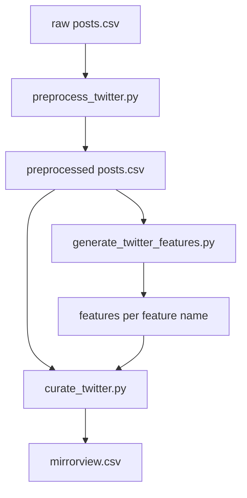

# Twitter preprocessing, features, and curation

## Remember

- Exact file paths always
- Exact commands with expected output
- DRY, YAGNI, TDD, frequent commits
- Maximum safely delegable parallelism
- Delegated tasks must be impossible to misread
- No UI work in this plan (CLI/data pipeline only)

**Plan assets:** [docs/plans/2026-06-01_twitter_preprocess_features_curate_482913/](docs/plans/2026-06-01_twitter_preprocess_features_curate_482913/) (save this plan copy there on implementation)

**Primary dataset (ingestion already done):**

- `dataset_id`: `twitter_f47ac10b-58cc-4372-a567-0e02b2c3d479`
- Raw run: [data_platform/data/twitter/twitter_f47ac10b-58cc-4372-a567-0e02b2c3d479/raw/2026_06_01-16:02:25/](data_platform/data/twitter/twitter_f47ac10b-58cc-4372-a567-0e02b2c3d479/raw/2026_06_01-16:02:25/) (~1000 rows in `posts.csv`)

---

## Overview

Twitter ingestion is complete; the data platform still lacks downstream stages. This work adds three thin platform CLIs that plug into existing shared modules ([`data_platform/preprocessing/runner.py`](data_platform/preprocessing/runner.py), [`data_platform/generate_features/generate_features.py`](data_platform/generate_features/generate_features.py), [`data_platform/curate/runner.py`](data_platform/curate/runner.py)). Preprocessing uses **Twitter-specific validators** (strip `t.co`, block other URLs, length 50–280). Features reuse the global [`FEATURE_REGISTRY`](data_platform/generate_features/registry.py) with `tweet_id` as the record key and `uri` as the feature-CSV column name (Reddit pattern). Curation reuses the same Mirrorview filter chain as Bluesky/Reddit via a new YAML under `curate/configs/twitter/`.

---

## Happy Flow

1. **Preprocess** — [`preprocess_twitter.py`](data_platform/preprocessing/preprocess_twitter.py) loads latest raw `posts.csv` via [`TwitterStorageManager`](data_platform/utils/storage.py), validates rows with [`SyncTwitterPostModel`](data_platform/models/sync.py), applies text validators from [`twitter_validators.py`](data_platform/preprocessing/validators/twitter_validators.py), writes `data_platform/data/twitter/{dataset_id}/preprocessed/{timestamp}/posts.csv` + `metadata.json` (via [`runner.preprocess_records`](data_platform/preprocessing/runner.py)).
2. **Features** — [`generate_twitter_features.py`](data_platform/generate_features/generate_twitter_features.py) loads latest preprocessed posts, builds [`FeatureGenerationConfig`](data_platform/generate_features/models.py) with `id_column=tweet_id`, `feature_csv_id_column=uri` ([`TWITTER_BINDING`](data_platform/utils/platform_ids.py)), runs all six registry features, appends to `data_platform/data/twitter/{dataset_id}/features/{feature}.csv` + `metadata.json`.
3. **Curate** — [`curate_twitter.py`](data_platform/curate/curate_twitter.py) loads latest preprocessed `posts.csv`, DuckDB-joins feature CSVs ([`consolidate.build_wide_table`](data_platform/curate/consolidate.py) with `id_column=tweet_id`), applies [`configs/twitter/mirrorview.yaml`](data_platform/curate/configs/twitter/mirrorview.yaml) via [`apply_rules`](data_platform/curate/apply_rules.py), writes `curated/{timestamp}/mirrorview.csv` + `metadata.json`.



---

## Interface or Contract Freeze

| Contract | Value | Notes |
|----------|-------|--------|
| `dataset_id` | `twitter_<uuid>` | Already validated in [`dataset.py`](data_platform/utils/dataset.py) |
| Raw/preprocessed CSV | `posts.csv` | [`TwitterStorageManager`](data_platform/utils/storage.py) default |
| Record schema | [`SyncTwitterPostModel`](data_platform/models/sync.py) | `tweet_id`, `text`, `username`, … |
| `TWITTER_BINDING` | `records_id_column=tweet_id`, `text_column=text`, `feature_csv_id_column=uri`, `records_file_key=posts` | **Do not rename** feature CSV column from `uri` (engines hardcode it) |
| Feature registry | All keys in [`FEATURE_REGISTRY`](data_platform/generate_features/registry.py) | `is_news_or_opinion`, `is_political`, `is_self_contained`, `is_structurally_complete`, `is_toxic_tiered`, `political_stance` |
| Curate export | `mirrorview.csv` | Same columns/filters as Bluesky Mirrorview |
| Preprocess validators | See TW-P packet | User chose Twitter-specific strategy |

**Forbidden changes (parallel tasks):**

- Do not edit `FEATURE_REGISTRY` entries or per-feature `generate_feature.py` modules unless a Twitter-only prompt is explicitly scoped later
- Do not change `SyncTwitterPostModel` fields or ingestion code
- Do not rename `uri` column in feature output models (`IsPoliticalModel.uri`, etc.)

---

## Serial Coordination Spine

1. Land **contract freeze** constants/tests (`VALID_TWITTER_DATASET_ID`, `mock_tweet_row`) — coordinator only
2. **TW-P** preprocessing + validator tests
3. **TW-F** feature CLI + unit tests (fixture-based; no live LLM in unit tests)
4. **TW-C** curate CLI + config + unit tests
5. **Integration** on real dataset: preprocess → features (start with subset) → curate
6. **TW-DOC** README + copy plan to `docs/plans/.../plan.md`
7. **Final verification** — pytest + pre-commit

---

## Parallel Task Packets

### TW-P — Preprocessing + Twitter validators

**Objective:** Filter raw tweets into preprocessed `posts.csv` with Twitter-appropriate rules.

**Parallelizable after:** contract constants exist (TW-0).

**Files to inspect:** [`preprocess_bluesky.py`](data_platform/preprocessing/preprocess_bluesky.py), [`validators/validators.py`](data_platform/preprocessing/validators/validators.py), [`runner.py`](data_platform/preprocessing/runner.py)

**Files allowed to change/add:**

- **Add** [`data_platform/preprocessing/validators/twitter_validators.py`](data_platform/preprocessing/validators/twitter_validators.py)
- **Add** [`data_platform/preprocessing/preprocess_twitter.py`](data_platform/preprocessing/preprocess_twitter.py)
- **Add** [`tests/data_platform/preprocessing/test_preprocess_twitter.py`](tests/data_platform/preprocessing/test_preprocess_twitter.py)

**Files forbidden:** `generate_features/*`, `curate/*`, ingestion/*

**Validator spec (exact behavior):**

| Function | Rule |
|----------|------|
| `strip_tco_links(text)` | Remove `https://t.co/<token>` and `http://t.co/<token>` (regex `r"https?://t\.co/\S+"`) |
| `check_if_valid_twitter_post_length(text)` | `50 <= len(text) <= 280` |
| `check_if_twitter_text_has_no_external_urls(text)` | Run existing URL regex from `validators.py` on `strip_tco_links(text)`; pass if no match |
| Reuse `check_if_not_phone`, `check_if_text_english` | From [`validators.py`](data_platform/preprocessing/validators/validators.py) |

**`POST_TEXT_VALIDATORS` tuple (order):** `check_if_not_phone`, `check_if_valid_twitter_post_length`, `check_if_twitter_text_has_no_external_urls`, `check_if_text_english`

**`TWITTER_SPEC`:** `platform="twitter"`, `storage_cls=TwitterStorageManager`, `model_cls=SyncTwitterPostModel`, `binding=TWITTER_BINDING`, `row_validators=()` (empty — no `author` column)

**CLI:** `typer` `--dataset-id` (required), help text `twitter_<uuid>`

**Tests (TDD first):** Parametrize validator cases: t.co-only URL passes external-URL check; `https://example.com` fails; length 49 fails, 50 passes, 281 fails; non-English fails; `filter_posts` keeps one valid row among invalid; optional integration test writing raw + running `preprocess_records` under `tmp_path` (mirror [`test_preprocess_reddit.py`](tests/data_platform/preprocessing/test_preprocess_reddit.py))

**Verify:**

```bash
uv run pytest tests/data_platform/preprocessing/test_preprocess_twitter.py -q
```

Expected: all passed

**Done when:** preprocess CLI runs on fixtures; tests green

---

### TW-F — Feature generation CLI

**Objective:** Resumable LLM labeling for preprocessed Twitter posts.

**Parallelizable after:** TW-P merged (for integration); unit tests use synthetic preprocessed CSV only.

**Files to inspect:** [`generate_reddit_features.py`](data_platform/generate_features/generate_reddit_features.py), [`generate_features.py`](data_platform/generate_features/generate_features.py), [`platform_cli.py`](data_platform/generate_features/platform_cli.py)

**Files allowed to change/add:**

- **Add** [`data_platform/generate_features/generate_twitter_features.py`](data_platform/generate_features/generate_twitter_features.py)
- **Add** [`tests/data_platform/generate_features/test_generate_twitter_features.py`](tests/data_platform/generate_features/test_generate_twitter_features.py)

**Files forbidden:** `registry.py`, feature subpackages, `curate/*`, `preprocessing/*`

**Config values (CLI defaults — match Bluesky/Reddit):**

| Flag | Default |
|------|---------|
| `--batch-size` | `64` |
| `--max-concurrency` | `80` |
| `--no-opik` | `False` |
| `--preprocessed-run` | optional, e.g. `preprocessed/2026_06_01-16:30:00` |
| `--features` | optional subset; repeatable |

**`twitter_feature_config` must set:**

- `platform="twitter"`
- `id_column="tweet_id"`
- `text_column="text"`
- `input_storage=TwitterStorageManager("preprocessed", dataset_id)`
- `features_dir=dataset_root("twitter", dataset_id) / "features"`
- `feature_label_query=FeatureLabelQuery(features_root=..., id_column="tweet_id", feature_csv_id_column="uri")`

**`load_posts`:** Validate with `SyncTwitterPostModel` (mirror `load_comments`)

**Tests:** Mirror [`test_generate_reddit_features.py`](tests/data_platform/generate_features/test_generate_reddit_features.py): `reddit_feature_config` → `twitter_feature_config`; `filter_unlabeled` uses `tweet_id` vs feature CSV `uri`; mock `generate_features` / registry subset

**Verify:**

```bash
uv run pytest tests/data_platform/generate_features/test_generate_twitter_features.py -q
```

---

### TW-C — Curation CLI + Mirrorview config

**Objective:** Join preprocessed posts + features; apply Mirrorview filters; export CSV.

**Parallelizable after:** contract freeze; unit tests use synthetic CSVs (no live features required).

**Files to inspect:** [`curate_reddit.py`](data_platform/curate/curate_reddit.py), [`configs/bluesky/mirrorview.yaml`](data_platform/curate/configs/bluesky/mirrorview.yaml), [`test_curate_reddit.py`](tests/data_platform/curate/test_curate_reddit.py)

**Files allowed to change/add:**

- **Add** [`data_platform/curate/curate_twitter.py`](data_platform/curate/curate_twitter.py)
- **Add** [`data_platform/curate/configs/twitter/mirrorview.yaml`](data_platform/curate/configs/twitter/mirrorview.yaml)
- **Add** [`tests/data_platform/curate/test_curate_twitter.py`](tests/data_platform/curate/test_curate_twitter.py)

**Files forbidden:** `consolidate.py`, `apply_rules.py`, `runner.py` (unless coordinator approves bugfix), `generate_features/*`

**`mirrorview.yaml` (exact content — copy Bluesky/Reddit):**

```yaml
name: mirrorview
output:
  filename: mirrorview.csv
filters:
  - column: news_or_opinion_category
    op: eq
    value: opinion
  - column: is_political
    op: eq
    value: true
  - column: political_stance
    op: in
    value:
      - left
      - right
  - column: is_self_contained
    op: eq
    value: true
  - column: is_structurally_complete
    op: eq
    value: true
```

**`TWITTER_CURATE_SPEC`:** `platform="twitter"`, `storage_cls=TwitterStorageManager`, `binding=TWITTER_BINDING`, `record_noun="posts"`

**CLI:** `--dataset-id` (required), `--config` / `-c` default `mirrorview.yaml`, resolved under `data_platform/curate/configs/twitter/`

**Tests:** Wide-table join on `tweet_id` with feature rows keyed by `uri` column containing tweet IDs; end-to-end `curate_mirrorview` on `tmp_path` with minimal feature CSVs for all six `FEATURE_WIDE_COLUMNS` keys

**Verify:**

```bash
uv run pytest tests/data_platform/curate/test_curate_twitter.py -q
```

---

### TW-0 — Shared test constants (coordinator / first commit)

**Add to** [`tests/data_platform/constants.py`](tests/data_platform/constants.py):

```python
VALID_TWITTER_DATASET_ID = "twitter_00000000-0000-4000-8000-000000000001"
```

**Add** [`tests/data_platform/ingestion/twitter_conftest.py`](tests/data_platform/ingestion/twitter_conftest.py) with `mock_tweet_row(tweet_id: str, **overrides)` returning a dict satisfying `SyncTwitterPostModel` (minimal fields: `tweet_id`, `text` ≥50 chars without external URLs after strip, `author_id`, `username`, `created_at`, counts, `url`, `keyword`, `sync_timestamp`).

---

### TW-DOC — Documentation

**Change** [`data_platform/README.md`](data_platform/README.md):

- Extend pipeline table with `twitter` row and three commands (preprocess, features, curate)
- Document `dataset_id` example `twitter_f47ac10b-58cc-4372-a567-0e02b2c3d479`

**Add** [`docs/plans/2026-06-01_twitter_preprocess_features_curate_482913/plan.md`](docs/plans/2026-06-01_twitter_preprocess_features_curate_482913/plan.md) — copy of this plan

---

## Integration Order

1. TW-0 → TW-P → run preprocess on production dataset
2. TW-F → run features (smoke then full)
3. TW-C → run curate after all six feature CSVs exist
4. TW-DOC

---

## Manual Verification

### Unit / CI

- [ ] `uv run pytest tests/data_platform/preprocessing/test_preprocess_twitter.py tests/data_platform/generate_features/test_generate_twitter_features.py tests/data_platform/curate/test_curate_twitter.py -q` — all pass
- [ ] `uv sync --group dev && uv run pre-commit run --all-files` — ruff, pyright, complexipy pass

### Preprocess (production dataset)

```bash
PYTHONPATH=. uv run python data_platform/preprocessing/preprocess_twitter.py \
  --dataset-id twitter_f47ac10b-58cc-4372-a567-0e02b2c3d479
```

**Expected:** stdout like `preprocess_records: kept N of 1000 posts -> .../preprocessed/{timestamp}` with `N < 1000` (t.co/external URL/length filters). New dir under `data_platform/data/twitter/twitter_f47ac10b-58cc-4372-a567-0e02b2c3d479/preprocessed/`.

- [ ] `metadata.json` has `row_counts.input` ≈ 1000, `row_counts.output` = N
- [ ] Spot-check: preprocessed `text` rows have no `t.co` and length in [50, 280]

### Features (smoke then full)

**Smoke (one feature, no Opik):**

```bash
PYTHONPATH=. uv run python data_platform/generate_features/generate_twitter_features.py \
  --dataset-id twitter_f47ac10b-58cc-4372-a567-0e02b2c3d479 \
  --features is_political --batch-size 16 --no-opik
```

**Expected:** `data_platform/data/twitter/.../features/is_political.csv` created; `uri` column values match `tweet_id` from preprocessed CSV.

**Full registry:**

```bash
PYTHONPATH=. uv run python data_platform/generate_features/generate_twitter_features.py \
  --dataset-id twitter_f47ac10b-58cc-4372-a567-0e02b2c3d479 \
  --batch-size 64 --no-opik
```

- [ ] Six CSVs present: `is_news_or_opinion.csv`, `is_political.csv`, `is_self_contained.csv`, `is_structurally_complete.csv`, `is_toxic_tiered.csv`, `political_stance.csv`
- [ ] `features/metadata.json` shows `sync_status: completed` when all features done

### Curate

```bash
PYTHONPATH=. uv run python data_platform/curate/curate_twitter.py \
  --dataset-id twitter_f47ac10b-58cc-4372-a567-0e02b2c3d479 \
  --config mirrorview.yaml
```

**Expected:** `curate_mirrorview: kept M of N posts -> .../curated/{timestamp}`

- [ ] `metadata.json`: 5 filter steps; `political_stance` step `op: in`, `value: [left, right]`
- [ ] `mirrorview.csv`: columns include `tweet_id`, `text`, `news_or_opinion_category`, `is_political`, `political_stance`, quality flags; stance values only `left` or `right`

---

## Alternative approaches

| Option | Why not chosen |
|--------|----------------|
| Bluesky validator parity | Drops most tweets (t.co in text); user rejected |
| Minimal validators only | Weaker alignment with Mirrorview “self-contained” intent |
| Rename feature CSV `uri` → `tweet_id` | Large blast radius across all feature models and engines |
| New Twitter feature prompts | YAGNI until labeling quality is measured on tweets |
| `orchestrate_twitter.py` Prefect flow | Out of scope; Bluesky orchestration stops at preprocess |

---

## File change summary

| Action | Path |
|--------|------|
| **Add** | `data_platform/preprocessing/validators/twitter_validators.py` |
| **Add** | `data_platform/preprocessing/preprocess_twitter.py` |
| **Add** | `data_platform/generate_features/generate_twitter_features.py` |
| **Add** | `data_platform/curate/curate_twitter.py` |
| **Add** | `data_platform/curate/configs/twitter/mirrorview.yaml` |
| **Add** | `tests/data_platform/preprocessing/test_preprocess_twitter.py` |
| **Add** | `tests/data_platform/generate_features/test_generate_twitter_features.py` |
| **Add** | `tests/data_platform/curate/test_curate_twitter.py` |
| **Add** | `tests/data_platform/ingestion/twitter_conftest.py` |
| **Add** | `docs/plans/2026-06-01_twitter_preprocess_features_curate_482913/plan.md` |
| **Change** | `tests/data_platform/constants.py` |
| **Change** | `data_platform/README.md` |
| **Unchanged** | `runner.py`, `generate_features/registry.py`, `curate/runner.py`, `consolidate.py`, `TWITTER_BINDING`, ingestion |

**Estimated new code:** ~700–900 lines (mostly tests mirroring Reddit).
