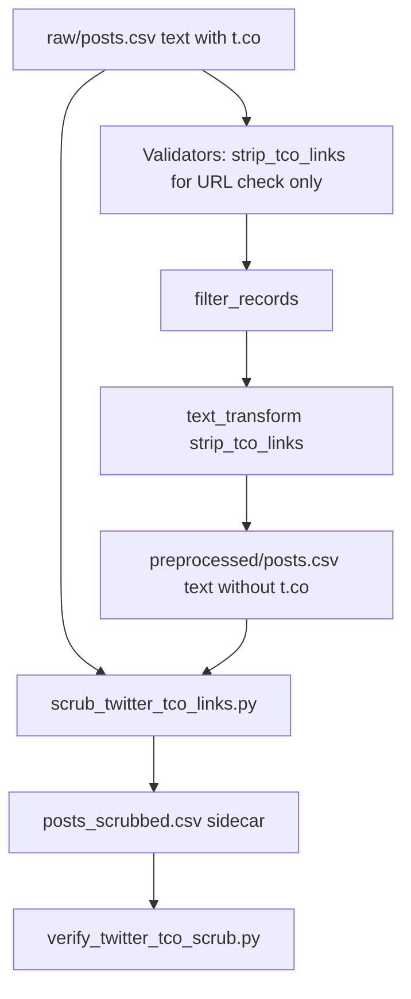

# Twitter t.co link scrubbing

## Remember

- Exact file paths always
- Exact commands with expected output
- DRY, YAGNI, TDD, frequent commits
- Maximum safely delegable parallelism
- Delegated tasks must be impossible to misread
- No UI work in this plan (CLI/data pipeline only)

**Plan assets:** [docs/plans/2026-06-01_twitter_tco_scrub_847293/](docs/plans/2026-06-01_twitter_tco_scrub_847293/) (save this plan copy there on implementation)

**Primary dataset:**

- `dataset_id`: `twitter_f47ac10b-58cc-4372-a567-0e02b2c3d479`
- Data root: [data_platform/data/twitter/twitter_f47ac10b-58cc-4372-a567-0e02b2c3d479/](data_platform/data/twitter/twitter_f47ac10b-58cc-4372-a567-0e02b2c3d479/)

---

## Overview

Twitter preprocessing already allows posts whose **only** URLs are t.co shorteners: [`check_if_twitter_text_has_no_external_urls`](data_platform/preprocessing/validators/twitter_validators.py) calls [`strip_tco_links`](data_platform/preprocessing/validators/twitter_validators.py) before [`check_if_post_has_no_urls`](data_platform/preprocessing/validators/validators.py), but [`runner.preprocess_records`](data_platform/preprocessing/runner.py) never mutates `text` before write. Kept rows therefore still contain `https://t.co/...` in saved CSVs (raw, preprocessed, curated). This work adds a `text_transform` hook to the shared preprocess runner (Twitter-only), extends validators with `has_tco_links` for scripts/tests, adds integration tests, and ships two one-off scripts under [`scripts/`](scripts/) that write sidecar `*_scrubbed.csv` files and verify them—without overwriting originals.

**Agreed design choices:** leave whitespace artifacts after strip; sidecar outputs only; per-file emit/skip (no `_scrubbed` when file has zero t.co in `text`); scrub **`text` column only**; posts with non–t.co URLs remain dropped at preprocess time.

---

## Happy Flow

1. **Ongoing preprocess** — [`preprocess_twitter.py`](data_platform/preprocessing/preprocess_twitter.py) loads latest raw [`posts.csv`](data_platform/data/twitter/twitter_f47ac10b-58cc-4372-a567-0e02b2c3d479/raw/2026_06_01-16:02:25/posts.csv) via [`TwitterStorageManager`](data_platform/utils/storage.py) + [`SyncTwitterPostModel`](data_platform/models/sync.py).
2. **Filter (unchanged)** — [`filter_records`](data_platform/preprocessing/runner.py) keeps rows where [`POST_TEXT_VALIDATORS`](data_platform/preprocessing/preprocess_twitter.py) pass (length 50–280, English, no phone, no external URLs after virtual t.co strip).
3. **Transform (new)** — [`preprocess_records`](data_platform/preprocessing/runner.py) applies `text_transform=strip_tco_links` on [`TWITTER_BINDING.text_column`](data_platform/utils/platform_ids.py) (`"text"`) for every kept row.
4. **Save** — New timestamped [`preprocessed/{ts}/posts.csv`](data_platform/data/twitter/twitter_f47ac10b-58cc-4372-a567-0e02b2c3d479/preprocessed/2026_06_01-18:10:03/posts.csv) has no `t.co` in `text`; `url` column (x.com status links) unchanged.
5. **One-off backfill** — [`scripts/scrub_twitter_tco_links.py`](scripts/scrub_twitter_tco_links.py) walks `data_platform/data/twitter/**/*.csv`, skips `*_scrubbed.csv` and files without `text`, writes `{stem}_scrubbed.csv` only when that file has ≥1 t.co in `text`.
6. **One-off verify** — [`scripts/verify_twitter_tco_scrub.py`](scripts/verify_twitter_tco_scrub.py) pairs each original with its `_scrubbed` sibling and asserts original had t.co, scrubbed has none.



---

## Interface or Contract Freeze

| Contract | Value | Notes |
|----------|-------|--------|
| Text column | `text` | [`TWITTER_BINDING.text_column`](data_platform/utils/platform_ids.py) |
| t.co regex | `r"https?://t\.co/\S+"` | Existing [`_TCO_URL_PATTERN`](data_platform/preprocessing/validators/twitter_validators.py) |
| Scrub function | `strip_tco_links(text) -> str` | Reuse; do not duplicate regex in scripts |
| Detection helper | `has_tco_links(text) -> bool` | New; `_TCO_URL_PATTERN.search(text) is not None` |
| `PreprocessPlatformSpec` | Add `text_transform: Callable[[str], str] \| None = None` | Default `None`; Bluesky/Reddit unchanged |
| Sidecar naming | `{path.stem}_scrubbed{path.suffix}` | e.g. `posts.csv` → `posts_scrubbed.csv` |
| Forbidden | Overwriting originals; scrubbing `url` column; changing validators to allow non–t.co URLs | |

**CSV inventory (current repo; scripts use `rglob`, not hardcoded paths):**

| File | `text`? | t.co today |
|------|---------|------------|
| `raw/2026_06_01-15:01:56/posts.csv` | Yes | Yes |
| `raw/2026_06_01-16:02:25/posts.csv` | Yes | Yes |
| `preprocessed/2026_06_01-18:10:03/posts.csv` | Yes | Yes |
| `curated/2026_06_01-18:56:42/mirrorview.csv` | Yes | Yes |
| `features/*.csv` (6 files) | No (`uri` + labels) | Skip |

---

## Alternative Approaches

| Option | Why not chosen |
|--------|----------------|
| Scrub only in `preprocess_twitter.py` after `filter_records` | Duplicates transform logic; scripts cannot import a single pipeline step |
| Reject all posts with any t.co | Conflicts with product decision to keep t.co-only link posts |
| Overwrite CSVs in place | User chose sidecar for one-off; preprocess writes new run dirs anyway |
| Normalize whitespace after strip | Out of scope; existing test documents double spaces |

**Chosen:** optional `text_transform` on [`PreprocessPlatformSpec`](data_platform/preprocessing/runner.py) + shared `strip_tco_links` / `has_tco_links` in validators module.

---

## Serial Coordination Spine

1. **TW-TCO-V** — Add `has_tco_links` + unit tests (no runner changes).
2. **TW-TCO-R** — Add `text_transform` to runner; apply in `preprocess_records` after `filter_records`.
3. **TW-TCO-P** — Wire `strip_tco_links` on `TWITTER_SPEC` + integration test in [`test_preprocess_twitter.py`](tests/data_platform/preprocessing/test_preprocess_twitter.py).
4. **TW-TCO-S1** + **TW-TCO-S2** — Scripts (parallel with each other after step 1).
5. **Integration** — Run pytest, scrub script, verify script, optional re-preprocess on dataset.
6. Copy plan to `docs/plans/2026-06-01_twitter_tco_scrub_847293/plan.md`.

---

## Parallel Task Packets

### TW-TCO-V — Validator helper + tests

**Objective:** Export `has_tco_links` and lock detection behavior with unit tests.

**Parallelizable because:** Only touches [`twitter_validators.py`](data_platform/preprocessing/validators/twitter_validators.py) and [`test_preprocess_twitter.py`](tests/data_platform/preprocessing/test_preprocess_twitter.py) (validator section).

**Files allowed to change:**

- [`data_platform/preprocessing/validators/twitter_validators.py`](data_platform/preprocessing/validators/twitter_validators.py)
- [`tests/data_platform/preprocessing/test_preprocess_twitter.py`](tests/data_platform/preprocessing/test_preprocess_twitter.py)

**Files forbidden:** `runner.py`, `scripts/*`, data CSVs.

**Steps:**

1. Add after `strip_tco_links`:

```python
def has_tco_links(text: str) -> bool:
    return _TCO_URL_PATTERN.search(text) is not None
```

2. Add `@pytest.mark.parametrize` for `has_tco_links`:
   - `("Hello https://t.co/abc", True)`
   - `("Hello https://example.com", False)`
   - `("no links " + "x" * 40, False)`

**Verify:**

```bash
cd /Users/mark/Documents/work/lab_data_integrations_interface-wt
PYTHONPATH=. uv run pytest tests/data_platform/preprocessing/test_preprocess_twitter.py -k "has_tco or strip_tco" -v
```

**Expected:** All selected tests pass.

**Done when:** `has_tco_links` exists; parametrized tests pass; `strip_tco_links` test unchanged.

---

### TW-TCO-R — Runner `text_transform`

**Objective:** Apply optional post-filter text mutation before `save_preprocessed`.

**Parallelizable after:** TW-TCO-V (scripts may import `has_tco_links`; not required for runner).

**Files allowed:**

- [`data_platform/preprocessing/runner.py`](data_platform/preprocessing/runner.py)

**Files forbidden:** `preprocess_twitter.py`, scripts, Bluesky/Reddit entrypoints.

**Steps:**

1. Import is already `Callable` from `collections.abc`.
2. Extend dataclass:

```python
text_transform: Callable[[str], str] | None = None
```

3. Add helper (module-level):

```python
def apply_text_transform(
    df: pd.DataFrame,
    spec: PreprocessPlatformSpec,
) -> pd.DataFrame:
    if spec.text_transform is None or df.empty:
        return df
    out = df.copy()
    text_col = spec.binding.text_column
    out[text_col] = out[text_col].map(lambda v: spec.text_transform(str(v)))
    return out
```

4. In `preprocess_records`, between `filter_records` and `save_preprocessed`:

```python
preprocessed = filter_records(records, spec)
preprocessed = apply_text_transform(preprocessed, spec)
```

**Verify:**

```bash
PYTHONPATH=. uv run pytest tests/data_platform/preprocessing/ -q
```

**Expected:** Existing tests still pass (no platform sets `text_transform` yet).

---

### TW-TCO-P — Twitter spec + integration test

**Objective:** Twitter preprocess persists scrubbed `text`.

**Preconditions:** TW-TCO-R merged.

**Files allowed:**

- [`data_platform/preprocessing/preprocess_twitter.py`](data_platform/preprocessing/preprocess_twitter.py)
- [`tests/data_platform/preprocessing/test_preprocess_twitter.py`](tests/data_platform/preprocessing/test_preprocess_twitter.py)

**Steps:**

1. Import `strip_tco_links` from `twitter_validators`.
2. Set on `TWITTER_SPEC`:

```python
text_transform=strip_tco_links,
```

3. Add `test_preprocess_records_strips_tco_from_saved_text(data_root)`:
   - Use [`VALID_TWITTER_DATASET_ID`](tests/data_platform/constants.py) + [`mock_tweet_row`](tests/data_platform/ingestion/twitter_conftest.py).
   - Raw text: valid English length (≥50 chars) + ` https://t.co/abc123` (must pass validators).
   - Run `preprocess_twitter.preprocess_records(dataset_id)`.
   - Load output via `TwitterStorageManager("preprocessed", dataset_id).load_records(output_dir)`.
   - Assert `not twitter_validators.has_tco_links(output.iloc[0]["text"])`.
   - Assert `"https://t.co/" not in output.iloc[0]["text"]`.

4. Optional: assert non-`text` columns unchanged vs input row (`tweet_id`, `url`).

**Verify:**

```bash
PYTHONPATH=. uv run pytest tests/data_platform/preprocessing/test_preprocess_twitter.py -v
```

**Expected:** All tests in file pass, including new integration test.

---

### TW-TCO-S1 — Scrub script

**Objective:** Create sidecar scrubbed CSVs for existing Twitter data.

**Preconditions:** TW-TCO-V (`has_tco_links`, `strip_tco_links`).

**Files allowed:**

- [`scripts/scrub_twitter_tco_links.py`](scripts/scrub_twitter_tco_links.py) (new)

**Pattern reference:** [`scripts/migrate_bluesky_dataset_id.py`](scripts/migrate_bluesky_dataset_id.py) (docstring, `argparse`, repo-root paths).

**Implementation spec:**

- `_DATA_ROOT = Path(__file__).resolve().parents[1] / "data_platform" / "data"`
- `TWITTER_ROOT = _DATA_ROOT / "twitter"`
- CLI: `--dry-run` (print would-write paths only), `--twitter-root` (default `TWITTER_ROOT`)
- Loop: `sorted(twitter_root.rglob("*.csv"))`
  - Skip if `path.name.endswith("_scrubbed.csv")`
  - `pd.read_csv(path)`
  - Skip if `"text" not in df.columns` (log: `skip no text column: {path}`)
  - `mask = df["text"].astype(str).map(has_tco_links)`
  - If not `mask.any()`: continue
  - `df_out = df.copy()`; `df_out["text"] = df_out["text"].astype(str).map(strip_tco_links)` (full column map is OK)
  - `out_path = path.with_name(f"{path.stem}_scrubbed{path.suffix}")`
  - Unless `--dry-run`: `df_out.to_csv(out_path, index=False)`
- Exit 0; print summary counts (scanned, scrubbed, skipped)

**Verify (after run):**

```bash
PYTHONPATH=. uv run python scripts/scrub_twitter_tco_links.py --dry-run
PYTHONPATH=. uv run python scripts/scrub_twitter_tco_links.py
ls data_platform/data/twitter/twitter_f47ac10b-58cc-4372-a567-0e02b2c3d479/raw/2026_06_01-16:02:25/
```

**Expected dry-run:** Lists 4 paths (2 raw `posts`, 1 preprocessed `posts`, 1 `mirrorview`). No feature CSVs.

**Expected files created:**

- `raw/2026_06_01-15:01:56/posts_scrubbed.csv`
- `raw/2026_06_01-16:02:25/posts_scrubbed.csv`
- `preprocessed/2026_06_01-18:10:03/posts_scrubbed.csv`
- `curated/2026_06_01-18:56:42/mirrorview_scrubbed.csv`

---

### TW-TCO-S2 — Verify script

**Objective:** Assert sidecar contract for every original/scrubbed pair.

**Preconditions:** TW-TCO-V; TW-TCO-S1 run for manual integration (tests can mock paths).

**Files allowed:**

- [`scripts/verify_twitter_tco_scrub.py`](scripts/verify_twitter_tco_scrub.py) (new)

**Implementation spec:**

- Same `TWITTER_ROOT` / CLI `--twitter-root`
- For each `original_path` in `sorted(twitter_root.rglob("*.csv"))`:
  - Skip `*_scrubbed.csv`
  - `scrubbed_path = original_path.with_name(f"{original_path.stem}_scrubbed{original_path.suffix}")`
  - If not `scrubbed_path.exists()`:
    - If `"text" in columns` and any t.co in original: **fail** (missing expected sidecar)
    - Else: continue
  - If scrubbed exists:
    - Require `text` in both
    - `orig_df`, `scr_df` = read_csv both
    - Assert `orig_df["text"].astype(str).map(has_tco_links).any()` is True
    - Assert `scr_df["text"].astype(str).map(has_tco_links).any()` is False
    - Assert row counts equal
    - Assert `scr_df["text"].tolist() == orig_df["text"].astype(str).map(strip_tco_links).tolist()`
    - Assert non-text columns equal: `orig_df.drop(columns=["text"]).equals(scr_df.drop(columns=["text"]))`
- On any failure: print path + reason; `sys.exit(1)`
- On success: print pass count; exit 0

**Verify:**

```bash
PYTHONPATH=. uv run python scripts/verify_twitter_tco_scrub.py
```

**Expected:** Exit 0; message listing 4 verified pairs.

---

## Integration Order

1. Merge TW-TCO-V → TW-TCO-R → TW-TCO-P (tests green).
2. Run TW-TCO-S1 then TW-TCO-S2 on real data tree.
3. Optional forward fix (new preprocessed run, not sidecar):

```bash
PYTHONPATH=. uv run python data_platform/preprocessing/preprocess_twitter.py \
  --dataset-id twitter_f47ac10b-58cc-4372-a567-0e02b2c3d479
```

4. Confirm new `preprocessed/{latest}/posts.csv` has zero t.co in `text` (grep or small Python one-liner).

**Note:** Re-preprocess does not auto-fix curated `mirrorview.csv`; re-run curation after new preprocessed run, or rely on sidecar until re-curated.

---

## Manual Verification

- [ ] `PYTHONPATH=. uv run pytest tests/data_platform/preprocessing/test_preprocess_twitter.py -v` — all pass
- [ ] `PYTHONPATH=. uv run pytest tests/data_platform/preprocessing/ -q` — no regressions
- [ ] `PYTHONPATH=. uv run python scripts/scrub_twitter_tco_links.py` — creates 4 `*_scrubbed.csv` files; originals untouched
- [ ] `PYTHONPATH=. uv run python scripts/verify_twitter_tco_scrub.py` — exit 0
- [ ] Spot-check one row in `posts_scrubbed.csv`: `text` lacks `t.co`; `url` still has `https://x.com/i/web/status/...`
- [ ] `rg 't\.co' data_platform/data/twitter --glob '*_scrubbed.csv'` — no matches (or only in non-`text` columns if any false positive; should be none)
- [ ] Optional: re-preprocess dataset; `rg 't\.co' .../preprocessed/*/posts.csv` on latest run — no matches in `text`
- [ ] `uv run pre-commit run --all-files` (if hooks configured) — pass

**Quick t.co check one-liner:**

```bash
PYTHONPATH=. uv run python -c "
from pathlib import Path
import pandas as pd
from data_platform.preprocessing.validators.twitter_validators import has_tco_links
p = Path('data_platform/data/twitter/twitter_f47ac10b-58cc-4372-a567-0e02b2c3d479/preprocessed/2026_06_01-18:10:03/posts_scrubbed.csv')
df = pd.read_csv(p)
assert not df['text'].astype(str).map(has_tco_links).any()
print('ok')
"
```

---

## Final Verification

| Check | Command | Pass criterion |
|-------|---------|----------------|
| Unit + integration | `pytest tests/data_platform/preprocessing/test_preprocess_twitter.py -v` | 0 failures |
| Scrub | `python scripts/scrub_twitter_tco_links.py` | 4 sidecars written |
| Verify | `python scripts/verify_twitter_tco_scrub.py` | exit 0 |
| Preprocess output | re-run `preprocess_twitter.py` + grep | latest `posts.csv` `text` has no t.co |

---

## Functions changed (summary by file)

| File | Functions / symbols |
|------|---------------------|
| [`twitter_validators.py`](data_platform/preprocessing/validators/twitter_validators.py) | **Add** `has_tco_links`; **unchanged** `strip_tco_links`, `check_if_twitter_text_has_no_external_urls` |
| [`runner.py`](data_platform/preprocessing/runner.py) | **Add** `apply_text_transform`; **extend** `PreprocessPlatformSpec`; **modify** `preprocess_records` |
| [`preprocess_twitter.py`](data_platform/preprocessing/preprocess_twitter.py) | **Set** `TWITTER_SPEC.text_transform=strip_tco_links` |
| [`test_preprocess_twitter.py`](tests/data_platform/preprocessing/test_preprocess_twitter.py) | **Add** `test_has_tco_links`, `test_preprocess_records_strips_tco_from_saved_text` |
| [`scripts/scrub_twitter_tco_links.py`](scripts/scrub_twitter_tco_links.py) | **New** `main()` |
| [`scripts/verify_twitter_tco_scrub.py`](scripts/verify_twitter_tco_scrub.py) | **New** `main()` |
