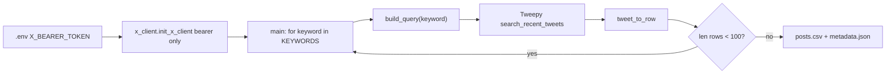

# X Keyword Fetch Experiment (100 original posts)

Plan assets: [`docs/plans/2026-06-01_x_keyword_fetch_experiment_482912/`](docs/plans/2026-06-01_x_keyword_fetch_experiment_482912/)

## Remember

- Exact file paths always
- Exact commands with expected output
- DRY, YAGNI, TDD, frequent commits
- Maximum safely delegable parallelism
- Delegated tasks must be impossible to misread
- No UI changes — screenshots not required

---

## Overview

Build a proof-of-concept experiment that validates X API v2 recent search for mirrorview political keywords. The script authenticates with a Bearer Token, runs one search query per keyword with filters for original English posts only, collects up to **100 posts total** (10 keywords × 10 posts each), and writes normalized CSV + metadata under a timestamped output directory — same orchestration style as [`experiments/reddit_fetch_data_2026_05_23/main.py`](experiments/reddit_fetch_data_2026_05_23/main.py) but without comment fetching and without wiring into `data_platform/` yet.

Estimated API cost: ~100 posts × $0.005 ≈ **$0.50** in X developer credits.

---

## Happy Flow

1. Developer sets X credentials in repo-root `.env` (from [console.x.com](https://console.x.com) → app → Keys and tokens). All three keys are registered in [`lib/load_env_vars.py`](lib/load_env_vars.py); **only `X_BEARER_TOKEN` is required for this experiment**.
2. [`experiments/x_fetch_data_2026_06_01/main.py`](experiments/x_fetch_data_2026_06_01/main.py) calls `get_current_timestamp()` from [`lib/timestamp_utils.py`](lib/timestamp_utils.py) and creates `experiments/x_fetch_data_2026_06_01/data/<sync_timestamp>/`.
3. `main.py` calls `init_x_client()` from [`experiments/x_fetch_data_2026_06_01/x_client.py`](experiments/x_fetch_data_2026_06_01/x_client.py), which reads **`X_BEARER_TOKEN` only** via `EnvVarsContainer` and passes it to `tweepy.Client(bearer_token=...)`.
4. For each keyword in `KEYWORDS` (10 items, one per mirrorview topic cluster), `main.py` computes `remaining = TOTAL_POST_CAP - len(all_rows)` and skips if zero.
5. `fetch_posts_for_keyword()` builds query `"<keyword>" lang:en -is:reply -is:retweet -is:quote`, calls `GET /2/tweets/search/recent` via Tweepy, paginates with `next_token`, stops at `min(POSTS_PER_KEYWORD, remaining)`.
6. Each tweet is normalized to a flat dict matching `CSV_FIELDNAMES`; rows accumulate in memory.
7. `main.py` writes `posts.csv` and `metadata.json` to the run directory and prints per-keyword counts.



---

## Interface or Contract Freeze

These contracts are fixed before parallel implementation begins.

### Environment variables

Already registered in [`lib/load_env_vars.py`](lib/load_env_vars.py) (`ENV_VAR_TYPES` lines 32–34):

| Name | X console label | Used in this experiment | Purpose |
|---|---|---|---|
| `X_BEARER_TOKEN` | Bearer Token | **Yes — required at runtime** | OAuth 2.0 app-only auth for `GET /2/tweets/search/recent` (read public posts) |
| `X_CONSUMER_KEY` | API Key | No | OAuth 1.0a app identity; reserved for future user-context or write flows |
| `X_SECRET_KEY` | API Key Secret | No | OAuth 1.0a signing; reserved for future user-context or write flows |

**`.env` shape** (all three may be present; experiment fails fast only if Bearer is missing):

```bash
X_CONSUMER_KEY=...
X_SECRET_KEY=...
X_BEARER_TOKEN=...
```

**`init_x_client()` contract** — Bearer-only for this POC:

```python
def init_x_client() -> tweepy.Client:
    bearer_token = EnvVarsContainer.get_env_var("X_BEARER_TOKEN", required=True)
    return tweepy.Client(bearer_token=bearer_token)
```

Do **not** pass `consumer_key` / `consumer_secret` to Tweepy for recent search; app-only Bearer is the documented auth path and avoids pulling unused secrets into the request path.

### Constants in `main.py`

```python
TOTAL_POST_CAP = 100
POSTS_PER_KEYWORD = 10

KEYWORDS: list[str] = [
    "gun control",       # gun_control cluster
    "climate change",    # climate_change
    "abortion",          # abortion
    "immigration",       # immigration
    "second amendment",
    "reproductive rights",
    "border security",
    "renewable energy",
    "pro-life",
    "DACA",
]
```

(Source: first/representative keyword per topic group from [`data_platform/ingestion/configs/bluesky/mirrorview.yaml`](data_platform/ingestion/configs/bluesky/mirrorview.yaml).)

### Query builder contract (`x_client.py`)

```python
def build_query(keyword: str, *, lang: str = "en") -> str:
    # Multi-word or special chars → double-quoted phrase (mirror Bluesky _quote_query_term logic)
    # Returns: '<term> lang:en -is:reply -is:retweet -is:quote'
```

Examples:

| Input | Output |
|---|---|
| `gun control` | `"gun control" lang:en -is:reply -is:retweet -is:quote` |
| `DACA` | `DACA lang:en -is:reply -is:retweet -is:quote` |
| `pro-life` | `pro-life lang:en -is:reply -is:retweet -is:quote` |

### CSV schema (`CSV_FIELDNAMES` in `x_client.py`)

```python
CSV_FIELDNAMES = [
    "tweet_id",
    "text",
    "author_id",
    "username",
    "created_at",
    "like_count",
    "retweet_count",
    "reply_count",
    "quote_count",
    "url",
    "keyword",
    "sync_timestamp",
]
```

### Example `posts.csv` row (shape)

```csv
tweet_id,text,author_id,username,created_at,like_count,retweet_count,reply_count,quote_count,url,keyword,sync_timestamp
1234567890,"Gun control debate continues...",987654321,example_user,2026-05-30T14:22:01.000Z,42,5,3,0,https://x.com/i/web/status/1234567890,gun control,2026_06_01-15:30:00
```

### `metadata.json` shape

```json
{
  "sync_timestamp": "2026_06_01-15:30:00",
  "api": "x_api_v2",
  "endpoint": "/2/tweets/search/recent",
  "total_post_cap": 100,
  "posts_per_keyword_target": 10,
  "total_posts": 100,
  "filters": {
    "original_posts_only": true,
    "exclude": ["reply", "retweet", "quote"],
    "lang": "en"
  },
  "keywords": ["gun control", "climate change", "..."],
  "counts_by_keyword": {
    "gun control": 10,
    "climate change": 10
  },
  "files": {
    "posts": "posts.csv"
  }
}
```

If a keyword returns fewer than 10 matches, `counts_by_keyword` reflects actual count; `total_posts` may be less than 100 (acceptable for POC — metadata must be truthful).

### Success criteria

| Criterion | Pass condition |
|---|---|
| Auth works | Script runs without 401 when `X_BEARER_TOKEN` is valid |
| Volume cap | `len(posts.csv rows) <= 100` |
| Original-only filter | Query string always includes `-is:reply -is:retweet -is:quote` |
| No comment fetch | No `conversation_id` search or reply endpoints called |
| Keyword traceability | Every CSV row has non-empty `keyword` matching a `KEYWORDS` entry |
| Metadata consistency | `metadata.json` `total_posts` equals CSV data row count; sum of `counts_by_keyword` equals `total_posts` |
| Unit tests pass | `uv run pytest tests/experiments/x_fetch_data_2026_06_01/ -q` exits 0 |
| Live smoke test | Manual run produces at least 1 row in `posts.csv` (ideally ~100 if keywords are active in last 7 days) |

---

## Serial Coordination Spine

1. **Contract freeze** (this plan) — no code until contracts above are agreed.
2. **Dependency registration** — add `tweepy` to [`pyproject.toml`](pyproject.toml); run `uv sync`. (X env vars already in [`lib/load_env_vars.py`](lib/load_env_vars.py).)
3. **Parallel packets** — `x_client.py` + unit tests (no shared file ownership).
4. **Integration** — `main.py` + `__init__.py` wiring only after `x_client.py` exports are stable.
5. **Final verification** — pytest + manual live run.

---

## Parallel Task Packets

### Task A — Dependency only (env vars pre-done)

- **Objective:** Add `tweepy` dependency; confirm X env keys already registered.
- **Parallelizable because:** Touches only `pyproject.toml`; no experiment code yet.
- **Precondition (already satisfied):** [`lib/load_env_vars.py`](lib/load_env_vars.py) contains `X_CONSUMER_KEY`, `X_SECRET_KEY`, `X_BEARER_TOKEN` in `ENV_VAR_TYPES`.
- **Files allowed to change:** [`pyproject.toml`](pyproject.toml)
- **Files forbidden:** [`lib/load_env_vars.py`](lib/load_env_vars.py) (no changes needed), `experiments/x_fetch_data_2026_06_01/*`, `tests/*`
- **Steps:**
  1. Add `"tweepy>=4.14.0"` to `[project].dependencies` in `pyproject.toml`.
  2. Run `uv sync`.
- **Verify:**
  - `uv run python -c "import tweepy; print(tweepy.__version__)"` prints a version string.
  - `uv run python -c "from lib.load_env_vars import ENV_VAR_TYPES; assert {'X_CONSUMER_KEY','X_SECRET_KEY','X_BEARER_TOKEN'} <= ENV_VAR_TYPES.keys()"` exits 0.
- **Done when:** Tweepy import succeeds; env keys confirmed present (no `load_env_vars.py` edit).

### Task B — `x_client.py` (pure logic + API wrapper)

- **Objective:** Implement query building, tweet normalization, and paginated keyword fetch.
- **Parallelizable because:** New file only; depends on Task A for env key name but not on `main.py`.
- **Files allowed to change:** [`experiments/x_fetch_data_2026_06_01/x_client.py`](experiments/x_fetch_data_2026_06_01/x_client.py)
- **Files forbidden:** `main.py`, tests (Task C owns tests)
- **Preconditions:** Task A complete.
- **Exports (public API):**

```python
CSV_FIELDNAMES: list[str]
def init_x_client() -> tweepy.Client: ...
def build_query(keyword: str, *, lang: str = "en") -> str: ...
def tweet_to_row(tweet, *, username: str, keyword: str, sync_timestamp: str) -> dict[str, object]: ...
def fetch_posts_for_keyword(client, keyword: str, *, limit: int, sync_timestamp: str) -> list[dict[str, object]]: ...
```

- **Implementation notes:**
  - `init_x_client()` mirrors [`experiments/reddit_fetch_data_2026_05_23/reddit_client.py`](experiments/reddit_fetch_data_2026_05_23/reddit_client.py) `init_reddit()` pattern but uses **`X_BEARER_TOKEN` only** (not `X_CONSUMER_KEY` / `X_SECRET_KEY`).
  - `EnvVarsContainer.get_env_var("X_BEARER_TOKEN", required=True)` — same required-flag pattern as Reddit credentials.
  - Pagination loop: `max_results = max(10, min(100, limit - len(rows)))` (API requires 10–100).
  - Request fields: `tweet_fields=["created_at", "public_metrics", "author_id"]`, `expansions=["author_id"]`, `user_fields=["username"]`.
  - Build `users_by_id` from `response.includes["users"]`.
  - On empty `response.data`, break (keyword exhausted).
  - Optional: catch `tweepy.TooManyRequests`, log and re-raise (no retry logic in POC — YAGNI).
- **Verify:** `uv run python -c "from experiments.x_fetch_data_2026_06_01.x_client import build_query; print(build_query('gun control'))"` prints `"gun control" lang:en -is:reply -is:retweet -is:quote`.
- **Done when:** Module imports; `build_query` output matches contract table.

### Task C — Unit tests (mocked, no live API)

- **Objective:** Test query building and row normalization without network.
- **Parallelizable because:** New test file only; mocks `tweepy.Client`.
- **Files allowed to change:** [`tests/experiments/x_fetch_data_2026_06_01/test_x_client.py`](tests/experiments/x_fetch_data_2026_06_01/test_x_client.py), [`tests/experiments/x_fetch_data_2026_06_01/__init__.py`](tests/experiments/x_fetch_data_2026_06_01/__init__.py) (empty)
- **Files forbidden:** `x_client.py` (read-only reference), `main.py`
- **Preconditions:** Task B interface frozen (function signatures + CSV_FIELDNAMES).
- **Test cases:**
  1. `test_build_query_quotes_multiword` — `"gun control"` → quoted phrase + filters.
  2. `test_build_query_single_word` — `DACA` → unquoted + filters.
  3. `test_tweet_to_row_maps_fields` — mock tweet + user → dict keys match `CSV_FIELDNAMES`.
  4. `test_fetch_posts_for_keyword_respects_limit` — mock Client returning 2 pages; assert `len(rows) == limit`.
  5. `test_fetch_posts_for_keyword_stops_on_empty` — mock returns no data; assert `[]`.
- **Verify:** `uv run pytest tests/experiments/x_fetch_data_2026_06_01/test_x_client.py -q`
- **Expected:** `5 passed`
- **Done when:** All tests green without `X_BEARER_TOKEN` set.

### Task D — `main.py` orchestration

- **Objective:** Wire keyword loop, global cap, CSV + metadata output.
- **Parallelizable:** No — depends on Task B exports; runs after B+C.
- **Files allowed to change:** [`experiments/x_fetch_data_2026_06_01/main.py`](experiments/x_fetch_data_2026_06_01/main.py), [`experiments/x_fetch_data_2026_06_01/__init__.py`](experiments/x_fetch_data_2026_06_01/__init__.py) (empty)
- **Files forbidden:** `x_client.py` (unless bugfix needed during integration)
- **Structure** (mirror Reddit experiment):

```python
"""One-shot X keyword post fetch experiment.

Run from repo root:

    PYTHONPATH=. uv run python experiments/x_fetch_data_2026_06_01/main.py
"""
```

- **Functions:**
  - `write_posts_csv(rows, path)` — `csv.DictWriter` with `CSV_FIELDNAMES`
  - `write_metadata(output_dir, ...)` — returns metadata dict, writes `metadata.json`
  - `main()` — loop keywords, enforce cap, print progress
- **Verify:** `uv run python -m py_compile experiments/x_fetch_data_2026_06_01/main.py`
- **Done when:** Compiles; docstring run command present.

---

## Integration Order

1. Task A (deps + env)
2. Tasks B + C in parallel
3. Task D (main.py)
4. Final verification (below)

---

## Alternative Approaches

| Option | Why not chosen |
|---|---|
| Official `xdk` Python SDK | Not in repo deps; Tweepy mirrors existing PRAW pattern in Reddit experiment and has stable v2 `Client.search_recent_tweets` docs |
| Raw `requests` only | Avoids new dep but duplicates pagination/error handling Tweepy already provides |
| YAML config like Bluesky ingestion | YAGNI for 100-post POC; constants in `main.py` match Reddit experiment |
| 100 posts **per** keyword | User asked for 100 total to prove pipeline; 10×10 keeps cost ~$0.50 |
| Full-archive search (`/search/all`) | Requires higher tier; recent search sufficient for POC |
| Wire into `data_platform/ingestion/` now | Out of scope; experiment folder first, promote later if validated |
| Pass `consumer_key` + `consumer_secret` to Tweepy | Unnecessary for app-only recent search; Bearer alone is sufficient and matches X docs for public read endpoints |
| OAuth 1.0a with consumer key/secret | Needed only for user-context writes or private metrics; `X_CONSUMER_KEY` / `X_SECRET_KEY` stay in `.env` for future promotion to `data_platform/` |

---

## Manual Verification

Prerequisites: X developer account, app credentials, ~$5 credits in [console.x.com](https://console.x.com).

- [ ] **Unit tests:** `uv run pytest tests/experiments/x_fetch_data_2026_06_01/test_x_client.py -q` → `5 passed`
- [ ] **Env configured:** `.env` contains all three (recommended) with **`X_BEARER_TOKEN=<non-empty>`** (required). `X_CONSUMER_KEY` and `X_SECRET_KEY` may be set but are not read by this experiment.
- [ ] **curl smoke test** (optional pre-script):
  ```bash
  curl "https://api.x.com/2/tweets/search/recent?query=%22gun%20control%22%20lang:en%20-is:reply%20-is:retweet%20-is:quote&max_results=10&tweet.fields=created_at,author_id,public_metrics" \
    -H "Authorization: Bearer $X_BEARER_TOKEN"
  ```
  Expected: JSON with `"data": [...]` array (may be empty if no recent matches).
- [ ] **Run experiment:**
  ```bash
  PYTHONPATH=. uv run python experiments/x_fetch_data_2026_06_01/main.py
  ```
  Expected stdout (example):
  ```
  gun control: 10 posts
  climate change: 10 posts
  ...
  Metadata written to experiments/x_fetch_data_2026_06_01/data/2026_06_01-.../metadata.json
  ```
- [ ] **Inspect output dir** `experiments/x_fetch_data_2026_06_01/data/<timestamp>/`:
  - `posts.csv` exists, header matches `CSV_FIELDNAMES`, data rows ≤ 100
  - `metadata.json` exists, `total_posts` matches CSV row count
- [ ] **Spot-check 3 rows:** `url` is `https://x.com/i/web/status/<tweet_id>`, `keyword` is in `KEYWORDS`, `created_at` is ISO-8601
- [ ] **Confirm no replies fetched:** no second CSV, no conversation_id API calls in code review

---

## Final Verification

Coordinator checklist after all tasks merge:

- [ ] `uv sync` clean
- [ ] `uv run pytest tests/experiments/x_fetch_data_2026_06_01/ -q` passes
- [ ] `uv run ruff check experiments/x_fetch_data_2026_06_01/ tests/experiments/x_fetch_data_2026_06_01/` passes
- [ ] Live run produces valid `posts.csv` + `metadata.json`
- [ ] Total billed posts ≤ 100 (check X Developer Console usage)

---

## Files Created (summary)

| File | Purpose |
|---|---|
| [`experiments/x_fetch_data_2026_06_01/__init__.py`](experiments/x_fetch_data_2026_06_01/__init__.py) | Package marker (empty) |
| [`experiments/x_fetch_data_2026_06_01/x_client.py`](experiments/x_fetch_data_2026_06_01/x_client.py) | Auth, query build, fetch, normalize |
| [`experiments/x_fetch_data_2026_06_01/main.py`](experiments/x_fetch_data_2026_06_01/main.py) | Orchestration, CSV/metadata writers |
| [`tests/experiments/x_fetch_data_2026_06_01/test_x_client.py`](tests/experiments/x_fetch_data_2026_06_01/test_x_client.py) | Mocked unit tests |
| [`docs/plans/2026-06-01_x_keyword_fetch_experiment_482912/plan.md`](docs/plans/2026-06-01_x_keyword_fetch_experiment_482912/plan.md) | This plan (copy on implement) |

## Files Modified (summary)

| File | Change |
|---|---|
| [`pyproject.toml`](pyproject.toml) | Add `tweepy>=4.14.0` |

## Files Already Modified (no further action)

| File | Change |
|---|---|
| [`lib/load_env_vars.py`](lib/load_env_vars.py) | `X_CONSUMER_KEY`, `X_SECRET_KEY`, `X_BEARER_TOKEN` in `ENV_VAR_TYPES` (done) |
