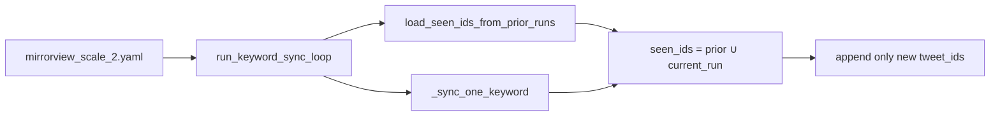

# Twitter mirrorview_scale_2 Ingestion Plan

## Remember
- Exact file paths always
- Exact commands with expected output
- DRY, YAGNI, TDD, frequent commits
- No UI changes in this work (screenshots N/A)

## Plan assets
- Folder: [`docs/plans/2026-06-02_twitter_mirrorview_scale_2_482915/`](docs/plans/2026-06-02_twitter_mirrorview_scale_2_482915/)
- Save this plan as: `docs/plans/2026-06-02_twitter_mirrorview_scale_2_482915/plan.md`

## Overview
Add [`data_platform/ingestion/configs/twitter/mirrorview_scale_2.yaml`](data_platform/ingestion/configs/twitter/mirrorview_scale_2.yaml) as a YAML-only follow-on to [`mirrorview_scale.yaml`](data_platform/ingestion/configs/twitter/mirrorview_scale.yaml). The second pass targets up to **15,000** tweets in a **new** raw run directory, fetching up to **300** posts per keyword, while reusing the **same** `dataset_id` so existing ingestion code deduplicates against all prior raw runs plus the current run.

## Dedupe behavior (no code changes)

Existing logic in [`data_platform/ingestion/sync_twitter.py`](data_platform/ingestion/sync_twitter.py) already satisfies “prior runs + current run”:



- **Cross-run:** When `dedupe_tweets_from_prior_raw_runs: true`, `prior_tweet_ids` is loaded once from every other `raw/<timestamp>/posts.csv` under the same dataset (e.g. run `2026_06_01-23:45:14` with 10k rows).
- **Within-run:** `storage.load_seen_tweet_ids(output_dir)` unions into `seen_ids` before each keyword append.
- **Counter:** `tweets_skipped_as_duplicates` increments for rows dropped by that combined set.

**Critical config choice:** `dataset_id` must stay **`twitter_a8f3c22d-6b14-4e9a-9d2f-1c7e5a9b3d48`**. A new UUID would start with an empty prior-run index and would **not** dedupe against the first scale sync.

## Config file specification

**Create:** [`data_platform/ingestion/configs/twitter/mirrorview_scale_2.yaml`](data_platform/ingestion/configs/twitter/mirrorview_scale_2.yaml)

Copy the full `keyword` block (73 keywords) from [`mirrorview_scale.yaml`](data_platform/ingestion/configs/twitter/mirrorview_scale.yaml) unchanged. Only these top-level / `fetch` fields differ from scale 1:

| Field | `mirrorview_scale.yaml` | `mirrorview_scale_2.yaml` |
|-------|-------------------------|---------------------------|
| `name` | `mirrorview_scale` | `mirrorview_scale_2` |
| `description` | …200 posts each | …300 posts each, 15k cap, second pass |
| `dataset_id` | `twitter_a8f3c22d-6b14-4e9a-9d2f-1c7e5a9b3d48` | **same** |
| `fetch.max_rows` | `10000` | **`15000`** |
| `fetch.limit_per_keyword` | `200` | **`300`** |
| `fetch.dedupe_tweets_from_prior_raw_runs` | `true` | **`true`** |

**Skeleton (keywords omitted in plan; copy lines 18–96 from scale 1):**

```yaml
# Second scale pass: 73 keywords, up to 300 posts per keyword, 15k row cap.
# Same dataset_id as mirrorview_scale.yaml so prior-run dedupe applies.
dataset_id: twitter_a8f3c22d-6b14-4e9a-9d2f-1c7e5a9b3d48
name: mirrorview_scale_2
description: Mirrorview scale pass 2 — 300 posts per keyword, 15k cap, prior-run dedupe
date: "2026-06-02"
record_types:
  - twitter.tweet
fetch:
  max_rows: 15000
  limit_per_keyword: 300
  lang: en
  exclude:
    - reply
    - retweet
    - quote
  dedupe_tweets_from_prior_raw_runs: true
  keyword:
    # ... copy entire keyword list from mirrorview_scale.yaml ...
```

**Theoretical fetch ceiling:** 73 × 300 = 21,900 API rows requested across keywords; `max_rows: 15000` stops the run once **this run’s** `posts.csv` reaches 15,000 unique `tweet_id`s (after dedupe).

## Happy Flow

1. Operator adds `mirrorview_scale_2.yaml` (config-only PR or commit).
2. **Ingestion** — `sync_twitter.py --config mirrorview_scale_2.yaml` creates a **new** `raw/<timestamp>/` under `data_platform/data/twitter/twitter_a8f3c22d-6b14-4e9a-9d2f-1c7e5a9b3d48/`, skipping any `tweet_id` already in prior raw runs (including `2026_06_01-23:45:14`) and within the new run.
3. **Preprocessing** — [`preprocess_twitter.py`](data_platform/preprocessing/preprocess_twitter.py) loads **`latest=True` raw run** only ([`runner.py`](data_platform/preprocessing/runner.py) `load_raw_records`), i.e. the scale-2 raw folder, not a merge of both raw runs.
4. **Features** — [`generate_twitter_features.py`](data_platform/generate_features/generate_twitter_features.py) labels **latest preprocessed** run.
5. **Curation** — [`curate_twitter.py`](data_platform/curate/curate_twitter.py) with [`curate/configs/twitter/mirrorview.yaml`](data_platform/curate/configs/twitter/mirrorview.yaml) exports `curated/<timestamp>/mirrorview.csv` for that preprocessed/features snapshot.

**Operational note:** Cumulative “25k unique tweets across two ingestion runs” lives in **two raw directories** under one dataset id. Downstream stages by default operate on the **latest** run only (~15k new unique max for pass 2). Combining pass 1 + pass 2 for one curated export is **out of scope** for this YAML-only plan (would need consolidate or a multi-run preprocess strategy).

## Files to change

| File | Action |
|------|--------|
| [`data_platform/ingestion/configs/twitter/mirrorview_scale_2.yaml`](data_platform/ingestion/configs/twitter/mirrorview_scale_2.yaml) | **Create** |
| [`docs/plans/2026-06-02_twitter_mirrorview_scale_2_482915/plan.md`](docs/plans/2026-06-02_twitter_mirrorview_scale_2_482915/plan.md) | **Create** (copy of this plan) |

**No changes:** `sync_twitter.py`, tests, storage, preprocess/features/curate code.

## Manual Verification

### Config / CLI (no API)

```bash
# From repo root
PYTHONPATH=. uv run python data_platform/ingestion/sync_twitter.py --config mirrorview_scale_2.yaml --help
```

**Expected:** Exit 0; help text shows `--config` accepts filename under `configs/twitter/`.

Optional parse check:

```bash
python -c "import yaml; from pathlib import Path; c=yaml.safe_load(Path('data_platform/ingestion/configs/twitter/mirrorview_scale_2.yaml').read_text()); assert c['fetch']['max_rows']==15000 and c['fetch']['limit_per_keyword']==300 and c['fetch']['dedupe_tweets_from_prior_raw_runs'] is True and c['dataset_id']=='twitter_a8f3c22d-6b14-4e9a-9d2f-1c7e5a9b3d48'"
```

**Expected:** No assertion error.

### Ingestion (Twitter API; long-running)

```bash
PYTHONPATH=. uv run python data_platform/ingestion/sync_twitter.py --config mirrorview_scale_2.yaml
```

**Expected:**
- New directory: `data_platform/data/twitter/twitter_a8f3c22d-6b14-4e9a-9d2f-1c7e5a9b3d48/raw/<new_timestamp>/`
- `metadata.json`: `ingestion_config` = `mirrorview_scale_2.yaml`, `sync_status` = `completed` (or `in_progress` if interrupted)
- `row_count` ≤ `15000` (unique tweets in **this** run)
- `tweets_skipped_as_duplicates` > `0` if API returns overlap with pass 1 (pass 1 had 358 skips within run; pass 2 should skip heavily against ~10k prior IDs)

If interrupted:

```bash
PYTHONPATH=. uv run python data_platform/ingestion/sync_twitter.py --config mirrorview_scale_2.yaml --resume
```

Validate metadata (replace `<timestamp>`):

```bash
jq '.row_count, .sync_status, .tweets_skipped_as_duplicates // 0, .ingestion_config' \
  data_platform/data/twitter/twitter_a8f3c22d-6b14-4e9a-9d2f-1c7e5a9b3d48/raw/<timestamp>/metadata.json
```

### Preprocessing

```bash
PYTHONPATH=. uv run python data_platform/preprocessing/preprocess_twitter.py \
  --dataset-id twitter_a8f3c22d-6b14-4e9a-9d2f-1c7e5a9b3d48
```

**Expected:** New `preprocessed/<timestamp>/posts.csv` sourced from latest raw run (`source_raw_run` in preprocessed `metadata.json` points at scale-2 raw timestamp).

### Feature generation

Smoke:

```bash
PYTHONPATH=. uv run python data_platform/generate_features/generate_twitter_features.py \
  --dataset-id twitter_a8f3c22d-6b14-4e9a-9d2f-1c7e5a9b3d48 \
  --features is_political \
  --batch-size 16 \
  --no-opik
```

Full:

```bash
PYTHONPATH=. uv run python data_platform/generate_features/generate_twitter_features.py \
  --dataset-id twitter_a8f3c22d-6b14-4e9a-9d2f-1c7e5a9b3d48 \
  --batch-size 64 \
  --max-concurrency 80 \
  --no-opik
```

**Expected:** Feature CSVs under `features/` for latest preprocessed run.

### Curation

```bash
PYTHONPATH=. uv run python data_platform/curate/curate_twitter.py \
  --dataset-id twitter_a8f3c22d-6b14-4e9a-9d2f-1c7e5a9b3d48 \
  --config mirrorview.yaml
```

**Expected:**
- `curated/<timestamp>/mirrorview.csv` exists
- `curated/<timestamp>/metadata.json` lists 5 filter steps with decreasing pass counts

### Regression (optional, no new tests required)

```bash
uv run pytest tests/data_platform/ingestion/test_sync_twitter_checkpoint.py -q
```

**Expected:** 5 passed (unchanged code).

## Alternative approaches

| Approach | Why not chosen |
|----------|----------------|
| New `dataset_id` for pass 2 | Breaks cross-run dedupe against pass 1 |
| Bump `mirrorview_scale.yaml` limits in place | Loses provenance; pass 1 metadata/config name no longer matches run |
| Code change to merge multiple raw runs in preprocess | Out of scope; YAML-only follow-on |
| **Chosen:** `mirrorview_scale_2.yaml`, same dataset id, higher caps, `dedupe_tweets_from_prior_raw_runs: true` | Matches Reddit scale pattern; zero code diff |

## Implementation todos

1. Copy [`mirrorview_scale.yaml`](data_platform/ingestion/configs/twitter/mirrorview_scale.yaml) → `mirrorview_scale_2.yaml`; update `name`, `description`, `date`, `max_rows`, `limit_per_keyword`; keep `dataset_id`, keywords, dedupe flag.
2. Save plan to `docs/plans/2026-06-02_twitter_mirrorview_scale_2_482915/plan.md`.
3. Run CLI `--help` and YAML assert (above).
4. Run ingestion; confirm `row_count` / `tweets_skipped_as_duplicates` in new raw metadata.
5. Run preprocess → features → curate on `twitter_a8f3c22d-6b14-4e9a-9d2f-1c7e5a9b3d48`.
