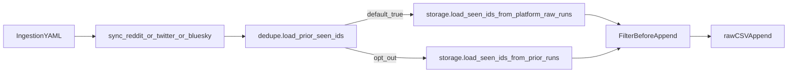
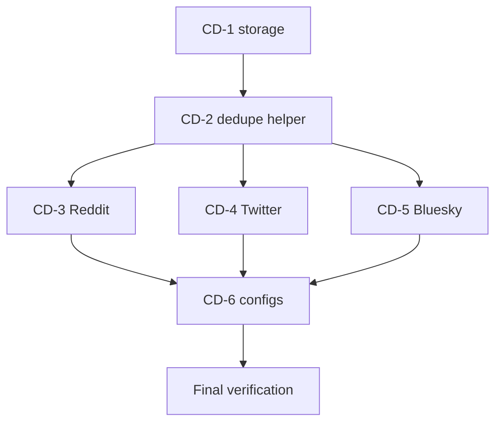

# Cross-Dataset Ingestion Dedupe

## Remember
- Exact file paths always
- Exact commands with expected output
- DRY, YAGNI, TDD, frequent commits
- Maximum safely delegable parallelism
- Delegated tasks must be impossible to misread
- No UI changes in this work (no screenshots required)

**Plan assets:** [`docs/plans/2026-06-10_cross_dataset_ingestion_dedupe_628472/`](docs/plans/2026-06-10_cross_dataset_ingestion_dedupe_628472/)

---

## Overview

Ingestion today deduplicates within the current raw run always, and optionally against prior raw runs of the **same** `dataset_id` (Reddit comments via `dedupe_comments_from_prior_raw_runs`, Twitter via `dedupe_tweets_from_prior_raw_runs`). Bluesky has within-run dedupe only. Starting a sync under a new `dataset_id` can re-ingest the same Reddit comment, tweet, or Bluesky post.

This plan adds **platform-scoped deduplication**: scan all raw CSVs under `data_platform/data/{platform}/` and skip IDs already stored anywhere on that platform (excluding the current run directory). The behavior is opt-out via YAML (`dedupe_across_datasets: false`) and **on by default** when the key is omitted.

---

## Happy Flow

1. Operator runs e.g. `PYTHONPATH=. uv run python data_platform/ingestion/sync_reddit.py --config mirrorview.yaml`.
2. [`sync_reddit.py`](data_platform/ingestion/sync_reddit.py) reads `fetch.dedupe_across_datasets` via shared helper in new [`dedupe.py`](data_platform/ingestion/dedupe.py) (default `True`).
3. At loop start, [`StorageManager.load_seen_ids_from_platform_raw_runs`](data_platform/utils/storage.py) scans `data/reddit/*/raw/*/{comments.csv,posts.csv}`, excluding only the current `output_dir`.
4. For each subreddit, [`_append_fetched_subreddit_rows`](data_platform/ingestion/sync_reddit.py) filters fetched rows against `prior_platform_ids | current_run_csv_ids` before append.
5. Skipped rows increment metadata counters; only unseen rows are appended to raw CSVs.
6. Same pattern for [`sync_twitter.py`](data_platform/ingestion/sync_twitter.py) (`tweet_id`) and [`sync_bluesky.py`](data_platform/ingestion/sync_bluesky.py) (`uri`).



---

## Interface or Contract Freeze

| Item | Contract |
|------|----------|
| **New YAML flag** | `fetch.dedupe_across_datasets: bool` — default **`true`** when missing (`fetch.get("dedupe_across_datasets", True)`) |
| **Scope** | Raw stage only: `data_platform/data/{platform}/{dataset_id}/raw/{timestamp}/` |
| **Exclude** | Current `output_dir` only (other runs of same dataset are included in scan) |
| **ID columns** | Reddit comments: `comment_fullname`; Reddit posts: `reddit_fullname`; Twitter: `tweet_id`; Bluesky: `uri` |
| **Existing flags (unchanged names)** | `dedupe_comments_from_prior_raw_runs`, `dedupe_tweets_from_prior_raw_runs` — used **only when** `dedupe_across_datasets: false` |
| **New metadata counters** | Reddit: add `posts_skipped_as_duplicates`; Bluesky: add `posts_skipped_as_duplicates`; Twitter: keep `tweets_skipped_as_duplicates` |
| **No schema changes** | `SyncRedditCommentModel`, `SyncRedditPostModel`, `SyncTwitterPostModel`, `SyncBlueskyPostModel` unchanged |
| **Downstream** | No changes to preprocess / features / curate in this plan |

**Behavior matrix**

| `dedupe_across_datasets` | Prior-run flag | Prior-ID source |
|--------------------------|----------------|-----------------|
| `true` (default) | ignored for loading | All platform raw runs except current run dir |
| `false` | `true` | Same-dataset sibling raw runs (today's behavior) |
| `false` | `false` | Within-current-run only |

**Default-on behavior change:** Fresh syncs with [`default.yaml`](data_platform/ingestion/configs/reddit/default.yaml) will skip IDs found in any existing Reddit dataset unless explicitly opted out.

---

## Serial Coordination Spine

1. **Contract freeze** (this document) — done at plan approval.
2. **Phase 1 — Storage + tests** — add `load_seen_ids_from_platform_raw_runs` in [`storage.py`](data_platform/utils/storage.py); must land before any sync wiring.
3. **Phase 2 — Shared helper + tests** — add [`dedupe.py`](data_platform/ingestion/dedupe.py); must land before platform sync tasks.
4. **Phases 3–5 — Platform sync wiring** (Reddit, Twitter, Bluesky) — parallel after Phase 2.
5. **Phase 6 — Config touch-up** — after sync tasks merge.
6. **Final verification** — full test suite + lint.

---

## Parallel Task Packets

### CD-1 — Platform raw ID scan (serial gate)

- **Objective:** Add platform-wide seen-ID loader to storage layer.
- **Parallelizable:** No — all sync tasks depend on this.
- **Inspect:** [`data_platform/utils/storage.py`](data_platform/utils/storage.py) (`load_seen_ids`, `load_seen_ids_from_prior_runs`), [`tests/data_platform/utils/test_storage.py`](tests/data_platform/utils/test_storage.py), [`tests/data_platform/conftest.py`](tests/data_platform/conftest.py) (`data_root` fixture).
- **Allowed to change:** `data_platform/utils/storage.py`, `tests/data_platform/utils/test_storage.py`
- **Forbidden:** All `sync_*.py` files.

**Implementation:**
1. Add `platform_data_root(self) -> Path` returning `DATA_ROOT / self.platform`.
2. Add `load_seen_ids_from_platform_raw_runs(self, exclude_run_dir, id_column, *, filename=None) -> set[str]`:
   - Iterate `platform_data_root / {dataset_id} / raw / {timestamp}/`
   - Skip non-dirs, missing CSV, and `run_dir.resolve() == exclude_run_dir.resolve()`
   - Union via existing `load_seen_ids()`
3. TDD: write `test_load_seen_ids_from_platform_raw_runs` first with two dataset IDs under isolated `data_root`.

**Verify:**
```bash
uv run pytest tests/data_platform/utils/test_storage.py::test_load_seen_ids_from_platform_raw_runs -q
```
Expected: 1 passed.

**Done when:** New method exists, test green, no sync files touched.

---

### CD-2 — Shared dedupe helper (serial gate)

- **Objective:** Centralize flag resolution so all sync scripts share one contract.
- **Parallelizable:** No — platform sync tasks depend on this.
- **Preconditions:** CD-1 merged.
- **Allowed to change:** `data_platform/ingestion/dedupe.py` (new), `tests/data_platform/ingestion/test_dedupe.py` (new)
- **Forbidden:** `sync_reddit.py`, `sync_twitter.py`, `sync_bluesky.py`, `storage.py`

**Implementation:**
```python
# data_platform/ingestion/dedupe.py
def load_prior_seen_ids(
    storage: StorageManager,
    output_dir: Path,
    fetch: dict[str, Any],
    id_column: str,
    *,
    filename: str | None = None,
    same_dataset_flag: str,
) -> set[str]:
    if fetch.get("dedupe_across_datasets", True):
        return storage.load_seen_ids_from_platform_raw_runs(
            output_dir, id_column, filename=filename
        )
    if fetch.get(same_dataset_flag):
        return storage.load_seen_ids_from_prior_runs(
            output_dir, id_column, filename=filename
        )
    return set()
```

**Tests (TDD first):**
- Default fetch dict (no keys) → calls platform scan (mock/patch storage method)
- `dedupe_across_datasets: false` + `same_dataset_flag: true` → prior-runs path
- Both false → empty set

**Verify:**
```bash
uv run pytest tests/data_platform/ingestion/test_dedupe.py -q
```
Expected: all passed.

---

### CD-3 — Reddit sync wiring (parallel)

- **Objective:** Apply platform dedupe to Reddit comments and posts.
- **Parallelizable:** Yes — disjoint file ownership after CD-2.
- **Preconditions:** CD-2 merged.
- **Allowed to change:** [`data_platform/ingestion/sync_reddit.py`](data_platform/ingestion/sync_reddit.py), [`tests/data_platform/ingestion/test_sync_reddit_checkpoint.py`](tests/data_platform/ingestion/test_sync_reddit_checkpoint.py)
- **Forbidden:** `sync_twitter.py`, `sync_bluesky.py`, `storage.py`, `dedupe.py`

**Implementation:**
1. In `run_subreddit_sync_loop`, replace direct `load_seen_ids_from_prior_runs` with:
   ```python
   prior_comment_ids = load_prior_seen_ids(
       comment_storage, output_dir, fetch, "comment_fullname",
       filename=COMMENTS_CSV,
       same_dataset_flag="dedupe_comments_from_prior_raw_runs",
   )
   ```
2. Add `prior_post_ids` preload when `include_posts` (same helper, `"reddit_fullname"`, `POSTS_CSV`).
3. Extend `_append_fetched_subreddit_rows` with `prior_post_ids`; filter posts like comments; track `posts_skipped_as_duplicates`.
4. Log once at loop start: count of prior IDs loaded (optional, low-noise print).

**Tests (TDD):**
- `test_run_subreddit_sync_loop_skips_ids_from_other_dataset` — second `RedditStorageManager` with different `dataset_id`, default fetch (no explicit flag), overlapping comment ID skipped.
- `test_run_subreddit_sync_loop_respects_dedupe_across_datasets_false` — duplicate written when opted out.
- Extend existing prior-run test to still pass with explicit `dedupe_across_datasets: false`.

**Verify:**
```bash
uv run pytest tests/data_platform/ingestion/test_sync_reddit_checkpoint.py -q
```

---

### CD-4 — Twitter sync wiring (parallel)

- **Objective:** Replace same-dataset-only preload with shared helper (platform default).
- **Preconditions:** CD-2 merged.
- **Allowed to change:** [`data_platform/ingestion/sync_twitter.py`](data_platform/ingestion/sync_twitter.py), [`tests/data_platform/ingestion/test_sync_twitter_checkpoint.py`](tests/data_platform/ingestion/test_sync_twitter_checkpoint.py)
- **Forbidden:** Reddit/Bluesky sync files, `storage.py`, `dedupe.py`

**Implementation:**
In `run_keyword_sync_loop`, replace:
```python
if fetch.get("dedupe_tweets_from_prior_raw_runs"):
    prior_tweet_ids = storage.load_seen_ids_from_prior_runs(...)
```
with unconditional:
```python
prior_tweet_ids = load_prior_seen_ids(
    storage, output_dir, fetch, "tweet_id",
    filename=csv_filename,
    same_dataset_flag="dedupe_tweets_from_prior_raw_runs",
)
```

**Tests:** Cross-dataset skip + opt-out cases mirroring CD-3.

**Verify:**
```bash
uv run pytest tests/data_platform/ingestion/test_sync_twitter_checkpoint.py -q
```

---

### CD-5 — Bluesky sync wiring (parallel)

- **Objective:** Add prior-ID preload (platform default) to Bluesky, which today only dedupes within current run.
- **Preconditions:** CD-2 merged.
- **Allowed to change:** [`data_platform/ingestion/sync_bluesky.py`](data_platform/ingestion/sync_bluesky.py), [`tests/data_platform/ingestion/test_sync_bluesky_checkpoint.py`](tests/data_platform/ingestion/test_sync_bluesky_checkpoint.py)
- **Forbidden:** Reddit/Twitter sync files, `storage.py`, `dedupe.py`

**Implementation:**
1. Preload `prior_uris` once at `run_keyword_sync_loop` start via `load_prior_seen_ids(..., "uri", same_dataset_flag="dedupe_posts_from_prior_raw_runs")`.
2. Filter: `prior_uris | storage.load_seen_uris(output_dir)`.
3. Add cumulative `posts_skipped_as_duplicates` metadata counter.

**Tests:** Cross-dataset skip + opt-out + within-run still works.

**Verify:**
```bash
uv run pytest tests/data_platform/ingestion/test_sync_bluesky_checkpoint.py -q
```

---

### CD-6 — Config documentation (serial, after sync tasks)

- **Objective:** Make default explicit for operators; no functional change.
- **Preconditions:** CD-3, CD-4, CD-5 merged.
- **Allowed to change:**
  - [`data_platform/ingestion/configs/reddit/default.yaml`](data_platform/ingestion/configs/reddit/default.yaml)
  - [`data_platform/ingestion/configs/twitter/default.yaml`](data_platform/ingestion/configs/twitter/default.yaml)
  - [`data_platform/ingestion/configs/bluesky/default.yaml`](data_platform/ingestion/configs/bluesky/default.yaml)
  - [`docs/plans/2026-06-10_cross_dataset_ingestion_dedupe_628472/plan.md`](docs/plans/2026-06-10_cross_dataset_ingestion_dedupe_628472/plan.md) (copy of this plan)

Add to each `fetch:` block:
```yaml
dedupe_across_datasets: true
```

Scale configs with `dedupe_*_from_prior_raw_runs: true` may keep those lines (harmless when platform dedupe is on).

---

## Integration Order



---

## Alternative Approaches

| Approach | Verdict |
|----------|---------|
| **Scan raw CSVs under `data/{platform}/`** | Chosen — matches existing `load_seen_ids` pattern; no index file; YAGNI |
| **Persistent platform dedupe index (SQLite/JSON)** | Rejected — prior plan rejected global cross-dataset index; adds invalidation complexity |
| **`dedupe_scope: run \| dataset \| platform` enum** | Rejected for now — single bool matches user request with less migration |
| **Include preprocessed/curated layers** | Out of scope — ingestion contract is raw IDs only |

---

## Manual Verification

- [ ] Storage unit test:
  ```bash
  uv run pytest tests/data_platform/utils/test_storage.py -q
  ```
  Expected: all passed.

- [ ] Dedupe helper tests:
  ```bash
  uv run pytest tests/data_platform/ingestion/test_dedupe.py -q
  ```
  Expected: all passed.

- [ ] Ingestion checkpoint suites:
  ```bash
  uv run pytest tests/data_platform/ingestion/test_sync_reddit_checkpoint.py tests/data_platform/ingestion/test_sync_twitter_checkpoint.py tests/data_platform/ingestion/test_sync_bluesky_checkpoint.py -q
  ```
  Expected: all passed.

- [ ] Regression — existing downstream tests unchanged:
  ```bash
  uv run pytest tests/data_platform/preprocessing/ tests/data_platform/generate_features/ tests/data_platform/curate/ -q
  ```
  Expected: all passed.

- [ ] Lint:
  ```bash
  uv run pre-commit run --all-files
  ```
  Expected: all hooks pass.

- [ ] Integration smoke (manual, optional with real data):
  1. Confirm dataset A has a known raw comment ID in `data_platform/data/reddit/{dataset_a}/raw/.../comments.csv`.
  2. Run sync for dataset B (different `dataset_id`) without `dedupe_across_datasets: false`.
  3. Confirm overlapping ID is absent from dataset B's new raw CSV and `comments_skipped_as_duplicates > 0` in metadata.
  4. Re-run with `dedupe_across_datasets: false` and confirm duplicate is written.

---

## Final Verification

1. All new and updated unit tests pass (commands above).
2. Pre-commit passes.
3. Default-on behavior verified: missing YAML key skips IDs from other datasets.
4. Opt-out verified: `dedupe_across_datasets: false` restores prior same-dataset-only (or within-run-only) behavior.
5. No changes to preprocess/features/curate contracts.
