# Dedupe Policy at Storage Write Boundary

**Plan assets:** [`docs/plans/2026-06-11_dedupe_policy_storage_boundary_482916/`](docs/plans/2026-06-11_dedupe_policy_storage_boundary_482916/)

Save this plan to that directory as `plan.md` at implementation start.

## Remember

- Exact file paths always
- Exact commands with expected output
- DRY, YAGNI, TDD, frequent commits
- Maximum safely delegable parallelism
- Delegated tasks must be impossible to misread
- No UI changes in this work (no screenshots required)

---

## Overview

Ingestion deduplication today is split across boolean YAML flags (`dedupe_across_datasets`, `dedupe_*_from_prior_raw_runs`) and [`data_platform/ingestion/dedupe.py`](data_platform/ingestion/dedupe.py). We will consolidate into [`data_platform/utils/deduplication.py`](data_platform/utils/deduplication.py) with explicit `DedupePolicy` lists in config, wire dedupe at the storage write boundary via `StorageManager.open_dedupe_session` / `append_deduped_records`, delete the ingestion helper module, and rewrite all 11 ingestion YAMLs plus ingestion tests. No legacy bridge, no deprecation warnings.

---

## Happy Flow

1. Operator runs e.g. `PYTHONPATH=. uv run python data_platform/ingestion/sync_bluesky.py --config data_platform/ingestion/configs/bluesky/default.yaml`.
2. Sync script reads `ingestion_params.dedupe_policy` from YAML (required, non-empty list).
3. At loop start, sync calls `storage.open_dedupe_session(output_dir, DedupeConfig.from_ingestion_params(...))` — see [`data_platform/ingestion/sync_bluesky.py`](data_platform/ingestion/sync_bluesky.py).
4. `DedupeSession.warm()` unions ID sets per policy:
   - `current_run` → `StorageManager.load_ids_from_csv` (current run CSV)
   - `prior_runs_same_dataset` → `load_seen_ids_from_prior_runs`
   - `prior_runs_all_datasets` → `load_seen_ids_from_platform_raw_runs`
5. Per task, sync calls `storage.append_deduped_records(rows, output_dir, session=dedupe)`.
6. Storage filters rows against `session.seen_ids`, appends survivors via dumb `append_records`, calls `session.note_appended` to incrementally track `current_run` IDs.
7. Sync updates metadata counters (`posts_skipped_as_duplicates`, `row_count`, etc.) — metadata stays in sync layer, not storage.
8. Reddit uses two sessions: `comments_dedupe_policy` + `posts_dedupe_policy` with separate `DedupeConfig` keys — see [`data_platform/ingestion/sync_reddit.py`](data_platform/ingestion/sync_reddit.py).

```mermaid
flowchart LR
  yaml[IngestionYAML_dedupe_policy] --> sync[sync_bluesky_or_twitter_or_reddit]
  sync --> openSession[storage.open_dedupe_session]
  openSession --> warm[DedupeSession.warm]
  warm --> filter[append_deduped_records_filter]
  filter --> append[append_records_dumb_write]
  append --> note[session.note_appended]
```



---

## Interface or Contract Freeze

| Item | Contract |
|------|----------|
| **YAML (Bluesky/Twitter)** | `ingestion_params.dedupe_policy: list[str]` — required, non-empty |
| **YAML (Reddit)** | `comments_dedupe_policy` and `posts_dedupe_policy` — each required when matching `record_types` present |
| **Policy values** | `current_run`, `prior_runs_same_dataset`, `prior_runs_all_datasets` |
| **`current_run` rule** | Must be present in every policy list; `ValueError` if missing |
| **Mutual exclusion** | Cannot include both `prior_runs_same_dataset` and `prior_runs_all_datasets` |
| **ID columns** | Bluesky: `uri`; Twitter: `tweet_id`; Reddit comments: `comment_fullname`; Reddit posts: `reddit_fullname` |
| **Removed** | `dedupe_across_datasets`, `dedupe_tweets_from_prior_raw_runs`, `dedupe_comments_from_prior_raw_runs`, `dedupe_posts_from_prior_raw_runs`, entire [`data_platform/ingestion/dedupe.py`](data_platform/ingestion/dedupe.py) |
| **Dumb writes unchanged** | `append_records`, `write_records` — no dedupe; used by preprocessing, features, tests |
| **Rename** | `StorageManager.load_seen_ids` → `load_ids_from_csv` (update all call sites) |
| **New storage API** | `open_dedupe_session`, `append_deduped_records`, `AppendResult(kept, skipped)` |

### YAML target values (all 11 configs)

| Config file | Policy |
|-------------|--------|
| [`bluesky/default.yaml`](data_platform/ingestion/configs/bluesky/default.yaml) | `dedupe_policy: [current_run, prior_runs_all_datasets]` |
| [`bluesky/mirrorview.yaml`](data_platform/ingestion/configs/bluesky/mirrorview.yaml) | same |
| [`bluesky/mirrorview_scale.yaml`](data_platform/ingestion/configs/bluesky/mirrorview_scale.yaml) | same |
| [`twitter/default.yaml`](data_platform/ingestion/configs/twitter/default.yaml) | same |
| [`twitter/mirrorview.yaml`](data_platform/ingestion/configs/twitter/mirrorview.yaml) | same |
| [`twitter/mirrorview_scale.yaml`](data_platform/ingestion/configs/twitter/mirrorview_scale.yaml) | `[current_run, prior_runs_same_dataset]` |
| [`twitter/mirrorview_scale_2.yaml`](data_platform/ingestion/configs/twitter/mirrorview_scale_2.yaml) | same |
| [`twitter/keyword_politics_econ_7000.yaml`](data_platform/ingestion/configs/twitter/keyword_politics_econ_7000.yaml) | `[current_run, prior_runs_same_dataset]` |
| [`reddit/default.yaml`](data_platform/ingestion/configs/reddit/default.yaml) | `comments_dedupe_policy` + `posts_dedupe_policy`: both `[current_run, prior_runs_all_datasets]` |
| [`reddit/mirrorview.yaml`](data_platform/ingestion/configs/reddit/mirrorview.yaml) | same as reddit default |
| [`reddit/mirrorview_scale.yaml`](data_platform/ingestion/configs/reddit/mirrorview_scale.yaml) | `comments_dedupe_policy: [current_run, prior_runs_same_dataset]`; `posts_dedupe_policy: [current_run]` |

---

## Serial Coordination Spine

1. **Contract freeze** (this document) — no parallel work until approved.
2. **DD-1** — Implement `deduplication.py` + `test_deduplication.py` (TDD).
3. **DD-2** — Add storage boundary methods + storage tests (depends on DD-1 types).
4. **DD-3, DD-4, DD-5, DD-6** — YAML rewrites and sync script wiring (parallel across platforms once DD-2 lands).
5. **DD-7** — Delete `ingestion/dedupe.py`, rewrite ingestion checkpoint tests, update `conftest.py`.
6. **Final verification** — full pytest ingestion + storage suites.

---

## Parallel Task Packets

### DD-1 — Core deduplication module (TDD)

**Objective:** Implement `DedupePolicy`, `DedupeConfig`, `DedupeSession`, `DedupeResult` in [`data_platform/utils/deduplication.py`](data_platform/utils/deduplication.py).

**Parallelizable:** Yes, after contract freeze. No sync script changes.

**Inspect:** [`data_platform/utils/deduplication.py`](data_platform/utils/deduplication.py) (stub), [`data_platform/utils/storage.py`](data_platform/utils/storage.py) (lines 132–183 scan helpers).

**Allowed to change:** [`data_platform/utils/deduplication.py`](data_platform/utils/deduplication.py), **new** [`tests/data_platform/utils/test_deduplication.py`](tests/data_platform/utils/test_deduplication.py).

**Forbidden:** `storage.py`, sync scripts, YAMLs, `ingestion/dedupe.py`.

**Preconditions:** Contract freeze approved.

**Contracts:** `DedupeSession` calls `storage.load_ids_from_csv`, `load_seen_ids_from_prior_runs`, `load_seen_ids_from_platform_raw_runs` (rename of `load_seen_ids` happens in DD-2; DD-1 tests mock `StorageManager`).

**Steps:**
1. Write tests first in `test_deduplication.py`:
   - `test_parse_policies_requires_current_run`
   - `test_parse_policies_rejects_both_prior_policies`
   - `test_parse_policies_rejects_empty_list`
   - `test_session_warm_current_run_only`
   - `test_session_filter_rows_skips_seen`
   - `test_note_appended_updates_seen_ids`
2. Implement `DedupeConfig.from_ingestion_params(ingestion_params, id_column, *, filename, policy_key="dedupe_policy")`.
3. Implement `DedupeSession` with `warm`, `seen_ids`, `filter_rows`, `note_appended`.

**Verify:**
```bash
uv run pytest tests/data_platform/utils/test_deduplication.py -q
```
Expected: all pass.

**Done when:** Module complete; no references to legacy boolean flags.

---

### DD-2 — Storage write boundary (TDD)

**Objective:** Add `open_dedupe_session`, `append_deduped_records`, `AppendResult`; rename `load_seen_ids` → `load_ids_from_csv`.

**Parallelizable:** No — must follow DD-1 (imports `DedupeConfig`, `DedupeSession`).

**Inspect:** [`data_platform/utils/storage.py`](data_platform/utils/storage.py), [`tests/data_platform/utils/test_storage.py`](data_platform/utils/test_storage.py).

**Allowed to change:** [`data_platform/utils/storage.py`](data_platform/utils/storage.py), [`tests/data_platform/utils/test_storage.py`](tests/data_platform/utils/test_storage.py).

**Forbidden:** sync scripts, YAMLs, `ingestion/dedupe.py`.

**Dependency:** DD-1 complete.

**Steps:**
1. Rename `load_seen_ids` → `load_ids_from_csv`; update `load_seen_uris` / platform helpers to call new name internally.
2. Add `AppendResult` dataclass and `open_dedupe_session`, `append_deduped_records`.
3. Write tests:
   - `test_append_deduped_records_skips_current_run_duplicates`
   - `test_append_deduped_records_skips_prior_run_duplicates` (use existing prior-runs fixture pattern from `test_load_seen_ids_from_prior_runs`)
   - `test_append_deduped_records_skips_platform_duplicates`
   - `test_append_deduped_records_returns_empty_when_all_duplicates`

**Verify:**
```bash
uv run pytest tests/data_platform/utils/test_storage.py -q
```
Expected: all pass including renamed `load_ids_from_csv` tests.

**Done when:** Storage API frozen; `append_records` remains dedupe-free.

---

### DD-3 — YAML config rewrite (all 11 files)

**Objective:** Replace all legacy dedupe booleans with explicit policy lists per contract table.

**Parallelizable:** Yes, once contract frozen. Independent files.

**Allowed to change:** All files under [`data_platform/ingestion/configs/`](data_platform/ingestion/configs/).

**Forbidden:** Python source files.

**Steps:** Apply exact policy values from contract table; remove all `dedupe_across_datasets` and `dedupe_*_from_prior_raw_runs` keys.

**Verify:**
```bash
rg 'dedupe_across_datasets|dedupe_.*_from_prior_raw_runs' data_platform/ingestion/configs/
```
Expected: no matches.

```bash
rg 'dedupe_policy|comments_dedupe_policy|posts_dedupe_policy' data_platform/ingestion/configs/
```
Expected: 11 config files with new keys.

**Done when:** Every ingestion YAML has explicit policies; no legacy keys remain.

---

### DD-4 — Wire Bluesky sync

**Objective:** Replace `load_prior_seen_ids` / `persist_deduped_rows` with storage dedupe session.

**Parallelizable:** Yes, after DD-2. Does not touch Twitter/Reddit files.

**Inspect:** [`data_platform/ingestion/sync_bluesky.py`](data_platform/ingestion/sync_bluesky.py) (lines 221–254).

**Allowed to change:** [`data_platform/ingestion/sync_bluesky.py`](data_platform/ingestion/sync_bluesky.py), [`tests/data_platform/ingestion/test_sync_bluesky_checkpoint.py`](tests/data_platform/ingestion/test_sync_bluesky_checkpoint.py), [`tests/data_platform/ingestion/conftest.py`](tests/data_platform/ingestion/conftest.py) (`minimal_sync_config` adds `dedupe_policy`).

**Forbidden:** `sync_twitter.py`, `sync_reddit.py`, `ingestion/dedupe.py` (deleted in DD-7).

**Dependency:** DD-2, DD-3.

**Steps:**
1. Remove import from `data_platform.ingestion.dedupe`.
2. In `run_sync_tasks`: create `dedupe = storage.open_dedupe_session(output_dir, DedupeConfig.from_ingestion_params(ingestion_params, "uri", filename=csv_filename))`.
3. Per task: `result = storage.append_deduped_records(rows, output_dir, session=dedupe)`; update `posts_skipped_as_duplicates` and `row_count` from `result.skipped` and `len(dedupe.seen_ids)`.
4. Update checkpoint tests: replace `dedupe_across_datasets` overrides with explicit `dedupe_policy` lists; rename `test_run_sync_tasks_respects_dedupe_across_datasets_false` → `test_run_sync_tasks_respects_current_run_only_policy` (uses `[current_run]` only when testing cross-dataset skip disabled).

**Verify:**
```bash
uv run pytest tests/data_platform/ingestion/test_sync_bluesky_checkpoint.py -q
```

---

### DD-5 — Wire Twitter sync

**Objective:** Same as DD-4 for Twitter (`tweet_id`, `tweets_skipped_as_duplicates`).

**Parallelizable:** Yes, after DD-2. Independent of DD-4/DD-6.

**Allowed to change:** [`data_platform/ingestion/sync_twitter.py`](data_platform/ingestion/sync_twitter.py), [`tests/data_platform/ingestion/test_sync_twitter_checkpoint.py`](tests/data_platform/ingestion/test_sync_twitter_checkpoint.py).

**Forbidden:** Bluesky/Reddit sync files, `ingestion/dedupe.py`.

**Verify:**
```bash
uv run pytest tests/data_platform/ingestion/test_sync_twitter_checkpoint.py -q
```

---

### DD-6 — Wire Reddit sync

**Objective:** Replace dual `load_prior_seen_ids` + `persist_deduped_subreddit_rows` with two dedupe sessions.

**Parallelizable:** Yes, after DD-2. Independent of DD-4/DD-5.

**Allowed to change:** [`data_platform/ingestion/sync_reddit.py`](data_platform/ingestion/sync_reddit.py), [`tests/data_platform/ingestion/test_sync_reddit_checkpoint.py`](tests/data_platform/ingestion/test_sync_reddit_checkpoint.py).

**Steps:**
1. Open `comment_dedupe` with `policy_key="comments_dedupe_policy"`.
2. Open `post_dedupe` with `policy_key="posts_dedupe_policy"`.
3. Per subreddit: two `append_deduped_records` calls; update `posts_skipped_as_duplicates`, `comments_skipped_as_duplicates`, `row_count`, `post_row_count`.

**Verify:**
```bash
uv run pytest tests/data_platform/ingestion/test_sync_reddit_checkpoint.py -q
```

---

### DD-7 — Delete legacy module and consolidate tests

**Objective:** Remove [`data_platform/ingestion/dedupe.py`](data_platform/ingestion/dedupe.py); migrate/delete [`tests/data_platform/ingestion/test_dedupe.py`](tests/data_platform/ingestion/test_dedupe.py); fix remaining imports.

**Parallelizable:** No — must run after DD-4/5/6.

**Allowed to change:** Delete `ingestion/dedupe.py`, delete or empty `test_dedupe.py`, [`tests/data_platform/ingestion/test_sync_checkpoint.py`](tests/data_platform/ingestion/test_sync_checkpoint.py) (replace `append_deduped_rows` test with storage-level test or move to `test_storage.py`).

**Steps:**
1. Delete [`data_platform/ingestion/dedupe.py`](data_platform/ingestion/dedupe.py).
2. Delete [`tests/data_platform/ingestion/test_dedupe.py`](tests/data_platform/ingestion/test_dedupe.py) (coverage lives in `test_deduplication.py` + `test_storage.py`).
3. Update `test_sync_checkpoint.py` to use `storage.append_deduped_records` with a `DedupeSession`.
4. Grep repo for `ingestion.dedupe` / `load_prior_seen_ids` / `persist_deduped` — zero matches.

**Verify:**
```bash
rg 'ingestion\.dedupe|load_prior_seen_ids|persist_deduped|dedupe_across_datasets' data_platform/ tests/
```
Expected: no matches (docs/plans excluded).

---

## Integration Order

```
DD-1 → DD-2 → (DD-3 ∥ DD-4 ∥ DD-5 ∥ DD-6) → DD-7 → Final Verification
```

Commit suggestions (frequent, small):
1. `feat(dedupe): add DedupeConfig and DedupeSession`
2. `feat(storage): add append_deduped_records boundary`
3. `feat(config): replace boolean dedupe flags with dedupe_policy lists`
4. `feat(sync): wire bluesky/twitter/reddit to storage dedupe`
5. `refactor: remove ingestion/dedupe.py`

---

## Alternative Approaches

| Approach | Why not chosen |
|----------|----------------|
| Keep dedupe in `ingestion/dedupe.py` | User wants ownership in `utils/deduplication.py` at storage boundary |
| Legacy boolean bridge | Explicit hard break requested |
| Single `dedupe_policy` for Reddit | Posts and comments need different scopes; dual keys required |
| Dedupe inside dumb `append_records` | Would force policy on preprocessing/features writes; opt-in dedupe API is cleaner |

**Chosen:** `DedupeSession` + `append_deduped_records` — load once per run, filter per task, metadata in sync layer.

---

## Manual Verification

- [ ] `uv run pytest tests/data_platform/utils/test_deduplication.py -q` — all pass
- [ ] `uv run pytest tests/data_platform/utils/test_storage.py -q` — all pass
- [ ] `uv run pytest tests/data_platform/ingestion/ -q` — all pass
- [ ] `rg 'dedupe_across_datasets|dedupe_.*_from_prior_raw_runs' data_platform/` — no matches
- [ ] `rg 'ingestion\.dedupe' data_platform/ tests/` — no matches
- [ ] Spot-check Bluesky default YAML loads:
  ```bash
  python -c "import yaml; from pathlib import Path; c=yaml.safe_load(Path('data_platform/ingestion/configs/bluesky/default.yaml').read_text()); assert c['ingestion_params']['dedupe_policy'] == ['current_run', 'prior_runs_all_datasets']"
  ```
- [ ] Spot-check Reddit scale YAML:
  ```bash
  python -c "import yaml; from pathlib import Path; c=yaml.safe_load(Path('data_platform/ingestion/configs/reddit/mirrorview_scale.yaml').read_text()); assert c['ingestion_params']['comments_dedupe_policy'] == ['current_run', 'prior_runs_same_dataset']; assert c['ingestion_params']['posts_dedupe_policy'] == ['current_run']"
  ```
- [ ] `uv run pre-commit run --all-files` (if hooks configured) — pass

---

## Final Verification

```bash
uv run pytest tests/data_platform/utils/test_deduplication.py tests/data_platform/utils/test_storage.py tests/data_platform/ingestion/ -q
```

Expected: exit code 0, no failures.

```bash
rg 'data_platform/ingestion/dedupe' .
```

Expected: only references in `docs/plans/` archive, not in active code.
