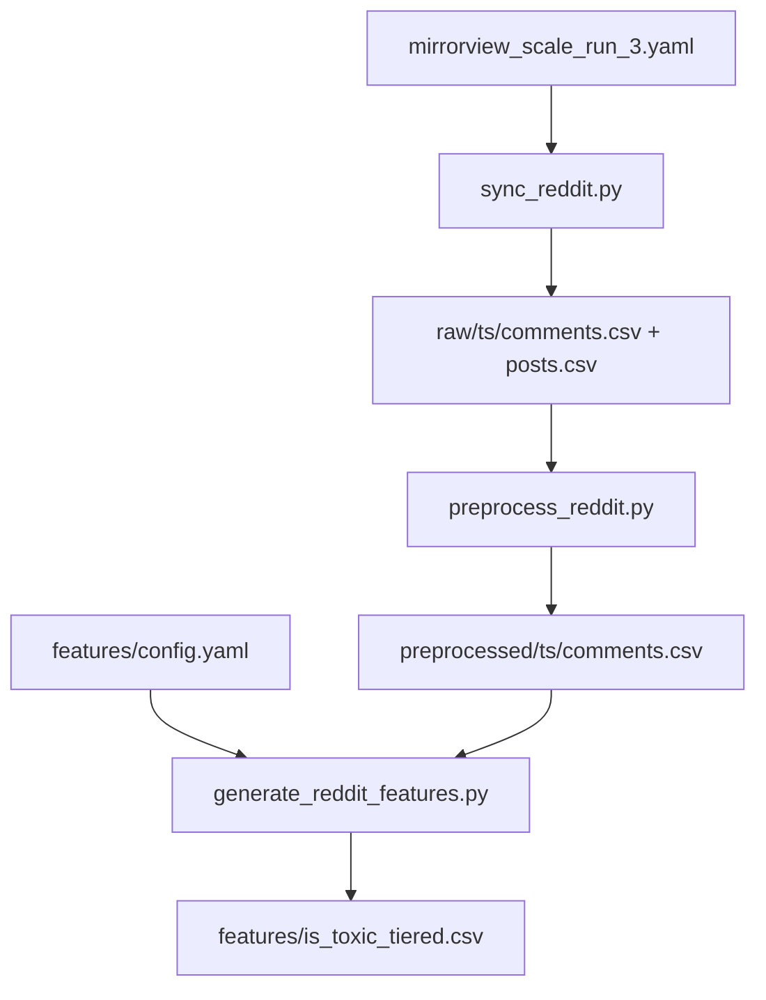

# Reddit Scale Run 3 + Per-Dataset Toxicity Config

Plan assets: [`docs/plans/2026-06-15_reddit_scale_run_3_toxicity_config_628473/`](docs/plans/2026-06-15_reddit_scale_run_3_toxicity_config_628473/)

No UI changes — screenshots not required.

## Remember

- Exact file paths always
- Exact commands with expected output
- DRY, YAGNI, TDD, frequent commits
- Maximum safely delegable parallelism
- Delegated tasks must be impossible to misread
- UI changes: agent captures before/after screenshots itself (no README or instructions for the user)

---

## Overview

We are shipping **Reddit collection batch 3** as a new dataset with the same Mirrorview subreddit/listing settings as [`mirrorview_scale_run_2.yaml`](data_platform/ingestion/configs/reddit/mirrorview_scale_run_2.yaml), but with higher fetch limits (`limit_per_subreddit: 500`, `comments_per_post: 400`) and explicit platform-wide dedupe so every collected comment and post is unique vs all prior Reddit raw runs. Feature generation runs **`is_toxic_tiered` only**, with tier cutoffs **`low_max: 0.3`** and **`high_min: 0.5`** read from an optional per-dataset [`features/config.yaml`](data_platform/data/reddit/{dataset_id}/features/config.yaml). Code defaults in [`generate_feature.py`](data_platform/generate_features/is_toxic_tiered/generate_feature.py) remain **`0.1` / `0.7`** when no config file exists.

---

## Happy Flow

1. **TDD (code):** Add threshold-parameterized helpers and a dataset config loader; wire into [`reddit_feature_config()`](data_platform/generate_features/generate_reddit_features.py).
2. **Ingestion config:** Create [`mirrorview_scale_run_3.yaml`](data_platform/ingestion/configs/reddit/mirrorview_scale_run_3.yaml) with a freshly generated `reddit_{uuid}`.
3. **Ingest:** [`sync_reddit.py`](data_platform/ingestion/sync_reddit.py) writes `raw/{timestamp}/comments.csv` and `posts.csv` under `data_platform/data/reddit/{NEW_DATASET_ID}/`, skipping IDs already seen anywhere under `data/reddit/*/raw/` via [`dedupe.py`](data_platform/ingestion/dedupe.py) (`dedupe_across_datasets: true`, default-on).
4. **Preprocess:** [`preprocess_reddit.py`](data_platform/preprocessing/preprocess_reddit.py) filters raw comments to `preprocessed/{timestamp}/comments.csv`.
5. **Feature config:** Create `data_platform/data/reddit/{NEW_DATASET_ID}/features/config.yaml` with `is_toxic_tiered.low_max: 0.3` and `high_min: 0.5`.
6. **Features:** [`generate_reddit_features.py`](data_platform/generate_features/generate_reddit_features.py) with `--features is_toxic_tiered` scores via Perspective API and writes `features/is_toxic_tiered.csv` using config thresholds.
7. **Verify:** Raw ID uniqueness, zero cross-dataset overlap, tier labels match 0.3/0.5, existing datasets without config unchanged.



---

## Alternative Approaches

| Option | Why not chosen |
|--------|----------------|
| Hardcode 0.3/0.5 in `generate_feature.py` | Affects all platforms/datasets; user wants per-dataset override |
| CLI flags for thresholds | Not persisted with dataset; easy to mis-run |
| Shared config under `generate_features/configs/` | Valid, but user asked for config scoped to dataset ID; colocating under `data/reddit/{id}/features/` matches existing feature artifacts |
| Re-tier old CSVs from stored `toxicity_prob` | Out of scope; new batch only |

**Chosen:** Optional `data_platform/data/reddit/{dataset_id}/features/config.yaml`; missing file → module defaults.

---

## Interface or Contract Freeze

### Ingestion YAML — [`mirrorview_scale_run_3.yaml`](data_platform/ingestion/configs/reddit/mirrorview_scale_run_3.yaml)

Copy from [`mirrorview_scale_run_2.yaml`](data_platform/ingestion/configs/reddit/mirrorview_scale_run_2.yaml) with these changes:

| Field | Run 2 | Run 3 |
|-------|-------|-------|
| `dataset_id` | `reddit_29747ef4-...` | `reddit_{new-uuid}` |
| `name` | `mirrorview_scale_run_2` | `mirrorview_scale_run_3` |
| `date` | `2026-06-11` | `2026-06-15` |
| `fetch.limit_per_subreddit` | `300` | **`500`** |
| `fetch.comments_per_post` | `300` | **`400`** |
| `fetch.dedupe_across_datasets` | omitted (defaults true) | **`true` (explicit)** |

Unchanged: 6 subreddits, `listing: top`, `listing_time_filter: month`, `min_comment_body_length: 30`, `dedupe_comments_from_prior_raw_runs: true`.

### Feature config YAML — `data_platform/data/reddit/{dataset_id}/features/config.yaml`

```yaml
is_toxic_tiered:
  low_max: 0.3
  high_min: 0.5
```

Validation: `low_max < high_min`; reject otherwise. Missing keys fall back to module defaults.

### New code surface

```python
# data_platform/generate_features/is_toxic_tiered/generate_feature.py
def toxicity_tier_from_prob(toxicity_prob, *, low_max=LOW_MAX, high_min=HIGH_MIN) -> ToxicityTier
def make_generate_feature(*, low_max=LOW_MAX, high_min=HIGH_MIN) -> FeatureFn

# data_platform/generate_features/dataset_feature_config.py (new)
def load_dataset_feature_config(platform: str, dataset_id: str) -> dict
def apply_toxic_tiered_overrides(registry: dict[str, FeatureSpec], feature_config: dict) -> dict[str, FeatureSpec]
```

**Invariant:** Datasets without `features/config.yaml` behave identically to today.

---

## Serial Coordination Spine

| Step | Task | Blocks |
|------|------|--------|
| S1 | Generate `NEW_DATASET_ID` | S4, S6–S8 |
| S2 | T1 — loader + threshold helpers + tests | S3 |
| S3 | T2 — wire into `reddit_feature_config()` | S8 |
| S4 | T3 — create ingestion YAML | S5 |
| S5 | Run ingestion + verify uniqueness | S6 |
| S6 | Run preprocess | S7, S8 |
| S7 | Create `features/config.yaml` | S8 |
| S8 | Run `is_toxic_tiered` + verify tiers | Done |

---

## Parallel Task Packets

### T1 — Per-dataset toxicity config (TDD)

**Objective:** Load optional `features/config.yaml` and build threshold-aware `generate_fn`; defaults unchanged.

**Files to change:**
- [`data_platform/generate_features/is_toxic_tiered/generate_feature.py`](data_platform/generate_features/is_toxic_tiered/generate_feature.py)
- `data_platform/generate_features/dataset_feature_config.py` (new)
- `tests/data_platform/generate_features/test_is_toxic_tiered_config.py` (new)

**Forbidden:** `generate_reddit_features.py`, ingestion configs

**Steps:**
1. Write failing tests for parameterized tiers, `make_generate_feature`, loader (missing file → `{}`, valid file → parsed dict, invalid `low_max >= high_min` → error).
2. Implement helpers; keep `generate_feature()` as thin wrapper using module defaults (`LOW_MAX=0.1`, `HIGH_MIN=0.7`).

**Verify:**
```bash
cd /Users/mark/Documents/work/lab_data_integrations_interface
PYTHONPATH=. uv run pytest tests/data_platform/generate_features/test_is_toxic_tiered_config.py -q
```

---

### T2 — Wire config into Reddit feature generation

**Precondition:** T1 complete.

**Files to change:**
- [`data_platform/generate_features/generate_reddit_features.py`](data_platform/generate_features/generate_reddit_features.py)
- [`tests/data_platform/generate_features/test_generate_reddit_features.py`](tests/data_platform/generate_features/test_generate_reddit_features.py)

**Steps:**
1. In `reddit_feature_config()`, after building registry:
   ```python
   feature_config = load_dataset_feature_config("reddit", dataset_id)
   registry = apply_toxic_tiered_overrides(registry, feature_config)
   ```
2. Add test: dataset with `features/config.yaml` uses overridden tiers (mock `get_toxicity_prob`).

**Verify:**
```bash
PYTHONPATH=. uv run pytest tests/data_platform/generate_features/ -q
```

---

### T3 — Ingestion config

**Precondition:** S1 UUID generated.

**Files to change:**
- [`data_platform/ingestion/configs/reddit/mirrorview_scale_run_3.yaml`](data_platform/ingestion/configs/reddit/mirrorview_scale_run_3.yaml) (new)

**Verify:**
```bash
python -c "import yaml; yaml.safe_load(open('data_platform/ingestion/configs/reddit/mirrorview_scale_run_3.yaml'))"
```

---

## Integration Order

1. Merge T1 → T2 (code + tests)
2. Merge T3 (ingestion YAML with pinned UUID)
3. Save this plan to `docs/plans/2026-06-15_reddit_scale_run_3_toxicity_config_628473/plan.md`
4. Run live pipeline (S5–S8)

---

## Manual Verification

### A. Unit / regression tests (before live run)

```bash
PYTHONPATH=. uv run pytest \
  tests/data_platform/generate_features/ \
  tests/data_platform/ingestion/test_sync_reddit_checkpoint.py \
  tests/data_platform/preprocessing/test_preprocess_reddit.py \
  -q
```

### B. Prerequisites

- `.env` has Reddit credentials and `GOOGLE_API_KEY`

### C. Generate dataset ID

```bash
python -c "import uuid; print(f'reddit_{uuid.uuid4()}')"
```

Set `DATASET` to output; pin in YAML before ingestion.

### D. Ingestion

```bash
DATASET="reddit_<NEW_UUID>"

PYTHONPATH=. uv run python data_platform/ingestion/sync_reddit.py \
  --config mirrorview_scale_run_3.yaml
```

Resume: `--config mirrorview_scale_run_3.yaml --resume`

```bash
RAW_TS=$(ls -1 "data_platform/data/reddit/${DATASET}/raw" | tail -1)

jq '{sync_status, row_count, post_row_count, comments_skipped_as_duplicates, posts_skipped_as_duplicates}' \
  "data_platform/data/reddit/${DATASET}/raw/${RAW_TS}/metadata.json"
```

Expected: `sync_status: "completed"`; skip counters > 0.

**Within-run uniqueness + zero cross-dataset overlap:**
```bash
PYTHONPATH=. uv run python -c "
import pandas as pd
from pathlib import Path
new = Path('data_platform/data/reddit/${DATASET}/raw/${RAW_TS}')
c = pd.read_csv(new/'comments.csv'); p = pd.read_csv(new/'posts.csv')
assert c['comment_fullname'].is_unique and p['reddit_fullname'].is_unique
prior = [Path('data_platform/data/reddit/reddit_f47ac10b-58cc-4372-a567-0e02b2c3d479/raw'),
         Path('data_platform/data/reddit/reddit_29747ef4-b7bb-413a-8a4c-55eb6ec6c136/raw')]
def ids(root,col,fn):
    s=set()
    for run in root.iterdir():
        f=run/fn
        if f.exists(): s.update(pd.read_csv(f,usecols=[col])[col])
    return s
assert not set(c['comment_fullname']) & set().union(*[ids(r,'comment_fullname','comments.csv') for r in prior])
assert not set(p['reddit_fullname']) & set().union(*[ids(r,'reddit_fullname','posts.csv') for r in prior])
print('uniqueness OK')
"
```

### E. Preprocess

```bash
PYTHONPATH=. uv run python data_platform/preprocessing/preprocess_reddit.py --dataset-id "${DATASET}"
PRE_RUN=$(ls -1 "data_platform/data/reddit/${DATASET}/preprocessed" | tail -1)
jq '.row_counts' "data_platform/data/reddit/${DATASET}/preprocessed/${PRE_RUN}/metadata.json"
```

### F. Create feature config + run features

```bash
mkdir -p "data_platform/data/reddit/${DATASET}/features"
cat > "data_platform/data/reddit/${DATASET}/features/config.yaml" <<'EOF'
is_toxic_tiered:
  low_max: 0.3
  high_min: 0.5
EOF

PYTHONPATH=. uv run python data_platform/generate_features/generate_reddit_features.py \
  --dataset-id "${DATASET}" \
  --features is_toxic_tiered \
  --batch-size 64 \
  --max-concurrency 80
```

**Tier correctness:**
```bash
PYTHONPATH=. uv run python -c "
import pandas as pd
from data_platform.generate_features.is_toxic_tiered.generate_feature import toxicity_tier_from_prob
df = pd.read_csv(f'data_platform/data/reddit/${DATASET}/features/is_toxic_tiered.csv')
bad = df[df.apply(lambda r: r.toxicity_tier != toxicity_tier_from_prob(r.toxicity_prob, low_max=0.3, high_min=0.5), axis=1)]
print('mismatches:', len(bad)); assert len(bad) == 0
"
```

**Defaults preserved for datasets without config:**
```bash
PYTHONPATH=. uv run python -c "
from data_platform.generate_features.is_toxic_tiered.generate_feature import LOW_MAX, HIGH_MIN
from data_platform.generate_features.dataset_feature_config import load_dataset_feature_config
assert LOW_MAX == 0.1 and HIGH_MIN == 0.7
assert load_dataset_feature_config('reddit', 'reddit_f47ac10b-58cc-4372-a567-0e02b2c3d479') == {}
print('defaults OK')
"
```

---

## Final Verification Checklist

- T1 + T2 tests pass
- `mirrorview_scale_run_3.yaml` has limits 500/400 and explicit dedupe
- Ingestion completed; raw IDs unique within run and vs prior datasets
- Preprocess completed
- `features/config.yaml` present for new dataset only
- `is_toxic_tiered.csv` uses 0.3/0.5 tiers
- Existing datasets without config unchanged
- Curate not run (out of scope)

## Commit Suggestions

1. `Add per-dataset feature config loader for is_toxic_tiered thresholds`
2. `Wire dataset features/config.yaml into reddit feature generation`
3. `Add mirrorview_scale_run_3 Reddit ingestion config`

Do not commit live `data/` outputs unless repo policy requires it.
