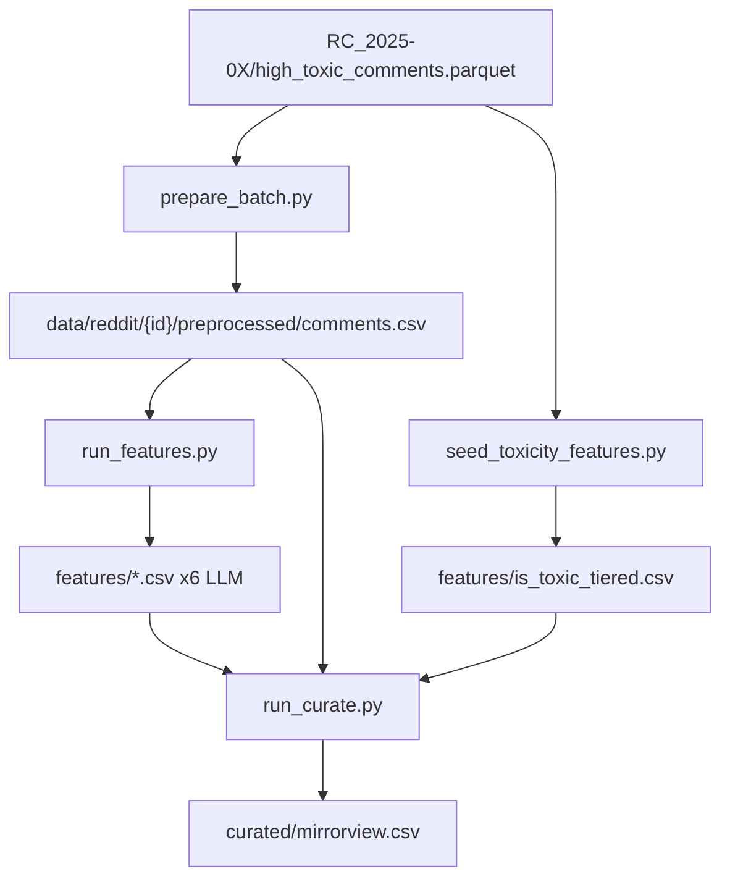

# Reddit Pushshift Dump Labeling Pipeline

Plan asset folder: [`docs/plans/2026-06-16_reddit_pushshift_labeling_847294/`](docs/plans/2026-06-16_reddit_pushshift_labeling_847294/)

No UI changes — screenshots not required.

## Remember

- Exact file paths always
- Exact commands with expected output
- DRY, YAGNI, TDD, frequent commits
- Maximum safely delegable parallelism
- Delegated tasks must be impossible to misread
- UI changes: agent captures before/after screenshots itself (no README or instructions for the user)

---

## Overview

We are labeling ~62k high-toxicity Reddit comments from two Pushshift parquet batches (`RC_2025-05`, `RC_2025-06`) using the existing feature-generation and curation logic in [`data_platform/generate_features/`](data_platform/generate_features/) and [`data_platform/curate/`](data_platform/curate/). Perspective API scoring is already done (`prob_toxic` column); we seed `is_toxic_tiered` from that and run the six LLM classifiers only. All artifacts stay under [`experiments/reddit_data_dump_labeling_2026_06_16/`](experiments/reddit_data_dump_labeling_2026_06_16/) by monkeypatching prod `DATA_ROOT` at runtime—zero changes to prod code.

---

## Happy Flow

1. Operator runs `prepare_batch.py` for each batch → reads [`RC_2025-05/high_toxic_comments.parquet`](experiments/reddit_data_dump_labeling_2026_06_16/RC_2025-05/high_toxic_comments.parquet), drops `prob_toxic`, validates via [`SyncRedditCommentModel`](data_platform/models/sync.py), writes `data/reddit/{dataset_id}/preprocessed/{run}/comments.csv` and [`dataset.json`](data_platform/utils/dataset.py).
2. Operator runs `seed_toxicity_features.py` → writes `features/is_toxic_tiered.csv` with `uri=comment_fullname`, `toxicity_prob=prob_toxic`, tier via [`toxicity_tier_from_prob`](data_platform/generate_features/is_toxic_tiered/generate_feature.py).
3. Operator runs `run_features.py` → patches `DATA_ROOT`, loads comments, calls [`generate_features`](data_platform/generate_features/generate_features.py) with registry subset excluding `is_toxic_tiered` → writes six LLM feature CSVs under `features/`.
4. Operator runs `run_curate.py` → patches `DATA_ROOT`, calls [`run_curation`](data_platform/curate/runner.py) with [`configs/mirrorview.yaml`](data_platform/curate/configs/reddit/mirrorview.yaml) copy → writes `curated/{run}/mirrorview.csv` + metadata with filter funnel.
5. Operator verifies row counts, feature coverage, and spot-checks curated samples.



---

## Alternative Approaches

| Option | Why not chosen |
|--------|----------------|
| Symlink into `data_platform/data/reddit/` | Violates "artifacts live in experiment folder"; pollutes prod data tree |
| Copy prod scripts and fork orchestration | Duplicates resumability/deadletter logic; harder to maintain |
| Call Perspective API again via `is_toxic_tiered` | User explicitly has scores; wastes API quota |
| Single combined dataset for both months | Loses per-month provenance; harder to resume/debug; batches already split |
| Modify `StorageManager` to accept custom root | Requires prod code changes |

**Chosen:** Runtime monkeypatch of [`DATA_ROOT`](data_platform/utils/storage.py) and [`_DATA_ROOT`](data_platform/utils/dataset.py) in experiment entrypoints; call prod functions unchanged.

---

## Interface or Contract Freeze

### Batch config — [`experiments/reddit_data_dump_labeling_2026_06_16/batches.yaml`](experiments/reddit_data_dump_labeling_2026_06_16/batches.yaml)

```yaml
RC_2025-05:
  dataset_id: reddit_c3e4a5b6-7d8e-9012-3456-789012345601
  parquet: RC_2025-05/high_toxic_comments.parquet
RC_2025-06:
  dataset_id: reddit_d4f5b6c7-8e9f-0123-4567-890123456702
  parquet: RC_2025-06/high_toxic_comments.parquet
```

### Experiment data root (monkeypatched)

```
experiments/reddit_data_dump_labeling_2026_06_16/data/reddit/{dataset_id}/
  dataset.json              # {"format": "csv", ...}
  preprocessed/{run}/comments.csv
  features/is_toxic_tiered.csv   # seeded
  features/{feature}.csv         # LLM outputs
  features/metadata.json
  curated/{run}/mirrorview.csv
  curated/{run}/metadata.json
```

### Column contracts (must not drift)

| Layer | ID column | Text column | Feature CSV id |
|-------|-----------|-------------|----------------|
| Preprocessed | `comment_fullname` | `body` | — |
| Feature CSVs | — | — | `uri` (= `comment_fullname`, e.g. `t1_mpxmf7g`) |
| Wide table join | `comment_fullname` | — | joined via `uri` |

Per [`REDDIT_BINDING`](data_platform/utils/platform_ids.py): `records_id_column=comment_fullname`, `feature_csv_id_column=uri`.

### LLM feature subset (exclude Perspective)

From [`FEATURE_REGISTRY`](data_platform/generate_features/registry.py):

- `is_news_or_opinion`, `is_political`, `is_likely_spam`, `is_self_contained`, `is_structurally_complete`, `political_stance`
- **Excluded:** `is_toxic_tiered` (seeded from `prob_toxic`)

### Files forbidden to change (all parallel tasks)

- Everything under [`data_platform/`](data_platform/)
- Source parquets: [`RC_2025-05/high_toxic_comments.parquet`](experiments/reddit_data_dump_labeling_2026_06_16/RC_2025-05/high_toxic_comments.parquet), [`RC_2025-06/high_toxic_comments.parquet`](experiments/reddit_data_dump_labeling_2026_06_16/RC_2025-06/high_toxic_comments.parquet)

---

## Serial Coordination Spine

These tasks must complete in order before parallel packets start:

1. **S1 — Create plan asset folder** [`docs/plans/2026-06-16_reddit_pushshift_labeling_847294/plan.md`](docs/plans/2026-06-16_reddit_pushshift_labeling_847294/plan.md) (copy of this plan).
2. **S2 — Shared modules** (single owner):
   - [`experiments/reddit_data_dump_labeling_2026_06_16/paths.py`](experiments/reddit_data_dump_labeling_2026_06_16/paths.py) — `EXPERIMENT_ROOT`, `EXPERIMENT_DATA_ROOT`, `load_batches()`, `dataset_root_for(batch)`.
   - [`experiments/reddit_data_dump_labeling_2026_06_16/patch_data_root.py`](experiments/reddit_data_dump_labeling_2026_06_16/patch_data_root.py) — `patch_data_root()` sets `storage.DATA_ROOT` and `dataset._DATA_ROOT` to `EXPERIMENT_DATA_ROOT`; must be called before any prod import that resolves paths.
   - [`experiments/reddit_data_dump_labeling_2026_06_16/batches.yaml`](experiments/reddit_data_dump_labeling_2026_06_16/batches.yaml) — frozen IDs above.
3. **S3 — Copy curate config** [`experiments/reddit_data_dump_labeling_2026_06_16/configs/mirrorview.yaml`](experiments/reddit_data_dump_labeling_2026_06_16/configs/mirrorview.yaml) verbatim from [`data_platform/curate/configs/reddit/mirrorview.yaml`](data_platform/curate/configs/reddit/mirrorview.yaml).

**Gate:** S2 + S3 done → parallel packets P1–P4 may start.

---

## Parallel Task Packets

### P1 — `prepare_batch.py` + tests

- **Objective:** Convert parquet → validated preprocessed `comments.csv` + `dataset.json`.
- **Parallelizable:** Yes, after S2; no shared file ownership with P2/P3/P4 (different output files per batch at runtime; script is one file).
- **Inspect:** [`SyncRedditCommentModel`](data_platform/models/sync.py), [`write_dataset_manifest`](data_platform/utils/dataset.py), prod preprocessed sample at [`data_platform/data/reddit/reddit_29747ef4-b7bb-413a-8a4c-55eb6ec6c136/preprocessed/`](data_platform/data/reddit/reddit_29747ef4-b7bb-413a-8a4c-55eb6ec6c136/preprocessed/).
- **Allowed to change:** [`experiments/reddit_data_dump_labeling_2026_06_16/prepare_batch.py`](experiments/reddit_data_dump_labeling_2026_06_16/prepare_batch.py), [`tests/experiments/reddit_pushshift_labeling/test_prepare_batch.py`](tests/experiments/reddit_pushshift_labeling/test_prepare_batch.py)
- **Forbidden:** `data_platform/**`, source parquets
- **Preconditions:** S2 complete
- **Steps:**
  1. Write failing test: temp parquet with 2 rows + `prob_toxic` → script produces `comments.csv` without `prob_toxic`, 2 rows, columns match `SyncRedditCommentModel`.
  2. Implement Typer CLI: `--batch RC_2025-05`, optional `--limit N`.
  3. Read parquet from `batches.yaml` path relative to `EXPERIMENT_ROOT`.
  4. Drop `prob_toxic`; validate each row; write CSV.
  5. Write `dataset.json` via `write_dataset_manifest(..., format=ValidDataFormats.CSV)` after `patch_data_root()`.
  6. Write `preprocessed/{timestamp}/metadata.json` with source batch, row count, parquet path.
- **Verify:**
  ```bash
  uv run pytest tests/experiments/reddit_pushshift_labeling/test_prepare_batch.py -q
  PYTHONPATH=. uv run python experiments/reddit_data_dump_labeling_2026_06_16/prepare_batch.py --batch RC_2025-05 --limit 10
  wc -l experiments/reddit_data_dump_labeling_2026_06_16/data/reddit/reddit_c3e4a5b6-7d8e-9012-3456-789012345601/preprocessed/*/comments.csv
  ```
  Expected: pytest pass; CSV has 11 lines (header + 10); no `prob_toxic` column.
- **Done when:** Test green; pilot CSV exists for RC_2025-05 with `--limit 10`.

### P2 — `seed_toxicity_features.py` + tests

- **Objective:** Seed `is_toxic_tiered.csv` from parquet `prob_toxic` without calling Perspective API.
- **Parallelizable:** Yes, after S2; reads parquet directly (no dependency on P1 output).
- **Inspect:** [`IsToxicTieredModel`](data_platform/generate_features/is_toxic_tiered/generate_feature.py), prod feature CSV sample.
- **Allowed to change:** [`seed_toxicity_features.py`](experiments/reddit_data_dump_labeling_2026_06_16/seed_toxicity_features.py), [`test_seed_toxicity.py`](tests/experiments/reddit_pushshift_labeling/test_seed_toxicity.py)
- **Preconditions:** S2 complete
- **Steps:**
  1. Failing test: given sample rows with `prob_toxic` 0.05 / 0.5 / 0.9 → tiers `low` / `medium` / `high`.
  2. CLI `--batch`; read parquet; emit CSV columns `uri,label_timestamp,toxicity_prob,toxicity_tier`.
  3. Create `features/` dir under patched dataset root; write CSV.
  4. Optionally write partial `features/metadata.json` marking `is_toxic_tiered` as `completed` with `labeled` count.
- **Verify:**
  ```bash
  uv run pytest tests/experiments/reddit_pushshift_labeling/test_seed_toxicity.py -q
  PYTHONPATH=. uv run python experiments/reddit_data_dump_labeling_2026_06_16/seed_toxicity_features.py --batch RC_2025-05 --limit 10
  head -3 experiments/reddit_data_dump_labeling_2026_06_16/data/reddit/reddit_c3e4a5b6-7d8e-9012-3456-789012345601/features/is_toxic_tiered.csv
  ```
  Expected: all pilot rows show `high` tier (source data is pre-filtered ≥0.7).
- **Done when:** Test green; seeded CSV exists with correct schema.

### P3 — `run_features.py`

- **Objective:** Run six LLM features via prod `generate_features` orchestrator.
- **Parallelizable:** Script implementation yes (after S2); **full batch execution** should run one batch at a time to manage API cost.
- **Inspect:** [`reddit_feature_config`](data_platform/generate_features/generate_reddit_features.py), [`generate_features`](data_platform/generate_features/generate_features.py)
- **Allowed to change:** [`run_features.py`](experiments/reddit_data_dump_labeling_2026_06_16/run_features.py) only
- **Preconditions:** S2 complete; P1 pilot data exists for integration smoke test
- **Steps:**
  1. Call `patch_data_root()` first.
  2. Load comments from latest preprocessed run (reuse validation logic from P1 or call prod `load_comments` after patch).
  3. Build config via `reddit_feature_config(dataset_id, features_subset=LLM_FEATURES, ...)`.
  4. Call `generate_features(comments, config)`.
  5. CLI flags: `--batch`, `--features` (repeatable), `--batch-size`, `--max-concurrency`, `--limit`, `--opik`.
- **Verify (pilot only during implementation):**
  ```bash
  PYTHONPATH=. uv run python experiments/reddit_data_dump_labeling_2026_06_16/run_features.py \
    --batch RC_2025-05 --limit 10 --features is_political --batch-size 4 --max-concurrency 4
  wc -l experiments/reddit_data_dump_labeling_2026_06_16/data/reddit/reddit_c3e4a5b6-7d8e-9012-3456-789012345601/features/is_political.csv
  ```
  Expected: 11 lines; `uri` values match `comment_fullname` from pilot CSV.
- **Done when:** Pilot feature CSV written; script supports all six features and resumability.

### P4 — `run_curate.py`

- **Objective:** Produce mirrorview curated CSV + metadata.
- **Parallelizable:** Script implementation yes (after S2); execution requires P1 + P2 + P3 for full run.
- **Inspect:** [`run_curation`](data_platform/curate/runner.py), [`REDDIT_CURATE_SPEC`](data_platform/curate/curate_reddit.py)
- **Allowed to change:** [`run_curate.py`](experiments/reddit_data_dump_labeling_2026_06_16/run_curate.py) only
- **Preconditions:** S2 + S3; P1/P2/P3 pilot artifacts for smoke test
- **Steps:**
  1. `patch_data_root()`.
  2. `run_curation(config_path, dataset_id, REDDIT_CURATE_SPEC)` where config is experiment copy.
  3. CLI: `--batch`.
- **Verify (pilot):**
  ```bash
  PYTHONPATH=. uv run python experiments/reddit_data_dump_labeling_2026_06_16/run_curate.py --batch RC_2025-05
  cat experiments/reddit_data_dump_labeling_2026_06_16/data/reddit/reddit_c3e4a5b6-7d8e-9012-3456-789012345601/curated/*/metadata.json
  ```
  Expected: metadata shows `filter_results` array; `mirrorview.csv` row count ≤ 10 for pilot.
- **Done when:** Pilot curated output + metadata exist.

### P5 — README + `.gitignore` (parallel after S2)

- **Objective:** Document exact run order and env requirements in [`README.md`](experiments/reddit_data_dump_labeling_2026_06_16/README.md); add `data/` to experiment `.gitignore` if large artifacts should not be committed.
- **Allowed to change:** README, optional `experiments/reddit_data_dump_labeling_2026_06_16/.gitignore`
- **Preconditions:** S2 complete (can finalize after P1–P4 APIs stable)

---

## Integration Order

1. S1 → S2 → S3 (serial)
2. P1, P2, P3, P4, P5 in parallel (implementation)
3. **Pilot integration** (serial, ~10 rows):
   ```bash
   PYTHONPATH=. uv run python experiments/reddit_data_dump_labeling_2026_06_16/prepare_batch.py --batch RC_2025-05 --limit 10
   PYTHONPATH=. uv run python experiments/reddit_data_dump_labeling_2026_06_16/seed_toxicity_features.py --batch RC_2025-05 --limit 10
   PYTHONPATH=. uv run python experiments/reddit_data_dump_labeling_2026_06_16/run_features.py --batch RC_2025-05 --limit 10 --features is_political
   PYTHONPATH=. uv run python experiments/reddit_data_dump_labeling_2026_06_16/run_curate.py --batch RC_2025-05
   ```
4. **Full batch RC_2025-05** (28,457 rows × 6 LLM features ≈ 171k calls):
   ```bash
   PYTHONPATH=. uv run python experiments/reddit_data_dump_labeling_2026_06_16/prepare_batch.py --batch RC_2025-05
   PYTHONPATH=. uv run python experiments/reddit_data_dump_labeling_2026_06_16/seed_toxicity_features.py --batch RC_2025-05
   # Run features one at a time for resumability:
   for f in is_news_or_opinion is_political is_likely_spam is_self_contained is_structurally_complete political_stance; do
     PYTHONPATH=. uv run python experiments/reddit_data_dump_labeling_2026_06_16/run_features.py --batch RC_2025-05 --features $f
   done
   PYTHONPATH=. uv run python experiments/reddit_data_dump_labeling_2026_06_16/run_curate.py --batch RC_2025-05
   ```
5. Repeat step 4 for `RC_2025-06` (33,635 rows).

**Scale note:** Total ~372k LLM calls; expect multi-hour runtime. Requires LLM env vars (same as prod, e.g. `OPENAI_API_KEY` via [`ml_tooling.llm`](ml_tooling/llm/)).

---

## Manual Verification

- [ ] `uv run pytest tests/experiments/reddit_pushshift_labeling/ -q` — all tests pass
- [ ] Pilot (10 rows) end-to-end completes without Perspective API calls
- [ ] Preprocessed CSV columns match [`SyncRedditCommentModel`](data_platform/models/sync.py) fields exactly (14 columns, no `prob_toxic`)
- [ ] Each feature CSV row count equals preprocessed row count for full batch
- [ ] `is_toxic_tiered.csv`: all rows `toxicity_tier=high` (source threshold 0.7)
- [ ] Feature `uri` values are `t1_*` fullnames, joinable to `comment_fullname`
- [ ] `features/metadata.json` shows all seven features `completed`
- [ ] Curated `metadata.json` filter funnel sums correctly (`records_passing` monotonically decreases)
- [ ] Spot-check 5 curated rows: `body`, `news_or_opinion_category`, `political_stance` plausible
- [ ] No files modified under `data_platform/` (`git diff data_platform/` empty)
- [ ] Full batch counts: RC_2025-05 = 28,457; RC_2025-06 = 33,635 preprocessed rows

---

## Final Verification

Coordinator runs after both full batches:

```bash
# Row count sanity
PYTHONPATH=. uv run python -c "
from pathlib import Path
import pandas as pd
root = Path('experiments/reddit_data_dump_labeling_2026_06_16/data/reddit')
for ds in root.iterdir():
    pre = list((ds/'preprocessed').glob('*/comments.csv'))[-1]
    n = len(pd.read_csv(pre))
    toxic = len(pd.read_csv(ds/'features/is_toxic_tiered.csv'))
    print(ds.name, 'preprocessed', n, 'toxic', toxic, 'match', n==toxic)
"

git diff --stat data_platform/
```

Expected: preprocessed == toxic counts per dataset; zero prod diff.
