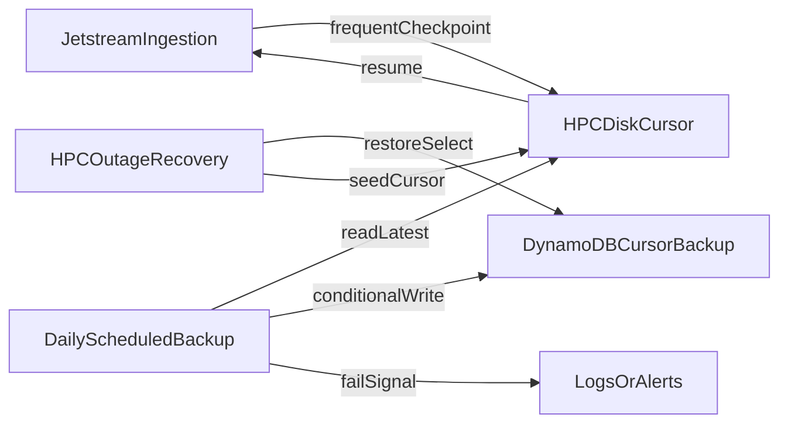

# Add Daily DynamoDB Disaster-Recovery Backup for Bluesky Backfill Cursor

## Remember
- Exact file paths always
- Exact commands with expected output
- DRY, YAGNI, TDD, frequent commits
- Delegated tasks must be impossible to misread.

## Overview

Issue [#122](https://github.com/METResearchGroup/lab_data_integrations_interface/issues/122) adds an off-path daily DynamoDB copy of the Bluesky Jetstream backfill cursor so HPC outages do not erase the only resume checkpoint. Hot ingestion stays disk-first; DynamoDB is a recovery artifact, not a per-update write. This work assumes primary HPC disk cursor persistence already exists (called out in the issue and in [PR #118 discussion](https://github.com/METResearchGroup/lab_data_integrations_interface/pull/118#discussion_r3610849352)).

## Happy flow

An operator keeps Jetstream ingestion running with frequent disk cursor checkpoints. Once per day a scheduled job reads the latest valid disk cursor, writes a metadata-rich backup into DynamoDB without clobbering a good prior backup on failure, and surfaces any unsuccessful run. After an HPC outage, the operator follows a runbook to restore or select that DynamoDB backup and resume ingestion.

## Approach

Treat DynamoDB as a cold disaster-recovery mirror of the disk cursor: one scheduled writer, overwrite-only after a successful validated write, and zero DynamoDB traffic on the ingestion hot path. Prefer a single latest-backup record with freshness and format metadata over a long history, unless retention needs force otherwise. Document restore selection explicitly so operators do not invent ad-hoc recovery.

## Steps

### Step 1: Freeze backup and recovery contracts

Lock the disk-cursor source of truth the backup job will read, the DynamoDB item shape (cursor value, backup timestamp, format/version, validation fields), overwrite vs retain semantics, and the recovery decision rules used when disk is missing or stale. This example PR **defines** the on-disk JSON contract so the backup job is testable even before production Jetstream writers land.

Detail: [`steps/step1.md`](steps/step1.md)

### Step 2: Implement the daily backup job with safe writes and tests

Build a standalone job that reads the latest disk cursor, validates it, writes DynamoDB only on success, leaves the prior backup intact on failure, and emits clear success/failure logs. Cover happy path, missing/corrupt disk cursor, and DynamoDB write failure with tests first. Mock boto3; no live AWS.

Detail: [`steps/step2.md`](steps/step2.md)

### Step 3: Schedule the job on HPC and make failures observable

Add an **example** daily cron snippet (not deployed by this PR), required environment/credential assumptions as placeholders, and observable failure signals (log markers + non-zero exit).

Detail: [`steps/step3.md`](steps/step3.md)

### Step 4: Document operational recovery and retention

Add a runbook that explains how to inspect backup freshness, restore or select the DynamoDB cursor after HPC loss, how overwrite/retention works, and how to confirm ingestion resumed from the recovered checkpoint.

Detail: [`steps/step4.md`](steps/step4.md)

Runbook: [`docs/runbooks/HOW_TO_RECOVER_JETSTREAM_CURSOR_FROM_DYNAMODB.md`](../../runbooks/HOW_TO_RECOVER_JETSTREAM_CURSOR_FROM_DYNAMODB.md)

## What "done" looks like

1. A daily scheduled process copies the latest disk cursor into DynamoDB.
2. DynamoDB backups include metadata sufficient to judge freshness and validity.
3. Failed backup runs are observable and do not corrupt an existing good backup.
4. Normal Jetstream ingestion remains disk-first and performs no DynamoDB writes per cursor update.
5. A documented recovery procedure explains post-outage restore/selection from DynamoDB.
6. Automated tests cover backup success and non-corrupting failure modes.

## Prerequisites / out of scope

- **Example PR scope:** Ships contracts, backup/restore helpers, unit tests (mocked DynamoDB), example cron, and recovery runbook. Does **not** provision the DynamoDB table, install HPC cron, or require live AWS/HPC credentials.
- **Disk contract:** Step 1 freezes the on-disk JSON schema the backup job reads/writes for restore. Production Jetstream ingestion should adopt that schema when its disk writer lands; this PR does not modify the hot path.
- **Out of scope:** Changing hot-path cursor cadence; per-record or frequent DynamoDB cursor writes; Jetstream ingestion feature work unrelated to backup/restore; UI changes; live AWS wiring.
