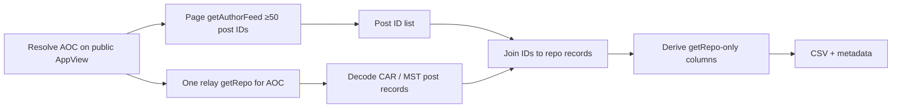

# Fetch AOC’s latest Bluesky posts and derive getRepo-only metrics

Plan assets: [`docs/plans/2026-08-11_aoc_bluesky_getrepo_metrics_92b5b5/`](docs/plans/2026-08-11_aoc_bluesky_getrepo_metrics_92b5b5/)

## Remember

- Exact file paths always
- Exact commands with expected output
- DRY, YAGNI, TDD, frequent commits
- Delegated tasks must be impossible to misread.

## Overview

Build a new experiment package that pulls at least 50 of AOC’s most recent Bluesky posts via public `getAuthorFeed`, captures their post IDs, loads AOC’s repository once via relay `getRepo`, joins each post ID to its repository record, and writes a metrics table. Engagement counts that require AppView endpoints are left missing — no extra API calls beyond author-feed listing and one repository export.

## Happy flow

An operator runs the experiment script; it resolves AOC on the public AppView, pages `getAuthorFeed` until ≥50 authored post IDs are collected, downloads AOC’s full repo from the relay once, joins IDs to decoded post records, derives only fields present in those records (deletion status always `unknown`), and writes a timestamped CSV plus metadata under the new experiment data directory.

## Approach

New package under `experimentation/` (do not extend `aoc_followers_backfill`). Copy or import only the proven client split and CAR/MST decode pattern from that prior experiment. Treat `getRepo` as account-scoped: one export for AOC, then local lookup by post URI. Prefer missing values over any additional AppView calls for likes, replies, reposts, quotes, saves, or deletion clocks. Deletion status is always `unknown` — do not infer deleted from feed-vs-repo mismatch.

### Confirmed decisions

1. Listing source: public `getAuthorFeed`
2. Deletion column: always `unknown` (never yes/no from this pipeline)
3. Home: new `experimentation/` package

### Metric availability (getRepo only)

| Metric | From getRepo? | Plan |
|--------|---------------|------|
| Timestamp | Yes — post `createdAt` | Populate when record found; else missing |
| Deleted | Not knowable from one getRepo snapshot | Always `unknown` |
| Deleted when | No | Missing |
| Original vs thread item | Yes — presence of reply linkage | Populate when record found |
| Includes media (image/video) | Yes — embed type | Populate when record found |
| Language | Yes — langs on record | Populate when record found (may be empty list) |
| Likes / replies / reposts / quotes / saves | No — AppView aggregates | Missing |
| Counts read-at | No — counts not read | Missing |

## Steps

Detailed specs: [`steps/step1.md`](steps/step1.md) · [`steps/step2.md`](steps/step2.md) · [`steps/step3.md`](steps/step3.md) · [`steps/step4.md`](steps/step4.md)

### Step 1: Scaffold the experiment package

Add `experimentation/aoc_posts_getrepo_metrics/` with constants, client wrappers, stub modules, and a thin `main.py` caller shape. See [`steps/step1.md`](steps/step1.md).

### Step 2: Collect ≥50 latest AOC post IDs via getAuthorFeed

Implement paginated public author-feed listing for AOC; keep only posts she authored; stop at ≥50 IDs. See [`steps/step2.md`](steps/step2.md).

### Step 3: Load AOC’s repo once and index post records

Call `getRepo` once for AOC’s DID on the relay; decode CAR/MST; index post records by URI. See [`steps/step3.md`](steps/step3.md).

### Step 4: Derive metrics, write outputs, add unit tests

Join IDs to the repo index; fill getRepo-only columns; write CSV + metadata; cover join/metrics offline. See [`steps/step4.md`](steps/step4.md).

## What "done" looks like

1. New package at `experimentation/aoc_posts_getrepo_metrics/` with a runnable `main.py`.
2. Live path uses public `getAuthorFeed` for ≥50 AOC-authored post IDs.
3. Exactly one `getRepo` call per successful run for AOC.
4. Output CSV includes every requested metric column; deletion is always `unknown`; engagement counts and deletion timestamps are missing.
5. Offline unit tests for join + metric derivation pass; live run is documented and optional for CI.
6. No AppView calls for likes, replies, reposts, quotes, bookmarks/saves, or `getPosts` enrichment.
7. `experimentation/aoc_followers_backfill/` is unchanged except optional shared imports if Step 1 chooses import-over-copy for MST decode only.
