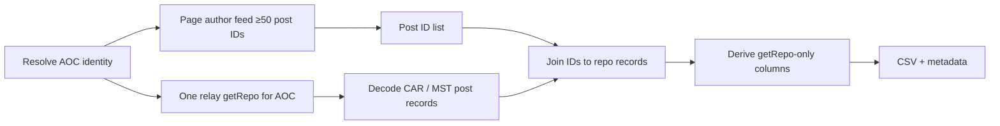

# Fetch AOC’s latest Bluesky posts and derive getRepo-only metrics

Plan assets: [`docs/plans/2026-08-11_aoc_bluesky_getrepo_metrics_92b5b5/`](docs/plans/2026-08-11_aoc_bluesky_getrepo_metrics_92b5b5/)

## Remember

- Exact file paths always
- Exact commands with expected output
- DRY, YAGNI, TDD, frequent commits
- Delegated tasks must be impossible to misread.

## Overview

Build a focused experiment that pulls at least 50 of AOC’s most recent Bluesky posts, captures their post IDs, loads AOC’s repository once via the sync export API, joins each post ID to its repository record, and writes a metrics table. Engagement counts that require AppView endpoints are left missing on purpose — no extra API calls beyond author-feed listing and one repository export.

## Happy flow

An operator runs the experiment script; it resolves AOC, pages the public author feed until ≥50 authored post IDs are collected, downloads AOC’s full repo from the relay once, joins IDs to decoded post records, derives only fields present in those records, and writes a timestamped CSV plus metadata under the experiment data directory.

## Approach

Reuse the existing AOC / getRepo experimentation stack (public AppView client for listing, relay client + CAR/MST decode for repository content). Treat getRepo as account-scoped: one export for AOC, then local lookup by post ID — not one getRepo call per post. Prefer missing values over any additional AppView calls for likes, replies, reposts, quotes, saves, or deletion timestamps.

### Metric availability (getRepo only)

| Metric | From getRepo? | Plan |
|--------|---------------|------|
| Timestamp | Yes — post `createdAt` | Populate |
| Deleted yes/no | Partial — feed ID absent from current repo ⇒ deleted | Populate yes/no; no tombstone clock |
| Deleted when | No | Missing |
| Original vs thread item | Yes — presence of reply linkage | Populate |
| Includes media (image/video) | Yes — embed type | Populate |
| Language | Yes — langs on record | Populate (may be empty) |
| Likes / replies / reposts / quotes / saves | No — AppView aggregates | Missing |
| Counts read-at | No — counts not read | Missing |

## Steps

### Step 1: Scaffold the experiment package

Add a new experiment directory beside the existing AOC-followers backfill work, with constants (AOC handle, minimum post count), thin client wiring that reuses the proven public AppView + relay split, and a CLI entrypoint stub.

### Step 2: Collect ≥50 latest AOC post IDs

Implement paginated author-feed listing for AOC, keep only posts she authored, stop at a hard minimum of 50 IDs, and persist the ID list (and any listing metadata) for the join step.

### Step 3: Load AOC’s repo once and index post records

Call getRepo once for AOC’s DID on the relay, decode with the existing CAR/MST walker (or a shared import from the prior experiment), and index `app.bsky.feed.post` records by URI/rkey for O(1) lookup.

### Step 4: Derive metrics and write outputs

For each collected post ID, join to the repo index, fill only getRepo-derivable columns, leave engagement and deletion-time columns missing, write `posts_metrics.csv` plus `metadata.json` under a timestamped run folder, and cover decode/join/metric mapping with unit tests using fixture CAR/record shapes (no live network in CI).

## What "done" looks like

1. New experiment package under `experimentation/` with a runnable main entrypoint documented in its README or module docstring.
2. A live or dry-run path that yields ≥50 AOC post IDs without requiring production `data_platform` ingestion changes.
3. Exactly one getRepo call per successful run for AOC (not per post).
4. Output CSV includes every requested metric column; engagement counts and deletion timestamps are explicitly missing when not available from getRepo.
5. Unit tests for join + metric derivation pass offline; live run is optional and documented.
6. No AppView calls for likes, replies, reposts, quotes, bookmarks/saves, or getPosts enrichment.
