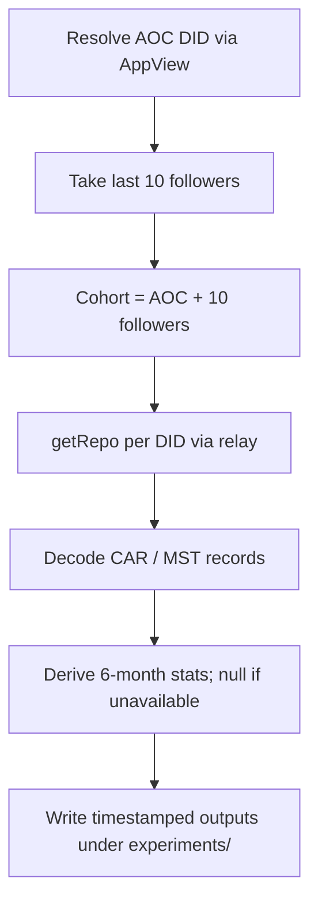

# Collect AOC-cohort repos and derive honest 6-month profile stats from getRepo

## Remember
- Exact file paths always
- Exact commands with expected output
- DRY, YAGNI, TDD, frequent commits
- Delegated tasks must be impossible to misread.

## Overview

Build a small experiment that resolves AOC’s DID, takes her last 10 followers (unfiltered), downloads each of the 11 repos via `com.atproto.sync.getRepo`, and derives a fixed profile-stat schema over a trailing 6-month window. Every field that cannot be proven from a repo snapshot (or from the minimal discovery calls needed to form the cohort) must be written as null / NaN — never invented.

This extends the proven decode path in [`experimentation/aoc_followers_backfill/`](../../../experimentation/aoc_followers_backfill/) and the field inventory in [`strategy_planning/2026-07-15_getrepo_return_type.md`](../../../strategy_planning/2026-07-15_getrepo_return_type.md). It does **not** reuse that experiment’s follower qualification filters or 4-week window.

## Happy flow

An operator runs one experiment entrypoint. The job resolves AOC, takes her last 10 followers, pulls full repos for AOC plus those 10, decodes records, and writes one derived-stats table (plus raw record dumps) under a timestamped folder. Missing fields are explicitly null.

## Approach

Reuse the existing relay `getRepo` + CAR/MST decode path; change discovery to “last 10 followers, no filters”; widen the activity window to 6 months; and add a second derivation layer that answers the requested stats with an explicit availability matrix. Prefer a current-repo snapshot interpreted as “end of the trailing 6 months ending at run time.” Do not invent historical profile text, unfollows, private saves, or inbound follower lists that the snapshot does not contain. Where a requested field needs the body of someone else’s post (quoted / replied-to target), keep only what lives in the actor’s own records unless a later revision explicitly approves hydration calls.

### Field availability (honest nulls)

| Requested field | Available from getRepo snapshot? | Plan behavior |
|---|---|---|
| Account creation date | Not reliably. Profile record may omit it; repo snapshot is not an account registry. | null / NaN unless a present profile `createdAt` exists on the decoded profile record; never infer from first post. |
| All original posts | Yes (posts without reply parent, `createdAt` in window). | Emit list. |
| All posts liked | Yes (like records → subject URI/CID). | Emit list of subjects; subject bodies are not in-repo. |
| All posts reposted | Yes (repost records → subject URI/CID). | Emit list of subjects; subject bodies are not in-repo. |
| All posts quoted (quote text + quoted post) | Partial. Quote text + quoted URI live on the actor’s post; quoted post body does not. | Emit quote text + quoted URI; quoted body = null unless later approved hydration. |
| All posts replied to (reply text + parent) | Partial. Reply text + parent/root URIs live on the actor’s post; parent body does not. | Emit reply text + parent/root URIs; parent body = null unless later approved hydration. |
| All posts saved | No. Bookmarks are private and not exposed on other users’ public repos. | Always null / NaN. |
| Cohort followers at end of window | Not from own repo (follows are outbound only). Derivable across cohort by scanning other cohort members’ still-present follow records that point at this DID. | Emit cohort-DID list from cross-repo edges still present at snapshot time; empty list is valid. |
| Cohort followees at end of window | Yes: still-present outbound follows whose subject is in the cohort. | Emit cohort-DID list. |
| Scalar total followers | No (AppView index, not repo content). | null / NaN under getRepo-only rule. |
| Scalar total followees | Countable as number of still-present follow records in the repo, or AppView count. | Prefer count of still-present follow records from getRepo; document that this is “current follows still in repo,” not historical. |
| Follow actions in window | Partial: still-present follow records with `createdAt` in window (unfollowed-then-gone edges are invisible). | Emit those creates; note survivorship bias. |
| Unfollow actions in window | No. Deletes remove records from the current MST; snapshot has no delete log. | Always null / NaN (Jetstream/firehose history would be a different project). |
| Bio at end of window | Current profile description only (no profile history in snapshot). Valid if window end = run time. | Emit current description; null if profile record missing. |
| Handle | Not a repo record field; obtained at discovery / identity resolution. | Emit from discovery; null if unresolved. |
| Display name | Current profile `displayName` in repo. | Emit current value; null if missing. |

## Steps

### Step 1: Freeze cohort rules, window, and derived-stat contracts

Lock AOC handle, “last 10 followers” selection rule, trailing 6-month window ending at run start, output paths under `experiments/`, and the per-field null policy above. Capture open decisions listed under Confirmation. Details go in [`steps/step1.md`](steps/step1.md) after this draft is approved.

### Step 2: Cohort discovery (AOC DID + last 10 follower DIDs)

Implement discovery against the public AppView client already used in [`experimentation/aoc_followers_backfill/client.py`](../../../experimentation/aoc_followers_backfill/client.py): resolve AOC, page `getFollowers` to obtain the last 10, and assemble the 11-DID cohort including AOC. No min-follower / recent-post filters. Details in [`steps/step2.md`](steps/step2.md) after approval.

### Step 3: getRepo fetch + decode for all 11 DIDs

Call relay `getRepo` for each cohort DID, decode via the existing MST walker in [`experimentation/aoc_followers_backfill/mst.py`](../../../experimentation/aoc_followers_backfill/mst.py), and retain posts, likes, reposts, follows, and the profile record without the old 4-week discard. Persist raw decoded rows for audit. Details in [`steps/step3.md`](steps/step3.md) after approval.

### Step 4: Derive stats with mandatory nulls

From decoded records only, build one row (or structured JSON document) per cohort member for the requested fields, applying the availability matrix. Cross-link cohort follows for in-cohort follower/followee lists. Unit-test null paths (saves, unfollows, missing profile, quote/reply without target body). Details in [`steps/step4.md`](steps/step4.md) after approval.

### Step 5: Orchestrate, write outputs, and verify live smoke

Wire discovery → fetch → derive → timestamped write under `experiments/`. Run mocked tests, then one live smoke against AOC + 10 followers; confirm 11 repos attempted and null fields stay null. Details in [`steps/step5.md`](steps/step5.md) after approval.

## What "done" looks like

1. Draft plan reviewed and open questions below resolved; then per-step specs exist under `docs/plans/2026-08-11_aoc_getrepo_derived_stats_dc0868/steps/`.
2. Experiment code lives under a new folder (proposed: `experiments/aoc_getrepo_derived_stats_2026_08_11/`) and reuses decode logic from `experimentation/aoc_followers_backfill/` rather than forking MST parsing.
3. Live run resolves AOC, selects exactly 10 followers by the agreed “last 10” rule, and attempts `getRepo` for 11 DIDs (AOC + 10).
4. Outputs include raw collection dumps plus a derived-stats artifact covering every requested field.
5. Saved posts and unfollow actions are explicitly null; no fabricated account-creation dates or historical bios.
6. Tests cover decode→derive happy path and every mandatory-null field without network.

## Confirmation / open questions for review

Please confirm or revise before step files are expanded:

1. **“Last 10” meaning.** AppView follower listing is newest-first. Treat “last 10” as the first page of 10 (most recent followers of AOC)? Or literally the oldest 10 at the end of a full follower crawl?
2. **Cohort membership.** Confirm cohort = AOC + those 10 followers (11 repos).
3. **Window.** Confirm trailing 6 months ending at run start (not a fixed calendar H1/H2).
4. **getRepo-only purity.** Confirm scalar total follower count stays null (AppView-only), and we do **not** call `getPosts` to hydrate quoted/replied-to bodies in v1.
5. **Scalar followees.** Confirm counting still-present outbound follow records from the repo is acceptable (vs forcing null because AppView also exposes a count).
6. **Output home.** Confirm new experiment under `experiments/aoc_getrepo_derived_stats_2026_08_11/` rather than extending `experimentation/aoc_followers_backfill/` in place.
7. **Reuse vs copy.** Prefer importing MST/decode helpers from `experimentation/aoc_followers_backfill/` vs copying into the new experiment package.

Reply with approvals/edits; after that, this draft expands into `steps/step1.md` … `steps/step5.md` via the implement-from-spec detail style.
