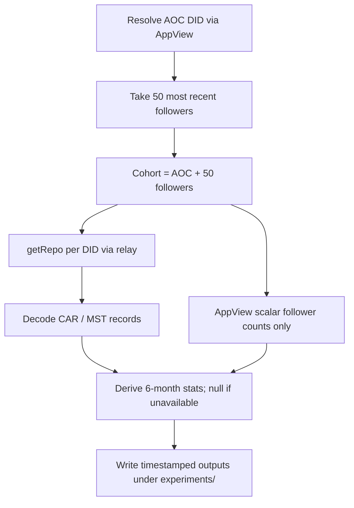

# Collect AOC-cohort repos and derive honest 6-month profile stats from getRepo

## Remember
- Exact file paths always
- Exact commands with expected output
- DRY, YAGNI, TDD, frequent commits
- Delegated tasks must be impossible to misread.

## Overview

Build a small experiment that resolves AOC’s DID, takes her **50 most recent** followers (unfiltered), downloads each of the **51** repos via `com.atproto.sync.getRepo`, and derives a fixed profile-stat schema over a trailing 6-month window. Every field that cannot be proven from a repo snapshot (or from the minimal discovery / AppView calls allowed below) must be written as null / NaN — never invented.

This extends the proven decode path in [`experimentation/aoc_followers_backfill/`](../../../experimentation/aoc_followers_backfill/) and the field inventory in [`strategy_planning/2026-07-15_getrepo_return_type.md`](../../../strategy_planning/2026-07-15_getrepo_return_type.md). It does **not** reuse that experiment’s follower qualification filters or 4-week window.

## Happy flow

An operator runs one experiment entrypoint. The job resolves AOC, takes her 50 most recent followers, pulls full repos for AOC plus those 50, decodes records, and writes one derived-stats table (plus raw record dumps) under a timestamped folder. Missing fields are explicitly null.

## Approach

Reuse the existing relay `getRepo` + CAR/MST decode path by **importing** helpers from `experimentation/aoc_followers_backfill/` (do not copy MST parsing). Change discovery to “50 most recent followers, no filters”; widen the activity window to trailing 6 months ending at run start; and add a derivation layer with an explicit availability matrix. Prefer a current-repo snapshot interpreted as “end of the trailing 6 months ending at run time.” Do not invent historical profile text, unfollows, private saves, or inbound follower lists that the snapshot does not contain. Do not call post-hydration endpoints for quoted / replied-to bodies.

### Decisions (resolved)

1. **Follower sample:** 50 most recent followers of AOC (AppView newest-first; first pages totaling 50).
2. **Cohort:** AOC + those 50 followers → **51 repos**.
3. **Window:** Trailing 6 months ending at run start (`182` days, matching `experimentation/aoc_followers_backfill/date_window_experiment.py`).
4. **Data sources for stats:** getRepo-only for activity/graph/profile-from-repo fields; **AppView allowed only for scalar total follower count**. No `getPosts` (or equivalent) hydration of quote/reply targets.
5. **Scalar followees:** Count of still-present outbound follow records in the repo.
6. **Code home:** New package `experiments/aoc_getrepo_derived_stats_2026_08_11/`.
7. **Reuse:** Import MST / client helpers from `experimentation/aoc_followers_backfill/`; do not fork decode.

### Field availability (honest nulls)

| Requested field | Source | Plan behavior |
|---|---|---|
| Account creation date | getRepo profile record only | null / NaN unless profile record has `createdAt`; never infer from first post. |
| All original posts | getRepo posts without reply, in window | Emit list. |
| All posts liked | getRepo like records | Emit subject URI/CID lists; bodies not hydrated. |
| All posts reposted | getRepo repost records | Emit subject URI/CID lists; bodies not hydrated. |
| All posts quoted | getRepo quote posts | Emit quote text + quoted URI; quoted body always null. |
| All posts replied to | getRepo reply posts | Emit reply text + parent/root URIs; parent body always null. |
| All posts saved | — | Always null / NaN (private bookmarks). |
| Cohort followers at end of window | Cross-repo still-present follows | DIDs in cohort whose outbound follow targets this DID. |
| Cohort followees at end of window | Own still-present follows | DIDs in cohort present in outbound follows. |
| Scalar total followers | AppView profile | Emit AppView followers count; null if profile fetch fails. |
| Scalar total followees | getRepo follow count | Count still-present outbound follows. |
| Follow actions in window | getRepo follows with `createdAt` in window | Emit creates still present; note survivorship bias. |
| Unfollow actions in window | — | Always null / NaN. |
| Bio at end of window | Current profile description | Emit current description; null if missing. |
| Handle | Discovery / AppView | Emit from discovery; null if unresolved. |
| Display name | Current profile record | Emit current value; null if missing. |

## Steps

### Step 1: Freeze cohort rules, window, and derived-stat contracts

Lock constants, output schemas, and null policy. Scaffold the experiment package with stub signatures and failing contract tests. See [steps/step1.md](steps/step1.md).

### Step 2: Cohort discovery (AOC DID + 50 most recent follower DIDs)

Resolve AOC and collect 50 newest followers via public AppView; assemble the 51-member cohort. See [steps/step2.md](steps/step2.md).

### Step 3: getRepo fetch + decode for all 51 DIDs

Relay `getRepo` per DID; import MST decode; retain posts/likes/reposts/follows/profile without the old 4-week discard. See [steps/step3.md](steps/step3.md).

### Step 4: Derive stats with mandatory nulls

Build per-member derived stats from decoded records + AppView follower scalars only; unit-test every null path. See [steps/step4.md](steps/step4.md).

### Step 5: Orchestrate, write outputs, and verify live smoke

Wire discovery → fetch → derive → timestamped write; mocked tests then one live smoke for 51 repos. See [steps/step5.md](steps/step5.md).

## What "done" looks like

1. Per-step specs exist under `docs/plans/2026-08-11_aoc_getrepo_derived_stats_dc0868/steps/`.
2. Experiment code lives under `experiments/aoc_getrepo_derived_stats_2026_08_11/` and imports MST/decode helpers from `experimentation/aoc_followers_backfill/` rather than forking MST parsing.
3. Live run resolves AOC, selects exactly 50 most recent followers, and attempts `getRepo` for 51 DIDs (AOC + 50).
4. Outputs include raw collection dumps plus a derived-stats artifact covering every requested field.
5. Saved posts and unfollow actions are explicitly null; no fabricated account-creation dates or historical bios; quoted/replied bodies stay null.
6. Scalar total followers come from AppView; scalar total followees from still-present outbound follow records.
7. Tests cover decode→derive happy path and every mandatory-null field without network.
