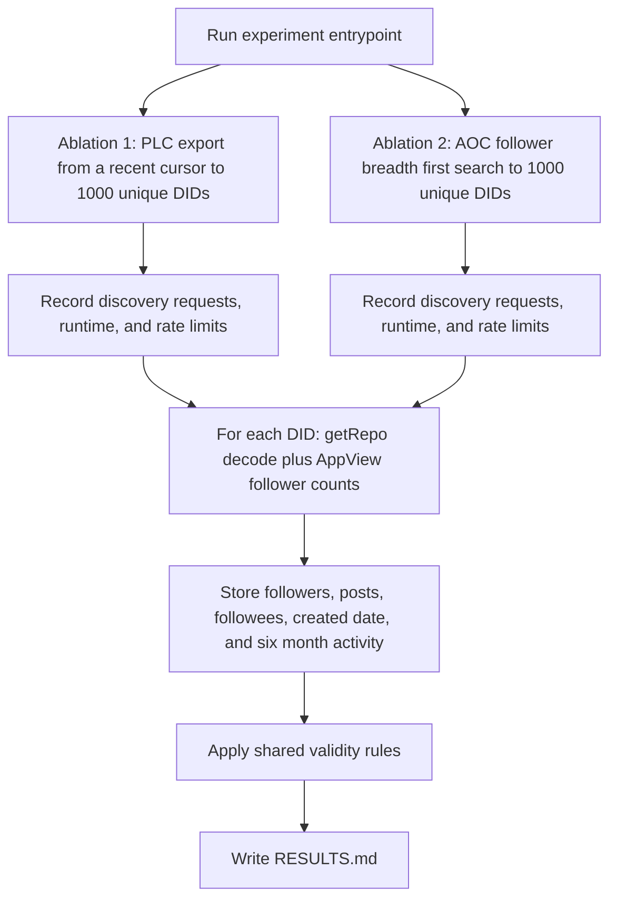

# Compare PLC export and AOC follower search for usable Bluesky accounts

## Remember
- Exact file paths always
- Exact commands with expected output
- DRY, YAGNI, TDD, frequent commits
- Delegated tasks must be impossible to misread.

## Overview

We will build an experiment under [`experiments/did_sync_experiment_2026_08_11/`](experiments/did_sync_experiment_2026_08_11/) that collects 1000 unique Bluesky account IDs in two ways, loads each account history with the existing repo download helpers, scores each account against shared activity rules, and writes a comparison in `RESULTS.md`.

Bluesky accounts are identified by DIDs. A DID is a stable account ID such as `did:plc:...`. Each collection method is an ablation, meaning one controlled way to gather DIDs so we can compare yield under the same scoring rules. The experiment answers which collection method yields more accounts that pass our activity rules before we commit to a large backfill. The open question lives in [`docs/design_docs/2026-07-17_bluesky_backfill_app.md`](docs/design_docs/2026-07-17_bluesky_backfill_app.md).

## Happy flow

An operator runs one command that discovers 1000 unique DIDs for Ablation 1 and 1000 unique DIDs for Ablation 2. For each discovery path, the operator gets request counts, wall time, and rate limit events. The same command then loads each DID with `getRepo` plus AppView profile reads. AppView is Bluesky's indexed public API for profile and graph fields. `getRepo` is the sync API that returns an account's full record history. The operator ends with stored follower, post, followee, and created date fields, plus activity counts for the last six months, a validity mark per account, and `RESULTS.md`.

## Approach

We will import the relay client and Merkle Search Tree decode helpers from [`experimentation/aoc_followers_backfill/`](experimentation/aoc_followers_backfill/) rather than copy them. The Merkle Search Tree is the index structure inside a `getRepo` response. The experiment package only adds discovery code, validity scoring, orchestration, tests, and result writing. The package layout follows [`experiments/x_fetch_data_2026_06_01/`](experiments/x_fetch_data_2026_06_01/).

### Confirmed decisions

- Use AppView for follower counts and handles. Use `getRepo` for followees, posts, and six month activity.
- Start PLC export from a recent cursor, not from the beginning of the log. PLC is the public ledger that registers `did:plc` identities.
- Stop Ablation 2 as soon as 1000 unique DIDs are collected, even if that happens while still reading AOC's direct followers.
- Run a smoke live pass with `--target 50` before the full 1000.
- Import helpers from `experimentation/aoc_followers_backfill/`.

### Locked rules

- An original post is a post record with no reply parent, created in the last 183 days.
- Interactions in the last 183 days are likes, reposts, replies, quote posts, and bookmark or save records when those records exist in the repo.
- An account is valid when it has at least 10 followers, at least 10 followees, at least 20 original posts in the window, and at least 20 interactions in the window.

## Steps

### Step 1: Scaffold the experiment package and freeze outputs

Create the package layout, constants, output schemas, command line stub, and failing unit tests. See [`steps/step1.md`](steps/step1.md).

### Step 2: Implement Ablation 1, PLC directory discovery from a recent cursor

Page `https://plc.directory/export` from a recent cursor until 1000 unique DIDs are collected, and write discovery metrics. See [`steps/step2.md`](steps/step2.md).

### Step 3: Implement Ablation 2, AOC follower breadth first search

Resolve AOC, walk follower pages in breadth first order until 1000 unique DIDs are collected, and write discovery metrics. See [`steps/step3.md`](steps/step3.md).

### Step 4: Enrich DIDs with getRepo and classify validity

Decode each repo, overlay AppView follower counts, write one row per DID, and emit valid DID counts. See [`steps/step4.md`](steps/step4.md).

### Step 5: Smoke run, full run, RESULTS.md, and tests

Run `--target 50`, then the full 1000, commit artifacts, write `RESULTS.md`, and keep unit tests passing offline. See [`steps/step5.md`](steps/step5.md).

## What "done" looks like

1. Detailed step files exist under [`docs/plans/2026-08-11_did_sync_experiment_739184/steps/`](steps/).
2. The experiment package lives at `experiments/did_sync_experiment_2026_08_11/` with one runnable entrypoint.
3. Ablation 1 and Ablation 2 each produce discovery metrics for 1000 unique DIDs, including requests, runtime, and rate limits.
4. Every DID has a stored row with followers, posts, followees, and account created date.
5. Each ablation reports DID count and valid DID count under the four validity rules.
6. `RESULTS.md` compares the two ablations.
7. Unit tests cover discovery uniqueness, validity classification, and summary rollup without live network calls.
8. Production `data_platform/` ingestion code is unchanged.
