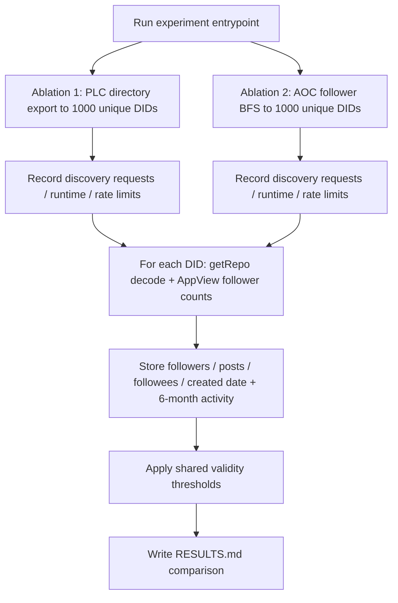

# Compare PLC Export vs AOC Follower-BFS DID Discovery Quality

## Remember
- Exact file paths always
- Exact commands with expected output
- DRY, YAGNI, TDD, frequent commits
- Delegated tasks must be impossible to misread.

## Overview

Run a controlled Bluesky discovery experiment under [`experiments/did_sync_experiment_2026_08_11/`](experiments/did_sync_experiment_2026_08_11/) that collects **1000 unique DIDs** by two methods (PLC directory export vs AOC follower BFS), enriches each DID with repo-derived profile/activity stats via the existing `getRepo` decode path in [`experimentation/aoc_followers_backfill/`](experimentation/aoc_followers_backfill/), applies a shared validity filter, and writes a comparison in `RESULTS.md`.

This answers the open question in [`docs/design_docs/2026-07-17_bluesky_backfill_app.md`](docs/design_docs/2026-07-17_bluesky_backfill_app.md): which seed strategy yields more usable accounts before committing to a large backfill.

## Happy flow

An operator runs one experiment entrypoint; it discovers 1000 DIDs per ablation (recording request count, wall time, and rate-limit events), fetches/decodes each repo, stores per-DID follower/post/followee/created-at plus 6-month activity counts, classifies validity, then writes per-ablation artifacts and a side-by-side `RESULTS.md`.

## Approach

Reuse the proven relay `getRepo` + MST decode stack from the AOC backfill experimentation package; only add new discovery strategies, validity scoring, and experiment packaging. Prefer import/reuse over copy. Keep the experiment self-contained under `experiments/` (same style as [`experiments/x_fetch_data_2026_06_01/`](experiments/x_fetch_data_2026_06_01/)), with mocked unit tests for discovery pagination, validity math, and result rollups before any live 1000-DID run.

**Assumptions to confirm before expanding step files:**

1. **Follower counts** come from AppView profile reads (a user's own repo does not contain inbound follower edges). Followee and activity counts come from decoded `getRepo` records.
2. **Account created date** prefers AppView/profile created-at when available; otherwise earliest decoded repo record timestamp.
3. **“Original posts”** = post records without a reply parent, created in the last ~183 days.
4. **“Interactions”** = like + repost + reply + quote-embed posts in that window. Bluesky **bookmark/save** records are counted when present in the repo; if the collection is absent/empty for a DID, that component is zero (not an error).
5. **PLC sampling** walks `https://plc.directory/export` from the start of the log, collecting unique DIDs until 1000 (not “first 1000 export lines,” which can repeat DIDs across create/update ops).
6. **AOC seed** is `aoc.bsky.social`; BFS uses `getFollowers` pages, queue uniqueness, and stops at 1000 unique DIDs (depth may exceed 1).
7. Live run may take significant wall time at 1000 `getRepo` calls; rate-limit backoff against the relay is required and must be measured.

## Steps

### Step 1: Scaffold experiment package and freeze outputs

Create [`experiments/did_sync_experiment_2026_08_11/`](experiments/did_sync_experiment_2026_08_11/) with package layout, constants (target 1000, validity thresholds, 6-month window), output schemas for discovery metrics / per-DID profiles / summaries, and a thin CLI stub. Add failing unit-test stubs under [`tests/experiments/did_sync_experiment_2026_08_11/`](tests/experiments/did_sync_experiment_2026_08_11/).

### Step 2: Implement Ablation 1 — PLC directory discovery

Paginate the PLC export endpoint until 1000 unique DIDs are collected. Persist DIDs plus request count, wall-clock runtime, HTTP status/rate-limit observations, and final cursor in `data/ablation1_plc/discovery.json`.

### Step 3: Implement Ablation 2 — AOC follower BFS discovery

Resolve AOC, then BFS through follower pages until 1000 unique DIDs. Persist the same discovery metrics shape under `data/ablation2_aoc_bfs/discovery.json`, including max depth reached and pages-per-depth.

### Step 4: Enrich DIDs via getRepo and classify validity

For each discovered DID, call relay `getRepo`, decode with the existing MST walker, and (for follower count / handle) batch AppView profile reads. Write one JSONL row per DID with follower/post/followee/created-at and 6-month original-post + interaction counts. Mark valid when all four thresholds pass. Emit per-ablation `summary.json` with DID count and valid DID count.

### Step 5: Live run, RESULTS.md, and regression tests

Run both ablations end-to-end (or smoke `--target` first, then full 1000). Commit artifacts under the experiment `data/` tree. Write [`experiments/did_sync_experiment_2026_08_11/RESULTS.md`](experiments/did_sync_experiment_2026_08_11/RESULTS.md) comparing DID totals, valid totals, validity rate, discovery cost, and getRepo cost/errors. Ensure unit tests pass without live network.

## What "done" looks like

1. Draft plan reviewed and confirmed (this file); detailed `steps/stepN.md` files exist only after confirmation.
2. Experiment package lives at `experiments/did_sync_experiment_2026_08_11/` with a single runnable entrypoint.
3. Ablation 1 and Ablation 2 each produce discovery metrics for ~1000 unique DIDs (requests, runtime, rate limits).
4. Every DID has a stored profile/activity row including followers, posts, followees, and account created date.
5. Each ablation reports **number of DIDs** and **number of valid DIDs** under the four validity rules.
6. `RESULTS.md` compares the two ablations side-by-side with interpretation.
7. Unit tests cover discovery uniqueness/pagination helpers, validity classification, and summary rollup without hitting Bluesky/PLC live.
8. No changes required to production `data_platform/` ingestion paths for this experiment.

## Open questions for review

Please confirm or revise:

1. Are the seven assumptions above correct, especially AppView for followers and bookmark/save handling?
2. Should PLC export start from genesis (earliest DIDs) or from a recent cursor (more “current” registrations)?
3. For Ablation 2, if AOC’s immediate followers alone exceed 1000, stop at depth 1 after 1000 unique DIDs (yes/no)?
4. Is a smoke live run (`--target 5` or `50`) acceptable before the full 1000, given relay rate limits?
5. Should this experiment **import** decode/client helpers from `experimentation/aoc_followers_backfill/` (preferred) or vendor a thin copy under `experiments/`?
