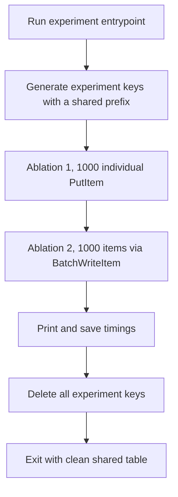

# Measure DynamoDB single write vs batch write time for 1000 items

## Remember
- Exact file paths always
- Exact commands with expected output
- DRY, YAGNI, frequent commits
- Delegated tasks must be impossible to misread.

## Overview

You will add a write rate experiment at `experiments/dynamodb_rates_2026_08_11/`. The experiment times two write methods against an existing DynamoDB table from the June 2026 dedup comparison. The table name is `lab-data-integrations-dedup-experiment-seen-ids`, the region is `us-east-2`, the partition key is `uri`, and billing is pay per request. Ablation 1 sends 1000 individual put requests that all succeed. Ablation 2 writes 1000 items with the batch write API. When the run finishes, the script deletes every experiment key it wrote, so the shared table is clean again.

The detailed steps are in [`steps/`](steps/).

## Happy flow

An operator sets AWS credentials for `us-east-2`, then runs the experiment entrypoint from the repo root. The script builds 1000 unique experiment keys for each ablation, times Ablation 1 with serial puts, times Ablation 2 with batch writes, prints wall clock duration and request counts for each ablation, writes a small results file, and deletes every key it created.

## Approach

Reuse the DynamoDB table and the write and cleanup patterns already used in `experiments/dedup_comparison_2026_06_12/`. Do not create new AWS resources. Keep the experiment narrow. Measure wall clock time and request counts only, use keys with an experiment prefix, always tear down, and never touch a production table. Do not add pytest or other automated tests.

## Steps

### Step 1. Scaffold the experiment package

Create `experiments/dynamodb_rates_2026_08_11/` with a package marker, a README with run instructions, and constants for the existing table and region. Do not add Terraform. See [`steps/step1.md`](steps/step1.md).

### Step 2. Implement timed ablations and teardown

Implement Ablation 1 as 1000 sequential PutItem calls that succeed. Implement Ablation 2 as BatchWriteItem chunks of 25 items, with retry for unprocessed items. Record wall clock time and HTTP call counts for each ablation. Teardown deletes exactly the keys from this run, using batch deletes with retry for unprocessed items. See [`steps/step2.md`](steps/step2.md).

### Step 3. Wire the entrypoint and results output

Add `main.py` so the operator can run Ablation 1, then Ablation 2, see a printed comparison, and get JSON under a timestamped `data/` directory. Always run teardown, including after a partial failure once keys were written. Do not add a tests package. See [`steps/step3.md`](steps/step3.md).

## What "done" looks like

1. `experiments/dynamodb_rates_2026_08_11/` exists with a README, an entrypoint, write helpers, and teardown.
2. A run from the repo root with AWS credentials times both ablations for 1000 successful writes and prints comparable durations.
3. Teardown removes all experiment written keys from `lab-data-integrations-dedup-experiment-seen-ids`. A later get of those keys finds none of them.
4. No pytest or other automated tests are added for this experiment.
5. No new DynamoDB table or Terraform resources are introduced.
