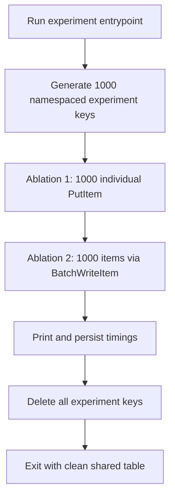

# Measure DynamoDB single-write vs batch-write latency for 1000 items

## Remember
- Exact file paths always
- Exact commands with expected output
- DRY, YAGNI, TDD, frequent commits
- Delegated tasks must be impossible to misread.

## Overview

Add a self-contained write-rate experiment under `experiments/dynamodb_rates_2026_08_11/` that times two ablations against the existing DynamoDB table from the June 2026 dedup comparison (`lab-data-integrations-dedup-experiment-seen-ids` in `us-east-2`, partition key `uri`, pay-per-request). Ablation 1 issues 1000 successful individual put requests. Ablation 2 writes the same 1000 items through the batch write API. The run tears down every experiment key it wrote so the shared table is left clean.

## Happy flow

An operator with AWS credentials set for `us-east-2` runs the experiment entrypoint from the repo root. The script generates 1000 unique experiment keys, times Ablation 1 (serial puts), times Ablation 2 (batch writes), prints wall-clock duration and request counts for each, writes a small results artifact, then deletes every key it created.

## Approach

Reuse the already-provisioned experiment DynamoDB table and the write/cleanup patterns proven in `experiments/dedup_comparison_2026_06_12/` rather than creating new AWS resources. Keep the experiment narrow: wall-clock latency and request counts only, namespaced keys, mandatory teardown, no production table touch, no cost modeling beyond what is needed to interpret the run.

## Steps

### Step 1: Scaffold the experiment package

Create `experiments/dynamodb_rates_2026_08_11/` with package marker, README run instructions, and constants pointing at the existing dedup-experiment table and region. No new Terraform.

### Step 2: Implement timed ablations and teardown

Implement Ablation 1 as 1000 sequential successful PutItem calls and Ablation 2 as BatchWriteItem chunks of 25 with unprocessed-item retry. Record wall-clock time and HTTP call counts for each ablation. Teardown deletes exactly the keys written in this run (same namespaced ID set), using batch deletes with unprocessed-item retry.

### Step 3: Wire entrypoint, mocked unit tests, and results output

Add `main.py` orchestration that runs Ablation 1, Ablation 2, prints a comparison, writes JSON under a timestamped `data/` directory, and always runs teardown (including on partial failure after keys were written). Add mocked unit tests under `tests/experiments/dynamodb_rates_2026_08_11/` so CI does not need live AWS.

## What "done" looks like

1. `experiments/dynamodb_rates_2026_08_11/` exists with README, entrypoint, write helpers, and teardown.
2. Running from repo root with AWS credentials times both ablations for 1000 successful writes and prints comparable durations.
3. Teardown removes all experiment-written keys from `lab-data-integrations-dedup-experiment-seen-ids`; a follow-up get/batch-get of those keys returns none of them.
4. Mocked pytest for the experiment package passes without AWS.
5. No new DynamoDB table or Terraform resources are introduced.
6. Detailed step files under `docs/plans/2026-08-11_dynamodb_rates_experiment_46c825/steps/` are written only after this draft is confirmed.
