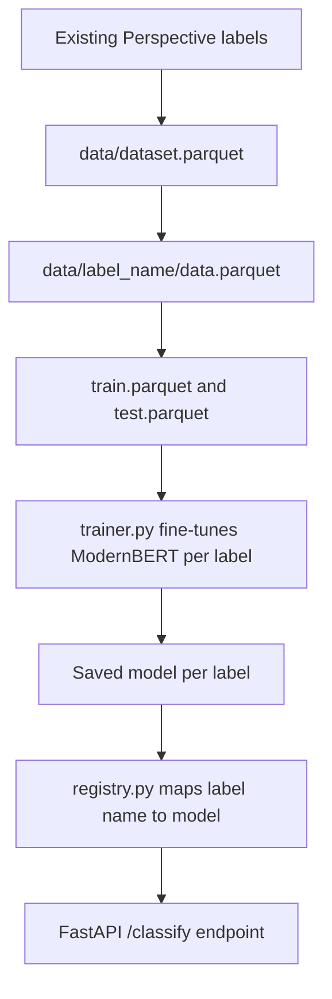

# Fine-tune ModernBERT classifiers on our existing Perspective API labels

## Remember
- Exact file paths always
- Exact commands with expected output
- DRY, YAGNI, TDD, frequent commits
- Delegated tasks must be impossible to misread.

## Overview

We already score every post with the Perspective API and store the results as labels under `experiments/perspective_api_labeling_2026_08_11/labels/`. The plan below turns those labels into training data and fine-tunes one small ModernBERT classifier per label, so the same signals can run on our own infrastructure instead of calling Google's API for every post. The work lives entirely under a new experiment folder, reuses the ModernBERT training pattern already proven in the `mirrorView-task` repository, and adds a small FastAPI service so other code can call our own classifiers the way it calls the Perspective API today.

## Happy flow

An operator runs one script to build the training data, trains each classifier with the same trainer class, and starts a FastAPI service that answers classification requests by looking up the right model in a registry.

## Approach

We copy the ModernBERT training pattern already proven in `mirrorView-task` rather than inventing a new one: a head-only classifier, a stratified split, and a single trainer class every label can reuse. We diverge from that reference in three small ways, each explained in full in the step files.

First, we split each label into train and test only, as asked, and let the trainer use the test split for its own evaluation during training instead of holding out a third validation split. Second, we compute each label's class weights from its own training data instead of hand-tuning a config file per label, since Perspective's labels vary widely in how rare the positive class is. Third, we skip training a separate classifier for the `constructive` label, because our own Perspective code already stores it as an exact copy of the `reasoning` label, so the registry points both names at the same trained model.

The registry is a plain dictionary from label name to a trained model's location, matching the registry pattern already used in this repo's feature generation code. The FastAPI service exposes a single endpoint that accepts a list of desired labels and, for now, only serves the first one in that list, leaving room to serve more later without changing the request shape.

## AWS and secrets findings

Our AWS credentials belong to an IAM user that already has read and write access to this project's own S3 bucket (`lab-data-integrations-interface`), and read access to SageMaker training jobs in the same AWS account. The same AWS account already runs ModernBERT training jobs for `mirrorView-task` using a dedicated IAM execution role created by Terraform, so the same approach should work for us. Step 5 covers the exact commands to confirm this again with the implementer's own credentials, since IAM access is tied to the specific user, not to this repository.

There is one real gap. Our IAM user can create a new role and attach a policy to it, but cannot delete a role or its policy. Terraform can still create the execution role this plan needs, but a future `terraform destroy` or role replacement will fail without wider IAM permissions on whoever runs it. We also could not clean up a disposable role we created while checking this, named `zzz-probe-delete-me-modernbert-plan`, in AWS account `517478598677`. Someone with `iam:DeleteRole` should remove it.

We did not find a Weights and Biases API key available in this environment. Training reports its metrics to a local JSON file by default instead of an external dashboard. Weights and Biases can be added later the same way `mirrorView-task` uses it, once a key is available as a secret.

## Steps

### Step 1: Consolidate existing Perspective labels

Read every labeled Parquet file the Perspective API pipeline already produced and combine the successfully labeled rows into one dataset file. See [`steps/step1.md`](steps/step1.md).

### Step 2: Split the dataset per label, then into train and test

For each Perspective attribute, pull out the text and its 0/1 label into its own folder, then split that into a train file and a test file. See [`steps/step2.md`](steps/step2.md).

### Step 3: Build the shared trainer and train each classifier

Add one trainer class that loads a label's train and test files, fine-tunes ModernBERT's classification head, and saves the model, metrics, and predictions. Run it once per label. See [`steps/step3.md`](steps/step3.md).

### Step 4: Add the registry and the FastAPI service

Add a lookup from label name to a trained model's location, a shared prediction helper, and a FastAPI endpoint that classifies text using the first label a caller asks for. See [`steps/step4.md`](steps/step4.md).

### Step 5: Wire up SageMaker training and its supporting IAM role

Add a launch script that uploads a label's train and test data to S3 and submits a SageMaker training job, plus the Terraform module that creates the scoped IAM role that job needs. See [`steps/step5.md`](steps/step5.md).

### Step 6: Smoke test end to end

Train a couple of labels locally on a small row limit, start the FastAPI service, and confirm a real request returns a sensible prediction. See [`steps/step6.md`](steps/step6.md).

## What "done" looks like

1. `experiments/perspective_classifiers_2026_08_16/data/dataset.parquet` holds every successfully labeled post, and each label has its own `data.parquet`, `train.parquet`, and `test.parquet` under that same `data/` folder.
2. One trainer class trains any label's ModernBERT classifier and writes its model, metrics, and predictions under that label's own artifacts folder.
3. A registry maps each label name, including the `constructive` alias, to a trained model, and a FastAPI service classifies text against the first label a caller requests.
4. A Terraform-managed IAM role and a launch script let any label's training run on SageMaker instead of locally.
5. The AWS access gaps above are recorded in this plan, and the leftover probe role is flagged for manual cleanup.
6. Automated tests cover the dataset split, the registry, and the FastAPI contract without requiring GPU access or downloaded model weights, and a manual smoke run covers real training and inference.
