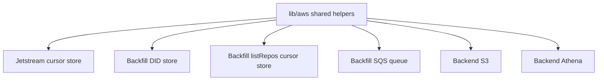

# Move duplicated AWS client code into a shared library

## Remember

- Exact file paths always
- Exact commands with expected output
- DRY, YAGNI, TDD, frequent commits
- Delegated tasks must be impossible to misread.

## Overview

Jetstream ingestion, the Bluesky backfill app, and the backend each keep their own Amazon Web Services (AWS) helper modules. The helper modules repeat the region string, client construction, and error code lookup. The helper modules also include near copies of the Simple Storage Service (S3) class and the Athena class. Athena is Amazon's SQL query service over files in S3. The DynamoDB stores and the Simple Queue Service (SQS) queue are specific to each app, and they use the same client wiring.

Issue 193 asks for a shared `lib/aws/` folder, and for Jetstream and backfill to keep their own classes that inherit from shared bases. The implementer will point the backend S3 and Athena copies at the shared classes, and will delete the local copies.

Glue catalog setup, Iceberg writes, commit retry, and dead-letter files stay in `bluesky_ingestion_jetstream/aws/`. The pipeline helpers under `data_platform/aws/` stay where they are.

The detailed steps are in [`steps/`](steps/).

## Happy flow

An implementer adds shared AWS helpers under `lib/aws/`. The implementer then points the Jetstream cursor store, the backfill DID store, the backfill listRepos cursor store, the backfill queue, and the backend S3 and Athena classes at the shared helpers. Callers keep using the same classes in each app. The existing unit tests for the app classes keep passing.

## Approach

Put only the duplicated client wiring, and the generic S3, Athena, SQS, and DynamoDB store helpers, in `lib/aws/`. App classes inherit one level and keep the methods that belong to one table or one queue. Do not add generic get, put, and update methods that every store must use. Do not move Iceberg or Glue code. Tests for the shared helpers come first. App migrations come after the shared helper tests pass.

## Decisions

1. Shared code lives in `lib/aws/`, as the issue comment requires.
2. DynamoDB and SQS bases are ordinary classes that hold a client and a table name or queue URL. The bases are not abstract base classes, because the app stores do not share one read and write interface.
3. Inheritance is one level deep. Jetstream and backfill subclass the DynamoDB and SQS bases. The backend uses the shared S3 and Athena classes directly, because it has no extra methods to add.
4. Jetstream's DynamoDB client keeps its timeout and retry bounds. Backfill keeps the default client from boto3, the AWS Python SDK, unless a config object is passed.
5. App-specific table names, status values, queue names, Glue database names, and Iceberg settings stay in the app packages.
6. `data_platform/aws/` is out of scope.
7. The implementer deletes duplicate helpers in the apps after the switch. Old modules that only import and rename the new helpers are not left behind.
8. The backend still imports the Glue database name and partition column from Jetstream, because those names identify the Bluesky raw tables, not an AWS client.

## Steps

### Step 1. Scaffold the shared package and freeze contracts

Create `lib/aws/` with a package marker, constants, client builders, an error helper, and base class signatures. Add failing tests that lock the contracts. Do not change Jetstream, backfill, or the backend yet. Details are in [`steps/step1.md`](steps/step1.md).

### Step 2. Implement the shared clients and bases

Fill in client construction, the error helper, and the DynamoDB, S3, Athena, and SQS helpers until the new tests pass. Details are in [`steps/step2.md`](steps/step2.md).

### Step 3. Point Jetstream's cursor store at the DynamoDB base

Make the Jetstream resume cursor store inherit from the shared DynamoDB base, and use the shared client helper and error helper. Existing cursor store tests must keep passing. Iceberg, Glue, retry, and dead-letter modules stay in `bluesky_ingestion_jetstream/aws/`. Details are in [`steps/step3.md`](steps/step3.md).

### Step 4. Point backfill stores and queue at the shared bases

Make the DID store and the listRepos cursor store inherit from the DynamoDB base. Make the DID queue inherit from the SQS base. Delete the duplicated client helpers in `bluesky_backfill_app/aws/clients.py`. Existing DID store, queue, and listRepos cursor tests must keep passing. Details are in [`steps/step4.md`](steps/step4.md).

### Step 5. Point the backend at shared S3 and Athena

Import the shared S3 and Athena classes from `lib/aws/` wherever the backend currently imports them from `backend/agentic_search/aws/`, and delete that folder. Existing query execution and graph tests must keep passing. Details are in [`steps/step5.md`](steps/step5.md).

## What "done" looks like

1. The shared region constant, client builders, error helper, and the DynamoDB, S3, Athena, and SQS helpers live in `lib/aws/`, with unit tests under `tests/lib/aws/`.
2. Jetstream's resume cursor store inherits from the shared DynamoDB base. Glue, Iceberg, retry, and dead-letter code remain in `bluesky_ingestion_jetstream/aws/`.
3. Backfill's DID store and listRepos cursor store inherit from the shared DynamoDB base. The DID queue inherits from the shared SQS base. The implementer has deleted the duplicated client helpers in the backfill package.
4. The backend constructs S3 and Athena from `lib/aws/`. The implementer has deleted `backend/agentic_search/aws/`.
5. Existing tests under `tests/bluesky_ingestion_jetstream/aws/`, `tests/bluesky_backfill_app/aws/`, `tests/bluesky_backfill_app/gather_users/`, and `tests/backend/agentic_search/query_execution/` pass without changing their assertions about app behavior.
6. `data_platform/aws/` is unchanged.
