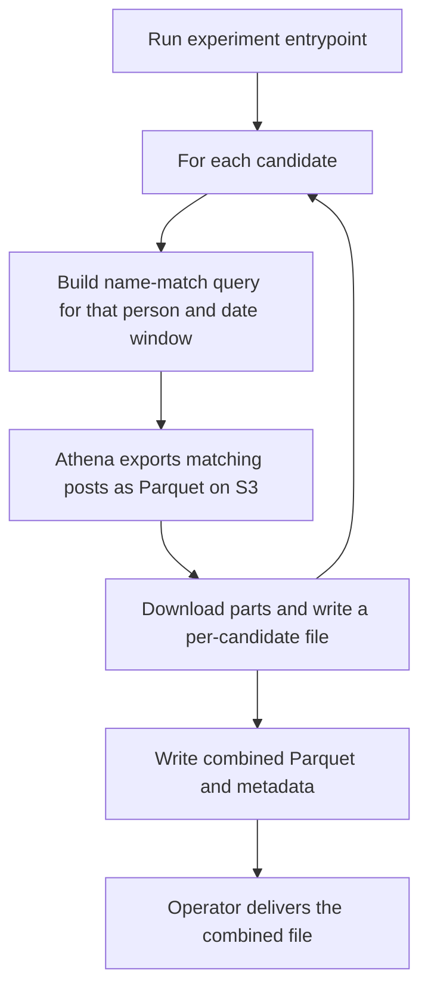

# Pull Iceberg posts that name five Democratic candidates

## Remember

- Exact file paths always
- Exact commands with expected output
- DRY, YAGNI, TDD, frequent commits
- Delegated tasks must be impossible to misread.

## Overview

[Issue 201](https://github.com/METResearchGroup/lab_data_integrations_interface/issues/201) is a request for Bluesky posts about Abdul El-Sayed, James Talarico, Xavier Becerra, Roy Cooper, and Jon Ossoff. Daniel asked Billy for common criticisms from the center and from the left, from each candidate's 2026 primary onward, so a conjoint can use realistic language. The method Mark wrote on the issue is substring search on names against the posts the lab already holds, then one compiled Parquet file.

The public query UI cannot run a name substring search. The UI filters Iceberg tables by date only, returns at most 1000 rows, and writes CSV. The implementer will add a one-run experiment that exports matching posts through Athena and writes a compiled Parquet file plus a metadata file.

Detailed steps live in [`steps/`](steps/).

## Happy flow

An operator with AWS credentials for `us-east-2` runs one experiment command from the repo root. For each candidate, Athena exports Iceberg posts whose text contains an approved name string and whose creation time falls in the candidate query window. The operator's script downloads the exported Parquet parts, writes one file per candidate, then writes a combined Parquet file and a metadata file that records the name strings, the dates searched, and the row counts.

## Approach

The implementer puts the work in a one-run experiment under [`experiments/democratic_candidate_posts_2026_09_09/`](../../../experiments/democratic_candidate_posts_2026_09_09/), and copies the export, download, and merge sequence from [`experiments/perspective_api_labeling_2026_08_11/download_posts_by_day.py`](../../../experiments/perspective_api_labeling_2026_08_11/download_posts_by_day.py). The Perspective labeling script already exports Iceberg posts to Parquet through Athena, so the new experiment can reuse that sequence. Queries run through the shared Athena helper in [`lib/aws/athena.py`](../../../lib/aws/athena.py) so the experiment uses the same client as the query UI. The query UI does not gain a text filter. Posts are not classified as criticisms or as coming from the center or the left. Metadata records that the file is a name match, not a criticism sample.

Jetstream coverage of `bluesky_raw.posts` starts on 2026-08-01, the coverage start date in [`bluesky_ingestion_jetstream/constants.py`](../../../bluesky_ingestion_jetstream/constants.py). The Talarico, Cooper, Ossoff, and Becerra primaries happened before 2026-08-01, so their query windows start on 2026-08-01 rather than on the primary. El-Sayed's Michigan primary is 2026-08-04, so his window can start on the primary. Historical backfill data is out of scope, because it is not in the Iceberg posts table the query path uses.

### Confirmed decisions

1. **Source table.** Query `bluesky_raw.posts` only. Likes, reposts, and follows are out of scope.
2. **Match rule.** Case-insensitive substring match on post text. No language filter. No reply filter. No toxicity or stance model.
3. **Query start.** For each candidate, the later of that candidate's primary date and 2026-08-01. Query end is the UTC date of the run, inclusive.
4. **Primary dates to confirm in code:**
   - James Talarico, Texas Senate Democratic primary, 2026-03-03
   - Roy Cooper, North Carolina Senate Democratic primary, 2026-03-03
   - Jon Ossoff, Georgia Senate Democratic primary, 2026-05-19
   - Xavier Becerra, California gubernatorial top-two primary, 2026-06-02
   - Abdul El-Sayed, Michigan Senate Democratic primary, 2026-08-04
   If a date is wrong, change only the constants and the tests that pin them.
5. **Name strings.** Distinctive surnames may match alone (El-Sayed with hyphen and spacing variants, Talarico, Ossoff). Cooper and Becerra require the given name plus the surname, because Cooper and Becerra are common surnames. Include the issue's misspelling "Beccera" as an extra Becerra string.
6. **Export shape.** One Athena export per candidate, then a local compile. A post that names two candidates appears twice, once per candidate.
7. **Row cap.** The full run has no row limit. A smoke flag caps each export at 100 rows so an operator can prove AWS wiring without scanning every day.
8. **Product code.** Do not change `backend/`, `bluesky_ingestion_jetstream/`, `data_platform/`, or `ui/`.
9. **Reuse.** Import Athena from `lib/aws/athena.py`. Keep S3 prefix download and delete helpers inside the experiment package, matching `download_posts_by_day.py`, rather than adding download methods to [`lib/aws/s3.py`](../../../lib/aws/s3.py).

## Steps

### Step 1: Confirm candidates, name strings, dates, and output layout

Confirm the five people, the name strings, the query windows, and the Parquet and metadata columns. Scaffold the experiment package with stub signatures and failing contract tests. See [`steps/step1.md`](steps/step1.md).

### Step 2: Build the per-candidate Athena export SQL

Write a pure SQL builder that substring-matches the approved name strings, limits the scan to the candidate's date window, casts timestamps for Parquet export, and optionally applies the smoke row cap. No AWS calls. See [`steps/step2.md`](steps/step2.md).

### Step 3: Export, download, and write one Parquet file per candidate

Run each candidate's SQL through Athena, download the S3 parts, merge them into one local Parquet file, and delete the temporary S3 prefix. See [`steps/step3.md`](steps/step3.md).

### Step 4: Compile the combined Parquet file and metadata

Concatenate the five per-candidate files, write the combined Parquet file, and write metadata with per-candidate row counts, name strings, and date windows. See [`steps/step4.md`](steps/step4.md).

### Step 5: Wire the entrypoint, README, and live smoke checklist

Connect confirmation, SQL, export, and compile in `main.py`. Ignore generated data in git. Add mocked end-to-end tests and a live smoke command. See [`steps/step5.md`](steps/step5.md).

## What "done" looks like

1. [`experiments/democratic_candidate_posts_2026_09_09/`](../../../experiments/democratic_candidate_posts_2026_09_09/) exists with constants, a SQL builder, export helpers, a compile step, `main.py`, and a README.
2. Unit tests under [`tests/experiments/democratic_candidate_posts_2026_09_09/`](../../../tests/experiments/democratic_candidate_posts_2026_09_09/) cover name strings, date windows, SQL shape, compile, and a fully mocked run. The tests pass without AWS.
3. A full run with AWS credentials exports matching posts from `bluesky_raw.posts` for all five candidates and writes a combined Parquet file plus metadata under a timestamped `data/` folder.
4. Metadata states that the file is a name match, records each primary date, and records that four windows start on 2026-08-01 rather than on the primary.
5. `backend/`, `bluesky_ingestion_jetstream/`, `data_platform/`, and `ui/` are unchanged.
6. Generated Parquet files are gitignored. The query UI still has no text filter.
