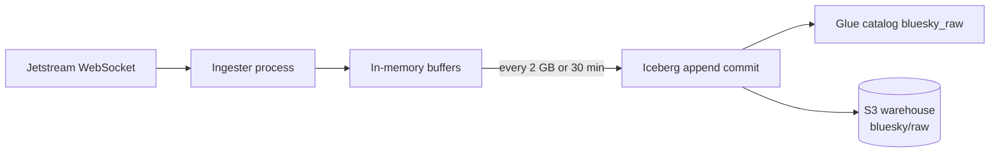
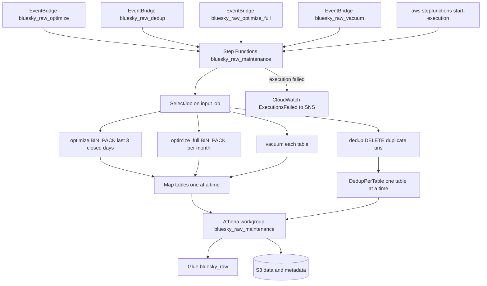
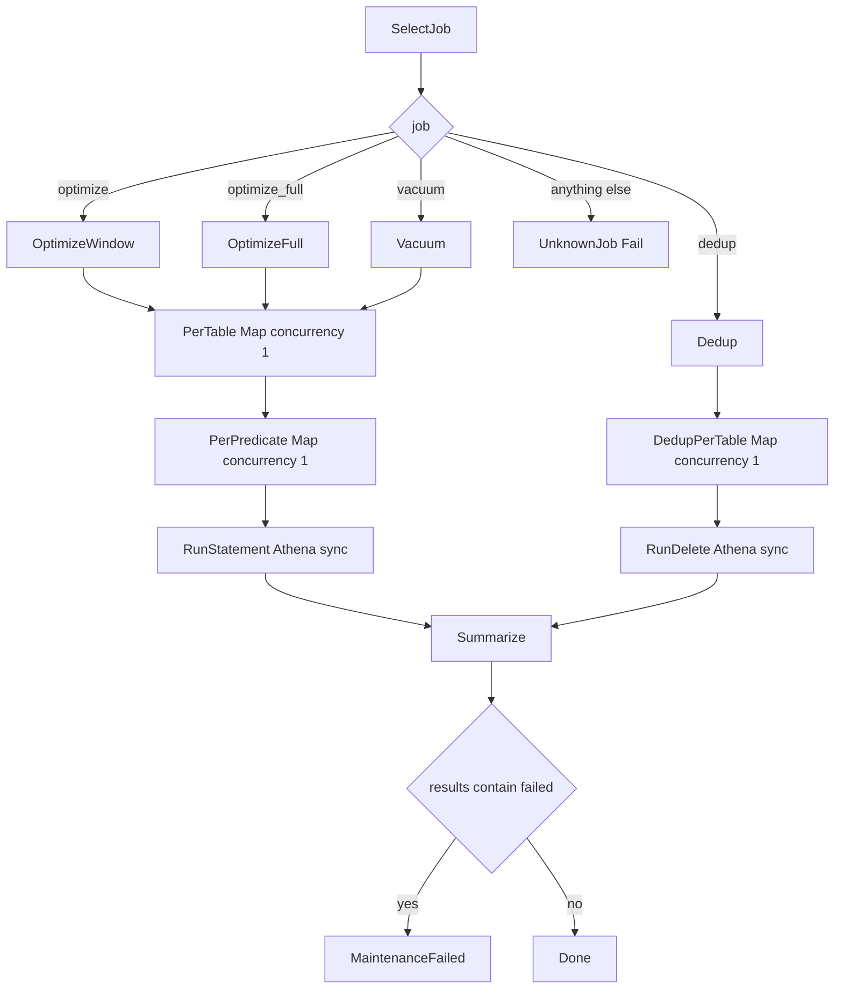
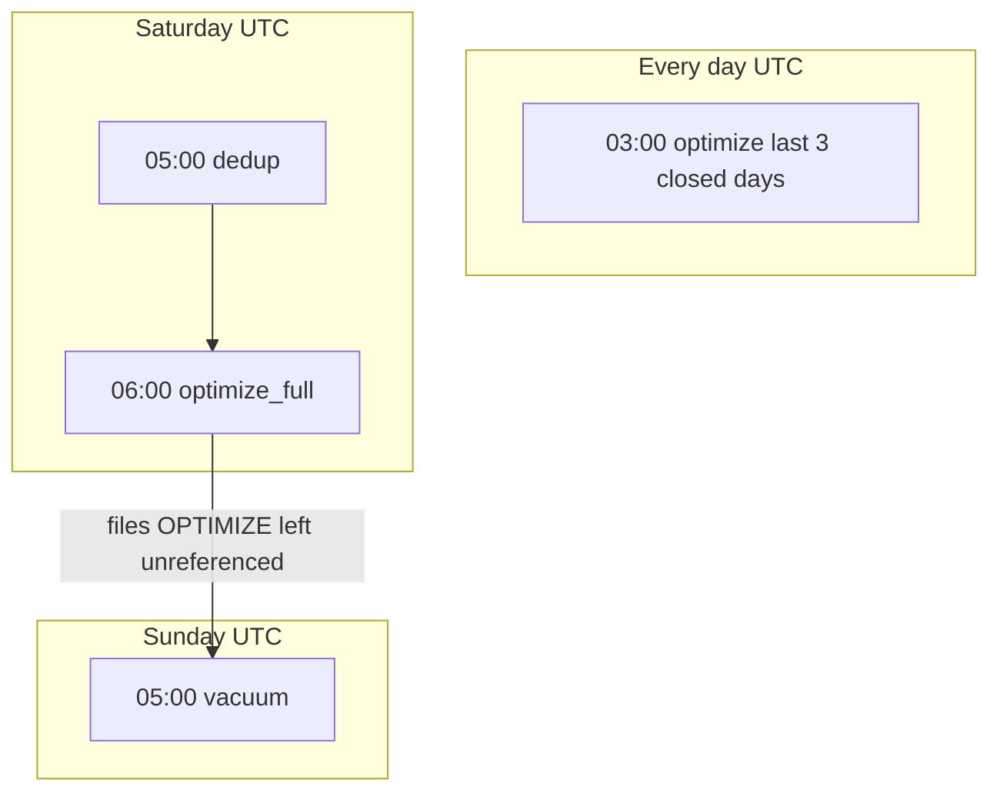

# How Iceberg compaction works

## Overview

Compaction is the rewrite of many small Iceberg data files into fewer larger files. The Jetstream ingester writes a new Parquet file per table about every 30 minutes or 2 GB, and the files pile up under each day's partition. Compaction is not part of the Python process. An EventBridge schedule starts a Step Functions state machine, and the state machine runs Athena SQL against the Glue database `bluesky_raw`.

Source of truth is [`terraform/bluesky_ingestion_jetstream/maintenance.tf`](../../terraform/bluesky_ingestion_jetstream/maintenance.tf). Table locations and the 256 MB target file size live in [`bluesky_ingestion_jetstream/aws/constants.py`](../../bluesky_ingestion_jetstream/aws/constants.py). Alarm email is a separate runbook, [`HOW_TO_ADD_MAINTENANCE_ALARM_EMAIL.md`](HOW_TO_ADD_MAINTENANCE_ALARM_EMAIL.md). Table bootstrap is [`HOW_TO_SETUP_ICEBERG_TABLES.md`](HOW_TO_SETUP_ICEBERG_TABLES.md).

Tables are `posts`, `likes`, `reposts`, and `follows`. Each table is partitioned by `day(created_at)`, which shows up on disk as `created_at_day=...`.

## Why files get small

The ingester holds rows in memory, then appends to Iceberg when the buffers hit 2 GB or 30 minutes. Each flush writes a new data file per table that has rows. A full day can therefore hold dozens of files per table. You pay Athena by bytes scanned, and many tiny files make scans slower and more expensive. OPTIMIZE rewrites the files toward `write.target-file-size-bytes` (256 MB).



## What each job does

OPTIMIZE rewrites data files with Athena `REWRITE DATA USING BIN_PACK`. BIN_PACK groups files by size. It does not sort rows, and it does not collapse a URI's history. Athena skips a partition that has fewer than 5 candidate files (`min-input-files`), so an already compacted day is mostly a metadata check.

VACUUM expires snapshots older than Athena's Iceberg default (5 days), then deletes data files, manifests, and manifest lists that no remaining snapshot points at.

DEDUP is a `DELETE` that keeps one copy of each `uri` when the same URI exists in more than one data file. Iceberg is in merge-on-read mode, so the delete is a position-delete file that hides extra copies on read. A later OPTIMIZE rewrites the data files and folds the deletes in.

OPTIMIZE_FULL is the same BIN_PACK as the daily job, but it covers every month from `2026-08-01` through the current month. Athena allows at most 100 partitions per OPTIMIZE statement, so the job issues one statement per month.

Dead-letter objects and Athena query results sit outside the warehouse prefix (`dead_letter/bluesky/raw` and `athena-results/maintenance/`). VACUUM would otherwise treat unreferenced objects under the warehouse root as orphans and delete them.

## How a run is wired

Schedules, the state machine, the Athena workgroup `bluesky_raw_maintenance`, IAM, and the CloudWatch alarm are all Terraform. There is no Spark job, no Railway cron, and no GitHub Actions schedule for Iceberg maintenance.



Inside the state machine, each job fills `tables`, an SQL template, and a list of predicates. The map walks `posts`, `likes`, `reposts`, `follows` with `MaxConcurrency = 1`. Predicates also run one at a time, because two concurrent OPTIMIZE commits on the same table race and one loses. Each statement is `athena:startQueryExecution.sync`. A failed statement is recorded as `"failed"`. After the maps finish, if any result string contains `failed`, the execution fails as `TableMaintenanceFailed`.



Athena retries `TooManyRequestsException` (4 attempts, 30 s, backoff 2) and other task failures (2 attempts, 60 s, backoff 2). EventBridge itself does not retry a missed schedule. The next run covers the same lookback window.

## Schedule

All times are UTC. The partition transform is UTC, so a local timezone that shifts for daylight saving would move the window off the day boundary.

| Job | Schedule name | Cron | When | What |
| --- | --- | --- | --- | --- |
| `optimize` | `bluesky_raw_optimize` | `cron(0 3 * * ? *)` | every day 03:00 | BIN_PACK for `created_at >= current_date - 3 day AND created_at < current_date` |
| `dedup` | `bluesky_raw_dedup` | `cron(0 5 ? * SAT *)` | Saturday 05:00 | DELETE duplicate `uri`s over the last 21 days |
| `optimize_full` | `bluesky_raw_optimize_full` | `cron(0 6 ? * SAT *)` | Saturday 06:00 | BIN_PACK one month at a time from 2026-08-01 |
| `vacuum` | `bluesky_raw_vacuum` | `cron(0 5 ? * SUN *)` | Sunday 05:00 | VACUUM each table |

The daily OPTIMIZE schedule is 03:00 so yesterday's partition is closed. The 3-day lookback (`optimize_lookback_days`) also covers late arrivals whose `created_at` falls on an earlier day (`MAX_CREATED_AT_BACKDATE` is 7 days on ingest). DEDUP runs an hour before OPTIMIZE_FULL so the weekend rewrite can fold the delete files in. VACUUM runs the next morning so files left unreferenced by OPTIMIZE can be deleted.



## Knobs

Defaults live in `maintenance.tf`. Change a variable and apply Terraform.

| Variable | Default | Meaning |
| --- | --- | --- |
| `optimize_lookback_days` | `3` | Closed days the daily OPTIMIZE reconsiders |
| `optimize_full_start_month` | `2026-08-01` | First month of the weekly full rewrite |
| `dedup_lookback_days` | `21` | Window for the URI DELETE (7 days between runs, plus backdate, plus slack) |
| `record_types` | `posts`, `likes`, `reposts`, `follows` | Tables the maps walk |
| `athena_results_prefix` | `athena-results/maintenance` | Query output prefix, sibling of the warehouse |
| `athena_results_retention_days` | `7` | S3 lifecycle on that prefix |
| `maintenance_alarm_email` | empty | SNS email, see the alarm runbook |

Flush size and age (`MAX_BUFFER_SIZE_BYTES`, `MAX_BUFFER_AGE_SECONDS`) in [`bluesky_ingestion_jetstream/constants.py`](../../bluesky_ingestion_jetstream/constants.py) control how many small files appear between OPTIMIZE runs.

## Run a job by hand

Run this from `terraform/bluesky_ingestion_jetstream/`.

```bash
aws stepfunctions start-execution \
  --region us-east-2 \
  --state-machine-arn "$(terraform output -raw maintenance_state_machine_arn)" \
  --input '{"job":"optimize"}'
```

`job` must be one of `optimize`, `optimize_full`, `vacuum`, `dedup`.

## Check that a run happened

- Step Functions console, state machine `bluesky_raw_maintenance`. Map history shows `ok` or `failed` per table.
- Athena workgroup `bluesky_raw_maintenance` query history. CloudWatch metrics are on for that workgroup.
- Alarm `bluesky_raw_maintenance_failed` on `AWS/States` `ExecutionsFailed` over 1 hour. Failures publish to SNS topic `bluesky_raw_maintenance_alarms`.
- S3 prefix `s3://lab-data-integrations-interface/athena-results/maintenance/` holds query output for 7 days.
- After OPTIMIZE, a `created_at_day=` prefix should hold fewer data files.

Grafana Cloud metrics from the ingester cover flushes, not these jobs.

## Related code that is not production

[`experimentation/iceberg/maintenance.py`](../../experimentation/iceberg/maintenance.py) implements a scan, collapse, and overwrite in PyIceberg for cost experiments. Nothing in AWS schedules it.
