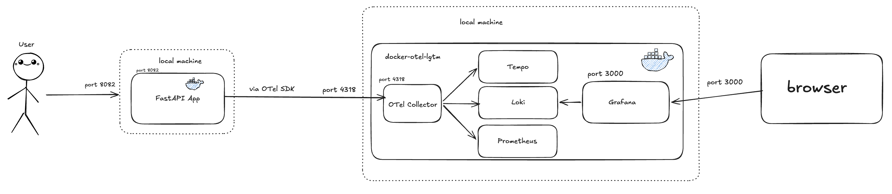

# LGTM Stack Setup

## Overview
We want a way to be able to track our app's logs, metrics, and also be able to trace calls to our endpoints.

The solution is to setup an observability stack (we are using LGTM stack) to be able to view all of this info.

## Tools
All of the following tools are packaged in a docker image, "docker-otel-lgtm"

### Loki
Records:
1. Logs
2. Warnings
3. Errors
4. Failures


### Grafana
Displays the actual information gathered by Loki, Grafana, and Prometheus onto a dashboard

### Tempo
Records the traceback of calls to our endpoints.

### Prometheus
Records metrics about our app's performance (e.g. request rate, error rate, latency, etc.)

### OpenTelemetry Collector
Contains the raw information funneled by OpenTelemetry SDK from FastAPI app. 
It then passes the information into the correct service (Tempo, Prometheus, or Loki)

## System Design


## Setup

### Prerequisites

Install Docker Desktop: https://www.docker.com/products/docker-desktop/

To manually pull the docker image, 
```
docker pull grafana/otel-lgtm.
```

When running Docker Compose with the whole demo app, you won't need to run this command. 
It will automatically be pulled via the docker-compose.yml file. 

