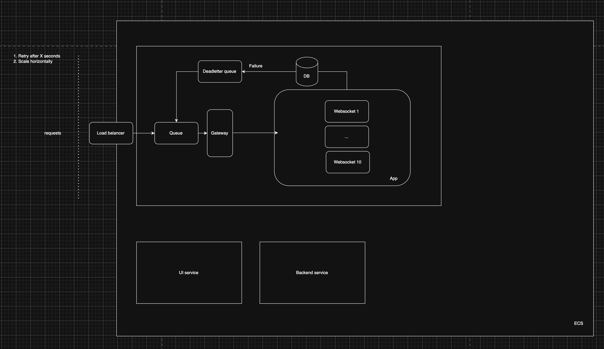

# Deployment spec

Now that we have (1) some initial scripts and (2) confirmed interest in a more fleshed-out lab data integrations interface, let's plan out what that build-out would look like.

## Phase 1: Initial build

UI:

- V1 UI
- Deploy to AWS Amplify (via Terraform)

Backend:

- V1 FastAPI app
- Dockerize + deploy to AWS App Runner (via Terraform)

Connect UI + backend.

DevOps:

- CI: Lint, testing, and build verification on each PR, via GitHub Actions. Also pre-commit hooks.
- CD: protected main-branch deploys (whenever we merge to main, deploy the UI and backend apps).
- Move secrets to AWS Secrets Manager.
- Add health + readiness checks.

Main deliverables of this phase:

- a live demo app, with working frontend + backend, to present to stakeholders.
- foundations of basic DevOps that we can build upon in the future.

## Phase 2: Hardening

Backend:

- Add basic OAuth (we can figure out the stack, but something like Supabase Auth would be easy to implement).
- Add rate-limiting.
- Add basic caching policy.
- Add idempotency on retries.
- Add aggressive deduplication, materialized views, precomputation, etc., for common queries. Can start with this here and add this more in Phase 3.

DevOps:

- Move secrets to AWS Secrets Manager.
- Add health + readiness checks.
- Add AWS cost monitoring + budget alerts
- Observability for App Runner and the FastAPI service, including logs, error visibility, and basic health monitoring.
  - Set up FastAPI + CloudWatch logs, for consistent logging.
  - Add /health endpoints for both AWS App Runner and AWS Amplify.
  - Set up AWS-native alerting: CloudWatch alarms -> SNS topic -> email notifications.
- Note: for each CI/CD ticket, please add a corresponding markdown file in docs/runbooks/ that serves as a reference.

## Phase 3: More hardening

App:

- Saving user queries, so we can track what people ask for.
- Determining a policy for what data to save (do we sync the data offline?). A v1 of this, which will be addressed more in Phase 4.
- Add async jobs for long-running jobs (probably will want a queue + worker pattern, and then alert user when it's done). Add polling in the UI for longer jobs.
- Add job metadata tracking (whenever users submit, track status, e.g., succeed/fail/in progress/etc.).
- (More) aggressive deduplication, materialized views, precomputation, etc., for common queries.

## Phase 4: Scaling up

Key questions:

- How can we allow multiple people to use the app at the same time? How do we manage resources when multiple jobs could be running in parallel that are resource-intensive? We'll have to profile how exactly the resources are intensive, but this may require us to persist multiple servers (which isn't ideal, but would necessitate Kubernetes/ECS). Otherwise we could possibly keep it lightweight and do one-off tasks via lambdas.
- Do we sync data in the background and just return to users the data that we already have? Or sync on-demand? Syncing on-demand, as we've seen, is pretty slow. But having all the data introduces problems with data storage (e.g., keeping a persistent Postgres DB up at all times).

Example user stories we'll want to support:

- "Can I have a sample of 100,000 posts from Bluesky?"
- "Can I get a sample of posts from the past 2 months on Bluesky?"

Example eventual system design diagram

