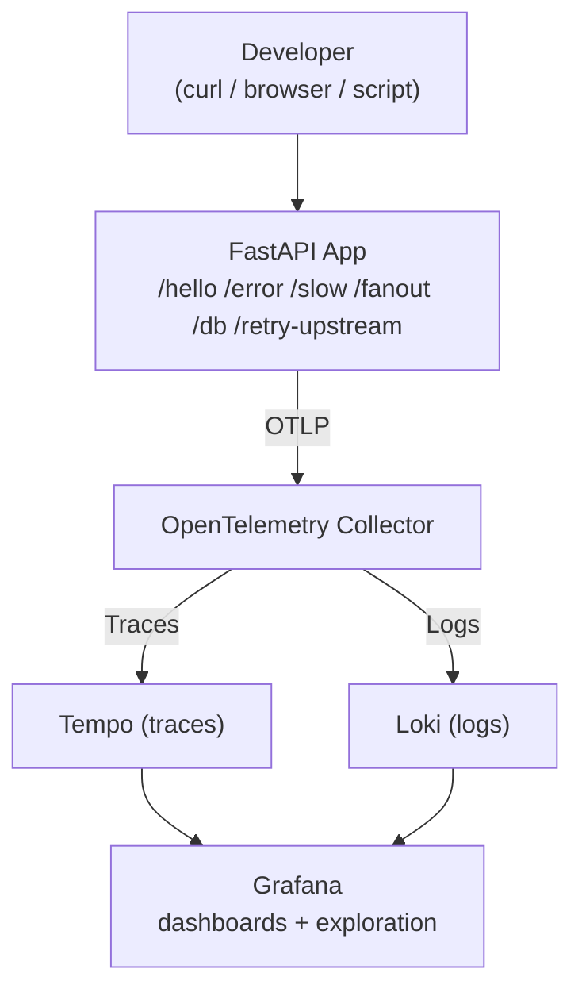

# Setting up the observability layer of the data integrations interface

## What is observability?

When people build apps, they're generally focused on the full-stack parts, as these are what make an app "run". However, any and every app will need debugging, and for most bootstrapped apps, this is a hacky ad-hoc "let me run it locally and get it to work" approach, which somewhat works if you only have a small demo app but definitely buckles under pressure when you have actual users (and more so as you go from 10 to 100 to 1,000 to 10,000 users and beyond).

Observability is the practice of setting up a system so that you can infer what it's doing (and why) based from data it emits (e.g., the logs it prints, etc.) rather than having to try to replicate each error manually. Observability gives us a sense of the "health" of an app and to give us confidence that (1) our app is working "as intended" (e.g., runs fast enough, processes requests correctly, etc.) and (2) that if something were to go wrong (e.g., slow requests, bugs in code, user complains about the quality of the results), we could quickly investigate it in a principled rather than ad-hoc way.

Telemetry is the combination of (1) the data emitted by applications (logs, metrics, etc.) and (2) the tools and pipelines that collect, store, and query it. Adding print statements and looking at the terminal is the most basic form of telemetry, but this doesn't scale up - when you deploy an app, you won't be SSHing into the server to look at all the logs, and if you have a nontrivial amount of users (e.g., >1,000), you can't manually parse or skim through the logs yourself. To build more sophisticated apps, you'll need a more robust and well-designed telemetry stack that will give you the information you need to diagnose the health of your app without just trying to scroll pages and pages of logs or trying to run the app locally to replicate a bug. In production setups, instrumentation follows open standards (e.g., OpenTelemetry) to track *what* happens, while tools and UIs let you aggregate the *what happened* to answer *how often did it happen*, *when did it happen*, and *what caused it to happen*.

For this project, what we're going with is the ["LGTM" stack](https://oneuptime.com/blog/post/2026-02-06-lgtm-stack-opentelemetry/view). Here is a good [primer on observability](https://opentelemetry.io/docs/concepts/observability-primer/).

## How does observability work?

### What do we track?

In observability, we track the following 3 concepts:

- **Logs**: Details about things that happened, such as print statements and logs. These are in-line within the code itself, and correspond to specific events.
- **Metrics**: These are numbers over time. Some examples include latency, runtime, and trends (e.g., total errors, total successful requests, etc.).
- **Traces**: what happens to a single request in your app, end-to-end. For example, if a user submits a GET request to a specific endpoint, a trace tracks each step of what happens in your app for that specific request.

### What does it look like if we don't have observability?

If we don't have observability in an app, what does debugging look like?

Suppose someone comes up to you and says "the app is slow when I press 'submit', and I don't know why". What do you do then?

Without an observability layer, you would:

- Ask them exactly what commands they ran and what they clicked.
- Try to run the app locally and add print statements to replicate the error.
- If you're lucky, you can maybe replicate the error, but often times you can't (e.g., it's a transient error, they didn't give you enough info, etc.).

With observability, you would:

- Check the Grafana logs for p99 requests (which requests are in the 99th percentile for how long they took to run).
- Click into the request.
- Look at the trace-level data and track the latencies for each stage of the app.
- Review any logs corresponding to the request.
- Piece together what happened for that user's exact request and why it took so long.

## Epic 1: Building a "Hello World" for observability

### Ticket 1: Set up a "Hello World" example

Some relevant resources to get up-to-speed:

- https://grafana.com/docs/opentelemetry/docker-lgtm/?utm_source=chatgpt.com
- https://andamp.io/insights/blog/from-blind-spots-to-total-transparency-building-an-observability-solution-with-opentelemetry-and-the-lgtm-stack
- https://blog.prateekjain.dev/mastering-observability-with-grafanas-lgtm-stack-e3b0e0a0e89b
- https://oneuptime.com/blog/post/2026-02-06-lgtm-stack-opentelemetry/view

Please do this in an `telemetry/` folder. This'll be the basis for the observability layer you'll build in production. Once you build this out and its associated endpoints, we'll adapt it to work specifically with your full-stack app.

#### Ticket 1 implementation

- Use the [official Grafana `docker-otel-lgtm` setup](https://github.com/grafana/docker-otel-lgtm/tree/main), which packages all of these up in a single container.
- Review the [Python sample app](https://github.com/grafana/docker-otel-lgtm/tree/main/examples/python).
- Build a "Hello World" HTTP service using FastAPI (see more details below)

#### Details of HTTP service

For the HTTP service, this can be any setup you want (e.g., the example from Grafana includes a dice roll app, but it can be anything you want).

But at minimum, let's include the following endpoints:

- `/hello`: a "happy path" success path with normal latency and structed info log.
- `/error`: returns 500. We'll want to use this to validate error traces, exception logs, and error-rate metrics.
- `/slow?ms=...`: an endpoint that allows us to inject controllable sleep to validate latency and span duration.

#### Ticket 1 acceptance criteria

- Can see /hello trace.
- Can see /error as failed trace/log.
- Can see /slow?ms=1000 produce a visibly longer span.
- README includes screenshots.
- Runbooks for (1) setting up the stack and (2) for running the demo app.

#### Ticket 1 runbook requirements

Please add under docs/runbooks/

1. A runbook for setting up the stack. This should include (1) a description of each of the tools in the LGTM stack and what they're used for, and (2) a basic system design flow for how the tools fit together.

2. A runbook for setting up the demo app (e.g., including Docker instructions)

3. A runbook for running the demo app. Include the endpoints and how to verify/check each endpoint (e.g,. which tool are you checking, and what are you checking for? Screenshots in the runbook are great here as well).

A system design diagram (e.g., in Excalidraw, Mermaid, etc.) similar to the following would be great, to internalize how the requests will flow:



In addition, add a request-level trace example, so we can see the exact flow. Here's one generated by Claude:

```bash
GET /retry-upstream
│
├── validate_request
├── upstream_attempt_1  ❌ timeout
├── upstream_attempt_2  ❌ 500
├── upstream_attempt_3  ✅ success
└── serialize_response
```

### Ticket 2: Trace topology and dependencies

Add an endpoint to track how traces are managed across dependencies.

Implementation:

- `/fanout?n=...`: creates several child operations, ideally nested spans, to test how well we can track traces.
- `/db`: simulate an external dependency to a SQLite DB (please create a dummy.sqlite DB for this), so we can see how it interacts with dependencies.
- Updating the runbook with results and findings.

Acceptance criteria:

- /fanout?n=5 shows parent span with child spans.
- /db shows a separate DB-related span or manual span.
- Runbook explains trace waterfall.
- Request-level trace examples.

### Ticket 3: Failure modes and retries

Implementation:

- `/retry-upstream`: simulates retries and partial failures so we can observe duplicated spans, retries in logs, and inflated latency.
- `/incorrect-business-result`: returns 200.
- Updating the runbook with results and findings.

Acceptance criteria:

- A single request shows multiple retry attempts.
- Logs can be filtered by trace ID.
- Dashboard shows increased latency from retries.
- Request-level trace examples.
- Runbook updated.

### Ticket 4: Async work

In FastAPI, work often continues after the handler returns (e.g. asyncio.create_task, a queue consumer, or BackgroundTasks). OpenTelemetry context is request-scoped by default; if you spawn fire-and-forget work without propagating context, you get orphan logs/spans or traces that “end” while work is still running. This ticket makes that failure mode visible and fixes it in the demo app.

Implementation:

- `/background`: launches async work to test span propagation. HTTP handler should return quickly (e.g. 202 Accepted or 200 with a small JSON body) while additional async work runs after the response path (e.g. asyncio.create_task or FastAPI BackgroundTasks).
- Updating the runbook with results and findings.

The background work should:

- run for a bounded duration or a fixed number of steps (so local demos cannot spawn unbounded tasks).
- perform at least one meaningful sub-operation you can name in a span (e.g. “process_job”, “write_audit”) so the trace is not a single anonymous block
- emit at least one structured log line from inside the background path.

Instrumentation: Ensure background work inherits the same trace as the incoming HTTP request (or, if you deliberately use span links, document that).

Acceptance criteria:

- A single call to /background yields a request-level trace where the async/background path is visible (child span(s) or clearly linked work—not only the short HTTP span with no follow-on).
- Logs emitted from the background path are correlatable to that same request (e.g. same trace ID in log fields as the HTTP trace, or an explicitly documented link pattern)
- Request-level trace examples.

### Ticket 5: Resource symptoms

Implementation:

- `/load?cpu=...`: burns CPU for a bounded interval to test profiling.
- `/leak`: allocates memory repeatedly to simulate gradual pressue and correlate requests with resource symptoms.
- `/retry-upstream`: simulates retries and partial failures so we can observe duplicated spans, retries in logs, and inflated latency.
- `/incorrect-business-result`: returns 200.

Acceptance criteria:

- CPU endpoint is bounded and cannot DOS the local machine accidentally.
- Memory leak endpoint has reset/limit behavior.
- Runbook explains what was visible and what was not.
- Request-level trace examples.

### Ticket 6: End-to-end smoke testing

Now that all these endpoints exist, let's pressure test it under certain scenarios. Let's generate mixed, realistic-ish traffic for a bounded time so we can see how metrics, traces, and logs behave together.

Let's put these in `telemetry/smoke_testing/`.

- `generate_traffic.py` randomly calls endpoints with varied probabilities for a given duration (e.g., `--duration-seconds 120`).

An example distribution (we can hardcode the sampling probability as constants in-file) is something like:

- 60% /hello
- 15% /slow
- 10% /fanout
- 5% /db
- 5% /error
- 5% /retry-upstream

Capture a short run report (markdown in the smoke folder or a subsection of the runbook) for a single timed run (e.g. 2–5 minutes) with fixed duration, seed, concurrency, and base URL. Include:

- Metrics (Grafana): Request rate by route if available; error rate (or ratio of 5xx to total); latency for the HTTP server (histogram or summary)—call out p50, p95, p99 (and p99.9 if available) for the window, and note whether /slow and /retry-upstream visibly pull the tail.
- Traces (Tempo): 2–3 example trace IDs (one mostly /hello, one /fanout, one /retry-upstream or /error) with one sentence each on what you confirmed in the waterfall.
- Logs (Loki): Whether you can filter by trace ID (or service labels) and see error lines for /error without drowning in noise from /hello.
- Qualitative: Anything that felt misleading, missing, or too noisy—e.g. double-counted spans, unclear route names, or percentiles that do not match intuition—so the next ticket can fix instrumentation rather than only dashboards.

Acceptance criteria:

- Running generate_traffic.py for N seconds produces a visible bump in traffic in Grafana for that time range.
- p95/p99 (or equivalent) move in the expected direction when /slow is included in the mix vs a /hello-only control run of similar duration.
- Error-rate or failed-span signals reflect the /error share of traffic (order-of-magnitude sanity check, not exact statistical proof).
- Runbook or smoke README documents one recommended command line and where to look in Grafana to validate the run.

## Epic 2: Deploying the "Hello World" example to AWS

(TBD)

## Epic 3: Connecting the DevOps layer to the full-stack app

(TBD)

## Epic 4: Develop an observability AI agent and connect to the telemetry stack

(TBD)

## Key questions to be able to answer along the way

By trade I'm not a DevOps expert, but as an engineer it's important to be flexible and use tool that you aren't necessarily an expert in and understand the problems they solve and to incorporate them to your work.

Therefore, my feedback will be less "do you have the exact correct commands" but rather asking key questions related to our system. Some of these include:

- Is the app healthy? Where can we check? Is there a runbook for this?
- If someone uses the app and they're getting slow results, can we trace it to see why they're getting slow results?
- If someone uses the app and they're getting wrong results, can we trace it to replicate the error and diagnose how to fix it?
- Why is a given endpoint slow? Where in the app is it slowing down?
- What SLAs can we report to our application and how can we guarantee them?
- Let's say we want to replace an external dependency (e.g., swap out our database and use Postgres instead of SQLite, use a different LLM model, etc.). How can we run smoke tests and make sure that our system is robust to those changes?
- Did our retry logic inflate latency?
- Are we leaking memory?
- How much will our app cost to run? And if we want to scale it up (add more features, support more people, etc), how does the cost change? How do we know?
- Can someone else onboard to the telemetry part of the codebase and run it on their own? Can an AI agent look at your code and runbooks and have exactly the context it needs to do observability on it s own?

These don't have to be answered in a single PR, but during our discussion, this is the sort of higher-level detail that I'll be probing. This is the sort of business context that observability helps us answer and success will be first and foremost evaluated against these questions, with implementation details important but secondary (i.e., we don't want context rot and AI slop driven by Claude Code, but we're also OK with different approaches to implementing a given task). I'll also still be doing code review and giving feedback on implementation, but my focus will be primarily on answering these higher-level questions.

## Notes

Feel free to co-develop this with Claude Code, but please do so very slowly and prioritize understanding of each tool, parameters, and how the entire system works together.
