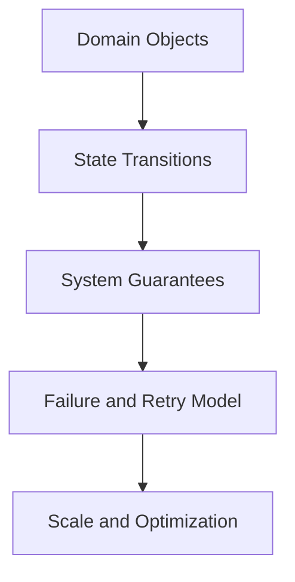
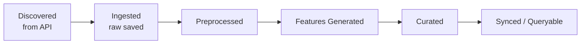

<!-- START doctoc generated TOC please keep comment here to allow auto update -->
<!-- DON'T EDIT THIS SECTION, INSTEAD RE-RUN doctoc TO UPDATE -->
**Table of Contents**  *generated with [DocToc](https://github.com/thlorenz/doctoc)*

- [Data platform pipeline correctness](#data-platform-pipeline-correctness)
  - [Guarantees-First Pipeline Design](#guarantees-first-pipeline-design)
    - [Stage 1: Domain objects](#stage-1-domain-objects)
    - [Stage 2: State transitions](#stage-2-state-transitions)
    - [Stage 3: System guarantees](#stage-3-system-guarantees)
    - [Stage 4: Failure and retry model](#stage-4-failure-and-retry-model)
    - [Stage 5: Scaling](#stage-5-scaling)
    - [A quick set of questions to answer about architecture](#a-quick-set-of-questions-to-answer-about-architecture)
    - [Some ways to think about this](#some-ways-to-think-about-this)

<!-- END doctoc generated TOC please keep comment here to allow auto update -->

# Data platform pipeline correctness

## Guarantees-First Pipeline Design

Before we optimize for scale, we need to first define what the system guarantees.  Let's first define these guarantees, and then scaling becomes an implementation problem.

Scaling will amplify whatever guarantees your system has. If the system has sloppy assumptions, scaling amplifies those assumptions. Whether you choose eventual or strong consistency, scaling amplifies the tradeoff.

One way to think about it is the following:

1. Domain Objects
2. State transitions.
3. System guarantees.
4. Failure and retry model.
5. Scaling.



### Stage 1: Domain objects

Name the most important things in the system.

For our use case, some of those include:

- `post_uri`: the identity of a post in Bluesky. We'll need a similar primary key for the other integrations, but for now we can stick to `post_uri`.
- `job_id`: one execution of the DAG.
- `dataset_id/config_id`: the collection config being run.
- `stage_artifact`: output of a pipeline stage.
- `run_status`: the status of a job or stage.
- `seen_uri`: a URI of a post that "exists" in the platform (definition of "existence" can vary).

This definition lets us be specific about what we're trying to do:

- The config defines what we're trying to collect.
- The job ID describes this specific attempt to collect it.
- The post URI describes the data entity itself.

### Stage 2: State transitions

Draw the pipeline as state transitions. For example:



Clearly define what goes through each stage and what counts as "complete" for each step.

For example, if we want to have deduplicated outputs at each stage, we can define here what that means. Each stage can have its own completion semantics.

- Ingestion dedupe: Have we accepted this post into the system before?
- Preprocessing dedupe: Have we preprocessed this ingested post before?
- Feature dedupe: Have we generated features for this preprocessed post before?
- Curation dedupe: Have we curated this feature-complete post before?

Start with the happy path for now (errors can be considered in Stage 4).

### Stage 3: System guarantees

We can write out the system guarantees in plain English.

Some examples are:

- Ingestion guarantees
  - A post URI should be ingested at most once into the raw layer.
  - A post becomes "seen" once its raw ingestion artifact is durably written.
  - The ingestion step should be safe to rerun without creating duplicate raw records.
- Pipeline guarantees
  - Each DAG trigger creates a unique job_id.
  - Each stage writes outputs with enough metadata to identify job_id, dataset_id, stage, timestamp, and input artifact.
  - If a downstream stage fails, already completed upstream stages do not need to be rerun unless explicitly requested.
- Source of truth guarantees:
  - S3 is the durable source of truth. Local disk is temporary execution state and should not be required for correctness across runs.
  - Athena/Glue are query interfaces over S3, not separate sources of truth.

This is where the actual details of the guarantees become more clear.

### Stage 4: Failure and retry model

Here, we can walk through concrete failure modes and think about what we expect to happen. This is also a good spot to iterate on with an AI agent, to probe into your proposed architecture:

An example breakdown:

| Scenario                            | Expected behavior                                                                            |
| ----------------------------------- | -------------------------------------------------------------------------------------------- |
| Run fails during ingestion          | Retry ingestion; skip URIs already durably written                                           |
| Run fails during preprocessing      | Do not re-ingest; rerun preprocessing for ingested posts missing preprocessing outputs       |
| Run fails during feature generation | Do not re-ingest or re-preprocess; rerun feature generation only for missing feature outputs |
| Run fails during curation           | Rerun curation for posts with features but no curation artifact                              |
| Same config runs again tomorrow     | New `job_id`, same `dataset_id`, skip already seen URIs                                      |
| Two jobs overlap                    | Not supported in v1 unless we define locking/partitioning semantics                          |

Naturally, thinking about failures will lead us to think about how we know what happened during a run, which leads to us thinking about metadata.

That way, on failures, we can pull up a JSON like this and be able to diagnose:

```json
{
  "job_id": "run_2026_06_19_153000_abc123",
  "dataset_id": "bluesky_search_trump_econ_iran",
  "stage": "feature_generation",
  "status": "failed",
  "input_artifacts": ["s3://.../preprocessed/..."],
  "output_artifacts": ["s3://.../features/..."],
  "started_at": "...",
  "finished_at": "...",
  "error": "timeout from LLM provider"
}
```

### Stage 5: Scaling

Scale is not separate from correctness. Parallelism is only safe if our state model can handle overlapping writes and retries. When we can guarantee correctness (based on a core set of assumptions), we can consider scale.

Some ways we can think of scaling:

| Question                          | Depends on                                                 |
| --------------------------------- | ---------------------------------------------------------- |
| Can jobs run in parallel?         | Whether we support locking, partitioning, or atomic writes |
| Should we use Athena or DuckDB?   | Data size, infra simplicity, where source of truth lives   |
| How often should the DAG run?     | API limits, pipeline duration, freshness requirements      |
| Can we process millions of posts? | Batch size, stage fanout, LLM cost, S3 layout              |
| Can we avoid duplicate LLM calls? | Feature-stage idempotency and artifact checks              |

### A quick set of questions to answer about architecture

A subset of questions to answer when designing a system like this include the following non-functional requirements $^*$.

| Non-functional requirement | Question                                |
| ------------------------- | ---------------------------------------- |
| Correctness               | What must always be true?                |
| Recovery                  | What happens when it fails halfway?      |
| Identity                  | What are the IDs and what do they mean?  |
| Source of truth           | Which state is authoritative?            |
| Performance               | How does it scale once correct?          |

*These are non-functional requirements. They specify qualities of the system (correctness, recovery, identity, source of truth, performance) rather than specific user-visible behaviors or features, which are the focus of functional requirements.

### Some ways to think about this

- It's often more productive to think of inputs/outputs to a given abstraction (a function, a class, a module, etc.) and start at higher levels of abstraction, diving increasingly more specific (e.g., specific I/O of a pipeline -> specific I/O of a pipeline stage -> specific I/O of a component in a script -> specific I/O of a function -> then implementation details).
- Metadata can be most easily stored in something like DynamoDB.
- Strict v1 assumptions (e.g., runs can't be retried; we just pick up failed records in the next run) are OK tradeoffs to make, as some approaches (e.g., rerunning a given run ID) can be complicated to verify from a correctness perspective (as, for example, you can now have 2 invokations of the same "run ID", so now "run ID" is no longer unique).
