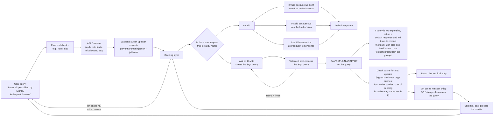

# System Design: Agentic Search

Text-to-SQL.

Likely steps are:

- Expand the query functionality to take on more generic queries (let's discuss later what this means)
- Add V1 text-to-SQL functionality, very naive (prompting an LLM to query, we'll pass into the LLM prompt the list of tables and their fields). We'll turn this into an experiment in experiments/ to have a proof of concept.
- We'll make this more robust (add validation, avoid prompt injection, make sure queries don't give results that are too large, etc). We can do more experiments for this step as well.
- Then we can put into production (still vague as to what that means).

## High-level design



## Implementation details

### Prompting

Possible draft prompt for "ask an LLM to create the query":

```markdown
{SYSTEM_PROMPT}

{cleaned up version of the user's prompt}.  

This is a query that a user has for our DB.

{tables + columns from Glue}

Here are some example requests from users and the correct SQL queries for those requests:

"I want all posts by Stanley in the past month" -> "SELECT * FROM posts WHERE handle LIKE "Stanley" AND created_at > {past month}"

{example requests + SQL queries}

Given that we have these columns and tables, generate an Athena SQL query for this user's request.

{cleaned up version of the user's prompt}
```

We'll need to do some experiments and have eval datasets to see if we're generating the right prompts.

### Caching