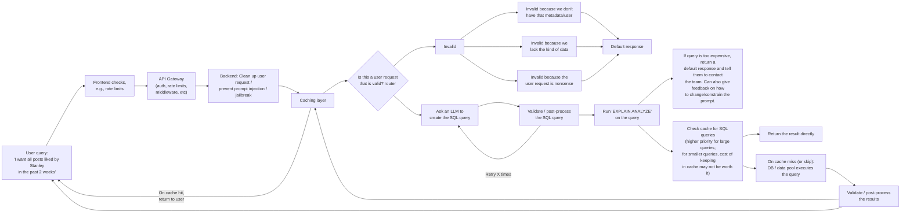

# System Design: Agentic Search

Text-to-SQL.

Likely steps are:

- Expand the query functionality to take on more generic queries (let's discuss later what this means)
- Add V1 text-to-SQL functionality, very naive (prompting an LLM to query, we'll pass into the LLM prompt the list of tables and their fields). We'll turn this into an experiment in experiments/ to have a proof of concept.
- We'll make this more robust (add validation, avoid prompt injection, make sure queries don't give results that are too large, etc). We can do more experiments for this step as well.
- Then we can put into production (still vague as to what that means).

## Purpose

...

## Background

## Proposal

Our proposal is a natural-language (NL) to SQL search interface. We propose a natural language query interface, where we take user queries, convert to SQL, execute the queries, and return results to users. Along the way, we include layers of caching and validation.

### High-level architecture



### User-facing behavior

A user enters the app and enters a natural language query as well as an email for contact (how the results are returned to the user is out-of-scope of the current plan). Upon submission, the user is informed that the request is underway. They then are given an end result, one of the following:

- A presigned URL with the resulting .csv file, if the request is valid.

### Goals/non-goals

#### What is in-scope

- NL-to-SQL end-to-end pipeline.
- Validation + preprocessing/postprocessing.
- API gateway layer (for rate limiting, authorization, etc).
- Agent plane observability: adding telemetry to the app and integrating with the existing [Grafana-based telemetry plane](https://github.com/METResearchGroup/lab_data_integrations_interface/issues/113). Some key metrics we care to track include error rate, p95/p99, cache hits/misses.
- LLMOps for the LLM components (router query, SQL generation query, and RAG steps).
- Basic FinOps: we want to track the cost of supporting our expected use case. We want to understand the cost of scaling different application components as well as provide a cost basis that we can then convert into a well-structured proposal for multi-TB project expansion.

#### What is out-of-scope

- Support for expanding data availability: this is managed in [this call for proposal](https://github.com/METResearchGroup/lab_data_integrations_interface/issues/111). The current plan builds on top of the existing database.
- Expanded app interactions beyond natural-language queries: we will keep the same endpoint that exists in FastAPI, focusing on providing a NL interface for users to request data.
- Expanding to multiple data sources and data integrations: this is managed in [this call for proposal](https://github.com/METResearchGroup/lab_data_integrations_interface/issues/111). The current plan builds on top of the existing data integrations.
- Multi-agent systems: two consecutive LLM calls are more than enough. No need for multi-agent architectures.

### Key design choices

### Scope of changes

Here, we introduce a new product surface. We replace the existing simple FastAPI + Athena query logic with a NL query interface.

## Implementation details

...

### Prompting

#### Draft query generation prompt

```markdown
{SYSTEM_PROMPT}

{cleaned up version of the user's prompt}.  

This is a query that a user has for our DB.

{tables + columns from Glue}

Here are some example requests from users and the correct SQL queries for those requests:

"I want all posts by Stanley in the past month" -> "SELECT * FROM posts WHERE handle LIKE "Stanley" AND created_at > {past month}"

{example requests + SQL queries}

Given that we have these columns and tables, generate an Athena SQL query for this user's request.

{cleaned up version of the user's prompt}
```

#### Draft router prompt

```markdown
You are a routing agent, charged with gatekeeping access to a database.

Our database has the following tables and columns:

{tables + columns from Glue}

{other system prompt details}

This is a query that a user has for our DB.

{cleaned up version of the user's prompt}.  

This is a request that a user has for our DB.

Classify the request using the following labels:

- VALID
- INVALID_MISSING_DATASET: Invalid because we don't have that table/dataset.
- INVALID_MISSING_ROWS: Invalid because we lack the rows of data.
- INVALID_UNQUERYABLE_REQUEST: Invalid because the user request isn't something that can be queried (e.g., "What is 2+2").
- INVALID_OTHER: Invalid for other reasons.

{Include few-shot examples}

Classify the request:

{cleaned up version of the user's prompt}
```

#### Testing + Experimentation

We'll need to do some experiments and have eval datasets to see if we're generating the right prompts. We'll want to create 40-50 queries for each use case, determine common query patterns, and use a subset as representative few-shot examples while keep the remaining as a validation set.

We'll also add regression testing as part of nightly tests, CI/CD (especially before big production releases relating to the search functionality).

We also want to add telemetry and take a subset of production traffic, perhaps every 1-2 days, and manually QA the samples + generate new evaluation samples.

### Caching

We want to invest in a good caching system (Redis cache + DB search of past queries + RAG) so as to avoid expensive queries + Athena calls. We also want to prioritize caching results of large queries, and caching results of smaller queries is less important (though will have to see financial tradeoff of keeping extra RAM in Redis + RAG queries vs. cost of executing smaller queries).

Our motivating example is the following user query:

```json
{
     "user_query": "I want all posts liked by Stanley in the past 2 months.",
     "cleaned_query": "i want all posts liked by stanley in the past 2 months",
}
```

#### Option 1: Matching on other entities or values

We can match on entities/values extracted from the user query.

```json
{
     "user_query": "I want all posts liked by Stanley in the past 2 months.",
     "cleaned_query": "i want all posts liked by stanley in the past 2 months",
     // don't match on the exact query string, match on the entities
    "users_referenced": "Stanley",
    "entities_mentioned": "posts",
    "timeframe": "last 2 months"

    // cache key could be something like {users referenced}::{entities}::{timeframe}
    // i want all posts liked by stanley in the past 2 months" vs.
    // i want all posts in the past 2 months  liked by stanley" have the same cache key
}
```

This is a low-cost approach, easy to implement and requires 0 LLM calls. It may require deploying some pretrained NER models, but beyond that  

Option 2: Fuzzy matching

Basically an extension of option 1, but not looking for exact match, but rather approximate string.

Option 3: Hybrid RAG (semantic search + BM25)

Can use RAG to find queries that are similar enough, then grab those similar queries, pass to an LLM,
ask an LLM "are any of these past queries the same as what a user is looking for?". If yes, return
the presigned URL for that past query.

Can possibly use a combination, e.g., using Option 1 first, then Option 2, then Option 3, in sequence.

Also Options 1+2 are probably via Redis, Option 3 is via vector DB (higher latency, higher cost, but more accurate)

### Observability/Telemetry

#### System Ops

...

#### LLMOps

...

#### FinOps

...

### Scaling the results

A v1 approach is presigned URLs. We can probably ship this as a v1, but what do we do with queries that will return LARGE results? A few options here:

- Disallow such queries, and tell them to contact the team: this removes the possibility of an end user querying lots of data, but still leaves it up to the internal team to have a policy for queries with a large number of results. This can possibly be combined with other methods (see below)
- Return paginated results: We can either (1) paginate the query internally, run multiple queries, and combine the results after the fact, or (2) run the expensive query once and then paginate the results ourselves. We can experiment with the more feasible approach (feasible via cost + runtime). I suspect the second approach is better since running multiple queries in order to get subsets of rows will result in more disk reads, which is where the cost will really pile on.

## Alternatives considered

...

## Cross-cutting concerns

...
